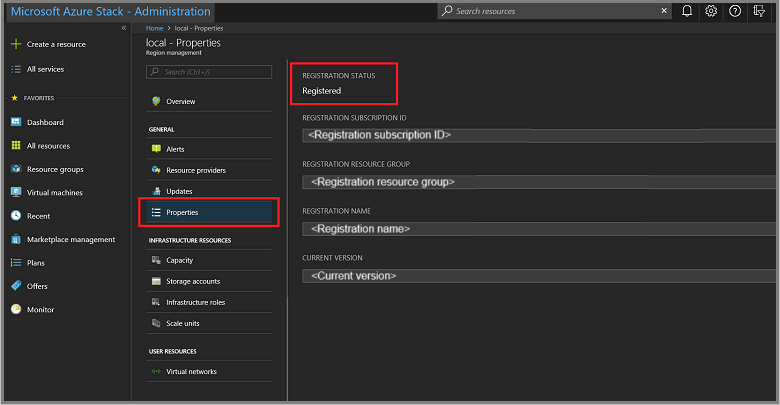

# Register Azure Stack Hub with Azure

To set up Marketplace syndication, you must register and activate your Modular Data Center (MDC) or Azure Stack Hub ruggedized, based on Azure Stack Hub, after deployment completes. With Marketplace syndication, an administrator populates the local Azure Stack Hub Marketplace with images downloaded from the Azure Marketplace.

Registration is required for systems that will connect to the Azure cloud as well as for systems that will be disconnected.

## Overview

The registration process consists of the following steps:

1. Export a registration token from Azure Stack Hub.
2. Register Azure Stack Hub with Azure.
3. Export an activation key from Azure.
4. Activate Azure Stack Hub.

If a system is connected to the Azure cloud, all four steps can be executed with a single script. If the system is disconnected, the administrator must perform the steps individually.

> [!NOTE]
> For MDC, each of the Azure Stack Hub systems must be registered separately. Therefore, the following instructions must be performed three times.

## Prerequisites

You need the following prerequisites before you register:

- Verify your credentials.
- Set the PowerShell language mode.
- Install PowerShell for Azure Stack Hub.
- Install the Azure Stack Hub tools module
- Determine your registration scenario.

### Verify your credentials

Before registering Azure Stack Hub with Azure, you must have:

- The subscription ID for an Azure subscription.  

    > [!NOTE]  
    > Azure subscriptions are associated to Azure cloud environments (Azure commercial, Azure government etc.) This determines which cloud you will connect to access Marketplace content.

- The username and password for an account that's an owner for the subscription. 
- The user account needs to have access to the Azure subscription and have permissions to create identity apps and service principals in the directory associated with that subscription. We recommend that you register Azure Stack Hub with Azure using least-privilege administration. For more information about how to create a custom role definition that limits access to your subscription for registration, see [Create a registration role for Azure Stack Hub](../../operator/azure-stack-registration-role.md).
- Register the Azure Stack Hub resource provider (see the following sections for details).

After registration, Azure Active Directory (Azure AD) global administrator permission is not required. However, some operations might require the global admin credential (for example, a resource provider installer script or a new feature requiring a permission to be granted). You can either temporarily reinstate the account's global admin permissions, or use a separate global admin account that is an owner of the *default provider subscription*.

The user who registers Azure Stack Hub is the owner of the service principal in Azure AD. Only the user who registered Azure Stack Hub can modify the Azure Stack Hub registration. If a non-admin user that's not an owner of the registration service principal attempts to register or re-register Azure Stack Hub, they might see a 403 response. A 403 response indicates that the user has insufficient permissions to complete the operation.

Registering Azure Stack Hub incurs no cost on your Azure subscription.

### PowerShell language mode

To successfully register Azure Stack Hub, the PowerShell language mode must be set to **FullLanguageMode**. To verify that the current language mode is set to full, open an elevated PowerShell window and run the following PowerShell cmdlets:

```powershell  
$ExecutionContext.SessionState.LanguageMode
```

Ensure that the output returns **FullLanguageMode**. If any other language mode is returned, registration needs to be run on another machine, or the language mode needs to be set to **FullLanguageMode** before continuing.

### Install PowerShell for Azure Stack Hub

Use the latest PowerShell for Azure Stack Hub to register with Azure.

If the latest version isn't already installed, see [Install PowerShell for Azure Stack Hub](../../operator/azure-stack-powershell-install.md).

### Install the Azure Stack Hub tools module

The [Azure Stack Hub tools module](https://www.powershellgallery.com/packages/azs.tools.admin/0.1.0) contains PowerShell modules that support Azure Stack Hub functionality, including registration functionality. During the registration process, you must import and use the **RegisterWithAzure.psm1** submodule to register your Azure Stack Hub instance with Azure.

To install the most recent Azure Stack Hubs tool:

1. Open an elevated PowerShell prompt.
2. Run the following cmdlet:

    ```powershell  
        Install-Module -Name Azs.Tools.Admin
    ```

### Determine your registration scenario

Your Azure Stack Hub deployment may be *connected* or *disconnected*.

- **Connected**: Connected means you've deployed Azure Stack Hub so that it can connect to the internet and to Azure. You can either have Azure AD or Active Directory Federation Services (AD FS) for your identity store.

- **Disconnected**: With the disconnected from Azure deployment option, you can deploy and use Azure Stack Hub without a connection to the internet.

### Determine a unique registration name to use

When you register Azure Stack Hub with Azure, you must provide a unique registration name. An easy way to associate your Azure Stack Hub subscription with an Azure registration is to use your Azure Stack Hub **Cloud ID**.

To determine the Cloud ID for your Azure Stack Hub deployment, open PowerShell as an admin on a computer that can access the Privileged Endpoint, run the following commands, and then record the **CloudID** value:

```PowerShell
Enter-PSSession -ComputerName <privileged endpoint computer name> -ConfigurationName PrivilegedEndpoint
Get-AzureStackStampInformation
```

## Registration and activation for systems connected to the Azure cloud

Use the following steps to register an Azure Stack Hub system that has connectivity to Azure.

> [!NOTE]  
> All these steps must be run from a computer that has access to the privileged endpoint (PEP). For details about the PEP, see [Using the privileged endpoint in Azure Stack Hub](../../operator/azure-stack-privileged-endpoint.md).

Connected environments can access the internet and Azure. For these environments, register the Azure Stack Hub resource provider with Azure and then configure your billing model.

1. To register the Azure Stack Hub resource provider with Azure, start PowerShell ISE as an administrator and use the following PowerShell cmdlets with the **EnvironmentName** parameter set to the appropriate Azure subscription type (see parameters as follows).

2. Add the Azure account that you used to register Azure Stack Hub. To add the account, run the **Add-AzureRmAccount** cmdlet. You are prompted to enter your Azure account credentials, and you may have to use two-factor authentication based on your account configuration.

   ```powershell
   Add-AzureRmAccount -EnvironmentName "<environment name>"
   ```

   | Parameter | Description |  
   |-----|-----|
   | EnvironmentName | The Azure cloud subscription environment name. Supported environment names are **AzureCloud**, **AzureUSGovernment**, or **AzureUSSec**.  |

   >[!NOTE]
   > If your session expires, your password has changed, or you want to switch accounts, run the following cmdlet before you sign in using **Add-AzureRmAccount**: **Remove-AzureRmAccount-Scope Process**.

3. In the same PowerShell session, ensure you're signed in to the correct Azure PowerShell context. This context is the Azure account that was used to register the Azure Stack Hub resource provider previously:

   ```powershell  
   Connect-AzureRmAccount -Environment "<environment name>"
   ```

   | Parameter | Description |  
   |-----|-----|
   | EnvironmentName | The Azure cloud subscription environment name. Supported environment names are **AzureCloud**, **AzureUSGovernment**, or **AzureUSSec**.  |

4. If you have multiple subscriptions, run the following command to select the one you want to use:

   ```powershell  
   Get-AzureRmSubscription -SubscriptionID '<Your Azure Subscription GUID>' | Select-AzureRmSubscription
   ```

5. Run the following command to register the Azure Stack Hub resource provider with your Azure subscription:

   ```powershell  
   Register-AzureRmResourceProvider -ProviderNamespace Microsoft.AzureStack
   ```

   Alternatively, you can register the Azure Stack Hub resource provider in your Azure Subscription using the Azure portal. Log into the Azure portal using the account associated with Azure subscription. Go to **Categories** > **General** > **Subscriptions** and select the subscription ID that you need to register the Azure Stack Hub resource provider to. On the left-hand pane, navigate to **Settings** > **Resource Providers**. Select **Microsoft.AzureStack** resource provider and select **Register**.

   

6. In the same PowerShell session, run the **Set-AzsRegistration** cmdlet:

   ```powershell  
   $CloudAdminCred = Get-Credential -UserName <Privileged endpoint credentials> -Message "Enter the cloud domain credentials to access the privileged endpoint."
   $msAssetTag = "Enter the value printed on the product"
   $RegistrationName = "<unique-registration-name>"

   Set-AzsRegistration `
      -PrivilegedEndpointCredential $CloudAdminCred `
      -PrivilegedEndpoint <PrivilegedEndPoint computer name> `
      -BillingModel Ruggedized `
      -RegistrationName $RegistrationName `
      -msAssetTag $msAssetTagName `
      -UsageReportingEnabled: $false
   ```

   The MS Asset tag (`msAssetTag`) is mandatory for Ruggedized billing model registration and is printed on the product.

   The process takes between 10 and 15 minutes. When the command completes, you see the message. **Your environment is now registered and activated using the provided parameters.**

## Registration and activation for systems not connected to the Azure cloud 

If you're registering Azure Stack Hub in a disconnected environment (with no internet connectivity), perform the following steps:

1. Get a registration token from the Azure Stack Hub environment.

2. Connect to Azure and register using the registration token from step 1. Use a computer that can connect to Azure, and has PowerShell for Azure Stack Hub installed.

3. Retrieve an activation key from the Azure registration.

4. Activate Azure Stack Hub using the activation key from Azure.

### Get a registration token from the Azure Stack Hub environment

Get a registration token from the Azure Stack Hub environment. Then, use that token on a computer that can connect to Azure and has PowerShell for Azure Stack Hub and Azure Stack Hub tools installed.

1. To get the registration token, run the following PowerShell cmdlets from an elevated prompt:

   ```PowerShell
    $FilePathForRegistrationToken = "$env:SystemDrive\RegistrationToken.txt" 
    
    $RegistrationToken = Get-AzsRegistrationToken `
      -PrivilegedEndpointCredential $YourCloudAdminCredential `
      -UsageReportingEnabled:$False `
      -PrivilegedEndpoint $YourPrivilegedEndpoint `
      -BillingModel Ruggedized -msAssetTag '<MS Asset tag>' `
      -TokenOutputFilePath $FilePathForRegistrationToken 
   ```

   > [!TIP]  
   > The registration token is saved in the file specified by `$FilePathForRegistrationToken`. You can change the path or filename as desired.

2. Save this registration token for use on the Azure-connected machine. You can copy the file or the text from `$FilePathForRegistrationToken`.

### Connect to Azure and register

On the computer that is connected to the internet, sign-in to the correct Azure PowerShell context. Then call **Register-AzsEnvironment**. Specify the registration token to register with Azure. If you are registering more than one instance of Azure Stack Hub using the same Azure subscription ID, specify a unique registration name.

You need your registration token and a unique token name.

1. From an elevated PowerShell prompt, run the following cmdlets to make sure your are using the right subscription.

    ```powershell  
    Get-AzureRmSubscription -SubscriptionID '<Your Azure Subscription GUID>' | Select-AzureRmSubscription
    ```

2. Then, run the following PowerShell cmdlets:

    ```powershell  
    $RegistrationToken = "<Your Registration Token>"
    $RegistrationName = "<unique-registration-name>"
    Register-AzsEnvironment -RegistrationToken $RegistrationToken -RegistrationName $RegistrationName
    ```

3. Optionally, you can use the **Get-Content** cmdlet to point to a file that contains your registration token.

   You need your registration token and a unique token name.

   1. Start PowerShell ISE as an administrator and navigate to the **Registration** folder in the **AzureStack-Tools-master** directory created when you downloaded the Azure Stack Hub tools. Import the **RegisterWithAzure.psm1** module:

      ```powershell  
      Import-Module .\RegisterWithAzure.psm1
      ```

   2. Then, run the following PowerShell cmdlets:

      ```powershell  
      $RegistrationToken = Get-Content -Path '<Path>\<Registration Token File>'
      Register-AzsEnvironment -RegistrationToken $RegistrationToken -RegistrationName $RegistrationName
      ```

> [!NOTE]  
> Save the registration resource name and the registration token for future reference.

### Retrieve an activation key from Azure registration resource

Next, retrieve an activation key from the registration resource created in Azure during **Register-AzsEnvironment**.

To get the activation key, run the following PowerShell cmdlets:

```PowerShell
$RegistrationResourceName = "<unique-registration-name>"
$KeyOutputFilePath = "$env:SystemDrive\ActivationKey.txt"
$ActivationKey = Get-AzsActivationKey -RegistrationName $RegistrationResourceName -KeyOutputFilePath $KeyOutputFilePath
```

> [!TIP]  
> The activation key is saved in the file specified by `$KeyOutputFilePath`. You can change the path or filename as desired.

### Create an activation resource in Azure Stack Hub

Return to the Azure Stack Hub environment with the file or text from the activation key created by **Get-AzsActivationKey**. Next, create an activation resource in Azure Stack Hub using that activation key. To create an activation resource, run the following PowerShell cmdlets:

```PowerShell
$ActivationKey = "<activation key>"
New-AzsActivationResource -PrivilegedEndpointCredential $YourCloudAdminCredential -PrivilegedEndpoint $YourPrivilegedEndpoint -ActivationKey $ActivationKey
```

Optionally, you can use the **Get-Content** cmdlet to point to a file that contains your registration token:

```PowerShell
$ActivationKey = Get-Content -Path '<Path>\<Activation Key File>'
New-AzsActivationResource -PrivilegedEndpointCredential $YourCloudAdminCredential -PrivilegedEndpoint $YourPrivilegedEndpoint -ActivationKey $ActivationKey
```

## Verify Azure Stack Hub registration

You can use the **Region management** tile to verify that the Azure Stack Hub registration was successful. This tile is available on the default dashboard in the administrator portal. The status can be registered, or not registered. If registered, it also shows the Azure subscription ID that you used to register your Azure Stack Hub along with the registration resource group and name.

1. Sign in to the Azure Stack Hub administrator portal. The URL varies based on your operator's region and external domain name, and will be in the format `https://adminportal.<region>.<FQDN>`.

2. From the Dashboard, select **Region management**.

3. Select **Properties**. This blade shows the status and details of your environment. The status can be **Registered**, **Not registered**, or **Expired**.

   [](media/registration-tzl/admin-1.png#lightbox)

   If registered, the properties include:

    - **Registration subscription ID**: The Azure subscription ID registered and associated to Azure Stack Hub.
    - **Registration resource group**: The Azure resource group in the associated subscription containing the Azure Stack Hub resources.

4. You can use the Azure portal to view Azure Stack Hub registration resources, and then verify that the registration succeeded. Sign in to the [Azure portal](https://portal.azure.com/) using an account associated with the subscription you used to register Azure Stack Hub. Select **All resources**, enable the **Show hidden types** checkbox, and then select the registration name.

5. If the registration did not succeed, you must re-register by [Change the subscription you use](../../operator/azure-stack-registration.md#change-the-subscription-you-use) to resolve the issue.

Alternatively, you can verify if your registration was successful by using the Marketplace management feature. If you see a list of Marketplace items in the **Marketplace management** blade, your registration was successful. However, in disconnected environments, you can't see Marketplace items in Marketplace management.

> [!NOTE]
> After registration is complete, the active warning for not registering no longer appears.

## Next steps

[Azure Stack Hub administration basics](azure-stack-manage-basics-tzl.md)  
