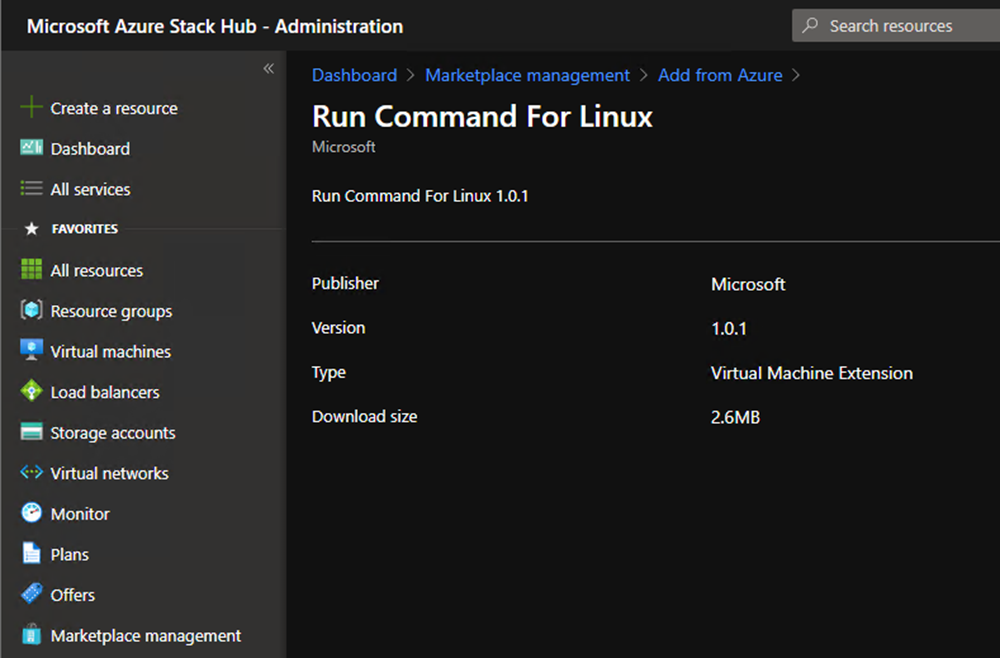
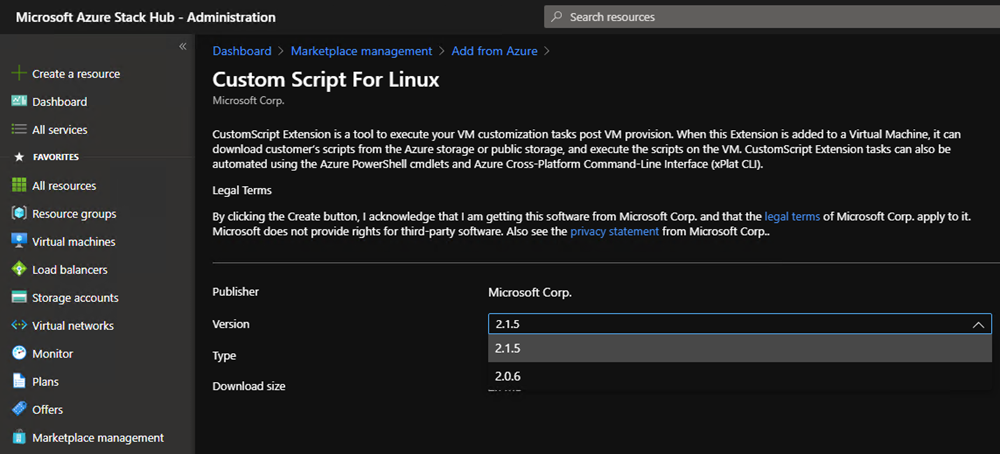
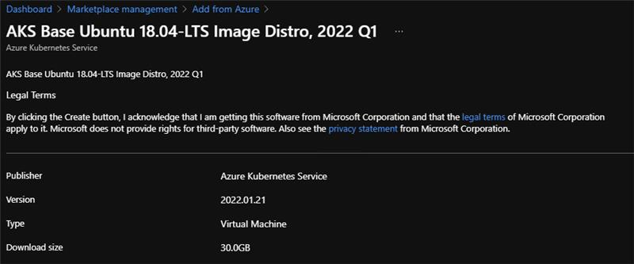
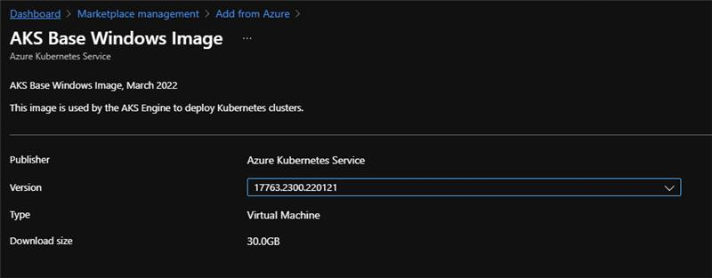
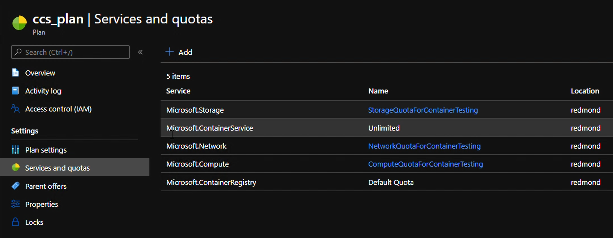
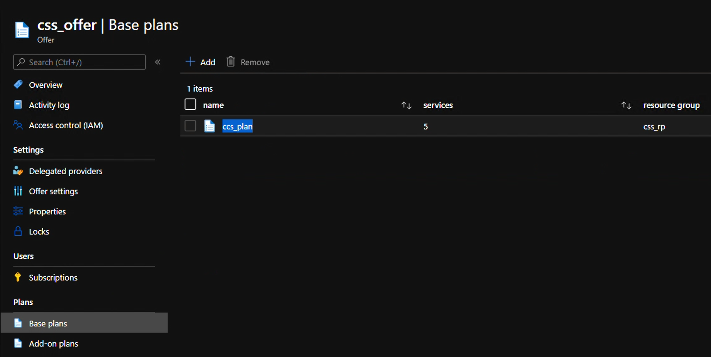
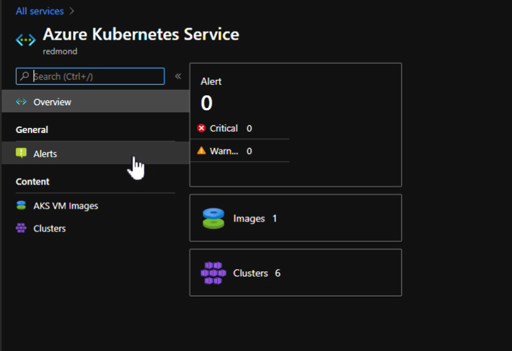
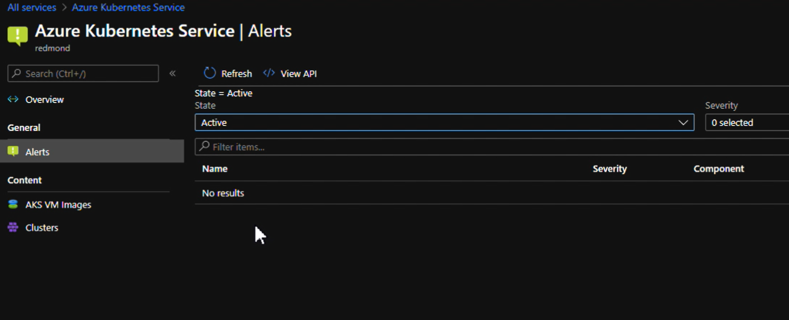

# Install and offer the Azure Kubernetes Service on Azure Stack Hub

Azure Kubernetes Service (AKS) enables your users to deploy Kubernetes clusters in Azure Stack Hub. AKS reduces the complexity and operational overhead of managing Kubernetes clusters. As a hosted Kubernetes service, Azure Stack Hub handles critical tasks like health monitoring and facilitates maintenance of clusters. The Azure Stack Hub team manages the image used for maintaining the clusters. The cluster tenant administrator only needs to apply the updates as needed. The services come at no extra cost. AKS is free: you only pay to use the virtual machines (VMs) master and agent nodes within your clusters. You can install the Azure Kubernetes Service (AKS) resource provider for the users of your Azure Stack Hub.

To install, you must have the VM extensions, the AKS base image, a plan and offer to your users, and enable multi-tenancy for your Azure Stack Hub. AKS clusters can only be created in the user environment.

> [!IMPORTANT]  
> Azure Kubernetes Service on Azure Stack Hub, currently in preview, is being discontinued and will not become GA. See [AKS Engine](../user/azure-stack-kubernetes-aks-engine-overview.md) for a Kubernetes solution on Azure Stack Hub. 
> See the [Supplemental Terms of Use for Microsoft Azure Previews](https://azure.microsoft.com/support/legal/preview-supplemental-terms/) for legal terms that apply to Azure features that are in beta, preview, or otherwise not yet released into general availability.

> [!NOTE]  
> Azure Kubernetes Service on Azure Stack Hub doesn't support the creation of a cluster in the administration environment. You can only create AKS clusters in the user environment.

## Download required VM extensions

Make sure that the following VM extensions are available in your Azure Stack Hub.

### Get the extensions from the portal

You can find the VM extensions in the Azure Stack Hub Marketplace. You can download them from Azure if you need to add them to a disconnected environment. Follow the instructions in [Download Marketplace items to Azure Stack Hub (Disconnected)](azure-stack-download-azure-marketplace-item.md?&tabs=az1%2Caz2&pivots=state-disconnected):

- Run command for Linux (latest version)

    

- Custom script for Linux (version 2.0.6)

    

### View the extensions with PowerShell

PowerShell provides a `Get-AzsVMExtension` cmdlet to view the VM extensions available in your system. Run the following script to view the available extensions. Specify the correct URL for your Azure Stack Hub Resource Manager endpoint:

```powershell  
Add-AzureRMEnvironment -Name "AzureStackAdmin" -ArmEndpoint "https://adminmanagement.<location>.<yourdomainname>/"
Login-AzureRMAccount -EnvironmentName "AzureStackAdmin"
Get-AzsVMExtension
```

For information about installing and using the AzureStack PowerShell module, see [Install PowerShell Az module for Azure Stack Hub](powershell-install-az-module.md).

## Download AKS base image

The AKS Service needs a special VM image referred to as the *AKS base image*. The AKS service doesn't work without the correct image version available in the local Azure Stack Hub Marketplace. The image is meant to be used by the AKS service, not to be used by tenants to create individual VMs. The image is not visible to tenants in the Marketplace. This is a task that needs to be done along with every Azure Stack Hub update. Every time there is a new update, there is a new AKS base image associated with the AKS service. Here are the steps:

1. Using the administrator portal, go the **Marketplace management** blade and select **Add from Azure**.
1. Type **AKS** in the search box. Locate and download both the Linux **AKS Base Ubuntu 18.04-LTS Image Distro, 2022 Q1** version **2022.01.21** and the **AKS Base Windows Image** version **17763.2300.220121**.

    - Linux base image:

        [](media/aks-add-on/aks-base-image-linux.png#lightbox)

    - Windows base image:

        [](media/aks-add-on/aks-base-image-windows.png#lightbox)

1. If your instance is disconnected, follow the instructions in the article [Download Marketplace items to Azure Stack Hub](azure-stack-download-azure-marketplace-item.md) to download the two specified items from the marketplace in Azure, and upload them to your Azure Stack Hub instance.

## Create plans and offers

To allow tenant users to use the AKS service, the operator must make it available through a plan and an offer.

1. Create a plan with the `Microsoft.Container` service. There are no specific quotas for this service; it uses the quotas available for the Compute, Network, and Storage services:

    

1. Again, use the Azure Stack Hub administration portal to create an offer that contains the plan created in the prior step:

    

## Configure multi-tenancy

You must configure Azure Stack Hub to support sign-ins from users that reside in other Microsoft Entra directories, allowing them to use services in Azure Stack Hub.

For instructions, see [Configure multi-tenancy in Azure Stack Hub](enable-multitenancy.md?pivots=management-tool-powershell)

## Monitor and act on alerts

1. Using the administrative portal, you can access the **Azure Kubernetes Service** under the **Administration** group.
1. Select the **Alerts** blade. Review the alerts:

    

1. Alerts appear in the **Alerts** blade, and you can take action on them if necessary:



## Next steps

[Learn more about AKS on Azure Stack Hub](../user/aks-overview.md)
