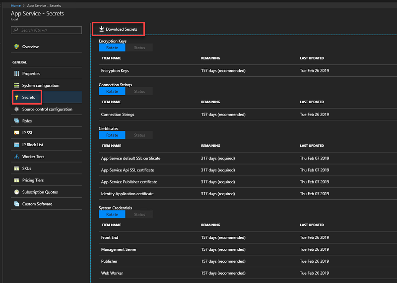
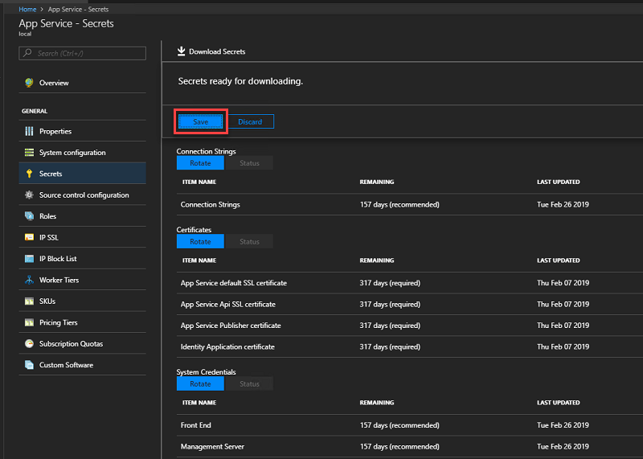

---

# Migrate SQL Server

This document provides instructions on how to migrate to new SQL Server infrastructure for hosting the Azure App Service on Azure Stack Hub Resource Provider databases - appservice_hosting and appservice_metrics.

## Back up App Service secrets
When preparing to migrate, you must backup the App Service keys used by the initial deployment. 

Use the administration portal to back up app service secrets by following these steps: 

1. Sign in to the Azure Stack Hub administrator portal as the service admin.

2. Browse to **App Service** -> **Secrets**. 

3. Select **Download Secrets**.

   

4. When secrets are ready for downloading, click **Save** and store the App Service secrets (**SystemSecrets.JSON**) file in a safe location. 

   

# Backup the App Service databases from the current server

To restore App Service, you need the **Appservice_hosting** and **Appservice_metering** database backups. We recommend using SQL Server maintenance plans or Azure Backup Server to ensure these databases are backed up and saved securely on a regular basis. However, any method of ensuring regular SQL backups are created can be used.

To manually back up these databases while logged into the SQL Server, use the following PowerShell commands:

  ```powershell
  $s = "<SQL Server computer name>"
  $u = "<SQL Server login>" 
  $p = read-host "Provide the SQL admin password"
  sqlcmd -S $s -U $u -P $p -Q "BACKUP DATABASE appservice_hosting TO DISK = '<path>\hosting.bak'"
  sqlcmd -S $s -U $u -P $p -Q "BACKUP DATABASE appservice_metering TO DISK = '<path>\metering.bak'"
  ```

> [!NOTE]
> If you need to back up SQL AlwaysOn databases, follow [these instructions](/sql/database-engine/availability-groups/windows/configure-backup-on-availability-replicas-sql-server?view=sql-server-2017&preserve-view=true). 

After all databases have been successfully backed up, copy the .bak files to a safe location along with the App Service secrets info.

