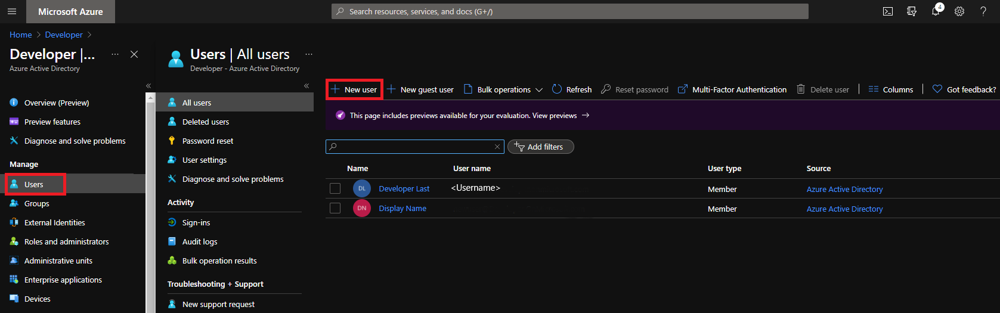
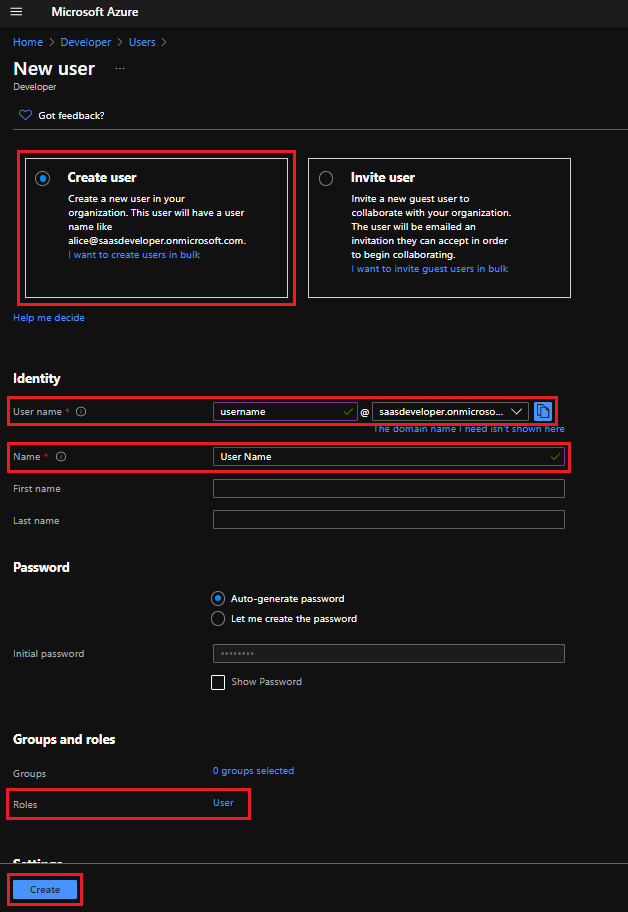

# Add a new Azure Stack tenant account in Azure Active Directory

After [deploying the Azure Stack Development Kit (ASDK)](../asdk/asdk-install.md), you need a tenant user account so you can explore the tenant portal and test your offers and plans. You can create a tenant account by [using the Azure portal](#create-an-azure-stack-tenant-account-using-the-azure-portal) or by using PowerShell.

## Create an Azure Stack tenant account using the Azure portal

You must have an Azure subscription to use the Azure portal.

1. Sign in to [Azure](https://portal.azure.com).
2. In the left navigation bar, select **Active Directory** and switch to the directory that you want to use for Azure Stack (or create a new one).
3. Select **Azure Active Directory** > **Users** > **New user**.

    

4. On the **User** page, fill out the required info.

    

   - **Name (required)**: The first and last name of the new user. For example, Mary Parker.
   - **User name (required)**: The user name of the new user. For example, mary@contoso.com.
       The domain part of the user name must use either the initial default domain name, <_yourdomainname_>.onmicrosoft.com, or a custom domain name, such as contoso.com. For more info on how to create a custom domain name, see [How to add a custom domain name to Azure Active Directory](/azure/active-directory/fundamentals/add-custom-domain).
   - **Profile**: Optionally, you can add more info about the user. You can also add user info at a later time. For more info on adding user info, see [How to add or change user profile information](/azure/active-directory/fundamentals/active-directory-users-profile-azure-portal).
   - **Directory role**:  choose **User**.

5. Check **Show Password** and copy the autogenerated password provided in the **Password** box. You'll need this password for the initial sign-in process.

6. Select **Create**.

    The user is created and added to your Azure AD tenant.

7. Sign in to the Azure portal with the new account. Change the password when prompted.
8. Sign in to `https://portal.local.azurestack.external` with the new account to see the tenant portal.

## Create an Azure Stack user account using PowerShell

If you don't have an Azure subscription, you can't use the Azure portal to add a tenant user account. In this case, you can use the Azure Active Directory Module for Windows PowerShell instead.

> [!NOTE]
> If you're using Microsoft Account to deploy the ASDK, you can't use Azure AD PowerShell to create a tenant account.

1. Install the **64-bit** version of the [Microsoft Online Services Sign-in Assistant for IT Professionals RTW](https://go.microsoft.com/fwlink/p/?LinkId=286152).

2. Install the Microsoft Azure Active Directory Module for Windows PowerShell with these steps:

    - Open an elevated Windows PowerShell command prompt (run Windows PowerShell as admin).
    - Run the **Install-Module MSOnline** command.
    - If you're prompted to install the NuGet provider, select **Y** and **Enter**.
    - If you're prompted to install the module from PSGallery, select **Y** and **Enter**.

3. Run the following cmdlets:

    ```powershell
    # Provide the AAD credential you use to deploy the ASDK

            $msolcred = get-credential

    # Add a tenant account "Tenant Admin <username>@<yourdomainname>" with the initial password "<password>".

            connect-msolservice -credential $msolcred
            $user = new-msoluser -DisplayName "Tenant Admin" -UserPrincipalName <username>@<yourdomainname> -Password <password>
            Add-MsolRoleMember -RoleName "Company Administrator" -RoleMemberType User -RoleMemberObjectId $user.ObjectId

    ```

1. Sign in to Azure with the new account. Change the password when prompted.
2. Sign in to `https://portal.local.azurestack.external` with the new account to see the tenant portal.

## Next steps

[Add Azure Stack users in AD FS](azure-stack-add-users-adfs.md)
