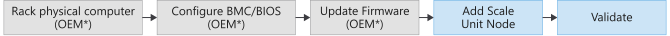

# Add scale unit nodes in Azure Stack Hub

You can increase the overall capacity of an existing scale unit by adding another physical computer. The physical computer is also referred to as a *scale unit node*. Each new node must have the same CPU type, memory, disk number, and size as the nodes already present in the scale unit. Azure Stack Hub doesn't support removing scale unit nodes for scaling down because of architectural limitations. It's only possible to expand capacity by adding nodes. The maximum size of a scale unit is 4-16 nodes.

To add a scale unit node, sign in to in Azure Stack Hub. Run the tools from your hardware equipment manufacturer (OEM). The OEM tool runs on the hardware lifecycle host (HLH) to make sure the new physical computer matches the same firmware level as existing nodes.

[!INCLUDE [Add node warning](../includes/operator-add-node-warning.md)]

The following flow diagram shows the general process to add a scale unit node:


<br> *Whether your OEM hardware vendor enacts the physical server rack placement and updates the firmware varies based on your support contract.*

Take into consideration the following limitations when adding a new node:

- The operation to add another scale unit Node includes two distinct phases: *compute* and *storage*.
- During the compute expansion phase, your Azure Stack Hub will show a state of **Expanding**. After the compute expansion completes, and the storage expansion is running, the stamp will show a state of **Configuring Storage**.
Let your Azure Stack Hub return to the **Running** state before adding another node. This means when adding multiple nodes you will need to add a node and wait for the state to return to **Running** before adding the next node.

  > [!IMPORTANT]
  > The storage expansion phase can run up to multiple days before completion, as spaces are rebalanced in a pool to disks with capacity. There isn't an impact to running workloads on the system while another scale unit node is added.

> [!WARNING]  
> Do not attempt any of the following operations while an add scale unit node operation is already in progress:
>
> - Update Azure Stack Hub
> - Rotate certificates
> - Stop Azure Stack Hub
> - Repair scale unit node
> - Add another node (the previous add-node action failure is also considered in progress)

## Add scale unit nodes

The following steps are a high-level overview of how to add a node. Don't follow these steps without first referring to your OEM-provided capacity expansion documentation.

1. Make sure the new node is configured with the BMC credentials that are already configured within Azure Stack Hub. For instructions on updating the BMC credentials in Azure Stack Hub, refer to [Update the BMC credential](/azure-stack/operator/azure-stack-rotate-secrets.md#update-the-bmc-credential).
2. Place the new physical server in the rack and cable it appropriately. 
3. Enable physical switch ports and adjust access control lists (ACLs) if applicable.
4. Configure the correct IP address in the baseboard management controller (BMC) and apply all BIOS settings per your OEM-provided documentation.
5. Apply the current firmware baseline to all components by using the tools that are provided by the hardware manufacturer that run on the HLH.
6. Run the add node operation. You can use the Administrator portal or PowerShell to add new nodes. The add node operation first adds the new scale unit node as available compute capacity and then automatically extends the storage capacity. The capacity expands automatically because Azure Stack Hub is a hyperconverged system where *compute* and *storage* scale together.

  ### [Administrator portal](#tab/portal)

  1. Sign in to the Azure Stack Hub administrator portal as an Azure Stack Hub operator.
  2. Navigate to **+ Create a resource** > **Capacity** > **Scale Unit Node**.
    
  3. On the **Add node** pane, select the *Region*, and then select the *Scale unit* that you want to add the node to. Also specify the *BMC IP ADDRESS* for the scale unit node you're adding. You can only add one node at a time.
    
  

  ### [PowerShell Az](#tab/Az)

  Use the **Add-AzsScaleUnitNode** cmdlet to add a node.  

  Before using either of the following sample PowerShell scripts, replace the values *name_of_new_node*,  *name_of_scale_unit_cluster*, *BMCIP_address_of_new_node* with values from your Azure Stack Hub environment.

  > [!Note]  
    > When naming a node you must keep the name to less than 15 characters in length. You also can't use a name that contains a space or contains any of the following characters: `\`, `/`, `:`, `*`, `?`, `"`, `<`, `>`, `|`, `\`, `~`, `!`, `@`, `#`, `$`, `%`, `^`, `&`, `(`, `)`, `{`, `}`, `_`.

  **Add a node:**
    ```powershell
    ## Add a single Node 
      Add-AzsScaleUnitNode -BMCIPv4Address "<BMCIP_address_of_new_node>" -computername "<name_of_new_node>" -ScaleUnit "<name_of_scale_unit_cluster>" 
    ```  

  ### [PowerShell AzureRM](#tab/AzureRM)

  Use the **New-AzsScaleUnitNodeObject** cmdlet to add a node.  

  Before using either of the following sample PowerShell scripts, replace the values *node names* and *IP addresses* with values from your Azure Stack Hub environment.

  > [!Note]  
    > When naming a node you must keep the name to less than 15 characters in length. You also can't use a name that contains a space or contains any of the following characters: `\`, `/`, `:`, `*`, `?`, `"`, `<`, `>`, `|`, `\`, `~`, `!`, `@`, `#`, `$`, `%`, `^`, `&`, `(`, `)`, `{`, `}`, `_`.

  **Add a node:**
    ```powershell
    ## Add a single Node 
    $NewNode=New-AzsScaleUnitNodeObject -computername "<name_of_new_node>" -BMCIPv4Address "<BMCIP_address_of_new_node>" 
  
  Add-AzsScaleUnitNode -NodeList $NewNode -ScaleUnit "<name_of_scale_unit_cluster>" 
    ```  

  ---

  ## Monitor add node operations 
  Use the administrator portal or PowerShell to get the status of the add node operation. Add node operations can take several hours to days to complete.

  ### Use the administrator portal 
  To monitor the addition of a new node, review the scale unit or scale unit node objects in the administrator portal. To do so, go to **Region management** > **Scale units**. Next, select the scale unit or scale unit node you want to review. 

  ### Use PowerShell
  The status for scale unit and scale unit nodes can be retrieved using PowerShell as follows:
    ```powershell
    #Retrieve Status for the Scale Unit
    Get-AzsScaleUnit|select name,state
  
    #Retrieve Status for each Scale Unit Node
    Get-AzsScaleUnitNode |Select Name, ScaleUnitNodeStatus
  ```

7. Verify whether the add node operation succeeded by checking the status, which should be "running". Refer to the Status for the node operation section that follows for more details. 

### Status for the add node operation 
 To validate that the add node operation succeeded, check the [**Status** of the Scale Unit](#monitor-add-node-operations).

**For a scale unit:**

  |Status               |Description  |
  |---------------------|---------|
  |Running              |All nodes are actively participating in the scale unit.|
  |Stopped              |The scale unit node is either down or unreachable.|
  |Expanding            |One or more scale unit nodes are currently being added as compute capacity.|
  |Configuring Storage  |The compute capacity has been expanded and the storage configuration is running.|
  |Requires Remediation |An error has been detected that requires one or more scale unit nodes to be repaired.|


  **For a scale unit node:**

  |Status                |Description  |
  |----------------------|---------|
  |Running               |The node is actively participating in the scale unit.|
  |Stopped               |The node is unavailable.|
  |Adding                |The node is actively being added to the scale unit.|
  |Repairing             |The node is actively being repaired.|
  |Maintenance           |The node is paused, and no active user workload is running. |
  |Requires Remediation  |An error has been detected that requires the node to be repaired.|

## Troubleshooting
The following are common issues seen when adding a node. 

**Scenario 1:**  The add scale unit node operation fails but one or more nodes are listed with a status of Stopped.  
- Remediation: Use the repair operation to repair one or more nodes. Only a single repair operation can run at one time.

**Scenario 2:** One or more scale unit nodes have been added but the storage expansion failed. In this scenario, the scale unit node object reports a status of Running but the Configuring Storage task isn't started.  
- Remediation: Use the privileged endpoint to review the storage health by running the following PowerShell cmdlet:
  ```powershell
    Get-VirtualDisk -CimSession s-cluster | Get-StorageJob
  ```

**Scenario 3:** You received an alert that indicates the storage scale-out job failed.  
- Remediation: In this case, the storage configuration task has failed. This problem requires you to contact support.

## Next steps 
[Add public IP addresses](azure-stack-add-ips.md) 
