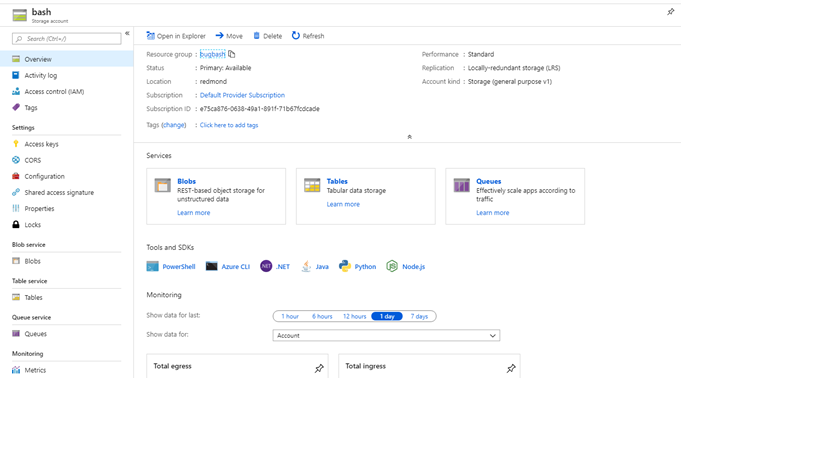
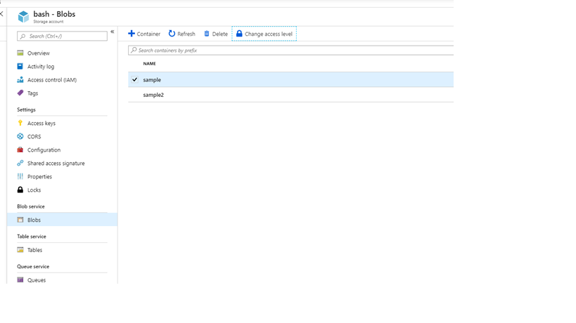
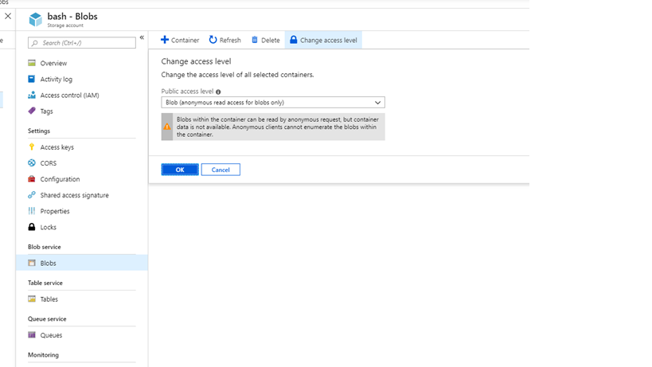
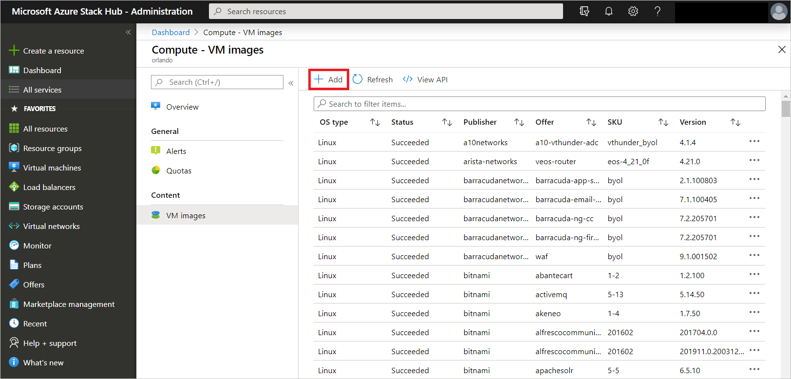
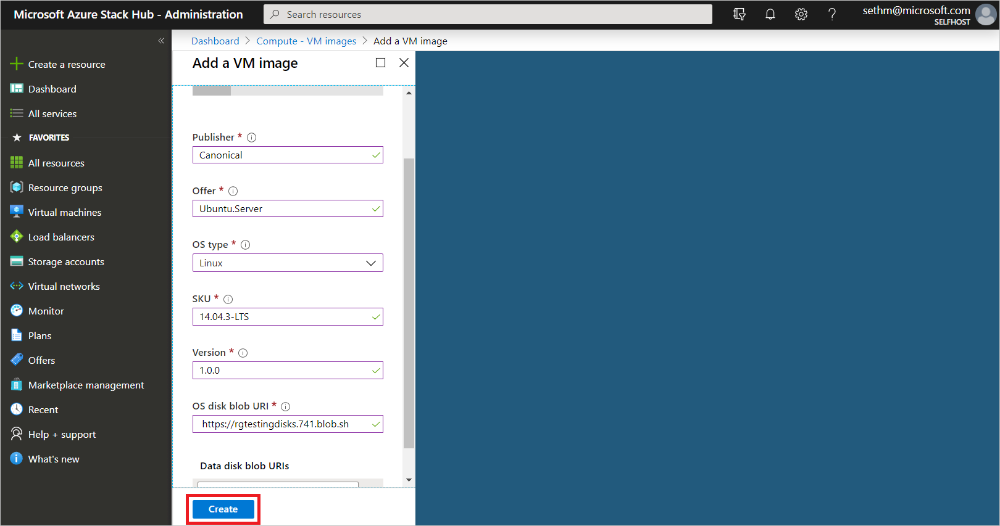

# Add a custom VM image to Azure Stack Hub

In Azure Stack Hub, you can add your custom virtual machine (VM) image to the marketplace and make it available to your users. You can add VM images to the Azure Stack Hub Marketplace through the administrator portal or Windows PowerShell. Use either an image from the global Azure Marketplace as a base for your custom image, or your create your own using Hyper-V.

## Step 1: Create the custom VM image

### Windows

Create a custom generalized VHD. 

**If the VHD is from outside Azure**, follow the steps in [Upload a generalized VHD and use it to create new VMs in Azure](/azure/virtual-machines/windows/upload-generalized-managed) to correctly **Sysprep** your VHD and make it generalized.

**If the VHD is from Azure**, prior to generalizing the VM make sure of the following:
1) When you provision the VM on Azure, use PowerShell and provision it without the `-ProvisionVMAgent` flag 
2) Remove all VM extensions using the **Remove-AzureRmVMExtension** cmdlet from the VM before generalizing the VM in Azure. You can find which VM extensions are installed by going to Windows (C:) > WindowsAzure > Logs > Plugins.

```Powershell
Remove-AzureRmVMExtension -ResourceGroupName winvmrg1 -VMName windowsvm -Name "CustomScriptExtension"
```                       
Post the above, follow the instructions in [this document](/azure/virtual-machines/windows/download-vhd) to correctly generalize and download the VHD before porting it to Azure Stack Hub.

### Linux

**If the VHD is from outside Azure**, follow the appropriate instructions to generalize the VHD:

- [CentOS-based Distributions](/azure/virtual-machines/linux/create-upload-centos?toc=%2fazure%2fvirtual-machines%2flinux%2ftoc.json)
- [Debian Linux](/azure/virtual-machines/linux/debian-create-upload-vhd?toc=%2fazure%2fvirtual-machines%2flinux%2ftoc.json)
- [Red Hat Enterprise Linux](/azure/azure-stack/azure-stack-redhat-create-upload-vhd)
- [SLES or openSUSE](/azure/virtual-machines/linux/suse-create-upload-vhd?toc=%2fazure%2fvirtual-machines%2flinux%2ftoc.json)
- [Ubuntu Server](/azure/virtual-machines/linux/create-upload-ubuntu?toc=%2fazure%2fvirtual-machines%2flinux%2ftoc.json)

**If the VHD is from Azure**, follow these instructions to generalize and download the VHD:

1. Stop the **waagent** service:

   ```bash
   sudo waagent -force -deprovision
   export HISTSIZE=0
   logout
   ```

   Keep in mind the Azure Linux Agent versions that work with Azure Stack Hub [as documented here](azure-stack-linux.md#azure-linux-agent). Make sure that the sysprepped image has an Azure Linux agent version that is compatible with Azure Stack Hub.

2. Stop deallocate the VM.

3. Download the VHD.

   1. To download the VHD file, you need to generate a shared access signature (SAS) URL. When the URL is generated, an expiration time is assigned to the URL.

   1. On the menu of the blade for the VM, select **Disks**.

   1. Select the operating system disk for the VM, and then select **Disk Export**.

   1. Set the expiration time of the URL to 36000.

   1. Select **Generate URL**.

   1. Generate the URL.
   
   1. Under the URL that was generated, select **Download the VHD file**.

   1. You might need to select **Save** in the browser to start the download. The default name for the VHD file is _abcd_.

### Considerations

Before you upload the image, it's important to consider the following:

- Azure Stack Hub only supports generation one (1) VM in the fixed disk VHD format. The fixed-format structures the logical disk linearly within the file, so that disk offset *X* is stored at blob offset *X*. A small footer at the end of the blob describes the properties of the VHD. To confirm if your disk is fixed, use the **Get-VHD** PowerShell cmdlet.

- Azure Stack Hub does not support dynamic disk VHDs. 

## Step 2: Upload the VM Image to a storage account

1. [Install PowerShell for Azure Stack Hub](azure-stack-powershell-install.md).  

2. Sign in to Azure Stack Hub as an operator. For instructions, see [Sign in to Azure Stack Hub as an operator](azure-stack-powershell-configure-admin.md).

3. Images must be able to be referenced by a blob storage URI. Prepare a Windows or Linux operating system image in VHD format (not VHDX), and then upload the image to a storage account in Azure Stack Hub.

   - If the VHD is in Azure, you can use a tool such as [Azcopy](/azure/storage/common/storage-use-azcopy) to directly transfer the VHD between an Azure and your Azure Stack Hub storage account if you are running on a connected Azure Stack Hub.

   - On a disconnected Azure Stack Hub, if your VHD is in Azure, you will need to download the VHD to a machine that has connectivity to both Azure and Azure Stack Hub. Then you copy the VHD to this machine from Azure before you transfer the VHD to Azure Stack Hub using any of the common [storage data transfer tools](../user/azure-stack-storage-transfer.md) that can be used across Azure and Azure Stack Hub.

     One such tool used in this example is the Add-AzureRmVHD command to upload a VHD to a storage account in the Azure Stack Hub Administrator portal.  

     ```powershell
     Add-AzureRmVhd -Destination "https://bash.blob.redmond.azurestack.com/sample/vhdtestingmgd.vhd" -LocalFilePath "C:\vhd\vhdtestingmgd.vhd" 
     ```

3. Make a note of the blob storage URI where you upload the image. The blob storage URI has the following format:
     *&lt;storageAccount&gt;/&lt;blobContainer&gt;/&lt;targetVHDName&gt;*.vhd.

4. To make the blob anonymously accessible, go to the storage account blob container where the VM image VHD was uploaded. Select **Blob**, and then select **Access policy**. Optionally, you can generate a shared access signature for the container, and include it as part of the blob URI. This step makes sure the blob is available to be used. If the blob isn't anonymously accessible, the VM image will be created in a failed state.

   

   

   
   

## Step 3, Option 1: Add the VM Image as an Azure Stack Hub operator using the portal

1. Sign in to Azure Stack Hub as operator. In the menu, select **All services** > **Compute** under **VM Images** > **Add**.

   

2. Under **Create image**, enter the Publisher, Offer, SKU, version and OS disk blob URI. Then, select **Create** to begin creating the VM image.
   
   

   When the image is successfully created, the VM image status changes to **Succeeded**.
   
3. When you add an image, it is only available for Azure Resource Manager-based templates and PowerShell deployments. To make an image available to your users as a marketplace item, publish the marketplace item using the steps in the article [Create and publish a Marketplace item](azure-stack-create-and-publish-marketplace-item.md). Make sure you note the **Publisher**, **Offer**, **SKU**, and **Version** values. You will need them when you edit the Resource Manager template and Manifest.json in your custom .azpkg.

## Step 3, Option 2: Add a VM image as an Azure Stack Hub operator using PowerShell

1. [Install PowerShell for Azure Stack Hub](azure-stack-powershell-install.md).  

2. Sign in to Azure Stack Hub as an operator. For instructions, see [Sign in to Azure Stack Hub as an operator](azure-stack-powershell-configure-admin.md).

3. Open PowerShell with an elevated prompt, and run:

   ```powershell
    Add-AzsPlatformimage -publisher "<publisher>" `
      -offer "<Offer>" `
      -sku "<SKU>" `
      -version "<#.#.#>" `
      -OSType "<OS type>" `
      -OSUri "<OS URI>"
   ```

   The **Add-AzsPlatformimage** cmdlet specifies values used by the Azure Resource Manager templates to reference the VM image. The values include:
   - **publisher**  
     For example: `Canonical`  
     The **publisher** name segment of the VM image that users use when they deploy the image. Don't include a space or other special characters in this field.  
   - **offer**  
     For example: `UbuntuServer`  
     The **offer** name segment of the VM image that users use when they deploy the VM image. Don't include a space or other special characters in this field.  
   - **sku**  
     For example: `14.04.3-LTS`  
     The **SKU** name segment of the VM Image that users use when they deploy the VM image. Don't include a space or other special characters in this field.  
   - **version**  
     For example: `1.0.0`  
     The version of the VM Image that users use when they deploy the VM image. This version is in the format *\#.\#.\#*. Don't include a space or other special characters in this field.  
   - **osType**  
     For example: `Linux`  
     The **osType** of the image must be either **Windows** or **Linux**.  
   - **OSUri**  
     For example: `https://storageaccount.blob.core.windows.net/vhds/Ubuntu1404.vhd`  
     You can specify a blob storage URI for an `osDisk`.  

     For more information, see the PowerShell reference for the [Add-AzsPlatformimage](/powershell/module/azs.compute.admin/add-azsplatformimage) cmdlet.
     
4. When you add an image, it is only available for Azure Resource Manager-based templates and PowerShell deployments. To make an image available to your users as a marketplace item, publish the marketplace item using the steps in the article [Create and publish a Marketplace item](azure-stack-create-and-publish-marketplace-item.md). Make sure you note the **Publisher**, **Offer**, **SKU**, and **Version** values. You will need them when you edit the resource manager template and Manifest.json in your custom .azpkg.

## Remove the VM image as an Azure Stack Hub operator using the portal

1. Open the Azure Stack Hub [administrator portal](https://adminportal.local.azurestack.external).

2. If the VM image has an associated Marketplace item, select **Marketplace management**, and then select the VM marketplace item you want to delete.

3. If the VM image does not have an associated Marketplace item, navigate to **All services > Compute > VM Images**, and then select the ellipsis (**...**) next to the VM image.

4. Select **Delete**.

## Remove a VM image as an Azure Stack Hub operator using PowerShell

When you no longer need the VM image that you uploaded, you can delete it from the Marketplace by using the following cmdlet:

1. [Install PowerShell for Azure Stack Hub](azure-stack-powershell-install.md).

2. Sign in to Azure Stack Hub as an operator.

3. Open PowerShell with an elevated prompt, and run:

   ```powershell  
   Remove-AzsPlatformImage `
    -publisher "<Publisher>" `
    -offer "<Offer>" `
    -sku "<SKU>" `
    -version "<Version>" `
   ```

   The **Remove-AzsPlatformImage** cmdlet specifies values used by the Azure Resource Manager templates to reference the VM image. The values include:
   - **publisher**  
     For example: `Canonical`  
     The **publisher** name segment of the VM image that users use when they deploy the image. Don't include a space or other special characters in this field.  
   - **offer**  
     For example: `UbuntuServer`  
     The **offer** name segment of the VM image that users use when they deploy the VM image. Don't include a space or other special characters in this field.  
   - **sku**  
     For example: `14.04.3-LTS`  
     The **SKU** name segment of the VM Image that users use when they deploy the VM image. Don't include a space or other special characters in this field.  
   - **version**  
     For example: `1.0.0`  
     The version of the VM Image that users use when they deploy the VM image. This version is in the format *\#.\#.\#*. Don't include a space or other special characters in this field.  

     For more info about the **Remove-AzsPlatformImage** cmdlet, see the Microsoft PowerShell [Azure Stack Hub Operator module documentation](/powershell/module/).

## Next steps

- [Create and publish a custom Azure Stack Hub Marketplace item](azure-stack-create-and-publish-marketplace-item.md)
- [Provision a virtual machine](../user/azure-stack-create-vm-template.md)
