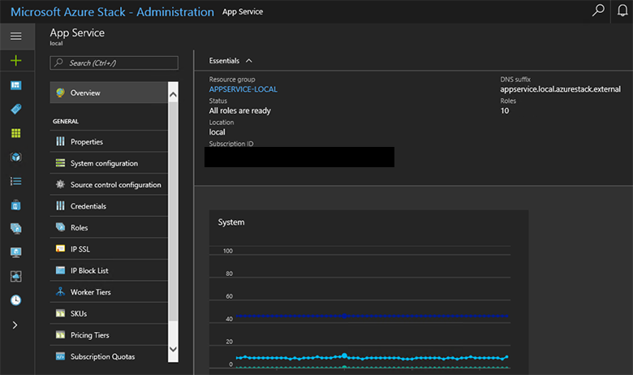

# Add workers and infrastructure in Azure App Service on Azure Stack Hub

This document provides instructions on how to scale infrastructure and worker roles in Azure App Service on Azure Stack Hub. We'll cover all the steps necessary for creating additional worker roles to support apps of any size.

> [!NOTE]
> If your Azure Stack Hub Environment doesn't have more than 96-GB RAM, you may have difficulties adding additional capacity.

Azure App Service on Azure Stack Hub supports free and shared worker tiers by default. To add other worker tiers, you need to add more worker roles.

If you're not sure what was deployed with the default Azure App Service on Azure Stack Hub installation, you can review additional info in the [App Service on Azure Stack Hub overview](azure-stack-app-service-overview.md).

Azure App Service on Azure Stack Hub deploys all roles using Virtual Machine Scale Sets and as such takes advantage of the scaling capabilities of this workload. Therefore, all scaling of the worker tiers is done via the App Service Admin.

## Add additional workers with PowerShell

1. [Set up the Azure Stack Hub admin environment in PowerShell](azure-stack-powershell-configure-admin.md)

2. Use this example to scale out the scale set:
   ```powershell
   
    ##### Scale out the AppService Role instances ######
   
    # Set context to AzureStack admin.
    Login-AzureRmAccount -EnvironmentName AzureStackAdmin
                                                 
    ## Name of the Resource group where AppService is deployed.
    $AppServiceResourceGroupName = "AppService.local"

    ## Name of the ScaleSet : e.g. FrontEndsScaleSet, ManagementServersScaleSet, PublishersScaleSet , LargeWorkerTierScaleSet,      MediumWorkerTierScaleSet, SmallWorkerTierScaleSet, SharedWorkerTierScaleSet
    $ScaleSetName = "SharedWorkerTierScaleSet"

    ## TotalCapacity is sum of the instances needed at the end of operation. 
    ## e.g. if your VMSS has 1 instance(s) currently and you need 1 more the TotalCapacity should be set to 2
    $TotalCapacity = 2  

    # Get current scale set
    $vmss = Get-AzureRmVmss -ResourceGroupName $AppServiceResourceGroupName -VMScaleSetName $ScaleSetName

    # Set and update the capacity
    $vmss.sku.capacity = $TotalCapacity
    Update-AzureRmVmss -ResourceGroupName $AppServiceResourceGroupName -Name $ScaleSetName -VirtualMachineScaleSet $vmss 
   ```    

   > [!NOTE]
   > This step can take a number of hours to complete depending on the type of role and the number of instances.
   >
   >

3. Monitor the status of the new role instances in the App Service administration. To check the status of an individual role instance, click the role type in the list.

## Add additional workers using the administrator portal

1. Sign in to the Azure Stack Hub administrator portal as the service admin.

2. Browse to **App Services**.

    

3. Click **Roles**. Here you see the breakdown of all App Service roles deployed.

4. Right click on the row of the type you want to scale and then click **ScaleSet**.

    

5. Click **Scaling**, select the number of instances you want to scale to, and then click **Save**.

    

6. Azure App Service on Azure Stack Hub will now add the additional VMs, configure them, install all the required software, and mark them as ready when this process is complete. This process can take approximately 80 minutes.

7. You can monitor the progress of the readiness of the new roles by viewing the workers in the **Roles** blade.

## Result

After they're fully deployed and ready, the workers become available for users to deploy their workload onto them. The following screenshot shows an example of the multiple pricing tiers available by default. If there are no available workers for a particular worker tier, the option to choose the corresponding pricing tier is unavailable.


>[!NOTE]
> To scale out Management, Front End, or Publisher roles, follow the same steps selecting the appropriate role type. Controllers aren't deployed as Scale Sets and therefore two should be deployed at installation time for all production deployments.

### Next steps

[Configure deployment sources](azure-stack-app-service-configure-deployment-sources.md)
