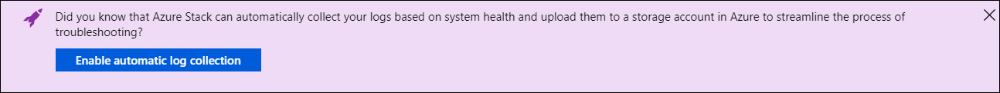

# Microsoft Azure Stack automatic log collection

The Support Bridge Service resource provider in Azure Stack streamlines the process for troubleshooting problems by helping operators easily upload log files for analysis by Microsoft Customer Support Services (CSS). 
Support Bridge enables automatic log collection and upload based on alerts. 
The service is resilient to Storage Spaces Direct and Software Defined Networking (SDN) failures. 
<!--- can we add how the resiliency helps here?--->

## Workflow

Automatic log collection isn't enabled by default. Before you can enable it, you need to [configure an Azure storage account](azure-stack-storage-account.md) where the logs can be uploaded. Here's the 

Create an Azure Storage blob container SAS URL
Enable automatic log collection
Support Bridge Service triggers collection and uploads logs based on alerts

## How to collect Azure Stack logs

You can collect diagnostic logs in two different ways:

- Automatically based on system health conditions
- On demand based on any 1-4 hour period over the previous week

## Prerequisites

<!--- any permissions, subscription requirements, or anything similar?--->

## Configure automatic log collection 

1. Sign in to the Azure Stack administrator portal.
1. Open **Help and support Overview**.
2. Click **Enable automatic log collection**.

   

3. Set Automatic log collection to **Enabled**.
4. Enter the shared access signature (SAS) URL of the storage account blob container.

   

## Configure on-demand log collection 

You can also collect logs for a specific time. For on-demand collection, CSS might provide its own blob service SAS URL. 
Click **Collect logs now**, choose a time up to four hours, and paste that SAS URL.

## View collected logs

Logs that were previously collected appear on the **Log collection** page in Help and Support. The **Collection time** refers to when the log collection operation began. The **From date** is the start of the time period you want to collect logs for and the **To date** is the end of that time period.

## Limitations

<!--- Need to confirm what Theebs wanted to cover here--->

## Alerts

<!--- demo says log collection (for all logs) triggers on alerts. See spec for algorithm--->

There are two types of alerts: 

- Expiration date approaching

  

- SAS URL has expired
  
  

## Troubleshooting errors

The next sections cover errors you might see while configuring automatic log collection. 

### Custom time range errors

Here are some errors you might see when you specify a custom time range:

- End time is before start time

  

- Time range is less than 1 hour

  

- Time range is more than 4 hours

  

### Container creation errors

<!--- Better heading title? I'm unsure if AuthN errors are actually containe errors.--->

Here are some errors you might see during automatic log collection:

<!--- how to resolve these?--->

- The storage container has not been created

  

- The account used to collect the logs is not authorized

  

- Time range is more than 4 hours

  
