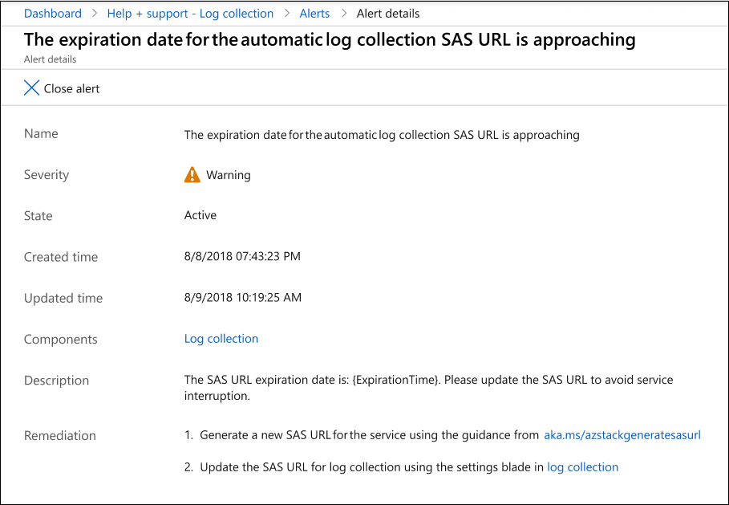
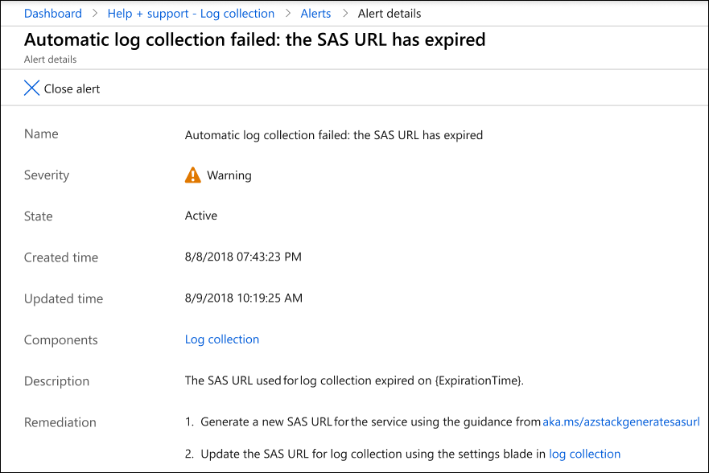
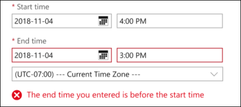
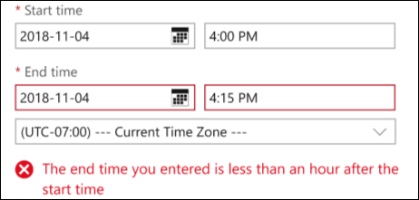
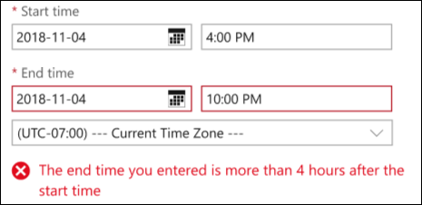
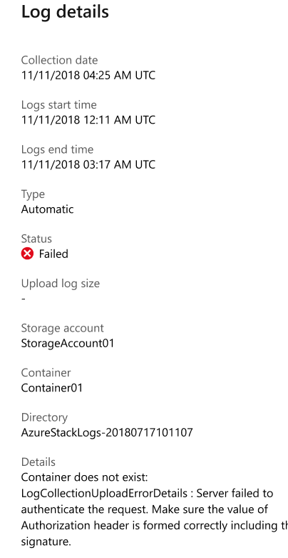
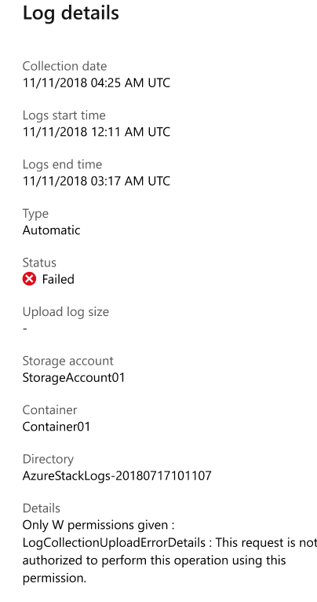
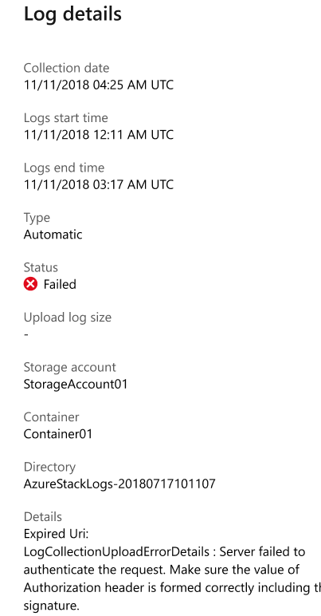

# Microsoft Azure Stack automatic log collection

Beginning with the 1906 release, Azure Stack includes an easy way for operators to upload log files for analysis by Customer Support Services. These improvements help streamline the process for troubleshooting problems. 

Automatic log collection isn't enabled by default. Before you can enable it, you need to [configure an Azure storage account](azure-stack-storage-account.md) where the logs can be uploaded. 

## How to collect Azure Stack logs

You can collect diagnostic logs in two different ways:

- Automatically based on system health conditions
- On demand based on any 1-4 hour period over the previous week

## Prerequisites

<!--- any permissions, subscription requirements, or anything similar?--->

## Workflow

1. Open Help and support Overview.
2. Click **Enable automatic log collection**.
3. Set Automatic log collection to **Enabled**.
4. Enter the shared access signature (SAS) URL of the storage account.
   

## Limitations

<!--- Need to confirm what Theebs wanted to cover here--->

## Alerts

There are two types of alerts: 

- Expiration date approaching

  

- SAS URL has expired
  
  

## Troubleshooting errors

### Custom time range errors

Here are some errors you might see when you specify a custom time range:

- End time is before start time

  

- Time range is less than 1 hour

  

- Time range is more than 4 hours

  

### Container creation errors

<!--- Better heading title? I'm unsure if AuthN errors are actually containe errors.--->

Here are some errors you might see during automatic log collection:

<!--- how to resolve these?--->

- The storage container has not been created

  

- The account used to collect the logs is not authorized

  

- Time range is more than 4 hours

  
