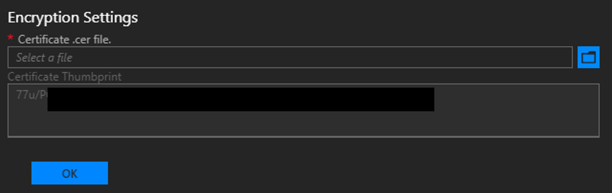
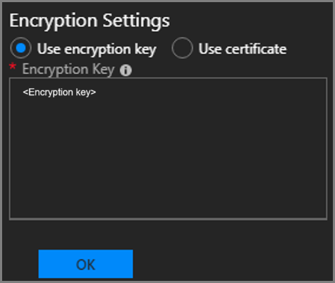

# Enable backup for Azure Stack from the admin portal

You have to enable the Infrastructure Backup Service through the admin portal so that Azure Stack can generate infrastructure backups. The hardware partner can use these backups to restore your environment using cloud recovery in the event of [a catastrophic failure](./azure-stack-backup-recover-data.md). The purpose of cloud recovery is to ensure that your operators and users can log back into the portal after recovery is complete. Users will have their subscriptions restored, including:

- Role-based access permissions and roles.
- Original plans and offers.
- Previously defined compute, storage, and network quotas.
- Key Vault secrets.

However, the Infrastructure Backup Service doesn't back up IaaS VMs, network configurations, and storage resources such as storage accounts, blobs, tables, and so on. Users logging in after cloud recovery won't see any of these previously existing resources. Platform as a Service (PaaS) resources and data are also not backed up by the service.

Admins and users are responsible for backing up and restoring IaaS and PaaS resources separately from the infrastructure backup processes. For info on backing up IaaS and PaaS resources, see the following links:

- [Protect VMs deployed on Azure Stack](../user/azure-stack-manage-vm-protect.md)
- [Back up your app in Azure](https://docs.microsoft.com/azure/app-service/manage-backup)
- [What is SQL Server on Azure VMs? (Windows)](https://docs.microsoft.com/azure/virtual-machines/windows/sql/virtual-machines-windows-sql-server-iaas-overview)


## Enable or reconfigure backup

1. Open the [Azure Stack admin portal](azure-stack-manage-portals.md).
2. Select **All services**, and then under the **ADMINISTRATION** category select **Infrastructure backup**. Choose **Configuration** in the **Infrastructure backup** blade.
3. Type the path to the **Backup storage location**. Use a Universal Naming Convention (UNC) string for the path to a file share hosted on a separate device. A UNC string specifies the location of resources such as shared files or devices. For the service, you can use an IP address. To ensure availability of the backup data after a disaster, the  device should be in a separate location.

    > [!Note]  
    > If your environment supports name resolution from the Azure Stack infrastructure network to your enterprise environment, you can use a Fully Qualified Domain Name (FQDN) rather than the IP.

4. Type the **Username** using the domain and username with sufficient access to read and write files. For example, `Contoso\backupshareuser`.
5. Type the **Password** for the user.
6. Type the password again to **Confirm Password**.
7. The **frequency in hours** determines how often backups are created. The default value is 12. Scheduler supports a maximum of 12 and a minimum of 4. 
8. The **retention period in days** determines how many days of backups are preserved on the external location. The default value is 7. Scheduler supports a maximum of 14 and a minimum of 2. Backups older than the retention period are automatically deleted from the external location.

    > [!Note]  
    > If you want to archive backups older than the retention period, make sure to back up the files before the scheduler deletes the backups. If you reduce the backup retention period (e.g. from 7 days to 5 days), the scheduler will delete all backups older than the new retention period. Make sure you're OK with the backups getting deleted before you update this value.

9. In Encryption Settings, provide a certificate in the Certificate .cer file box. Backup files are encrypted using this public key in the certificate. Provide a certificate that only contains the public key portion when you configure backup settings. Once you set this certificate for the first time or rotate the certificate in the future, you can only view the thumbprint of the certificate. You can't download or view the uploaded certificate file. To create the certificate file, run the following PowerShell command to create a self-signed certificate with the public and private keys and export a certificate with only the public key portion. You can save the certificate anywhere that can be accessed from admin portal.

	```powershell

	    $cert = New-SelfSignedCertificate `
		    -DnsName "www.contoso.com" `
		    -CertStoreLocation "cert:\LocalMachine\My"

		New-Item -Path "C:\" -Name "Certs" -ItemType "Directory" 
		Export-Certificate `
		    -Cert $cert `
		    -FilePath c:\certs\AzSIBCCert.cer 
    ```

   > [!Note]
   > **1901 and above**: Azure Stack accepts a certificate to encrypt infrastructure backup data. Make sure to store the certificate with the public and private key in a secure location. For security reasons, it's not recommended that you use the certificate with the public and private keys to configure backup settings. For more info on how to manage the lifecycle of this certificate, see [Infrastructure Backup Service best practices](azure-stack-backup-best-practices.md).
   > 
   > **1811 or earlier**: Azure Stack accepts a symmetric key to encrypt infrastructure backup data. Use the [New-AzsEncryptionKey64 cmdlet to create a key](https://docs.microsoft.com/powershell/module/azs.backup.admin/new-azsencryptionkeybase64). After you upgrade from 1811 to 1901, backup settings will retain the encryption key. We recommend you update backup settings to use a certificate. Encryption key support is now deprecated. You have at least 3 releases to update settings to use a certificate.

10. Select **OK** to save your backup controller settings.


## Start backup
To start a backup, click on **Backup now** to start an on-demand backup. An on-demand backup won't modify the time for the next scheduled backup. After the task completes, you can confirm the settings in **Essentials**:


You can also run the PowerShell cmdlet **Start-AzsBackup** on your Azure Stack admin computer. For more info, see [Back up Azure Stack](azure-stack-backup-back-up-azure-stack.md).

## Enable or disable automatic backups
Backups are automatically scheduled when you enable backup. You can check the next schedule backup time in **Essentials**. 


If you need to disable future scheduled backups, click on **Disable Automatic Backups**. Disabling automatic backups keeps backup settings configured and retains the backup schedule. This action simply tells the scheduler to skip future backups.


Confirm that future scheduled backups have been disabled in **Essentials**:


Click on **Enable Automatic Backups** to inform the scheduler to start future backups at the scheduled time. 


> [!Note]  
> If you configured infrastructure backup before updating to 1807, automatic backups will be disabled. This way the backups started by Azure Stack don't conflict with backups started by an external task scheduling engine. Once you disable any external task scheduler, click on **Enable Automatic Backups**.

## Update backup settings
As of 1901, support for encryption key is deprecated. If you're configuring backup for the first time in 1901, you must use a certificate. Azure Stack supports encryption key only if the key is configured before updating to 1901. Backward compatibility mode will continue for three releases. After that, encryption keys will no longer be supported.

### Default mode
In encryption settings, if you're configuring infrastructure backup for the first time after installing or updating to 1901, you must configure backup with a certificate. Using an encryption key is no longer supported.

To update the certificate used to encrypt backup data, upload a new .CER file with the public key portion and select OK to save settings.

New backups will start to use the public key in the new certificate. There's no impact to all existing backups created with the previous certificate. Make sure to keep the older certificate around in a secure location in case you need it for cloud recovery.



### Backwards compatibility mode
If you configured backup before updating to 1901, the settings are carried over with no change in behavior. In this case, the encryption key is supported for backwards compatibility. You can update the encryption key or switch to use a certificate. You have at least three releases to continue updating the encryption key. Use this time to transition to a certificate. To create a new encryption key, use [New-AzsEncryptionKeyBase64](https://docs.microsoft.com/powershell/module/azs.backup.admin/new-azsencryptionkeybase64).



> [!Note]  
> Updating from encryption key to certificate is a one-way operation. After making this change, you can't switch back to encryption key. All existing backups will remain encrypted with the previous encryption key.


## Next steps

Learn to run a backup. See [Back up Azure Stack](azure-stack-backup-back-up-azure-stack.md).

Learn to verify that your backup ran. See [Confirm backup completed in admin portal](azure-stack-backup-back-up-azure-stack.md).
