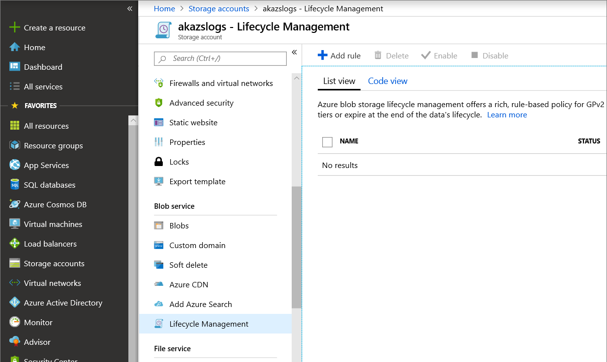

# Best practices for automatic Azure Stack Hub log collection 

This topic covers best practices for managing automatic diagnostic log collection for Azure Stack Hub. 

## Collecting logs from multiple Azure Stack Hub systems

Set up one blob container for every Azure Stack Hub scale unit you want to collect logs from. For more information about how to configure the blob container, see [Configure automatic Azure Stack Hub diagnostic log collection](azure-stack-configure-automatic-diagnostic-log-collection.md). As a best practice, only save diagnostic logs from the same Azure Stack Hub scale unit within a single blob container. 

## Retention policy

Create an Azure Blob storage [lifecycle management rule](https://docs.microsoft.com/azure/storage/blobs/storage-lifecycle-management-concepts) to manage the log retention policy. We suggest retaining diagnostic logs for 30 days. To create a lifecycle management rule in Azure storage, sign in to the Azure portal, click **Storage accounts**, click the blob container, and under **Blob service**, click **Lifecycle Management**.

## SAS token expiration

Set the SAS URL expiry to two years. If you ever renew your storage account keys, make sure to regenerate the SAS URL. You should manage the SAS token according to best practices. For more information, see [Best practices when using SAS](https://docs.microsoft.com/azure/storage/common/storage-dotnet-shared-access-signature-part-1#best-practices-when-using-sas).

## Bandwidth consumption

The average size of diagnostic log collection varies based on whether log collection is on-demand or automatic. 

For on-demand log collection, the size of the logs collection depends on how many hours are being collected. You can choose any 1-4 hour sliding window from the last seven days. 

When automatic diagnostic log collection is enabled, the service monitors for critical alerts. 
After a critical alert gets raised and persists for around 30 minutes, the service collects and uploads appropriate logs. 
This log collection size is around 2 GB on average. 
In the case of a patch and update failure, automatic log collection will start only if a critical alert is raised and persists for around 30 minutes. We recommend that you follow [guidance on monitoring the patch and update](azure-stack-updates.md).
Alert monitoring, log collection, and upload are transparent to the user. 

In a healthy system, logs will not be collected at all. 
In an unhealthy system, log collection may run two or three times in a day, but typically only once. 
At most, it could potentially run up to ten times in a day in a worst-case scenario.  

The following table can help environments with limited or metered connections to Azure consider the impact of enabling automatic log collection.

| Network connection | Impact |
|--------------------|--------|
| Low-bandwidth/high-latency connection | Log upload will take an extended amount of time to complete | 
| Shared connection | The upload may also impact other applications/users sharing the network connection |
| Metered connection | There may be an additional charge from your ISP for the additional network usage |

## Managing costs

Azure [blob storage charges](https://azure.microsoft.com/pricing/details/storage/blobs/) depend on how much data is saved each month and other factors such as data redundancy. 
If you don't have an existing storage account, you can sign in to the Azure portal, click **Storage accounts**, and follow the steps to [create an Azure blob container SAS URL](azure-stack-configure-automatic-diagnostic-log-collection.md).

As a best practice, create an Azure Blob storage [lifecycle management policy](https://docs.microsoft.com/azure/storage/blobs/storage-lifecycle-management-concepts) to minimize ongoing storage costs. For more information about how to set up the storage account, see [Configure automatic Azure Stack Hub diagnostic log collection](azure-stack-configure-automatic-diagnostic-log-collection.md)

## See also

[Configure automatic Azure Stack Hub log collection](azure-stack-best-practices-automatic-diagnostic-log-collection.md)

