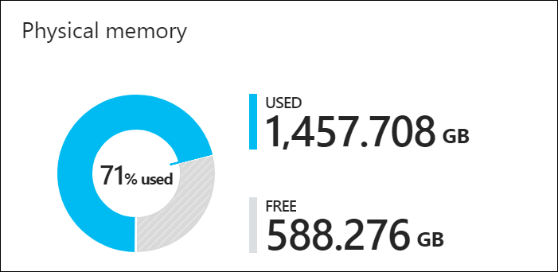

# Azure Stack compute

The [VM sizes](https://docs.microsoft.com/azure-stack/user/azure-stack-vm-sizes) supported on Azure Stack are a subset of those supported on Azure. Azure imposes resource limits along many vectors to avoid overconsumption of resources (server local and service-level). Without imposing some limits on tenant consumption, the tenant experiences will suffer when other tenants overconsume resources. For networking egress from the VM, there are bandwidth caps in place on Azure Stack that match Azure limitations. For storage resources on Azure Stack, storage IOPS limits avoid basic over consumption of resources by tenants for storage access.

>[!IMPORTANT]
>The [Azure Stack Capacity Planner](https://aka.ms/azstackcapacityplanner) does not consider or guarantee IOPS performance.

## VM placement

The Azure Stack placement engine places tenant VMs across the available hosts.

Azure Stack uses two considerations when placing VMs. One, is enough memory on the host for that VM type. Two, are the VMs a part of an [availability set](https://docs.microsoft.com/azure/virtual-machines/windows/manage-availability) or are [virtual machine scale sets](https://docs.microsoft.com/azure/virtual-machine-scale-sets/overview).

To achieve high availability of a multi-VM production system in Azure Stack, VMs are placed in an availability set that spreads them across multiple fault domains. 
A fault domain in an availability set is defined as a single node in the scale unit. 
Azure Stack supports having an availability set with a maximum of three fault domains to be consistent with Azure. 
VMs placed in an availability set will be physically isolated from each other by spreading them as evenly as possible over multiple fault domains, that is, Azure Stack hosts. 
If there is a hardware failure, VMs from the failed fault domain will be restarted in other fault domains, but, if possible, kept in separate fault domains from the other VMs in the same availability set. 
When the host comes back online, VMs will be rebalanced to maintain high availability.  

Virtual machine scale sets use availability sets on the back end and make sure each virtual machine scale set instance is placed in a different fault domain. 
This means they use separate Azure Stack infrastructure nodes. 
For example, in a four node Azure Stack system, there may be a situation where a virtual machine scale set of three instances will fail at creation due to the lack of the 4-node capacity to place three virtual machine scale set instances on three separate Azure Stack nodes. 
In addition, Azure Stack nodes can be filled up at varying levels prior to trying placement. 

Azure Stack doesn't over-commit memory. However, an over-commit of the number of physical cores is allowed. 

Since placement algorithms don't look at the existing virtual to physical core over-provisioning ratio as a factor, each host could have a different ratio. 
As Microsoft, we don't provide guidance on the physical-to-virtual core ratio because of the variation in workloads and service level requirements. 

## Consideration for total number of VMs 

There is a new consideration for accurately planning Azure Stack capacity. With the 1901 update (and every update going forward), there is now a limit on the total number of virtual machines that can be created. This limit is intended to be temporary to avoid solution instability. The source of the stability issue, at higher numbers of VMs, is being addressed but a specific timeline for remediation has not yet been determined. There is now a per server limit of 60 VMs with a total solution limit of 700. For example, an 8 server Azure Stack VM limit would be 480 (8 * 60). For a 12 to 16 server Azure Stack solution, the limit would be 700. This limit has been created keeping all the compute capacity considerations in mind, such as the resiliency reserve and the CPU virtual to physical ratio that an operator would like to maintain on the stamp. For more information, see the new release of the capacity planner. 

In the event that the VM scale limit has been reached, the following error codes would be returned as a result: VMsPerScaleUnitLimitExceeded, VMsPerScaleUnitNodeLimitExceeded.

## Considerations for deallocation

When a VM is in the _deallocated_ state, memory resources aren't being used. This allows others VMs to be placed in the system. 

If the deallocated VM is then started again, the memory usage or allocation is treated like a new VM placed into the system, and available memory is consumed. 

If there is no available memory, then the VM will not start.

## Azure Stack memory 

Azure Stack is designed to keep VMs running that have been successfully provisioned. 
For example, if a host is offline because of a hardware failure, Azure Stack will attempt to restart that VM on another host. 
The second example is patch and update of the Azure Stack software. 
If there is a need to reboot a physical host, an attempt is made to move the VMs executing on that host to another available host in the solution.   

This VM management or movement can only be achieved if there is reserved memory capacity to allow for the restart or migration to occur. 
A portion of the total host memory is reserved and unavailable for tenant VM placement. 

You can review a pie chart in the Administration portal that shows the free and used memory in Azure Stack. The following diagram shows the physical memory capacity on an Azure Stack scale unit in the Azure Stack:

Used memory is made up of several components. The following components consume the memory in the use section of the pie chart:  

 -	Host OS usage or reserve – This is the memory used by the operating system (OS) on the host, virtual memory page tables, processes that are running on the host OS, and the Spaces Direct memory cache. Since this value is dependent on the memory used by the different Hyper-V processes running on the host, it can fluctuate.
 - Infrastructure services – These are the infrastructure VMs that make up Azure Stack. As of the 1904 release version of Azure Stack, this entails ~31 VMs that take up 242 GB + (4 GB x # of nodes) of memory. The memory utilization of the infrastructure services component may change as we work on making our infrastructure services more scalable and resilient.
 - Resiliency reserve – Azure Stack reserves a portion of the memory to allow for tenant availability during a single host failure as well as during patch and update to allow for successful live migration of VMs.
 - Tenant VMs – These are the tenant VMs created by Azure Stack users. In addition to running VMs, memory is consumed by any VMs that have landed on the fabric. This means that VMs in "Creating" or "Failed" state, or VMs shut down from within the guest, will consume memory. However, VMs that have been deallocated using the stop deallocated option from portal/powershell/cli will not consume memory from Azure Stack.
 - Value-add resource providers (RPs) – VMs deployed for the value-add RPs like SQL, MySQL, App Service etc.

The best way to understand memory consumption on the portal is to use the [Azure Stack Capacity Planner](https://aka.ms/azstackcapacityplanner) to see the impact of various workloads. 
The following calculation is the same one used by the planner.

This calculation results in the total, available memory that can be used for tenant VM placement. 
This memory capacity is for the entirety of the Azure Stack scale unit. 

  Available Memory for VM placement = Total Host Memory - Resiliency Reserve - Memory used by running tenant VMs - Azure Stack Infrastructure Overhead 1

  Resiliency reserve = H + R * ((N-1) * H) + V * (N-2)

> Where:
> -	H = Size of single server memory
> - N = Size of Scale Unit (number of servers)
> -	R = The operating system reserve for OS overhead, which is .15 in this formula2
> -	V = Largest VM in the scale unit

  1 Azure Stack Infrastructure Overhead = 242 GB + (4 GB x # of nodes). Approximately 31 VMs are used to host Azure Stack's infrastructure and, in total, consume about 242 GB + (4 GB x # of nodes) of memory and 146 virtual cores. The rationale for this number of VMs is to satisfy the needed service separation to meet security, scalability, servicing and patching requirements. This internal service structure allows for the future introduction of new infrastructure services as they are developed. 

  2 Operating system reserve for overhead = 15% (.15) of node memory. The operating system reserve value is an estimate and will vary based on the physical memory capacity of the server and general operating system overhead.

The value V, largest VM in the scale unit, is dynamically based on the largest tenant VM memory size. 
For example, the largest VM value could be 7 GB or 112 GB or any other supported VM memory size in the Azure Stack solution. 
Changing the largest VM on the Azure Stack fabric will result in an increase in the resiliency reserve in addition to the increase in the memory of the VM itself. 

## Frequently Asked Questions

**Q**: My tenant deployed a new VM, how long will it take for the capability chart on the admin portal to show remaining capacity?

**A**: The capacity blade refreshes every 15 minutes, so please take that into consideration.

**Q**: The number of deployed VMs on my Azure Stack hasn't changed, but my capacity is fluctuating. Why?

**A**: The available memory for VM placement has multiple dependencies, one of which is the host OS reserve. This value is dependent on the memory used by the different Hyper-V processes running on the host, which isn't a constant value.

**Q**: What state do Tenant VMs have to be in to consume memory?

**A**: In addition to running VMs, memory is consumed by any VMs that have landed on the fabric. This means that VMs that are in "Creating", "Failed" or VMs shut down from within the guest as opposed to stop deallocated from portal/powershell/cli will consume memory.

**Q**: I have a four host Azure Stack. My tenant has 3 VMs that consume 56 GB RAM (D5_v2) each. One of the VMs is resized to 112 GB RAM (D14_v2), and available memory reporting on dashboard resulted in a spike of 168 GB usage on the capacity blade. Subsequent resizing of the other two D5_v2 VMs to D14_v2, resulted in only 56GB of RAM increase each. Why is this so?

**A**: The available memory is a function of the resiliency reserve maintained by Azure Stack. The Resiliency reserve is a function of the largest VM size on the Azure Stack stamp. At first, the largest VM on the stamp was 56 GB memory. When the VM was resized, the largest VM on the stamp became 112 GB memory which not only increased the memory used by that tenant VM but also  increased the Resiliency reserve. This resulted in an increase of 56 GB (56 GB to 112 GB tenant VM memory increase) + 112 GB resiliency reserve memory increase. When subsequent VMs were resized, the largest VM size remained as the 112 GB VM and therefore there was no resultant resiliency reserve increase. The increase in memory consumption was only the tenant VM memory increase (56 GB). 

> [!NOTE]
> The capacity planning requirements for networking are minimal as only the size of the Public VIP is configurable. For information about how to add more Public IP Addresses to Azure Stack, see [Add Public IP Addresses](azure-stack-add-ips.md).

## Next steps
Learn about [Azure Stack storage](azure-stack-capacity-planning-storage.md)
