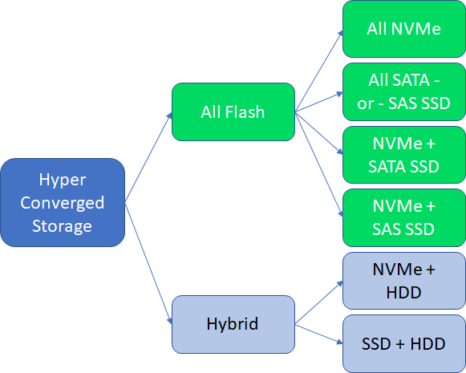

# Azure Stack Hub storage capacity planning

The following sections provide Azure Stack Hub storage capacity planning information to assist in planning for the solution's storage needs.

## Uses and organization of storage capacity

The hyperconverged configuration of Azure Stack Hub allows for the sharing of physical storage devices. There are three main divisions of the available storage that can be shared: the infrastructure, the temporary storage of the tenant virtual machines (VMs), and the storage backing the blobs, tables, and queues of the Azure Consistent Storage (ACS) services.

## Storage Spaces Direct cache and capacity tiers

There's storage capacity used for the operating system, local logging, dumps, and other temporary infrastructure storage needs. This local storage capacity is separate (devices and capacity) from the storage devices brought under management of the Storage Spaces Direct configuration. The rest of the storage devices are placed in a single pool of storage capacity, regardless of the number of servers in the scale unit.

These devices are of two types: cache and capacity. Storage Spaces Direct consumes cache devices for write-back and read caching. The capacities of these cache devices, while used, aren't committed to the formatted and "visible" capacity of the formatted virtual disks. By contrast, Storage Spaces Direct does use capacity devices for this purpose, providing the "home location" of the managed data.

The Azure Stack Hub infrastructure directly allocates and manages all storage capacity. The operator doesn't need to make choices about configuration, allocation, capacity expansion. Azure Stack Hub automates these design decisions to align with the solution requirements, during either the initial installation and deployment or capacity expansion. Azure Stack Hub takes into consideration resiliency, reserved capacity for rebuilds, and other details, as part of the design.

Operators can choose between either an *all flash* or a *hybrid* storage configuration:



In the all flash configuration, the configuration can be either a two-tier or a single-tier configuration. If the configuration is single-tier, all capacity devices are of the same type (for example, *NVMe* or *SATA SSD* or *SAS SSD*), and cache devices aren't used. In a two-tier all flash configuration, the typical configuration is NVMe as the cache devices, and then either SATA or SAS SSDs as the capacity devices.

In the hybrid two-tier configuration, the cache is a choice among NVMe, SATA, or SAS SSD, and the capacity is HDD.

A brief summary of the Storage Spaces Direct and Azure Stack Hub storage configuration is as follows:
- One Storage Spaces Direct pool per scale unit (all storage devices are configured within a single pool).
- Virtual disks are created as a three-copy mirror for best performance and resiliency.
- Each virtual disk is formatted as an ReFS file system.
- Virtual disk capacity is calculated and allocated in a way as to leave one capacity device's amount of data capacity unallocated in the pool. This is the equivalent of one capacity drive per server.
- Each ReFS file system has BitLocker enabled for data-at-rest encryption. 

The virtual disks created automatically and their capacities are as follows:

|Name|Capacity calculation|Description|
|-----|-----|-----|
|Local/boot device|Minimum of 340 GB<sup>1</sup>|Individual server storage for operating system images and "local" infrastructure VMs.|
|Infrastructure|3.5 TB|All Azure Stack Hub infrastructure usage.|
|VmTemp|See below<sup>2</sup>|Tenant VMs have a temporary disk attached and that data is stored in these virtual disks.|
|ACS|See below <sup>3</sup>|Azure Consistent Storage capacity for servicing blobs, tables, and queues.|

<sup>1</sup> Minimum storage capacity required of the Azure Stack Hub solution partner.

<sup>2</sup> The virtual disk size used for tenant VM temporary disks is calculated as a ratio of the physical memory of the server. The temporary disk is a ratio of the physical memory assigned to the VM. The allocation done for "temp disk" storage in Azure Stack Hub captures most use cases but might not be able to satisfy all temp disk storage needs. The ratio is a trade-off between making temporary storage available and not consuming a majority of the solution's storage capacity for temp disk capacity only. One temporary storage disk is created per server in the scale unit. The capacity of the temporary storage doesn't grow beyond 10 percent of the overall available storage capacity in the storage pool of the scale unit. The calculation is something like the following example:

```
  DesiredTempStoragePerServer = PhysicalMemory * 0.65 * 8
  TempStoragePerSolution = DesiredTempStoragePerServer * NumberOfServers
  PercentOfTotalCapacity = TempStoragePerSolution / TotalAvailableCapacity
  If (PercentOfTotalCapacity <= 0.1)
      TempVirtualDiskSize = DesiredTempStoragePerServer
  Else
      TempVirtualDiskSize = (TotalAvailableCapacity * 0.1) / NumberOfServers
```

<sup>3</sup> The virtual disks created for use by ACS are a simple division of the remaining capacity. As noted, all virtual disks are a three-way mirror and one capacity drive's worth of capacity for each server is unallocated. The various virtual disks previously enumerated are allocated first and the remaining capacity is then used for the ACS virtual disks.

## Next steps

Learn about the [Azure Stack Hub Capacity Planner](azure-stack-capacity-planner.md).
