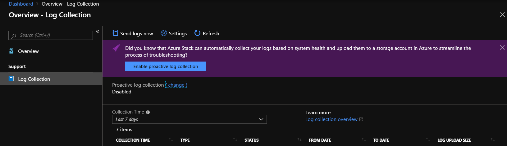
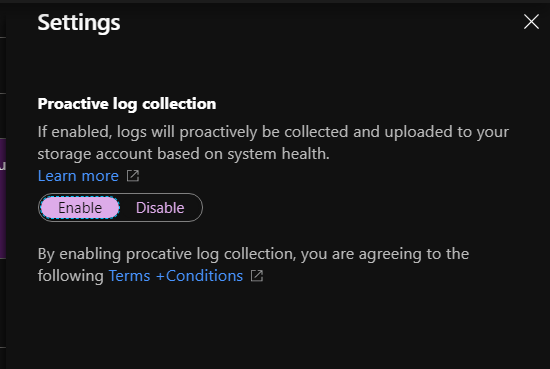
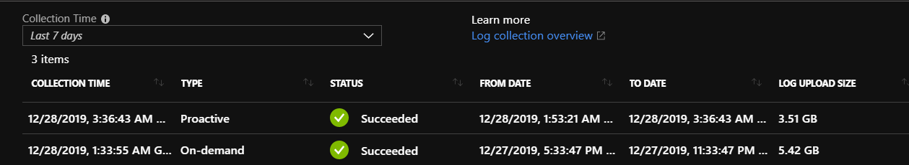

# Send Azure Stack Hub diagnostic logs proactively

You can save time with customer support by proactively collecting diagnostic logs when an alert gets raised on Azure Stack Hub.
If system health conditions need to be investigated, the logs can be uploaded automatically for analysis before opening a support case with Microsoft Customer Support Services (CSS). 

## Steps to configure proactive log collection

Follow these steps to configure proactive log collection. Automatic log collection can be disabled and re-enabled anytime.  

1. Sign in to the Azure Stack Hub administrator portal.
1. Open **Help and support Overview**.
1. If the banner appears, click **Enable proactive log collection**. 

   

   Or you can click **Settings** and set **Proactive log collection** to **Enable** and click **Save**.

   

## View log collection

The history of logs collected from Azure Stack Hub appears on the **Log collection** page in Help and Support, with the following dates and times:

- **Time Collected**: When the log collection operation began
- **Status**: Either in progress or complete
- **Logs start**: Start of the time period for which you want to collect
- **Logs end**: End of the time period
- **Type**: If it’s a manual or proactive log collection 

## Proactive diagnostic log collection alerts 

If enabled, proactive log collection uploads logs only when one of the following events is raised. 

For example, **Update failed** is an alert that triggers proactive diagnostic log collection. If it is enabled, diagnostic logs will be proactively captured during an update failure to help CSS troubleshoot the problem. The diagnostic logs are only collected when the alert for **Update failed** is raised. 

|Alert Title  |	FaultIdType|	
|-------------|------------|
|Unable to connect to the remote service |	UsageBridge.NetworkError|
|Update failed |	Urp.UpdateFailure	|          
|Storage Resource Provider infrastructure/dependencies not available |	StorageResourceProviderDependencyUnavailable	 |     
|Node not connected to controller|	ServerHostNotConnectedToController	 |     
|Route publication failure |	SlbMuxRoutePublicationFailure |	
|Storage Resource Provider internal data store unavailable |	StorageResourceProvider. DataStoreConnectionFail	 |       
|Storage device failure	| Microsoft.Health.FaultType.VirtualDisks.Detached	 |      
|Health controller cannot access storage account | Microsoft.Health.FaultType.StorageError |	
|Connectivity to a physical disk has been lost |	Microsoft.Health.FaultType.PhysicalDisk.LostCommunication	 |    
|The blob service isn't running on a node |	StorageService.The.blob.service.is.not.running.on.a.node-Critical |	
|Infrastructure role unhealthy |	Microsoft.Health.FaultType.GenericExceptionFault |        
|Table service errors |	StorageService.Table.service.errors-Critical |              
|A file share is over 80% utilized |	Microsoft.Health.FaultType.FileShare.Capacity.Warning.Infra |       
|Scale unit node is offline	| FRP.Heartbeat.PhysicalNode |	
|Infrastructure role instance unavailable |	FRP.Heartbeat.InfraVM	|    
|Infrastructure role instance unavailable  |	FRP.Heartbeat.NonHaVm     |        
|The infrastructure role, Directory Management, has reported time synchronization errors |	DirectoryServiceTimeSynchronizationError |	   
|Pending external certificate expiration |	CertificateExpiration.ExternalCert.Warning |
|Pending external certificate expiration |	CertificateExpiration.ExternalCert.Critical |
|Unable to provision virtual machines for specific class and size due to low memory capacity |	AzureStack.ComputeController.VmCreationFailure.LowMemory |
|Node inaccessible for virtual machine placement |	AzureStack.ComputeController.HostUnresponsive |	
|Backup failed  | AzureStack.BackupController.BackupFailedGeneralFault |	
|The scheduled backup was skipped due to a conflict with failed operations	| AzureStack.BackupController.BackupSkippedWithFailedOperationFault |	

## See also

[Azure Stack Hub log and customer data handling](azure-stack-data-collection.md)

