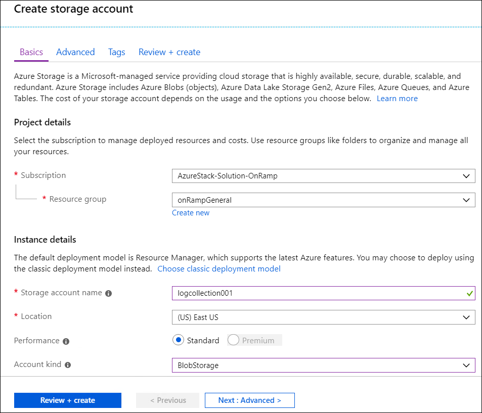
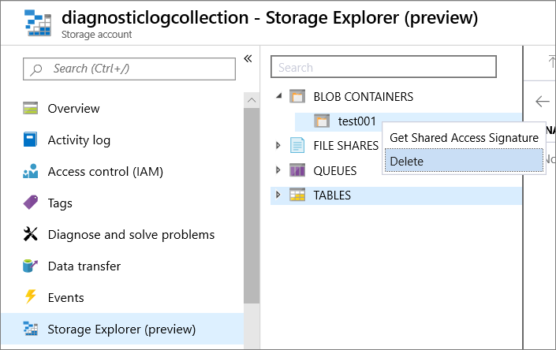
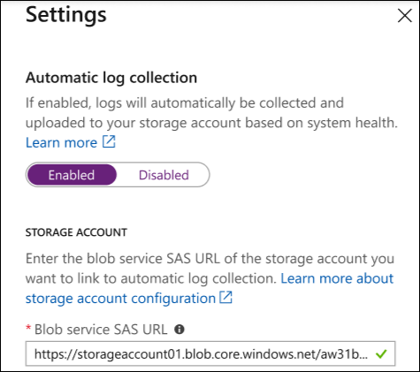
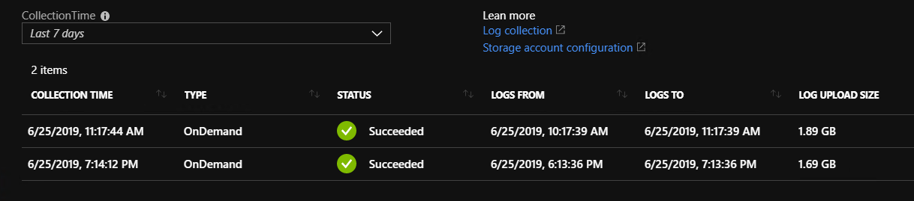
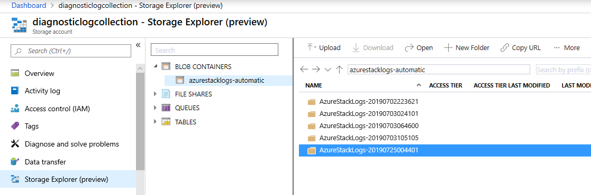

# Configure automatic Azure Stack diagnostic log collection

*Applies to: Azure Stack integrated systems*

We recommend configuring the automatic diagnostic log collection feature to streamline your log collection and customer support experience. 
If system health conditions need to be investigated, the logs can be uploaded automatically for analysis by Microsoft Customer Support Services (CSS). 

## Create an Azure blob container SAS URL 

Before you can configure automatic log collection, you'll need to get a shared access signature (SAS) for a blob container. A SAS lets you grant access to resources in your storage account without sharing your account keys. 
You can save Azure Stack log files to a blob container in Azure, and then provide the SAS URL where CSS can collect the logs. 

### Prerequisites

You can use a new or existing blob container in Azure. 
To create a blob container in Azure, you need at least the [storage blob contributor role](https://docs.microsoft.com/azure/role-based-access-control/built-in-roles#storage-blob-data-contributor) or the [specific permission](https://docs.microsoft.com/rest/api/storageservices/authenticate-with-azure-active-directory#permissions-for-calling-blob-and-queue-data-operations). 
Global administrators also have the necessary permission. 

For best practices about choosing parameters for the automatic log collection storage account, see [Best practices for automatic Azure Stack log collection](azure-stack-best-practices-automatic-diagnostic-log-collection.md). For more information about types of storage accounts, see [Azure storage account overview](https://docs.microsoft.com/azure/storage/common/storage-account-overview)

### Create a blob storage account
 
1. Sign in to the [Azure portal](https://portal.azure.com).
1. Click **Storage accounts** > **Add**. 
1. Create a blob container with these settings:
   - **Subscription**: Choose your Azure subscription.
   - **Resource group**: Specify a resource group.
   - **Storage account name**: Specify a unique storage account name.
   - **Location**: Choose a datacenter in accordance with your company policy.
   - **Performance**: Choose Standard.
   - **Account kind** Choose StorageV2 (general purpose v2). 
   - **Replication**: Choose Locally-redundant storage (LRS)
   - **Access tier**: Choose Cool

   

1. Click **Review + create** and then click **Create**.  

### Create a blob container 

1. After the deployment succeeds, click **Go to resource**. You can also pin the storage account to the Dashboard for easy access. 
1. Click **Storage Explorer (preview)**, right-click **Blob containers**, and click **Create blob container**. 
1. Enter a name for the new container and click **OK**.

## Create a SAS URL

1. Right-click the container, click **Get Shared Access Signature**. 
   
   

1. Choose these properties:
   - Start time: You can optionally move the start time back 
   - Expiry time: Two years
   - Time zone: UTC
   - Permissions: Read, Write, and List

    

1. Click **Create**.  

Copy the URL and enter it when you [configure automatic log collection](azure-stack-configure-automatic-diagnostic-log-collection.md). 
For more information about SAS URLs, see [Using shared access signatures (SAS)](https://docs.microsoft.com/azure/storage/common/storage-dotnet-shared-access-signature-part-1). 

## Steps to configure automatic log collection

Follow these steps to add the SAS URL to the log collection UI: 

1. Sign in to the Azure Stack administrator portal.
1. Open **Help and support Overview**.
1. Click **Automatic collection settings**.

   

1. Set Automatic log collection to **Enabled**.
1. Enter the shared access signature (SAS) URL of the storage account blob container.

   

>[!NOTE]
>Automatic log collection can be disabled and re-enabled anytime. The SAS URL configuration won't change. If automatic log collection is re-enabled, the previously entered SAS URL will undergo the same validation checks, and an expired SAS URL will be rejected. 

## View log collection

The history of logs collected from Azure Stack appears on the **Log collection** page in Help and Support, with the following dates and times:

- **Collection time**: When the log collection operation began 
- **From Date**: Start of the time period for which you want to collect
- **To Date**: End of the time period

If diagnostic log collection fails, verify the SAS URL is valid. If failure persists or you see multiple failures, call Microsoft CSS for help. 

Operators can also check the storage account for automatically collected logs. For example, this screenshot shows log collections by using the Storage Explorer preview from the Azure portal:

## Automatic diagnostic log collection alerts 

The following table lists the different types of alerts that can trigger automatic diagnostic log collection. 

|Alert Title  |	FaultIdType|	
|-------------|------------|
|Unable to connect to the remote service |	UsageBridge.NetworkError|
|Update failed |	Urp.UpdateFailure	|          
|Storage Resource Provider infrastructure/dependencies not available |	StorageResourceProviderDependencyUnavailable	 |     
|Node not connected to controller|	ServerHostNotConnectedToController	 |     
|Route publication failure |	SlbMuxRoutePublicationFailure |	
|Storage Resource Provider internal data store unavailable |	StorageResourceProvider. DataStoreConnectionFail	 |       
|Storage device failure	| Microsoft.Health.FaultType.VirtualDisks.Detached	 |      
|Health controller cannot access storage account | Microsoft.Health.FaultType.StorageError |	
|Connectivity to a physical disk has been lost |	Microsoft.Health.FaultType.PhysicalDisk.LostCommunication	 |    
|The blob service isnt running on a node |	StorageService.The.blob.service.is.not.running.on.a.node-Critical |	
|Infrastructure role unhealthy |	Microsoft.Health.FaultType.GenericExceptionFault |        
|Table service errors |	StorageService.Table.service.errors-Critical |              
|A file share is over 80% utilized |	Microsoft.Health.FaultType.FileShare.Capacity.Warning.Infra |       
|Scale unit node is offline	| FRP.Heartbeat.PhysicalNode |	
|Infrastructure role instance unavailable |	FRP.Heartbeat.InfraVM	|    
|Infrastructure role instance unavailable  |	FRP.Heartbeat.NonHaVm     |        
|The infrastructure role, Directory Management, has reported time synchronization errors |	DirectoryServiceTimeSynchronizationError |	   
|Pending external certificate expiration |	CertificateExpiration.ExternalCert.Warning |
|Pending external certificate expiration |	CertificateExpiration.ExternalCert.Critical |
|Unable to provision virtual machines for specific class and size due to low memory capacity |	AzureStack.ComputeController.VmCreationFailure.LowMemory |
|Node inaccessible for virtual machine placement |	AzureStack.ComputeController.HostUnresponsive |	
|Backup failed  | AzureStack.BackupController.BackupFailedGeneralFault |	
|The scheduled backup was skipped due to a conflict with failed operations	| AzureStack.BackupController.BackupSkippedWithFailedOperationFault |	

## See also

[Azure Stack log and customer data handling](https://docs.microsoft.com/azure-stack/operator/azure-stack-data-collection)

[Using shared access signatures (SAS)](https://docs.microsoft.com/azure/storage/common/storage-dotnet-shared-access-signature-part-1)

[Best practices for automatic Azure Stack log collection](azure-stack-best-practices-automatic-diagnostic-log-collection.md)

