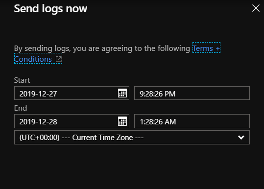

# Send Azure Stack Hub diagnostic logs now

Azure Stack operators can send diagnostics logs on-demand to Microsoft Customer Support Services (CSS), before requesting support, by using the Administrator portal or PowerShell. If Azure Stack Hub is connected to the Azure, the **Send logs now** option in the Administrator portal is recommended because it sends the logs directly to Microsoft simply. If the portal is unavailable, operators should use the PowerShell script included in this topic to send the logs directly to Microsoft.

If you are disconnected from the internet or want to only save logs locally, use the [privileged endpoint (PEP)](azure-stack-get-azurestacklog.md) method to send logs.

>[!Note]
>As an alternative to collecting logs on demand, you can streamline the troubleshooting process by [proactively collecting diagnostic logs](azure-stack-configure-automatic-diagnostic-log-collection-tzl.md). If system health conditions need to be investigated, the logs are uploaded automatically for analysis before opening a case with CSS. 

## Using the Administrator portal

Specify the start time and end time for log collection and click **Collect and Upload**. 



>[!NOTE]
>If proactive log collection is enabled, **Help and Support** shows when log collection is in progress. If you click **Send logs now** to collect logs from a specific time while proactive log collection is in progress, on-demand collection begins after proactive log collection is complete.

## Using PowerShell

Replace `<computer_name>` with the actual name of the computer and run the following script. When prompted, specify the CloudAdmin account name and password. 

```powershell
$session = New-PSSession -ComputerName <computer_name> -ConfigurationName PrivilegedEndpoint -Credential $cred
$stampinfo=Invoke-Command -Session $session { Get-Azurestackstampinformation }
$stampinfo.CloudId
$stampinfo=Invoke-Command -Session $session { Send-AzureStackDiagnosticLog }
```

## Next steps

[Use the privileged endpoint (PEP) to send Azure Stack Hub diagnostic logs](azure-stack-get-azurestacklog.md)
