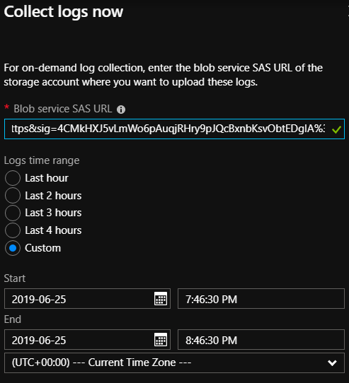

# Collect Azure Stack diagnostic logs on demand

*Applies to: Azure Stack integrated systems*

As part of troubleshooting, Microsoft Customer Support Services (CSS) may need to analyze diagnostic logs. Beginning with the 1907 release, Azure Stack operators can upload on-demand diagnostic logs to a blob container in Azure by using **Help and Support**. As an alternative if the portal is unavailable, operators can collect logs using Get-AzureStackLog through the privileged endpoint (PEP). This topic covers both ways of collecting diagnostic logs on demand.

## Using Help and Support

To troubleshoot a problem, CSS might request an Azure Stack operator to collect diagnostic logs on demand for a specific time window from the previous week. In that case, CSS will provide the operator with a SAS URL for uploading the collection. 
Use the following steps to configure on-demand log collection using the SAS URL from CSS:

1. Open **Help and Support Overview** and click **Collect logs now**. 
1. Choose a 1-4 hour sliding window from the last seven days. 
1. Choose the local time zone.
1. Enter the SAS URL that CSS provided.

   

>[!NOTE]
>If automatic diagnostic log collection is enabled, **Help and Support** shows when log collection is in progress. If you click **Collect logs now** to collect logs from a specific time while automatic log collection is in progress, on-demand collection begins after automatic log collection is complete. 

## Using PEP

<!--how do you look up the PEP IP address. You look up the azurestackstampinfo.json--->

Azure Stack diagnostics tools help make log collection easy and efficient. The following diagram shows how the diagnostics tools work:


### Trace Collector

The Trace Collector is enabled by default and runs continuously in the background to collect all Event Tracing for Windows (ETW) logs from Azure Stack component services. ETW logs are stored in a common local share with a five day age limit. Once this limit is reached, the oldest files are deleted as new ones are created. The default maximum size allowed for each file  is 200 MB. A size check occurs every 2 minutes, and if the current file is >= 200 MB, it's saved and a new file is generated. There's also an 8 GB limit on the total file size generated per event session.

### Get-AzureStackLog

The PowerShell cmdlet Get-AzureStackLog can be used to collect logs from all the components in an Azure Stack environment. It saves them in zip files in a user-defined location. If the Azure Stack technical support team needs your logs to help troubleshoot an issue, they may ask you to run Get-AzureStackLog.

> [!CAUTION]
> These log files may contain personally identifiable information (PII). Take this into account before you publicly post any log files.

The following are some example log types that are collected:

* **Azure Stack deployment logs**
* **Windows event logs**
* **Panther logs**
* **Cluster logs**
* **Storage diagnostic logs**
* **ETW logs**

These files are collected and saved in a share by Trace Collector. Get-AzureStackLog can then be used to collect them when necessary.

#### To run Get-AzureStackLog on Azure Stack integrated systems

To run Get-AzureStackLog on an integrated system, you need to have access to the Privileged End Point (PEP). Here's an example script you can run using the PEP to collect logs on an integrated system:

```powershell
$ipAddress = "<IP ADDRESS OF THE PEP VM>" # You can also use the machine name instead of IP here.

$password = ConvertTo-SecureString "<CLOUD ADMIN PASSWORD>" -AsPlainText -Force
$cred = New-Object -TypeName System.Management.Automation.PSCredential ("<DOMAIN NAME>\CloudAdmin", $password)

$shareCred = Get-Credential

$session = New-PSSession -ComputerName $ipAddress -ConfigurationName PrivilegedEndpoint -Credential $cred

$fromDate = (Get-Date).AddHours(-8)
$toDate = (Get-Date).AddHours(-2) # Provide the time that includes the period for your issue

Invoke-Command -Session $session { Get-AzureStackLog -OutputSharePath "<EXTERNAL SHARE ADDRESS>" -OutputShareCredential $using:shareCred  -FilterByRole Storage -FromDate $using:fromDate -ToDate $using:toDate}

if ($session) {
    Remove-PSSession -Session $session
}
```

#### Run Get-AzureStackLog on an Azure Stack Development Kit (ASDK) system

Use these steps to run `Get-AzureStackLog` on an ASDK host computer.

1. Sign in as **AzureStack\CloudAdmin** on the ASDK host computer.
2. Open a new PowerShell window as an administrator.
3. Run the **Get-AzureStackLog** PowerShell cmdlet.

#### Examples

* Collect all logs for all roles:

  ```powershell
  Get-AzureStackLog -OutputSharePath "<path>" -OutputShareCredential $cred
  ```

* Collect logs from VirtualMachines and BareMetal roles:

  ```powershell
  Get-AzureStackLog -OutputSharePath "<path>" -OutputShareCredential $cred -FilterByRole VirtualMachines,BareMetal
  ```

* Collect logs from VirtualMachines and BareMetal roles, with date filtering for log files for the past 8 hours:

  ```powershell
  Get-AzureStackLog -OutputSharePath "<path>" -OutputShareCredential $cred -FilterByRole VirtualMachines,BareMetal -FromDate (Get-Date).AddHours(-8)
  ```

* Collect logs from VirtualMachines and BareMetal roles, with date filtering for log files for the time period between 8 hours ago and 2 hours ago:

  ```powershell
  Get-AzureStackLog -OutputSharePath "<path>" -OutputShareCredential $cred -FilterByRole VirtualMachines,BareMetal -FromDate (Get-Date).AddHours(-8) -ToDate (Get-Date).AddHours(-2)
  ```

* Collect logs and store them in the specified Azure Storage blob container. The general syntax for this operation is as follows:

  ```powershell
  Get-AzureStackLog -OutputSasUri "<Blob service SAS Uri>"
  ```

  For example:

  ```powershell
  Get-AzureStackLog -OutputSasUri "https://<storageAccountName>.blob.core.windows.net/<ContainerName><SAS token>"
  ```

  > [!NOTE]
  > This procedure is useful for uploading logs. Even if you don't have an SMB share accessible or internet access, you can create a blob storage account on your Azure Stack to transfer the logs, and then use your client to retrieve those logs.  

  To generate the SAS token for the storage account, the following permissions are required:

  * Access to the Blob Storage service.
  * Access to the container resource type.

  To generate a SAS Uri value to be used for the `-OutputSasUri` parameter, follow these steps:

  1. Create a storage account, following the steps [in this article](/azure/storage/common/storage-quickstart-create-account).
  2. Open an instance of the Azure Storage Explorer.
  3. Connect to the storage account created in step 1.
  4. Navigate to **Blob Containers** in **Storage Services**.
  5. Select **Create a new container**.
  6. Right-click the new container, then click **Get Shared Access Signature**.
  7. Select a valid **Start Time** and **End Time**, depending on your requirements.
  8. For the required permissions, select **Read**, **Write**, and **List**.
  9. Select **Create**.
  10. You'll get a Shared Access Signature. Copy the URL portion and provide it to the `-OutputSasUri` parameter.

### Parameter considerations for both ASDK and integrated systems

* The parameters **OutputSharePath** and **OutputShareCredential** are used to store logs in a user specified location.

* The **FromDate** and **ToDate** parameters can be used to collect logs for a particular time period. If these parameters aren't specified, logs are collected for the past four hours by default.

* Use the **FilterByNode** parameter to filter logs by computer name. For example:

    ```powershell
    Get-AzureStackLog -OutputSharePath "<path>" -OutputShareCredential $cred -FilterByNode azs-xrp01
    ```

* Use the **FilterByLogType** parameter to filter logs by type. You can choose to filter by File, Share, or WindowsEvent. For example:

    ```powershell
    Get-AzureStackLog -OutputSharePath "<path>" -OutputShareCredential $cred -FilterByLogType File
    ```

* You can use the **TimeOutInMinutes** parameter to set the timeout for log collection. It's set to 150 (2.5 hours) by default.
* Dump file log collection is disabled by default. To enable it, use the **IncludeDumpFile** switch parameter.
* Currently, you can use the **FilterByRole** parameter to filter log collection by the following roles:

  |   |   |   |    |     |
  | - | - | - | -  |  -  |
  |ACS                   |CA                             |HRP                            |OboService                |VirtualMachines|
  |ACSBlob               |CacheService                   |IBC                            |OEM                       |WAS            |
  |ACSDownloadService    |Compute                        |InfraServiceController         |OnboardRP                 |WASPUBLIC|
  |ACSFabric             |CPI                            |KeyVaultAdminResourceProvider  |PXE                       |         |
  |ACSFrontEnd           |CRP                            |KeyVaultControlPlane           |QueryServiceCoordinator   |         | 
  |ACSMetrics            |DeploymentMachine              |KeyVaultDataPlane              |QueryServiceWorker        |         |
  |ACSMigrationService   |DiskRP                         |KeyVaultInternalControlPlane   |SeedRing                  |         |
  |ACSMonitoringService  |Domain                         |KeyVaultInternalDataPlane      |SeedRingServices          |         |
  |ACSSettingsService    |ECE                            |KeyVaultNamingService          |SLB                       |         |
  |ACSTableMaster        |EventAdminRP                   |MDM                            |SQL                       |         |
  |ACSTableServer        |EventRP                        |MetricsAdminRP                 |SRP                       |         |
  |ACSWac                |ExternalDNS                    |MetricsRP                      |Storage                   |         |
  |ADFS                  |FabricRing                     |MetricsServer                  |StorageController         |         |
  |ApplicationController |FabricRingServices             |MetricsStoreService            |URP                       |         |
  |ASAppGateway          |FirstTierAggregationService    |MonAdminRP                     |SupportBridgeController   |         |
  |AzureBridge           |FRP                            |MonRP                          |SupportRing               |         |
  |AzureMonitor          |Gateway                        |NC                             |SupportRingServices       |         |
  |BareMetal             |HealthMonitoring               |NonPrivilegedAppGateway        |SupportBridgeRP           |         |
  |BRP                   |HintingServiceV2               |NRP                            |UsageBridge               |         |
  |   |   |   |    |     | 

### Additional considerations

* The command takes some time to run based on which role(s) the logs are collecting. Contributing factors also include the time duration specified for log collection, and the numbers of nodes in the Azure Stack environment.
* As log collection runs, check the new folder created in the **OutputSharePath** parameter specified in the command.
* Each role has its logs inside individual zip files. Depending on the size of the collected logs, a role may have its logs split into multiple zip files. For such a role, if you want to have all the log files unzipped into a single folder, use a tool that can unzip in bulk. Select all the zipped files for the role and select **extract here**. This unzips all the log files for that role in a single merged folder.
* A file called **Get-AzureStackLog_Output.log** is also created in the folder that contains the zipped log files. This file is a log of the command output, which can be used for troubleshooting problems during log collection. Sometimes the log file includes `PS>TerminatingError` entries which can be safely ignored, unless expected log files are missing after log collection runs.
* To investigate a specific failure, logs may be needed from more than one component.

  * System and event logs for all infrastructure VMs are collected in the **VirtualMachines** role.
  * System and event logs for all hosts are collected in the **BareMetal** role.
  * Failover cluster and Hyper-V event logs are collected in the **Storage** role.
  * ACS logs are collected in the **Storage** and **ACS** roles.

> [!NOTE]
> Size and age limits are enforced on the logs collected as it's essential to ensure efficient utilization of your storage space and to avoid getting flooded with logs. However, when diagnosing a problem, you sometimes need logs that don't exist anymore because of these limits. Thus, it's **highly recommended** that you offload your logs to an external storage space (a storage account in Azure, an additional on premises storage device, etc.) every 8 to 12 hours and keep them there for 1 - 3 months, depending on your requirements. You should also ensure this storage location is encrypted.

### Invoke-AzureStackOnDemandLog

You can use the **Invoke-AzureStackOnDemandLog** cmdlet to generate on-demand logs for certain roles (see the list at the end of this section). The logs generated by this cmdlet aren't present by default in the log bundle you receive when you execute the **Get-AzureStackLog** cmdlet. Also, it's recommended that you collect these logs only when requested by the Microsoft support team.

Currently, you can use the `-FilterByRole` parameter to filter log collection by the following roles:

* OEM
* NC
* SLB
* Gateway

#### Example of collecting on-demand logs

```powershell
$ipAddress = "<IP ADDRESS OF THE PEP VM>" # You can also use the machine name instead of IP here.

$password = ConvertTo-SecureString "<CLOUD ADMIN PASSWORD>" -AsPlainText -Force
$cred = New-Object -TypeName System.Management.Automation.PSCredential ("<DOMAIN NAME>\CloudAdmin", $password)

$shareCred = Get-Credential

$session = New-PSSession -ComputerName $ipAddress -ConfigurationName PrivilegedEndpoint -Credential $cred

$fromDate = (Get-Date).AddHours(-8)
$toDate = (Get-Date).AddHours(-2) # Provide the time that includes the period for your issue

Invoke-Command -Session $session {
   Invoke-AzureStackOnDemandLog -Generate -FilterByRole "<on-demand role name>" # Provide the supported on-demand role name e.g. OEM, NC, SLB, Gateway
   Get-AzureStackLog -OutputSharePath "<external share address>" -OutputShareCredential $using:shareCred -FilterByRole Storage -FromDate $using:fromDate -ToDate $using:toDate
}

if ($session) {
   Remove-PSSession -Session $session
}
```

