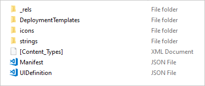
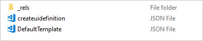
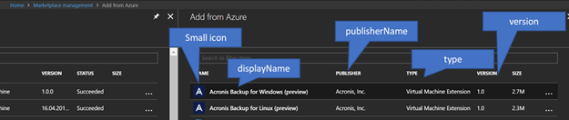
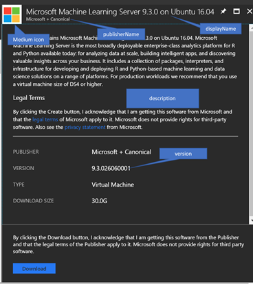
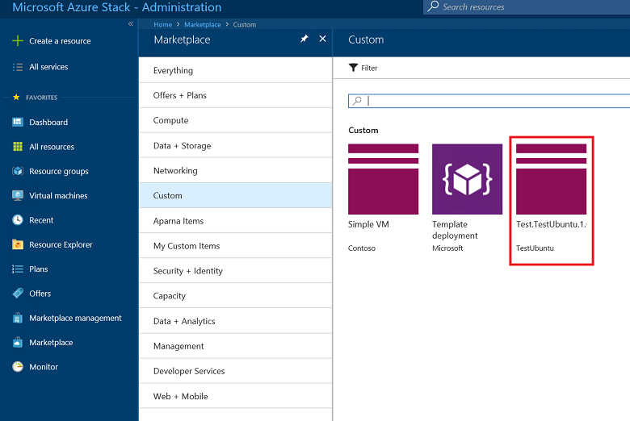

# Create and publish a custom Azure Stack Hub Marketplace item

Every item published to the Azure Stack Hub Marketplace uses the Azure Gallery Package (.azpkg) format. The *Azure Gallery Packager* tool enables you to create a custom Azure Gallery package that you can upload to the Azure Stack Hub Marketplace, which can then be downloaded by users. The deployment process uses an Azure Resource Manager template.

## Marketplace items

The examples in this article show how to create a single VM Marketplace offer, of type Windows or Linux.

## Create a Marketplace item

> [!IMPORTANT]
> Before creating the VM marketplace item, upload the custom VM image to the Azure Stack Hub portal, following the instructions in [Add a VM image to Azure Stack Hub](azure-stack-add-vm-image.md). Then, follow the instructions in this article to package the image (create an .azpkg) and upload it to the Azure Stack Hub Marketplace.

To create a custom marketplace item, do the following:

1. Download the [Azure Gallery Packager tool](https://aka.ms/azsmarketplaceitem) and the sample Azure Stack Hub gallery package. This download includes custom VM templates. Extract the .zip file, and under the folder **Custom VMs**, you can use either the Linux or the Windows templates that are available. You can decide to re-use the pre-made templates and modify the respective parameters with the product details of the item that you will show on your Azure Stack Hub portal. Or, you can simply re-use the .azpkg file available and skip the following steps to customize your own gallery package.

2. Create an Azure Resource Manager template or use our sample templates for Windows/Linux. These sample templates are provided in the packager tool .zip file you downloaded in step 1. You can either use the template and change the text fields, or you can download a pre-configured template from GitHub. For more information about Azure Resource Manager templates, see [Azure Resource Manager templates](/azure/azure-resource-manager/resource-group-authoring-templates).

3. The Gallery package should contain the following structure:

   

   The deployment templates file structure appears as follows:

   

4. Replace the following highlighted values (those with numbers) in the Manifest.json template with the value that you provided when [uploading your custom image](azure-stack-add-vm-image.md).

   > [!NOTE]  
   > Never hard code any secrets such as product keys, password, or any customer identifiable information in the Azure Resource Manager template. Template JSON files are accessible without the need for authentication once published in the gallery. Store all secrets in [Key Vault](/azure/azure-resource-manager/resource-manager-keyvault-parameter) and call them from within the template.

   The following template is a sample of the Manifest.json file:

    ```json
    {
       "$schema": "https://gallery.azure.com/schemas/2015-10-01/manifest.json#",
       "name": "Test", (1)
       "publisher": "<Publisher name>", (2)
       "version": "<Version number>", (3)
       "displayName": "ms-resource:displayName", (4)
       "publisherDisplayName": "ms-resource:publisherDisplayName", (5)
       "publisherLegalName": "ms-resource:publisherDisplayName", (6)
       "summary": "ms-resource:summary",
       "longSummary": "ms-resource:longSummary",
       "description": "ms-resource:description",
       "longDescription": "ms-resource:description",
       "uiDefinition": {
          "path": "UIDefinition.json" (7)
          },
       "links": [
        { "displayName": "ms-resource:documentationLink", "uri": "http://go.microsoft.com/fwlink/?LinkId=532898" }
        ],
       "artifacts": [
          {
             "name": "<Template name>",
             "type": "Template",
             "path": "DeploymentTemplates\\<Template name>.json", (8)
             "isDefault": true
          }
       ],
       "categories":[ (9)
          "Custom",
          "<Template name>"
          ],
       "images": [{
          "context": "ibiza",
          "items": [{
             "id": "small",
             "path": "icons\\Small.png", (10)
             "type": "icon"
             },
             {
                "id": "medium",
                "path": "icons\\Medium.png",
                "type": "icon"
             },
             {
                "id": "large",
                "path": "icons\\Large.png",
                "type": "icon"
             },
             {
                "id": "wide",
                "path": "icons\\Wide.png",
                "type": "icon"
             }]
        }]
    }
    ```

    The following list explains the preceding numbered values in the example template:

    - (1) – The name of the offer.
    - (2) – The name of the publisher, without a space.
    - (3) – The version of your template, without a space.
    - (4) – The name that customers see.
    - (5) – The publisher name that customers see.
    - (6) – The publisher legal name.
    - (7) – The path to where your **UIDefinition.json** file is stored.  
    - (8) – The path and the name of your JSON main template file.
    - (9) – The names of the categories in which this template is displayed.
    - (10) – The path and name for each icon.

5. For all fields referring to **ms-resource**, you must change the appropriate values inside the **strings/resources.json** file:

    ```json
    {
    "displayName": "<OfferName.PublisherName.Version>",
    "publisherDisplayName": "<Publisher name>",
    "summary": "Create a simple VM",
    "longSummary": "Create a simple VM and use it",
    "description": "<p>This is just a sample of the type of description you could create for your gallery item!</p><p>This is a second paragraph.</p>",
    "documentationLink": "Documentation"
    }
    ```

    
    

6. To ensure that the resource can be deployed successfully, test the template with the [Azure Stack Hub APIs](../user/azure-stack-profiles-azure-resource-manager-versions.md).

7. If your template relies on a virtual machine (VM) image, follow the instructions to [add a VM image to Azure Stack Hub](azure-stack-add-vm-image.md).

8. Save your Azure Resource Manager template in the **/Contoso.TodoList/DeploymentTemplates/** folder.

9. Choose the icons and text for your Marketplace item. Add icons to the **Icons** folder, and add text to the **resources** file in the **Strings** folder. Use the **small**, **medium**, **large**, and **wide** naming convention for icons. See the [Marketplace item UI reference](#reference-marketplace-item-ui) for a detailed description of these sizes.

    > [!NOTE]
    > All four icon sizes (small, medium, large, wide) are required for building the Marketplace item correctly.

10. For any further edits to Manifest.json, see [Reference: Marketplace item manifest.json](#reference-marketplace-item-manifestjson).

11. When you finish modifying your files, convert it to an .azpkg file. You perform the conversion using the **AzureGallery.exe** tool and the sample gallery package you downloaded previously. Run the following command:

    ```shell
    .\AzureGallery.exe package –m c:\<path>\<gallery package name>\manifest.json –o c:\Temp
    ```

    > [!NOTE]
    > The output path can be any path you choose, and does not have to be under the C: drive. However, the full path to both the manifest.json file, and the output package, must exist. For example, if the output path is `C:\<path>\galleryPackageName.azpkg`, the folder `C:\<path>` must exist.
    >
    >

## Publish a Marketplace item

1. Use PowerShell or Azure Storage Explorer to upload your Marketplace item (.azpkg) to Azure Blob storage. You can upload to local Azure Stack Hub storage or upload to Azure Storage, which is a temporary location for the package. Make sure that the blob is publicly accessible.

2. To import the gallery package into Azure Stack Hub, the first step is to remotely connect (RDP) to the client VM, in order to copy the file you just created to your Azure Stack Hub.

3. Add a context:

    ```powershell
    $ArmEndpoint = "https://adminmanagement.local.azurestack.external"
    Add-AzureRMEnvironment -Name "AzureStackAdmin" -ArmEndpoint $ArmEndpoint
    Add-AzureRmAccount -EnvironmentName "AzureStackAdmin"
    ```

4. Run the following script to import the resource into your gallery:

    ```powershell
    Add-AzsGalleryItem -GalleryItemUri `
    https://sample.blob.core.windows.net/<temporary blob name>/<offerName.publisherName.version>.azpkg –Verbose
    ```

5. Verify that you have a valid Storage account that is available to store your item. You can get the `GalleryItemURI` value from the Azure Stack Hub administrator portal. Select **Storage account -> Blob Properties -> URL**, with the extension .azpkg. The storage account is only for temporary use, in order to publish to the marketplace.

   After completing your gallery package and uploading it using **Add-AzsGalleryItem**, your custom VM should now appear on the Marketplace as well as in the **Create a resource** view. Note that the custom gallery package is not visible in **Marketplace Management**.

   [](media/azure-stack-create-and-publish-marketplace-item/pkg6.png#lightbox)

6. Once your item has been successfully published to the marketplace, you can delete the content from the storage account.

   > [!CAUTION]  
   > All default gallery artifacts and your custom gallery artifacts are now accessible without authentication under the following URLs:  
   `https://adminportal.[Region].[external FQDN]:30015/artifact/20161101/[Template Name]/DeploymentTemplates/Template.json`
   `https://portal.[Region].[external FQDN]:30015/artifact/20161101/[Template Name]/DeploymentTemplates/Template.json`

6. You can remove a Marketplace item by using the **Remove-AzureRMGalleryItem** cmdlet. For example:

   ```powershell
   Remove-AzsGalleryItem -Name <Gallery package name> -Verbose
   ```

   > [!NOTE]
   > The Marketplace UI may show an error after you remove an item. To fix the error, click **Settings** in the portal. Then, select **Discard modifications** under **Portal customization**.
   >
   >

## Reference: Marketplace item manifest.json

### Identity information

| Name | Required | Type | Constraints | Description |
| --- | --- | --- | --- | --- |
| Name |X |String |[A-Za-z0-9]+ | |
| Publisher |X |String |[A-Za-z0-9]+ | |
| Version |X |String |[SemVer v2](https://semver.org/) | |

### Metadata

| Name | Required | Type | Constraints | Description |
| --- | --- | --- | --- | --- |
| DisplayName |X |String |Recommendation of 80 characters |The portal might not display your item name correctly if it's longer than 80 characters. |
| PublisherDisplayName |X |String |Recommendation of 30 characters |The portal might not display your publisher name correctly if it's longer than 30 characters. |
| PublisherLegalName |X |String |Maximum of 256 characters | |
| Summary |X |String |60 to 100 characters | |
| LongSummary |X |String |140 to 256 characters |Not yet applicable in Azure Stack Hub. |
| Description |X |[HTML](https://github.com/Azure/portaldocs/blob/master/gallery-sdk/generated/index-gallery.md#gallery-item-metadata-html-sanitization) |500 to 5,000 characters | |

### Images

The Marketplace uses the following icons:

| Name | Width | Height | Notes |
| --- | --- | --- | --- |
| Wide |255 px |115 px |Always required |
| Large |115 px |115 px |Always required |
| Medium |90 px |90 px |Always required |
| Small |40 px |40 px |Always required |
| Screenshot |533 px |324 px |Always required |

### Categories

Each Marketplace item should be tagged with a category that identifies where the item appears on the portal UI. You can choose one of the existing categories in Azure Stack Hub (**Compute**, **Data + Storage**, and so on) or choose a new one.

### Links

Each Marketplace item can include various links to additional content. The links are specified as a list of names and URIs:

| Name | Required | Type | Constraints | Description |
| --- | --- | --- | --- | --- |
| DisplayName |X |String |Maximum of 64 characters. | |
| Uri |X |URI | | |

### Additional properties

In addition to the preceding metadata, Marketplace authors can provide custom key/value pair data in the following form:

| Name | Required | Type | Constraints | Description |
| --- | --- | --- | --- | --- |
| DisplayName |X |String |Maximum of 25 characters. | |
| Value |X |String |Maximum of 30 characters. | |

### HTML sanitization

For any field that allows HTML, the following [elements and attributes are allowed](https://github.com/Azure/portaldocs/blob/master/gallery-sdk/generated/index-gallery.md#gallery-item-metadata-html-sanitization):

`h1, h2, h3, h4, h5, p, ol, ul, li, a[target|href], br, strong, em, b, i`

## Reference: Marketplace item UI

Icons and text for Marketplace items as seen in the Azure Stack Hub portal are as follows.

### Create blade


### Marketplace item details blade


## Next steps

- [Azure Stack Hub Marketplace overview](azure-stack-marketplace.md)
- [Download Marketplace items](azure-stack-download-azure-marketplace-item.md)
- [Format and structure of Azure Resource Manager templates](/azure/azure-resource-manager/resource-group-authoring-templates)
