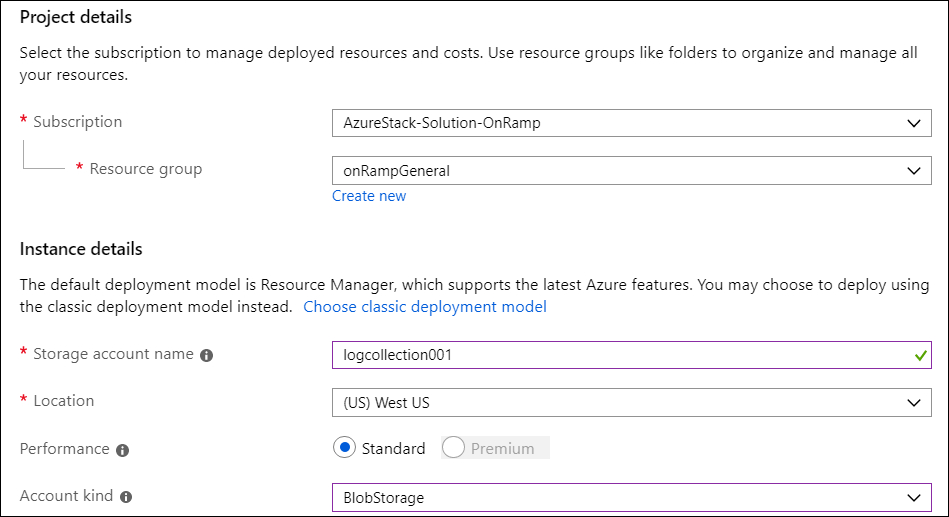

# Create a blob container SAS URL 

*Applies to: Azure Stack integrated systems*

A shared access signature (SAS) lets you grant access to resources in your storage account without sharing your account keys. 
You can save Azure Stack log files to a blob container in Azure, and then provide a SAS URL where Microsoft Customer Support Services (CSS) can collect the logs. 
This topic covers how to create a storage account and blob container in Azure, and how to create a SAS URL to access the logs.  

## Prerequisites

The SAS URL is a prerequisite for [configuring automatic log collection for Azure Stack](azure-stack-configure-automatic-log-collection.md).
You can use a new or existing blob container.

>[!NOTE]
>To create a blob container in Azure, you need at least the [storage blob contributor role](https://docs.microsoft.com/azure/role-based-access-control/built-in-roles#storage-blob-data-contributor) or the [specific permission](https://docs.microsoft.com/rest/api/storageservices/authenticate-with-azure-active-directory#permissions-for-calling-blob-and-queue-data-operations). Global administrators also have the necessary permission. 

For best practices about choosing parameters for the automatic log collection storage account, see [Manage a storage account for automatic Azure Stack log collection](azure-stack-manage-storage-account-for-automatic-log-collection.md).

### Create a blob storage account
 
1. Sign in to the Azure portal and create a blob container with these settings:
   - **Subscription**: Choose your Azure subscription.
   - **Resource group**: Specify a resource group.
   - **Storage account name**: Specify a unique storage account name.
   - **Location**: Choose a datacenter near your Azure Stack deployment.
   - **Performance**: Choose Standard.
   - **Account kind** Choose any blob storage account type (for example: BlobStorage, StorageV2). For more information about types of storage accounts, see [Azure storage account overview](https://docs.microsoft.com/azure/storage/common/storage-account-overview).

   

1. Click **Create**.  

### Create a blob container 

1. After the deployment succeeds, click **Go to resource**. You can also pin the storage account to the Dashboard for easy access. 
1. Click **Storage Explorer (preview)**, right-click **Blob containers**, and click **Create new blob container**. 
1. Enter a name for the new container and click **OK**.

## Create a SAS URL

1. Right-click the new container, click **Get Shared Access Signature**, and choose these properties:
   - Start time: You can optionally move the start time back. 
   - Expiry time: Must be at least 7 days but you can increase the number of days to avoid related alerts about upcoming expiration.
   - Time zone: UTC
   - Permissions: Read, Write, and List
1. Click **Create**.  

<!--- add screenshot with Read, Write, and List. I did not have perms to do it--->

Copy the URL and enter it when you [configure automatic log collection](azure-stack-configure-automatic-log-collection.md). 
For more information about SAS URLs, see [Using shared access signatures (SAS)](https://docs.microsoft.com/azure/storage/common/storage-dotnet-shared-access-signature-part-1). 

## Next step

[Configure automatic Azure Stack log collection](azure-stack-configure-automatic-log-collection.md)