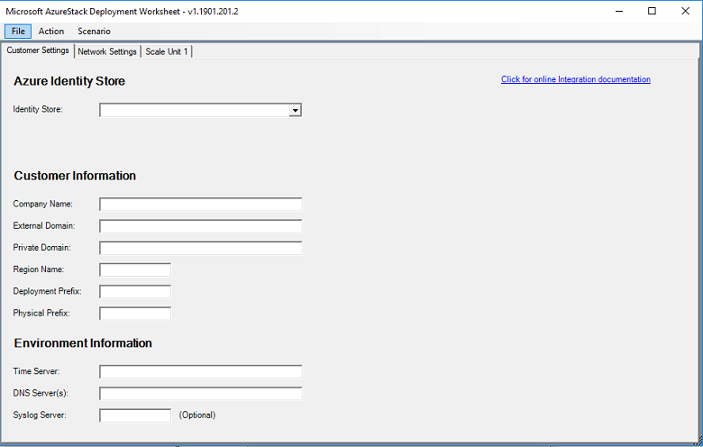

# Deployment worksheet for Azure Stack Hub integrated systems

The Azure Stack Hub deployment worksheet is a Windows Forms application that aggregates all necessary deployment information and decisions in one place. You can complete the deployment worksheet during the planning process, and review it before the deployment starts.

The information required by the worksheet covers networking, security, and identity information. It requires important decisions that may need knowledge in many different areas; therefore, you might want to consult with teams possessing expertise in these areas in order to complete the worksheet.

While filling out the worksheet, you might need to make some pre-deployment configuration changes to your network environment. This can include reserving IP address spaces for the Azure Stack Hub solution, and configuring routers, switches, and firewalls, to prepare for connectivity to the new Azure Stack Hub solution.

> [!NOTE]
> For more information about how to complete the deployment worksheet tool, see [this article in the Azure Stack Hub documentation](azure-stack-datacenter-integration.md).

[](media/azure-stack-deployment-worksheet/depworksheet.png)

## Installing the Windows PowerShell module

For each release of the deployment worksheet, you must perform a one-time installation of a Powershell module for each machine on which you want to use the deployment worksheet.

> [!NOTE]  
> The computer must be connected to the internet for this method to work.

1. Open an elevated PowerShell prompt.

2. In the PowerShell window, install the module from the [PowerShell gallery](https://www.powershellgallery.com/packages/Azs.Deployment.Worksheet/):

   ```PowerShell
   Install-Module -Name Azs.Deployment.Worksheet -Repository PSGallery
   ```

If you receive a message about installing from an untrusted repository, press **Y** to continue installation.

## Use the deployment worksheet tool

To launch and use the deployment worksheet on a computer on which you have installed the deployment worksheet PowerShell module, perform the following steps:

1. Start Windows PowerShell (do not use the PowerShell ISE, as unexpected results can occur). It is not necessary to run PowerShell as an Administrator.

2. Import the **AzS.Deployment.Worksheet** PowerShell module:

   ```PowerShell
   Import-Module AzS.Deployment.Worksheet
   ```

3. Once the module is imported, launch the deployment worksheet:

   ```PowerShell
   Start-DeploymentWorksheet
   ```

The deployment worksheet consists of separate tabs for collecting environment settings, such as **Customer Settings**, **Network Settings**, and **Scale Unit #**. You must supply all values (except for any marked **Optional**) on all tabs before any configuration data files can be generated. After all required values have been entered into the tool, you can use the **Action** menu to **Import**, **Export**, and **Generate**. The JSON files required for deployment are as follows:

**Import**: Enables you to import an Azure Stack Hub configuration data file (ConfigurationData.json) that was generated by this tool, or those created by any previous release of the deployment worksheet. Performing an import resets the forms and deletes any previously entered setting or generated data.

**Export**: Validates the data currently entered into the forms, generates the IP subnets and assignments, and then saves the content as JSON-formatted configuration files. You can then use these files to generate the network configuration and install Azure Stack Hub.

**Generate**: Validates the currently entered data and generates the network map without exporting the deployment JSON files. Two new tabs are created if **Generate** is successful: **Subnet Summary** and **IP Assignments**. You can analyze the data on these tabs to ensure the network assignments are as expected.

**Clear All**: Clears all data currently entered in the forms and returns them to default values.

**Save or Open your work in-progress**: You can save and open partially entered data as you are working on it, using the **File->Save** and **File->Open** menus. This differs from the **Import** and **Export** functions, as these require all data to be entered and validated. Open/save does not validate and does not require all fields to be entered to save your work in progress.

**Logging and Warning messages**: While the form is being used, you might see non-critical warning messages displayed in the PowerShell window. Critical errors are displayed as a pop-up message. Optional detailed logging, including a log written to disk, can be enabled to assist in troubleshooting problems.

To start the tool with verbose logging:

   ```PowerShell
   Start-DeploymentWorksheet -EnableLogging
   ```

You can find the saved log in the current user's **Temp** directory; for example: **C:\Users\me\AppData\Local\Temp\Microsoft_AzureStack\DeploymentWorksheet_Log.txt**.

## Next steps

* [Azure Stack Hub deployment connection models](azure-stack-connection-models.md)
