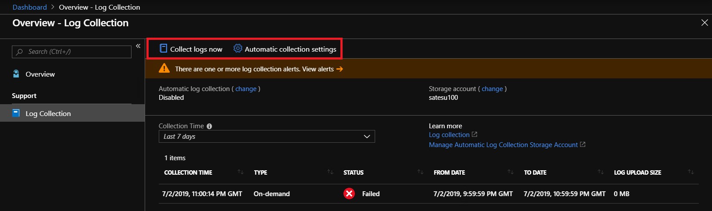

# Overview of Azure Stack Hub diagnostic log collection 

Azure Stack Hub is a large collection of components working together and interacting with each other. All these components generate their own unique logs. This can make diagnosing issues a challenging task, especially for errors coming from multiple, interacting Azure Stack Hub components. In order to address this challenge, we have designed a diagnostic log collection experience. 

Prior to 1907, the diagnostic experience included using [Test-AzureStack](azure-stack-diagnostic-test.md) to validate system health and using [the privileged endpoint (PEP)](azure-stack-configure-on-demand-diagnostic-log-collection-tzl.md#use-the-privileged-endpoint-pep-to-collect-diagnostic-logs) to collect logs for troubleshooting. 

Beginning with the 1907 release, the **Help and Support** page adds a simpler experience using **Diagnostic log collection**. 
**Diagnostic log collection** is part of an ongoing investment to improve Azure Stack Hub operator's experience with the troubleshooting process. 
With these improvements, operators can quickly collect and share diagnostic logs with Microsoft Customer Support Services (CSS). 
The logs can be stored in a blob container in Azure, where access can be customized as needed.    
   
**Diagnostic log collection** works in two different ways:

- **Automatic collection**: If enabled (recommended), log collection is automatically triggered by specific health alerts and stored in your Azure storage account
- **Collect logs now**: This is an on-demand option where you can choose to collect logs from a 1-4 hour sliding window from the last seven days

**Diagnostic log collection** has an easy user interface and doesn't require PowerShell. 
Logs get collected reliably even if infrastructure services are down.
If your policy allows sharing diagnostic logs with CSS, **Diagnostic log collection** is the recommended collection method beginning with the 1907 release. 
You should only use [the PEP](azure-stack-configure-on-demand-diagnostic-log-collection-tzl.md#use-the-privileged-endpoint-pep-to-collect-diagnostic-logs) to collect logs if **Diagnostic log collection** in Help and Support is unavailable.

## Automatic diagnostic log collection 

When a [specific health alert](azure-stack-configure-automatic-diagnostic-log-collection-tzl.md#automatic-diagnostic-log-collection-alerts) is active, automatic diagnostic log collection starts and proactively uploads diagnostic logs from Azure Stack Hub to a storage blob in Azure, significantly reducing the time required to share diagnostic logs with CSS. Diagnostic logs are only collected when an alert is raised.  

For more information about automatic log collection, see [Configure automatic Azure Stack Hub diagnostic log collection](azure-stack-configure-automatic-diagnostic-log-collection-tzl.md).

## On-demand diagnostic log collection

With on-demand collection, diagnostic logs are uploaded from Azure Stack Hub to a storage blob in Azure when an Azure Stack Hub operator manually triggers the collection.
CSS will provide shared access signature (SAS) URL to a CSS-owned storage blob. 
An Azure Stack Hub operator can click **Collect logs now** and enter the SAS URL. 
Diagnostic logs will then get uploaded directly to the CSS blob without needing an intermediate share. 

For more information about collecting logs on demand, see [Collect Azure Stack Hub diagnostic logs now](azure-stack-configure-on-demand-diagnostic-log-collection-tzl.md).

## Bandwidth considerations

The average size of diagnostic log collection varies based on whether it runs on-demand or automatic. 
The average size for automatic log collection is around 2 GB, whereas on-demand log collection size depends on how many hours are being collected. 

The following table lists considerations for environments with limited or metered connections to Azure.

| Network connection | Impact |
|--------------------|--------|
| Low-bandwidth/high-latency connection | Log upload will take an extended amount of time to complete | 
| Shared connection | The upload may also impact other applications/users sharing the network connection |
| Metered connection | There may be an additional charge from your ISP for the additional network usage |

For more information, see [Best practices for automatic Azure Stack Hub log collection](azure-stack-best-practices-automatic-diagnostic-log-collection.md).

## See also

[Azure Stack Hub log and customer data handling](https://docs.microsoft.com/azure-stack/operator/azure-stack-data-collection)

[Using shared access signatures (SAS)](https://docs.microsoft.com/azure/storage/common/storage-dotnet-shared-access-signature-part-1)

[Best practices for automatic Azure Stack Hub log collection](azure-stack-best-practices-automatic-diagnostic-log-collection.md)
