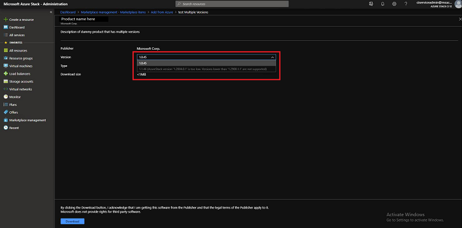
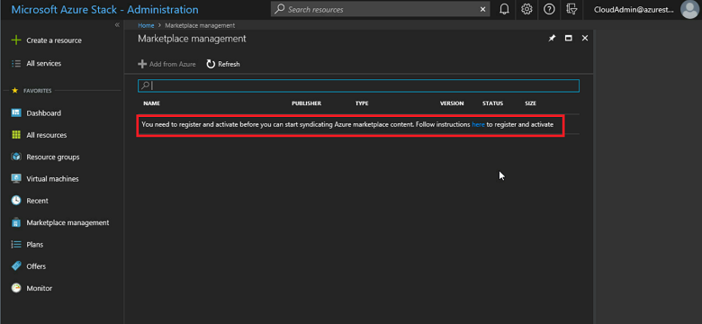
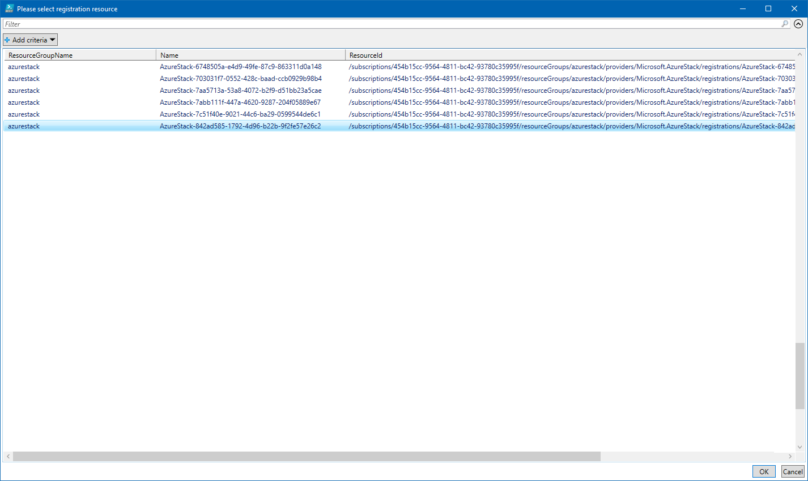
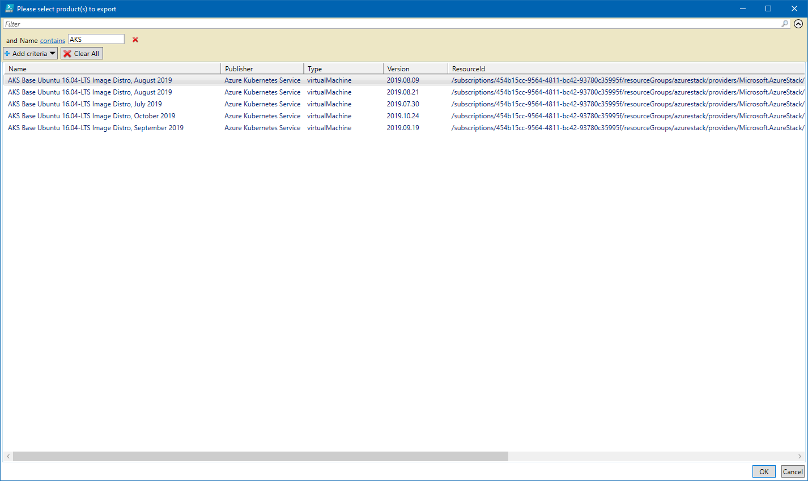

# Download Marketplace items to Azure Stack Hub 

As a cloud operator, you can download items to Azure Stack Hub from the Marketplace and make them available to all users using the Azure Stack Hub environment. The items you can choose are from a curated list of Azure Marketplace items that are pre-tested and supported to work with Azure Stack Hub. Additional items are frequently added to this list, so continue to check back for new content.

There are two scenarios for downloading Marketplace products:

- **Connected scenario**: Requires your Azure Stack Hub environment to be connected to the internet. You use the Azure Stack Hub administrator portal to locate and download items.
- **Disconnected or partially connected scenario**: Requires you to access the internet using the Marketplace syndication tool to download Marketplace items. Then, you transfer your downloads to your disconnected Azure Stack Hub installation. This scenario uses PowerShell.

See [Azure Marketplace items for Azure Stack Hub](azure-stack-marketplace-azure-items.md) for a complete list of the marketplace items you can download. See the [Azure Stack Hub Marketplace changes](azure-stack-marketplace-changes.md) article for a list of recent additions, deletions, and updates to Azure Stack Hub Marketplace.

> [!NOTE]
> The catalog will be different based on the cloud your Azure Stack Hub system is connected to. The cloud environment is determined by the Azure subscription you use for registering your Azure Stack Hub.

## Connected scenario

If Azure Stack Hub connects to the internet, you can use the administrator portal to download marketplace items.

### Prerequisites

Your Azure Stack Hub deployment must have internet connectivity and be registered with Azure.

### Use the portal to download marketplace items

1. Sign into the Azure Stack Hub administrator portal.

2. Review the available storage space before downloading marketplace items. Later, when you select items for download, you can compare the download size to your available storage capacity. If capacity is limited, consider options for [managing available space](azure-stack-manage-storage-shares.md#manage-available-space).

   To review available space: in **Region management**, select the region you want to explore and then go to **Resource Providers** > **Storage**:

   

3. Open Azure Stack Hub Marketplace and connect to Azure. To do so, select the **Marketplace management** service, select **Marketplace items**, and then select **Add from Azure**:

   

4. Each line item also shows the currently available version. If more than one version of a Marketplace item is available, the **Version** column shows **Multiple**. You can click on each item to view its description and additional information, including its download size:

   

5. If the version of an item is shown as **Multiple**, you can select that item and then choose a specific version from the resulting version selector dropdown:

   

6. Select the item you want, and then select **Download**. Download times vary and depends on the network connectivity. After the download completes, you can deploy the new marketplace item as either an Azure Stack Hub operator or a user.

7. To deploy the downloaded item, select **+ Create a resource**, and then search among the categories for the new marketplace item. Next, select the item to begin the deployment process. The process varies for different marketplace items.

## Disconnected or a partially connected scenario

If Azure Stack Hub has limited or no internet connectivity, you can use PowerShell and the *marketplace syndication tool* to download the marketplace items to a machine with internet connectivity. You then transfer the items to your Azure Stack Hub environment. In a disconnected environment, you can't download marketplace items by using the Azure Stack Hub portal.

The marketplace syndication tool can also be used in a connected scenario.

There are two parts to this scenario:

- **Part 1**: Download from Marketplace items. On the computer with internet access, you configure PowerShell, download the syndication tool, and then download items from Azure Marketplace.
- **Part 2**: Upload and publish to Azure Stack Hub Marketplace. You move the files you downloaded to your Azure Stack Hub environment and then publish them to Azure Stack Hub Marketplace.

### Prerequisites

- A connected environment (does not have to be Azure Stack Hub). You need connectivity to get the list of products from Azure with their details, and to download everything locally. Once this is done, the rest of the procedure does not require internet connectivity. It creates a catalog of items you've previously downloaded for you to use in your disconnected environment.

- Removable media to connect to your disconnected environment and transfer all the necessary artifacts.

- A disconnected Azure Stack Hub environment with the following prerequisites:

  - Your Azure Stack Hub deployment must be registered with Azure.

  - The computer that has internet connectivity must have **Azure Stack Hub PowerShell Module version 1.2.11** or later. If not already present, [install Azure Stack Hub-specific PowerShell modules](azure-stack-powershell-install.md).

  - To enable import of a downloaded marketplace item, the [PowerShell environment for the Azure Stack Hub operator](azure-stack-powershell-configure-admin.md) must be configured.

- Download the Azs.Syndication.Admin Module from the PowerShell Gallery using the command below
  ```
  Install-Module -Name Azs.Syndication.Admin
  ```

Once you have registered your Azure Stack, you can disregard the following message that appears on the Marketplace management blade, as this is not relevant for the disconnected use case:



### Use the marketplace syndication tool to download marketplace items

> [!IMPORTANT]
> Be sure to download the marketplace syndication tool each time you download marketplace items in a disconnected scenario. Frequent changes are made to this tool and the most current version should be used for each download.

1. On a computer with an Internet connection, open a PowerShell console as an administrator.

2. Sign in to the appropriate Azure cloud and AzureAD Directory Tenant using the Azure account that you've used to register Azure Stack Hub. To add the account, in PowerShell run **Add-AzureRmAccount**. 

```powershell  
Login-AzureRmAccount -Environment AzureCloud -Tenant '<mydirectory>.onmicrosoft.com'
```
You are prompted to enter your Azure account credentials and you might have to use two-factor authentication, depending on your account configuration.

   > [!NOTE]
   > If your session expires, your password has changed, or you simply wish to switch accounts, run the following cmdlet before you sign in using **Add-AzureRmAccount**: **Remove-AzureRmAccount-Scope Process**.

3. If you have multiple subscriptions, run the following command to select the one you've used for registration:

   ```powershell  
   Get-AzureRmSubscription -SubscriptionID 'Your Azure Subscription GUID' | Select-AzureRmSubscription
   ```

4. If you haven't done it in the pre-requisites step already, download the latest version of the marketplace syndication tool:

   ```powershell
   Install-Module -Name Azs.Syndication.Admin
   ```

5. To select the Marketplace items such as VM images, extensions, or solution templates to download, run the following command. 

   ```powershell
   $products = Select-AzsMarketplaceItem
   ```
  * This will first display a Powershell Grid listing all the Azure Stack Registrations available in the selected subscription. Pick the registration that matches the Azure Stack environment you're downloading the marketplace items for and select OK.

     

  * You should now see a second PowerShell Grid listing all the marketplace items available for download. Select the item that you want to download and make a note of the **Version**. You can hold the **Ctrl** key to select multiple images.
     
  
    You can also filter the list of images by using the **Add criteria** option.
     

    Once you've made your selections, select OK.

6. The Ids for the marketplace items you've selected for download is saved in the  `$products` variable. Use the command below to begin downloading the selected items. Replace the destination folder path with a location to store the files you download from Azure Marketplace:

    ```powershell
    $products | Export-AzsMarketplaceItem  -RepositoryDir "Destination folder path in quotes"
    ```

7. The time that the download takes depends on the size of the item. After the download completes, the item is available in the folder that you specified in the script. The download includes a VHD file (for virtual machines), or a .zip file (for virtual machine extensions and resource providers). It might also include a gallery package in the *.azpkg* format, which is simply a .zip file.

8. If the download fails, you can try again by re-running the following PowerShell cmdlet:

    ```powershell
    $products | Export-AzsMarketplaceItem  -RepositoryDir "Destination folder path in quotes"
    ```
9. You should also export the Azs.Syndication.Admin module locally so that you can copy it over to the machine, from which you are importing marketplace items to Azure Stack Hub.
> [!NOTE]
   > The destination folder for exporting this module should be different from the location to which you have exported the marketplace items.

    ```powershell
    Save-Package -ProviderName NuGet -Source https://www.powershellgallery.com/api/v2 -Name Azs.Syndication.Admin -Path "Destination folder path in quotes" -Force
    ```

### Import the download and publish to Azure Stack Hub Marketplace using PowerShell

1. You must move the files that you have [previously downloaded](#use-the-marketplace-syndication-tool-to-download-marketplace-items) locally to a machine that has connectivity to your Azure Stack Hub environment. The marketplace syndication tool must also be available to your Azure Stack Hub environment because you need to use the tool to perform the import operation.

   The following image shows a folder structure example. **D:\downloadfolder** contains all the downloaded marketplace items. Each subfolder is a marketplace item (for example, **microsoft.custom-script-linux-arm-2.0.3**), named by the product ID. Inside each subfolder is the marketplace item's downloaded content.

   

2. Follow the instructions in [this article](azure-stack-powershell-configure-admin.md) to configure the Azure Stack Hub Operator PowerShell session.

3. Login to your Azure Stack Hub with an identity that has owner access to the "Default Provider Subscription".

4. Import the syndication module and then launch the marketplace syndication tool by running the following script:

    ```powershell
    Import-AzsMarketplaceItem -RepositoryDir "Source folder path in quotes"
    ```

5. After the script successfully completes, the marketplace items should be available in Azure Stack Hub Marketplace.
