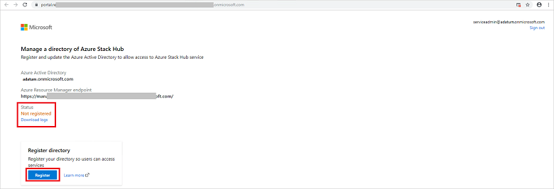
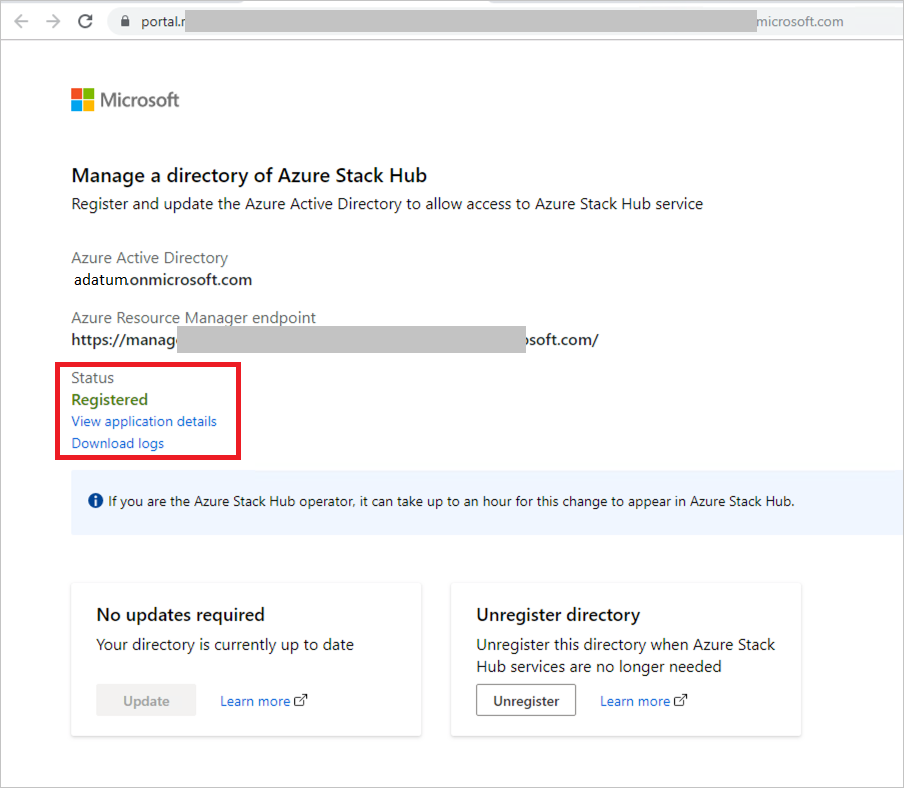
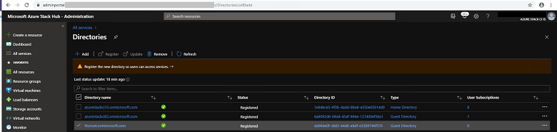
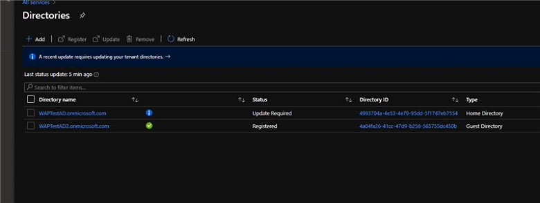

---

title: Configure multi-tenancy in Azure Stack Hub.
description: Learn how to enable and disable multiple Azure Active Directory tenants in Azure Stack Hub.
author: sethmanheim
ms.author: sethm
ms.date: 01/08/2021
ms.topic: how-to

ms.reviewer: thoroet
ms.lastreviewed: 12/17/2020
---

# Configure multi-tenancy in Azure Stack Hub

You can configure Azure Stack Hub to support users from multiple Azure Active Directory (Azure AD) tenants, allowing them to use services in Azure Stack Hub. For example, consider the following scenario:

- You're the service administrator of contoso.onmicrosoft.com, where Azure Stack Hub is installed.
- Mary is the directory administrator of adatum.onmicrosoft.com, where guest users are located.
- Mary's company receives IaaS and PaaS services from your company and needs to allow users from the guest directory (fabrikam.onmicrosoft.com) to sign in and use Azure Stack Hub resources in adatum.onmicrosoft.com.

This guide provides the steps required, in the context of this scenario, to configure multi-tenancy in Azure Stack Hub. In this scenario, you and Mary must complete steps to enable users from Fabrikam to sign in and consume services from the Azure Stack Hub deployment in Contoso.

If you're a Cloud Solution Provider (CSP), you have additional ways you can [configure and manage a multi-tenant Azure Stack Hub](azure-stack-add-manage-billing-as-a-csp.md).

## Onboard guest directory

The first step is to make your Azure Stack Hub system aware of the guest directory. In this example, the directory from Mary's company Adatum is called **adatum.onmicrosoft.com**.

1. Sign in to the Azure Stack Hub administrator portal and go to **All services - Directories**.

   [](./media/azure-stack-enable-multitenancy/directories-expanded.png#lightbox)

2. Select **Add** to start the onboarding process. Enter the guest directory name "adatum.onmicrosoft.com", and then click **Add** at the bottom of the page.

   [](./media/azure-stack-enable-multitenancy/add-directory-expanded.png#lightbox)

3. The guest directory appears in the list view, with a status of **unregistered**.

   [](./media/azure-stack-enable-multitenancy/unregistered-expanded.png#lightbox)

4. Only Mary has the credentials to authenticate to the guest directory, so you must send her the link to complete the registration. Check the box next to **adatum.onmicrosoft.com** and then select **Register**.

   [](./media/azure-stack-enable-multitenancy/register-expanded.png#lightbox)

5. A new browser tab opens. Select **Copy link** at the bottom of the page, and provide it to Mary.

6. If you have the credentials for the guest directory, you can complete the registration yourself by clicking **Sign in**.

   [](./media/azure-stack-enable-multitenancy/sign-in-expanded.png#lightbox)

## Register guest directory

Mary received the email with the link to register the directory. She opens the link in the browser and confirms the Azure Active Directory and the Azure Resource Manager endpoint of your Azure Stack Hub system.

1. Mary clicks **Sign in** using her global admin credentials for adatum.onmicrosoft.com.

   > [!NOTE]
   > Make sure pop-up blockers are disabled before signing in.

   [](./media/azure-stack-enable-multitenancy/sign-in-expanded.png#lightbox)

2. Mary reviews the status for the directory and sees it is not registered.

   [](./media/azure-stack-enable-multitenancy/not-registered-expanded.png#lightbox)

3. Mary clicks **Register** to start the process. 

   > [!NOTE]
   > Required objects for Visual Studio Code might not be able to be created, and must use PowerShell.

   

4. Once the registration process is finished, Mary can review all the applications that were created in the directory, and check their status.

   

5. Mary has successfully completed the registration process and can now start using the Azure Stack Hub system with her directory **adatum.onmicrosoft.com**.

> [!IMPORTANT]
> It can take up to one hour for the Azure Stack operator to see the directory status updated in the admin portal.

## Unregister directory

Mary decides to no longer use services on Azure Stack Hub and must remove the objects. She opens the URL again that she received via email to unregister the directory. Before starting this process, Mary removes all the resources from
the Azure Stack Hub subscription.

1. Mary clicks **Sign in** using her global admin credentials for **adatum.onmicrosoft.com**.

   > [!NOTE]
   > Make sure pop-up blockers are disabled before signing in.

   [](./media/azure-stack-enable-multitenancy/sign-in-expanded.png#lightbox)

2. Mary sees the status of the directory.

   

3. Mary clicks **Unregister** to start the action.

   

4. When the process has finished, the status is shown as **Not registered**:

   [](./media/azure-stack-enable-multitenancy/status-not-registered-2-expanded.png#lightbox)

   Mary has successfully unregistered the directory **adatum.onmicrosoft.com**.

   > [!NOTE]
   > It can take up to one hour to show the directory as not registered in the Azure Stack admin portal.

## Remove directory

As an Azure Stack Hub operator, you can remove the guest directory at any point, even if Mary has not previously unregistered the directory.

1. Sign in to the Azure Stack Hub administrator portal and go to **All services - Directories**.

   [](./media/azure-stack-enable-multitenancy/directory-list-expanded.png#lightbox)

2. Check the box next to the directory **adatum.onmicrosoft.com** and select **Remove**.

   [](./media/azure-stack-enable-multitenancy/directory-list-2-expanded.png#lightbox)

3. Confirm the delete action by typing **yes** and selecting **Remove**.

   [](./media/azure-stack-enable-multitenancy/remove-directory-expanded.png#lightbox)

   You have successfully removed the directory.

## Update home directory

Azure Stack Hub updates can introduce support for new tools or services that might require an update of the home directory.

As an Azure Stack Hub operator, you get an alert in the admin portal that informs you about the required directory update. You can
also see that an update is required for the home directory by opening the directories blade in the admin portal.

Each directory listing shows the type of directory. The type can be a home or guest directory, and its status is shown. When an update is needed, the home directory is shown with a status of **Update Required**. For example:



To update the home directory, check the box for the home directory and select **Update**.

## Update guest directory

Azure Stack Hub updates can introduce support for new tools or services that might require an update of the guest directory.

As an Azure Stack Hub operator, you get an alert in the admin portal that informs you about the required guest directory update. You can also see that an update is required for guest directories by opening the directories blade in the admin portal.

Each directory listing shows the type of directory. The type can be a home or guest directory, and its status is shown. When an update is needed, the guest directories show a status of **Update Required**.

An Azure Stack Hub operator has the responsibility to inform the owner of the guest directory that they must update the directory via the URL shared for registration. The operator can also send the URL again, but it does not change.

Mary, the owner of the guest directory, opens the URL again that she received via email when doing the initial directory registration:

1. Mary selects **Sign in** using her global admin credentials for **adatum.onmicrosoft.com**. Make sure pop-up blockers are disabled before signing in.

   

2. Mary sees the status of the directory saying an update is required.

3. The **Update** action is available for Mary to update the guest directory. It can take up to one hour to show the directory as registered
in the Azure Stack admin portal.

## Additional capabilities

An Azure Stack Hub operator can view the subscriptions associated with a directory. In addition, each directory has an action to manage the directory directly in the Azure portal. To manage, the target directory must have manage permissions in the Azure portal.

## Manage multi-tenancy via PowerShell

This section describes how to manage mult-tenancy using PowerShell.

## Enable multi-tenancy

There are a few prerequisites to account for before you configure multi-tenancy in Azure Stack Hub using PowerShell:
  
- You and Mary must coordinate administrative steps across both the directory Azure Stack Hub is installed in (Contoso), and the guest directory (Fabrikam).
- Make sure you've [installed](powershell-install-az-module.md) and [configured](azure-stack-powershell-configure-admin.md) PowerShell for Azure Stack Hub.
- [Download the Azure Stack Hub Tools](azure-stack-powershell-download.md), and import the Connect and Identity modules:

   ```powershell
   Import-Module .\Identity\AzureStack.Identity.psm1
   ```

### Configure Azure Stack Hub directory

In this section, you configure Azure Stack Hub to allow sign-ins from Fabrikam Azure AD directory tenants.

Onboard the guest directory tenant (Fabrikam) to Azure Stack Hub by configuring Azure Resource Manager to accept users and service principals from the guest directory tenant.

The service admin of contoso.onmicrosoft.com runs the following commands:

```powershell  
## The following Azure Resource Manager endpoint is for the ASDK. If you're in a multinode environment, contact your operator or service provider to get the endpoint.
$adminARMEndpoint = "https://adminmanagement.local.azurestack.external"

## Replace the value below with the Azure Stack Hub directory
$azureStackDirectoryTenant = "contoso.onmicrosoft.com"

## Replace the value below with the guest tenant directory. 
$guestDirectoryTenantToBeOnboarded = "fabrikam.onmicrosoft.com"

## Replace the value below with the name of the resource group in which the directory tenant registration resource should be created (resource group must already exist).
$ResourceGroupName = "system.local"

## Replace the value below with the region location of the resource group.
$location = "local"

# Subscription Name
$SubscriptionName = "Default Provider Subscription"

Register-AzSGuestDirectoryTenant -AdminResourceManagerEndpoint $adminARMEndpoint `
 -DirectoryTenantName $azureStackDirectoryTenant `
 -GuestDirectoryTenantName $guestDirectoryTenantToBeOnboarded `
 -Location $location `
 -ResourceGroupName $ResourceGroupName `
 -SubscriptionName $SubscriptionName
```

### Configure guest directory

Once the Azure Stack Hub operator has enabled the Fabrikam directory to be used with Azure Stack Hub, Mary must register Azure Stack Hub with Fabrikam's directory tenant.

#### Register Azure Stack Hub with the guest directory

Mary (directory admin of Fabrikam) runs the following commands in the guest directory fabrikam.onmicrosoft.com:

```powershell
## The following Azure Resource Manager endpoint is for the ASDK. If you're in a multinode environment, contact your operator or service provider to get the endpoint.
$tenantARMEndpoint = "https://management.local.azurestack.external"
    
## Replace the value below with the guest tenant directory.
$guestDirectoryTenantName = "fabrikam.onmicrosoft.com"

Register-AzSWithMyDirectoryTenant `
 -TenantResourceManagerEndpoint $tenantARMEndpoint `
 -DirectoryTenantName $guestDirectoryTenantName `
 -Verbose
```

> [!IMPORTANT]
> If your Azure Stack Hub administrator installs new services or updates in the future, you may need to run this script again.
>
> Run this script again at any time to check the status of the Azure Stack Hub apps in your directory.
>
> If you've noticed issues with creating VMs in Managed Disks (introduced in the 1808 update), a new **Disk Resource Provider** was added requiring this script to be run again.

### Direct users to sign in

Now that you and Mary have completed the steps to onboard Mary's directory, Mary can direct Fabrikam users to sign in. Fabrikam users (users with the fabrikam.onmicrosoft.com suffix) sign in by visiting https\://portal.local.azurestack.external.

Mary will direct any [foreign principals](/azure/role-based-access-control/rbac-and-directory-admin-roles) in the Fabrikam directory (users in the Fabrikam directory without the suffix of fabrikam.onmicrosoft.com) to sign in using https\://portal.local.azurestack.external/fabrikam.onmicrosoft.com. If they don't use this URL, they're sent to their default directory (Fabrikam) and receive an error that says their administrator hasn't consented.

## Disable multi-tenancy

If you no longer want multiple tenants in Azure Stack Hub, you can disable multi-tenancy by doing the following steps in order:

1. As the administrator of the guest directory (Mary in this scenario), run *Unregister-AzsWithMyDirectoryTenant*. The cmdlet uninstalls all the Azure Stack Hub apps from the new directory.

    ``` PowerShell
    ## The following Azure Resource Manager endpoint is for the ASDK. If you're in a multinode environment, contact your operator or service provider to get the endpoint.
    $tenantARMEndpoint = "https://management.local.azurestack.external"
        
    ## Replace the value below with the guest tenant directory.
    $guestDirectoryTenantName = "fabrikam.onmicrosoft.com"
    
    Unregister-AzsWithMyDirectoryTenant `
     -TenantResourceManagerEndpoint $tenantARMEndpoint `
     -DirectoryTenantName $guestDirectoryTenantName `
     -Verbose 
    ```

2. As the service administrator of Azure Stack Hub (you in this scenario), run *Unregister-AzSGuestDirectoryTenant*.

    ``` PowerShell
    ## The following Azure Resource Manager endpoint is for the ASDK. If you're in a multinode environment, contact your operator or service provider to get the endpoint.
    $adminARMEndpoint = "https://adminmanagement.local.azurestack.external"
    
    ## Replace the value below with the Azure Stack Hub directory
    $azureStackDirectoryTenant = "contoso.onmicrosoft.com"
    
    ## Replace the value below with the guest tenant directory. 
    $guestDirectoryTenantToBeDecommissioned = "fabrikam.onmicrosoft.com"
    
    ## Replace the value below with the name of the resource group in which the directory tenant registration resource should be created (resource group must already exist).
    $ResourceGroupName = "system.local"
    
    Unregister-AzSGuestDirectoryTenant -AdminResourceManagerEndpoint $adminARMEndpoint `
     -DirectoryTenantName $azureStackDirectoryTenant `
     -GuestDirectoryTenantName $guestDirectoryTenantToBeDecommissioned `
     -ResourceGroupName $ResourceGroupName
    ```

    > [!WARNING]
    > The disable multi-tenancy steps must be performed in order. Step #1 fails if step #2 is completed first.

## Retrieve Azure Stack Hub identity health report 

Replace the `<region>`, `<domain>`, and `<homeDirectoryTenant>` placeholders, then execute the following cmdlet as the Azure Stack Hub administrator.

```powershell

$AdminResourceManagerEndpoint = "https://adminmanagement.<region>.<domain>"
$DirectoryName = "<homeDirectoryTenant>.onmicrosoft.com"
$healthReport = Get-AzsHealthReport -AdminResourceManagerEndpoint $AdminResourceManagerEndpoint -DirectoryTenantName $DirectoryName
Write-Host "Healthy directories: "
$healthReport.directoryTenants | Where status -EQ 'Healthy' | Select -Property tenantName,tenantId,status | ft


Write-Host "Unhealthy directories: "
$healthReport.directoryTenants | Where status -NE 'Healthy' | Select -Property tenantName,tenantId,status | ft
```

### Update Azure AD tenant permissions

This action will clear the alert in Azure Stack Hub, indicating that a directory requires an update. Run the following command from the **Azurestack-tools-master/identity** folder:

```powershell
Import-Module ..\Identity\AzureStack.Identity.psm1

$adminResourceManagerEndpoint = "https://adminmanagement.<region>.<domain>"

# This is the primary tenant Azure Stack is registered to:
$homeDirectoryTenantName = "<homeDirectoryTenant>.onmicrosoft.com"

Update-AzsHomeDirectoryTenant -AdminResourceManagerEndpoint $adminResourceManagerEndpoint `
   -DirectoryTenantName $homeDirectoryTenantName -Verbose
```

The script prompts you for administrative credentials on the Azure AD tenant, and takes several minutes to run. The alert should clear after you run the cmdlet.

## Next steps

- [Manage delegated providers](azure-stack-delegated-provider.md)
- [Azure Stack Hub key concepts](azure-stack-overview.md)
- [Manage usage and billing for Azure Stack Hub as a Cloud Solution Provider](azure-stack-add-manage-billing-as-a-csp.md)
- [Add tenant for usage and billing to Azure Stack Hub](azure-stack-csp-howto-register-tenants.md)