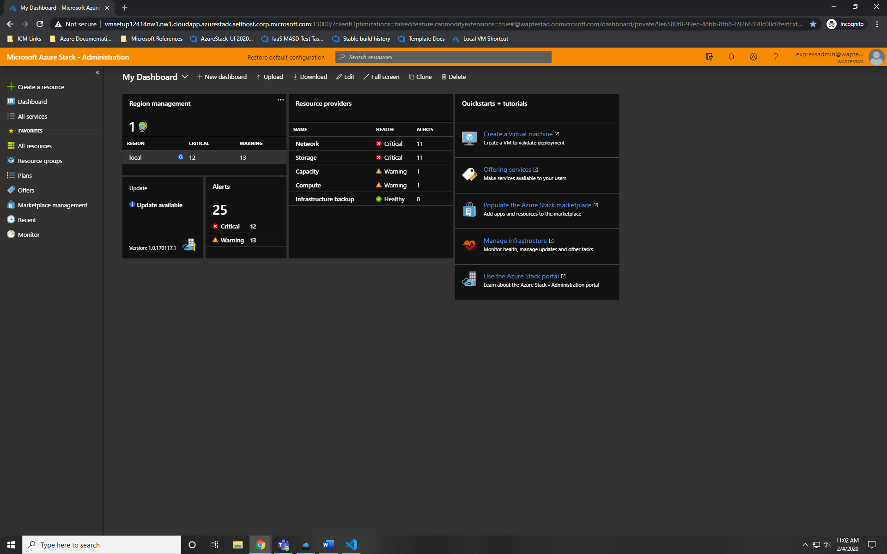
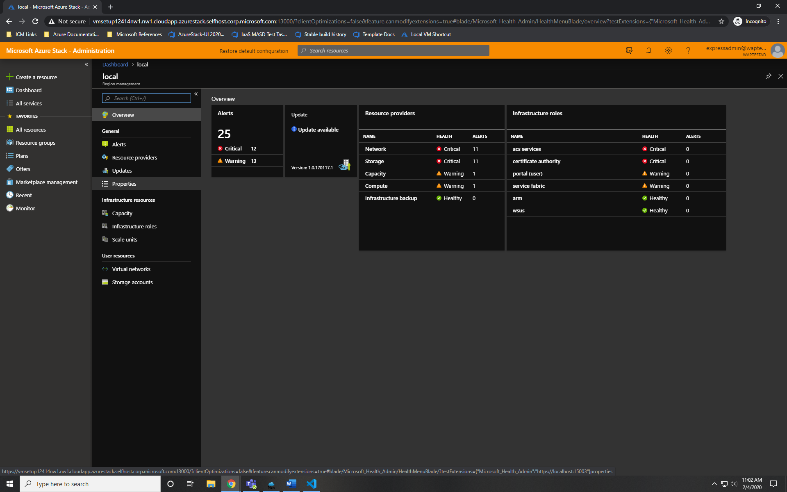
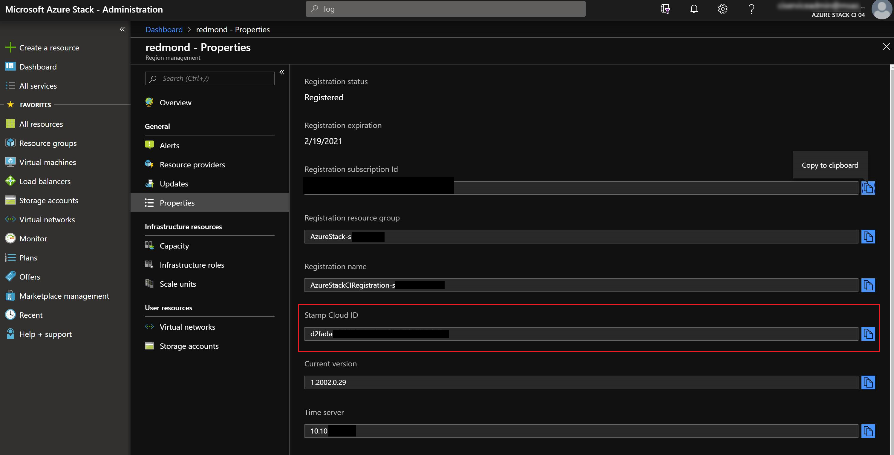

# Find your Cloud ID

This topic covers how to get you Cloud ID. 

## Use the administrator portal

Properties > Properties > Region > Registration status > Stamp Cloud ID

1. Open the Administrator portal. 
1. Click **Region management**.

   

1. Click **Properties** > **Properties**.

   

1. Copy the **Stamp Cloud ID**.

   


## Use the privileged endpoint


```powershell
$ipAddress = "<IP ADDRESS OF THE PEP VM>" # You can also use the machine name instead of IP here.

$password = ConvertTo-SecureString "<CLOUD ADMIN PASSWORD>" -AsPlainText -Force
$cred = New-Object -TypeName System.Management.Automation.PSCredential ("<DOMAIN NAME>\CloudAdmin", $password)
$session = New-PSSession -ComputerName $ipAddress -ConfigurationName PrivilegedEndpoint -Credential $cred

$stampInfo = Invoke-Command -Session $session { Get-AzureStackStampInformation }
if ($session) {
    Remove-PSSession -Session $session
}

$stampInfo.CloudID
```

## Next steps


