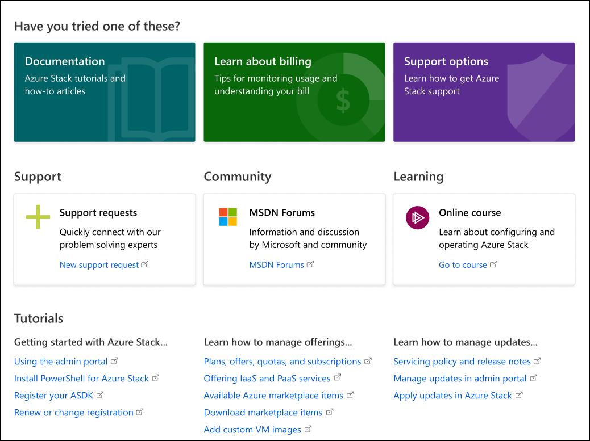
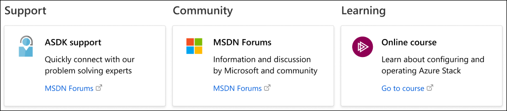

# Get Support for Microsoft Azure Stack

Beginning with 1905 release, Azure Stack **Help + support** improvements make it easier for operators to research issues and get expert help. 

## Self-service support

At the top of **Help + support** are self-service links to read more about an issue, get info about billing, or see which support options are available. 

### Documentation

[Azure Stack Operator Documentation](index.yml) includes concepts, how-to topics and tutorials that show how to offer Azure Stack services such as virtual machines, SQL databases, web apps, and more. 

### Learn about billing

Learn tips for monitoring usage and understanding your bill.

### Support options

Azure Stack operators can choose from a range of [Azure support options](https://azure.microsoft.com/support/options/) that can fit the needs of any enterprise. 

## Get expert help 

You can also get help from experts in Microsoft Customer Support and the MSDN Forums, or take an online training course to become a better expert yourself. 

### Support requests

Open a case with Microsoft Customer Support Services for expert help with any problem related to Azure Stack.

### Community 

The [Azure Stack MSDN Forum](https://social.msdn.microsoft.com/Forums/azure/home?forum=azurestack) is a community of Azure Stack experts who help answer questions and solve problems.

### Learning

Online courses help build your skills for configuring and operating Azure Stack. 

## Tutorials

This set of tutorials is customized for integrated systems and ASDK deployments. 

