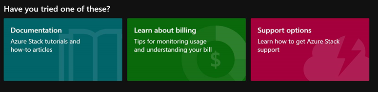

# Microsoft Azure Stack Hub help and support

**Help + support** in the Azure Stack Hub portal has resources to help operators learn more about Azure Stack, check their support options, and get expert help. Operators can also use **Help + support** to collect diagnostic logs for troubleshooting.

## Help resources 

Operators can use **Help + support** to learn more about Azure Stack Hub, check their support options, and get expert help. 

### Things to try first

At the top of **Help + support** are links to things you might try first, like read up about a new concept, understand how billing works, or see which support options are available. 

- **Documentation**. [Azure Stack Hub Operator Documentation](index.yml) includes concepts, how-to topics, and tutorials that show how to offer Azure Stack Hub services such as virtual machines, SQL databases, web apps, and more. 

- **Learn about billing**. Get tips on [usage and billing](azure-stack-billing-and-chargeback.md).

- **Support options**. Azure Stack Hub operators can choose from a range of [Azure support options](https://aka.ms/azstacksupport) that can fit the needs of any enterprise. 

### Get expert help 

To contact support, use the [Azure portal](https://portal.azure.us)

### Hardware related issues

For any hardware related issues, please contact Microsoft. 

## Diagnostic log collection

There are two ways to collect logs in **Help and support**:

- **Proactive log collection**: If enabled, log collection is triggered by specific health alerts 
- **Send logs now**: You can manually choose a specific sliding window as the time frame for log collection

For more information, see [Azure Stack Hub diagnostic log collection overview](azure-stack-diagnostic-log-collection-overview.md).

## Next steps

- Learn about [troubleshooting Azure Stack Hub](azure-stack-troubleshooting.md)
- Learn about [diagnostic log collection](azure-stack-diagnostic-log-collection-overview.md)
- Configure [proactive diagnostic log collection](azure-stack-configure-automatic-diagnostic-log-collection.md)
- Configure [on-demand diagnostic log collection](azure-stack-configure-on-demand-diagnostic-log-collection-tzl.md)
