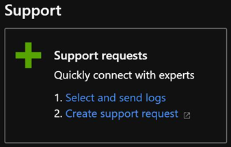
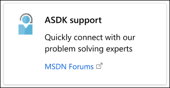
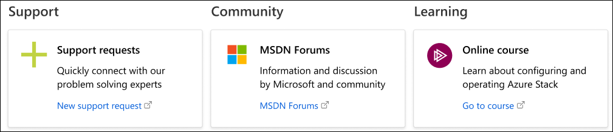
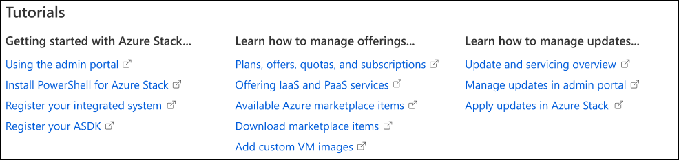
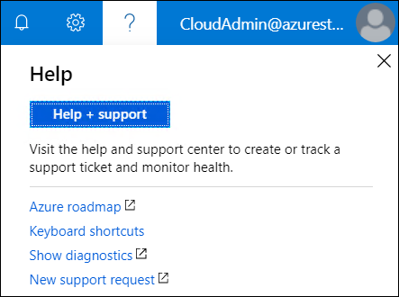

# Microsoft Azure Stack help and support

**Help + support** in the Azure Stack portal has resources to help operators learn more about Azure Stack, check their support options, and get expert help. Beginning with the 1907 release, operators can also use Help + support to collect diagnostic logs for troubleshooting.  

## Help resources 

Operators can also use **Help + support** to learn more about Azure Stack, check their support options, and get expert help. 

### Things to try first

At the top of **Help + support** are links to things you might try first, like read up about a new concept, understand how billing works, or see which support options are available. 

- **Documentation**. [Azure Stack Operator Documentation](index.yml) includes concepts, how-to topics and tutorials that show how to offer Azure Stack services such as virtual machines, SQL databases, web apps, and more. 

- **Learn about billing**. Get tips on [usage and billing](azure-stack-billing-and-chargeback.md).

- **Support options**. Azure Stack operators can choose from a range of [Azure support options](https://aka.ms/azstacksupport) that can fit the needs of any enterprise. 

### Get expert help 

For an integrated system, there is a coordinated escalation and resolution process between Microsoft and our original equipment manufacturer (OEM) hardware partners.

If there is a cloud services issue, support is offered through Microsoft Customer Support Services (CSS). 
You can click **Help** (question mark) in the upper-right corner of the administrator portal and then click **Help + support** to open **Help + Support Overview** and submit a new support request. Creating a support request will preselect Azure Stack service. We highly recommend that customers use this experience to submit tickets rather than using the public Azure portal. 

If there is an issue with deployment, patch and update, hardware (including field replaceable units), and any hardware-branded software, such as software running on the hardware lifecycle host, contact your OEM hardware vendor first. 
For anything else, contact Microsoft CSS.

For the ASDK, you can ask support-related questions in the [Azure Stack MSDN Forum](https://social.msdn.microsoft.com/Forums/azure/home?forum=azurestack). 

You can click **Help** (question mark) in the upper-right corner of the administrator portal and then click **Help + support** to open **Help + Support Overview**, which has a link to the forum. 
MSDN forums are regularly monitored.  
Because the development kit is an evaluation environment, there is no official support offered through Microsoft CSS.

You can also reach out to the MSDN Forums to discuss an issue, or take online training and improve your own skills. 

### Get up to speed with Azure Stack

This set of tutorials is customized depending on whether you're running the ASDK or integrated systems so you can quickly get up to speed with your environment. 

## Diagnostic log collection

Beginning with the 1907 release, there are two new ways to collect logs in **Help and support**:

- **Automatic collection**: If enabled, log collection is triggered by specific health alerts 
- **Collect logs now**: You can choose a 1-4 hour sliding window from the last seven days

Integrated systems can share the diagnostic logs with Microsoft Customer Support Service (CSS). Because Azure Stack Development Kit (ASDK) is an evaluation environment, it is not supported by CSS. For more information, see [Azure Stack diagnostic log collection overview](azure-stack-diagnostic-log-collection-overview.md).

## Help and support for earlier releases Azure Stack (pre-1905)

Previous Azure Stack releases also have a link to **Help + support** that redirects to the [Azure Stack Operator Documentation](https://aka.ms/adminportaldocs).

If there is a cloud services issue, support is offered through Microsoft Customer Support Services (CSS). 
You can click **Help** (question mark) in the upper-right corner of the administrator portal, click **Help and Support**, and then click **New support request** to directly submit a new support request with CSS.

For an integrated system, there is a coordinated escalation and resolution process between Microsoft and our OEM partners. 
If there is a cloud services issue, support is offered through Microsoft CSS. 

If there is an issue with deployment, patch and update, hardware (including field replaceable units), and any hardware-branded software, such as software running on the hardware lifecycle host, contact your OEM hardware vendor first. 
For anything else, contact Microsoft CSS.

For the development kit, you can ask support-related questions in the [Azure Stack MSDN Forum](https://social.msdn.microsoft.com/Forums/azure/home?forum=azurestack). 
You can click **Help** (question mark) in the upper-right corner of the administrator portal and then click **New support request** to get help from experts in the Azure Stack community.
Because the development kit is an evaluation environment, there is no official support offered through Microsoft CSS.

## Next steps

- Learn about the [Troubleshooting Azure Stack](azure-stack-troubleshooting.md)