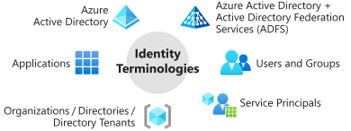
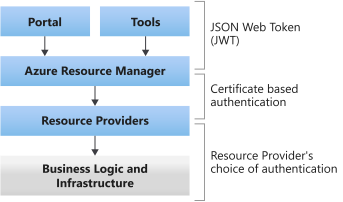
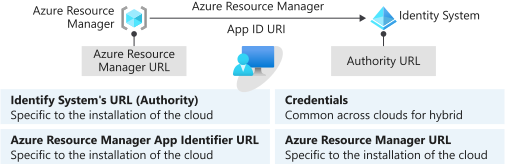
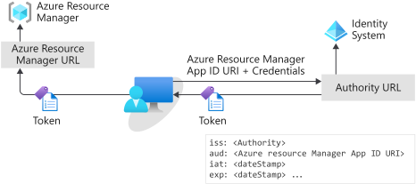

# Overview of identity providers for Azure Stack Hub

Azure Stack Hub requires Microsoft Entra ID or Active Directory Federation Services (AD FS), backed by Active Directory as an identity provider. The choice of a provider is a one-time decision that you make when you first deploy Azure Stack Hub. The concepts and authorization details in this article can help you choose between identity providers.

Your choice of either Microsoft Entra ID or AD FS is determined by the mode in which you deploy Azure Stack Hub:

- When you deploy it in a connected mode, you can use either Microsoft Entra ID or AD FS.
- When you deploy it in a disconnected mode, without a connection to the internet, only AD FS is supported.

For more information about your options, which depend on your Azure Stack Hub environment, see the following articles:

- Azure Stack Hub development kit: [Identity considerations](azure-stack-datacenter-integration.md#identity-considerations).
- Azure Stack Hub integrated systems: [Deployment planning decisions for Azure Stack Hub integrated systems](azure-stack-connection-models.md).

> [!IMPORTANT]
> Azure AD Graph is being deprecated, and will be retired on June 30, 2023. For more information, [see this section](#azure-ad-graph).

## Common concepts for identity providers

The next sections discuss common concepts about identity providers and their use in Azure Stack Hub.

### Directory tenants and organizations

A directory is a container that holds information about *users*, *applications*, *groups*, and *service principals*.

A directory tenant is an *organization*, such as Microsoft or your own company.

- Microsoft Entra ID supports multiple tenants, and it can support multiple organizations, each in its own directory. If you use Microsoft Entra ID and have multiple tenants, you can grant apps and users from one tenant access to other tenants of that same directory.
- AD FS supports only a single tenant and, therefore, only a single organization.

### Users and groups

User accounts (identities) are standard accounts that authenticate individuals by using a user ID and password. Groups can include users or other groups.

How you create and manage users and groups depends on the identity solution you use.

In Azure Stack Hub, user accounts:

- Are created in the *username\@domain* format. Although AD FS maps user accounts to an Active Directory instance, AD FS doesn't support the use of the *\\\<domain>\\\<alias>* format.
- Can be set up to use multi-factor authentication.
- Are restricted to the directory where they first register, which is their organization's directory.
- Can be imported from your on-premises directories. For more information, see  [Integrate your on-premises directories with Microsoft Entra ID](/azure/active-directory/connect/active-directory-aadconnect).

When you sign in to your organization's user portal, you use the *https:\//portal.local.azurestack.external* URL. When signing into the Azure Stack Hub portal from domains other than the one used to register Azure Stack Hub, the domain name used to register Azure Stack Hub must be appended to the portal url. For example, if Azure Stack Hub has been registered with fabrikam.onmicrosoft.com and the user account logging in is admin@contoso.com, the URL to use to log into the user portal would be: https:\//portal.local.azurestack.external/fabrikam.onmicrosoft.com.

### Guest users

Guest users are user accounts from other directory tenants that have been granted access to resources in your directory. To support guest users, you use Microsoft Entra ID and enable support for multi-tenancy. When support is enabled, you can invite guest users to access resources in your directory tenant, which in turn enables their collaboration with outside organizations.

To invite guest users, cloud operators and users can use [Microsoft Entra B2B collaboration](/azure/active-directory/active-directory-b2b-what-is-azure-ad-b2b). Invited users get access to documents, resources, and apps from your directory, and you maintain control over your own resources and data.

As a guest user, you can sign in to another organization's directory tenant. To do so, you append that organization's directory name to the portal URL. For example, if you belong to the Contoso organization and want to sign in to the Fabrikam directory, you use https:\//portal.local.azurestack.external/fabrikam.onmicrosoft.com.

### Apps

You can register apps to Microsoft Entra ID or AD FS, and then offer the apps to users in your organization.

Apps include:

- **Web apps**: Examples include the Azure portal and Azure Resource Manager. They support Web API calls.
- **Native client**: Examples include Azure PowerShell, Visual Studio, and Azure CLI.

Apps can support two types of tenancy:

- **Single-tenant**: Supports users and services only from the same directory where the app is registered.

  > [!NOTE]
  > Because AD FS supports only a single directory, apps you create in an AD FS topology are, by design, single-tenant apps.

- **Multi-tenant**: Supports use by users and services from both the directory where the app is registered and additional tenant directories. With multi-tenant apps, users of another tenant directory (another Microsoft Entra tenant) can sign in to your app.

  For more information about multi-tenancy, see [Enable multi-tenancy](enable-multitenancy.md).

  For more information about developing a multi-tenant app, see [Multi-tenant apps](/azure/active-directory/develop/active-directory-devhowto-multi-tenant-overview).

When you register an app, you create two objects:

- **Application object**: The global representation of the app across all tenants. This relationship is one-to-one with the software app and exists only in the directory where the app is first registered.

- **Service principal object**: A credential that's created for an app in the directory where the app is first registered. A service principal is also created in the directory of each additional tenant where that app is used. This relationship can be one-to-many with the software app.

To learn more about app and service principal objects, see [Application and service principal objects in Microsoft Entra ID](/azure/active-directory/develop/active-directory-application-objects).

### Service principals

A service principal is a set of *credentials* for an app or service that grant access to resources in Azure Stack Hub. The use of a service principal separates the app permissions from the permissions of the user of the app.

A service principal is created in each tenant where the app is used. The service principal establishes an identity for sign-in and access to resources (such as users) that are secured by that tenant.

- A single-tenant app has only one service principal, which is in the directory where it's first created. This service principal is created and consents to being used during registration of the app.
- A multi-tenant web app or API has a service principal that's created in each tenant where a user from that tenant consents to the use of the app.

Credentials for service principals can be either a key that's generated through the Azure portal or a certificate. The use of a certificate is suited for automation because certificates are considered more secure than keys.

> [!NOTE]
> When you use AD FS with Azure Stack Hub, only the administrator can create service principals. With AD FS, service principals require certificates and are created through the privileged endpoint (PEP). For more information, see [Use an app identity to access resources](./give-app-access-to-resources.md).

To learn about service principals for Azure Stack Hub, see [Create service principals](./give-app-access-to-resources.md).

### Services

Services in Azure Stack Hub that interact with the identity provider are registered as apps with the identity provider. Like apps, registration enables a service to authenticate with the identity system.

All Azure services use [OpenID Connect](/azure/active-directory/develop/active-directory-protocols-openid-connect-code) protocols and [JSON Web Tokens](/azure/active-directory/develop/active-directory-token-and-claims) to establish their identity. Because Microsoft Entra ID and AD FS use protocols consistently, you can use [the Microsoft Authentication Library](/azure/active-directory/develop/msal-overview) (MSAL) to obtain a security token to authenticate on-premises or to Azure (in a connected scenario). With MSAL, you can also use tools such as Azure PowerShell and Azure CLI for cross-cloud and on-premises resource management.

### Identities and your identity system

Identities for Azure Stack Hub include user accounts, groups, and service principals.

When you install Azure Stack Hub, several built-in apps and services automatically register with your identity provider in the directory tenant. Some services that register are used for administration. Other services are available for users. The default registrations give core services identities that can interact both with each other and with identities that you add later.

If you set up Microsoft Entra ID with multi-tenancy, some apps propagate to the new directories.

## Authentication and authorization

### Authentication by apps and users

For apps and users, the architecture of Azure Stack Hub is described by four layers. Interactions between each of these layers can use different types of authentication.

|Layer    |Authentication between layers  |
|---------|---------|
|Tools and clients, such as the administrator portal     | To access or modify a resource in Azure Stack Hub, tools and clients use a [JSON Web Token](/azure/active-directory/develop/active-directory-token-and-claims) to place a call to Azure Resource Manager.  Azure Resource Manager validates the JSON Web Token and peeks at the *claims* in the issued token to estimate the level of authorization that user or service principal has in Azure Stack Hub. |
|Azure Resource Manager and its core services     |Azure Resource Manager communicates with resource providers to transfer communication from users.   Transfers use *direct imperative* calls or *declarative* calls via [Azure Resource Manager templates](../user/azure-stack-arm-templates.md).|
|Resource providers     |Calls passed to resource providers are secured with certificate-based authentication.  Azure Resource Manager and the resource provider then stay in communication through an API. For every call that's received from Azure Resource Manager, the resource provider validates the call with that certificate.|
|Infrastructure and business logic     |Resource providers communicate with business logic and infrastructure by using an authentication mode of their choice. The default resource providers that ship with Azure Stack Hub use Windows Authentication to secure this communication.|

### Authenticate to Azure Resource Manager

To authenticate with the identity provider and receive a JSON Web Token, you must have the following information:

1. **URL for the identity system (Authority)**: The URL at which your identity provider can be reached. For example, *https:\//login.windows.net*.
2. **App ID URI for Azure Resource Manager**: The unique identifier for Azure Resource Manager that's registered with your identity provider. It's also unique to each Azure Stack Hub installation.
3. **Credentials**: The credential you use to authenticate with the identity provider.
4. **URL for Azure Resource Manager**: The URL is the location of the Azure Resource Manager service. For example, *https:\//management.azure.com* or *https:\//management.local.azurestack.external*.

When a principal (a client, apps, or user) makes an authentication request to access a resource, the request must include:

- The principal's credentials.
- The app ID URI of the resource that the principal wants to access.

The credentials are validated by the identity provider. The identity provider also validates that the app ID URI is for a registered app, and that the principal has the correct privileges to obtain a token for that resource. If the request is valid, a JSON Web Token is granted.

The token must then pass in the header of a request to Azure Resource Manager. Azure Resource Manager does the following, in no specific order:

- Validates the *issuer* (iss) claim to confirm that the token is from the correct identity provider.
- Validates the *audience* (aud) claim to confirm that the token was issued to Azure Resource Manager.
- Validates that the JSON Web Token is signed with a certificate that's configured through OpenID and known to Azure Resource Manager.
- Review the *issued at* (iat) and *expiration* (exp) claims to confirm that the token is active and can be accepted.

When all validations are complete, Azure Resource Manager uses the *object id* (oid) and the *groups* claims to make a list of resources that the principal can access.

> [!NOTE]
> After deployment, Microsoft Entra Global Administrator permission isn't required. However, some operations may require the global admin credentials (for example, a resource provider installer script or a new feature requiring a permission to be granted). You can either temporarily re-instate the account's global admin permissions or use a separate global admin account that's an owner of the *default provider subscription*.

### Use Role-Based Access Control

Role-Based Access Control (RBAC) in Azure Stack Hub is consistent with the implementation in Microsoft Azure. You can manage access to resources by assigning the appropriate RBAC role to users, groups, and apps. For information about how to use RBAC with Azure Stack Hub, see the following articles:

- [Get started with Role-Based Access Control in the Azure portal](/azure/role-based-access-control/overview).
- [Use Role-Based Access Control to manage access to your Azure subscription resources](/azure/role-based-access-control/role-assignments-portal).
- [Create custom roles for Azure Role-Based Access Control](/azure/role-based-access-control/custom-roles).
- [Manage Role-Based Access Control](azure-stack-manage-permissions.md) in Azure Stack Hub.

### Authenticate with Azure PowerShell

Details about using Azure PowerShell to authenticate with Azure Stack Hub can be found at [Configure the Azure Stack Hub user's PowerShell environment](../user/azure-stack-powershell-configure-user.md).

### Authenticate with Azure CLI

For information about using Azure PowerShell to authenticate with Azure Stack Hub, see [Install and configure Azure CLI for use with Azure Stack Hub](../user/azure-stack-version-profiles-azurecli2.md).

## Azure Policy

[Azure Policy](/azure/governance/policy/overview) helps to enforce organizational standards and to assess compliance at-scale. Through its compliance dashboard, it provides an aggregated view to evaluate the overall state of the environment, with the ability to drill down to per-resource, per-policy granularity. It also helps to bring your resources to compliance through bulk remediation for existing resources and automatic remediation for new resources.

Common use cases for Azure Policy include implementing governance for resource consistency, regulatory compliance, security, cost, and management. Policy definitions for these common use cases are already built in to your Azure environment to help you get started.

> [!NOTE]
> Azure Policy is currently not supported on Azure Stack Hub.

## Azure AD Graph

Microsoft Azure has announced the deprecation of Azure AD Graph on June 30, 2020, and its retirement date of June 30, 2023. Microsoft has informed customers via email about [this change](/graph/migrate-azure-ad-graph-faq). For more detailed information, see the Azure AD Graph [Retirement and Powershell Module Deprecation](https://techcommunity.microsoft.com/t5/microsoft-entra-azure-ad-blog/important-azure-ad-graph-retirement-and-powershell-module/ba-p/3848270) blog.

The following section describes how this deprecation affects Azure Stack Hub.

The Azure Stack Hub team is working closely with the Azure Graph team to ensure your systems continue to work beyond June 30, 2023 if necessary, to ensure a smooth transition. The most important action is to ensure you are compliant with the Azure Stack Hub servicing policy. Customers will receive an alert in the administrator portal of Azure Stack Hub and will be required to update the home directory and all onboarded guest directories.

The majority of the migration itself will be done by the integrated system update experience; there will be a manual step required by customers to grant new permissions to those applications, which will require global administrator permissions in each Microsoft Entra directory used with your Azure Stack Hub environments. After the update package with these changes finishes installing, an alert is raised in the admin portal directing you to complete this step using the multi-tenancy UI or PowerShell scripts. This is the same operation you perform when onboarding additional directories or resource providers; for more information, see [Configure multi-tenancy in Azure Stack Hub](enable-multitenancy.md).

If you use AD FS as your identity system with Azure Stack Hub, these Graph changes will not impact your system directly. However, the latest versions of tools such as Azure CLI, Azure PowerShell, etc., require the new Graph APIs, and they will not work. Ensure that you only use the versions of these tools which are explicitly supported with your given Azure Stack Hub build.

In addition to the alert in the admin portal, we will communicate changes via the update release notes and will communicate which update package requires updating the home directory and all onboarded guest directories.

## Next steps

- [Identity architecture](azure-stack-identity-architecture.md)
- [Datacenter integration - identity](azure-stack-integrate-identity.md)
