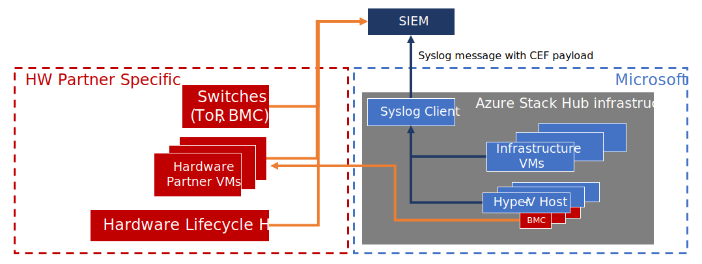

# Integrate Azure Stack Hub with monitoring solutions using syslog forwarding

This article describes how to use syslog to integrate Azure Stack Hub infrastructure with external security solution(s) already deployed in your datacenter. An example is a security information event management (SIEM) system. The syslog channel exposes audits, alerts, and security logs from all the components of the Azure Stack Hub infrastructure. Use syslog forwarding to integrate with security monitoring solutions and to retrieve all audits, alerts, and security logs to store them for retention.

Starting with the 1809 update, Azure Stack Hub has an integrated syslog client that, once configured, emits syslog messages with the payload in Common Event Format (CEF).

The following diagram describes the integration of Azure Stack Hub with an external SIEM. There are two integration patterns that need to be considered: the first one (the one in blue) is the Azure Stack Hub infrastructure that encompasses the infrastructure virtual machines and the Hyper-V nodes. All the audits, security logs, and alerts from those components are centrally collected and exposed via syslog with CEF payload. This integration pattern is described in this article.

The second integration pattern is the one depicted in orange and covers the baseboard management controllers (BMCs), the hardware lifecycle host (HLH), the virtual machines and virtual appliances that run the hardware partner monitoring and management software, and the top of rack (TOR) switches. Since these components are hardware-partner specific, contact your hardware partner for documentation on how to integrate them with an external SIEM.



## Configure syslog forwarding

The syslog client in Azure Stack Hub supports the following configurations:

1. **Syslog over TCP, with mutual authentication (client and server) and TLS 1.2 encryption**: In this configuration, both the syslog server and the syslog client can verify the identity of each other via certificates. The messages are sent over a TLS 1.2 encrypted channel.
1. **Syslog over TCP with server authentication and TLS 1.2 encryption**: In this configuration, the syslog client can verify the identity of the syslog server via a certificate. The messages are sent over a TLS 1.2 encrypted channel.
1. **Syslog over TCP, with no encryption**: In this configuration, the syslog client and syslog server identities aren't verified. The messages are sent in clear text over TCP.
1. **Syslog over UDP, with no encryption**: In this configuration, the syslog client and syslog server identities aren't verified. The messages are sent in clear text over UDP.

> [!IMPORTANT]
> To protect against man-in-the-middle attacks and eavesdropping of messages, Microsoft strongly recommends that you use TCP using authentication and encryption (configuration #1 or, at the very minimum, #2) for production environments.

### Cmdlets to configure syslog forwarding

Configuring syslog forwarding requires access to the privileged endpoint (PEP). Two PowerShell cmdlets were added to the PEP to configure the syslog forwarding:

```powershell
### cmdlet to pass the syslog server information to the client and to configure the transport protocol, the encryption and the authentication between the client and the server

Set-SyslogServer [-ServerName <String>] [-ServerPort <UInt16>] [-NoEncryption] [-SkipCertificateCheck] [-SkipCNCheck] [-UseUDP] [-Remove]

### cmdlet to configure the certificate for the syslog client to authenticate with the server

Set-SyslogClient [-pfxBinary <Byte[]>] [-CertPassword <SecureString>] [-RemoveCertificate] [-OutputSeverity]
```

#### Cmdlet parameters

Parameters for the `Set-SyslogServer` cmdlet:

| Parameter | Description | Type | Required |
|---------|---------|---------|---------|
|`ServerName` | FQDN or IP address of the syslog server. | String | Yes|
|`ServerPort` | Port number the syslog server is listening on. | UInt16 | Yes|
|`NoEncryption`| Force the client to send syslog messages in clear text. | Flag | No|
|`SkipCertificateCheck`| Skip validation of the certificate provided by the syslog server during initial TLS handshake. | Flag | No|
|`SkipCNCheck`| Skip validation of the **Common Name** value of the certificate provided by the syslog server during initial TLS handshake. | Flag | No|
|`UseUDP`| Use syslog with UDP as transport protocol. |Flag | No|
|`Remove`| Remove configuration of the server from the client and stop syslog forwarding.| Flag | No|

Parameters for the `Set-SyslogClient` cmdlet:

| Parameter | Description | Type |
|---------|---------| ---------|
| `pfxBinary` | The contents of the .pfx file, piped to a `Byte[]`, that contains the certificate to be used by the client as identity to authenticate against the syslog server.  | Byte[] |
| `CertPassword` |  Password to import the private key that's associated with the pfx file. | SecureString |
|`RemoveCertificate` | Remove certificate from the client. | Flag|
| `OutputSeverity` | Level of output logging. Values are **Default** or **Verbose**. **Default** includes severity levels: warning, critical, or error. **Verbose** includes all severity levels: verbose, informational, warning, critical, or error.  | String |

### Configure syslog forwarding with TCP, mutual authentication, and TLS 1.2 encryption

In this configuration, the syslog client in Azure Stack Hub forwards the messages to the syslog server over TCP, with TLS 1.2 encryption. During the initial handshake, the client verifies that the server provides a valid, trusted certificate. The client also provides a certificate to the server as proof of its identity. This configuration is the most secure as it provides a full validation of the identity of both the client and the server and it sends messages over an encrypted channel.

> [!IMPORTANT]
> Microsoft strongly recommends that you use this configuration for production environments.

To configure syslog forwarding with TCP, mutual authentication, and TLS 1.2 encryption, run both these cmdlets on a PEP session:

```powershell
# Configure the server
Set-SyslogServer -ServerName <FQDN or ip address of syslog server> -ServerPort <Port number on which the syslog server is listening>

# Provide certificate to the client to authenticate against the server
Set-SyslogClient -pfxBinary <Byte[] of pfx file> -CertPassword <SecureString, password for accessing the pfx file>
```

The client certificate must have the same root as the one provided during the deployment of Azure Stack Hub. It also must contain a private key.

```powershell
##Example on how to set your syslog client with the certificate for mutual authentication.
##This example script must be run from your hardware lifecycle host or privileged access workstation.

$ErcsNodeName = "<yourPEP>"
$password = ConvertTo-SecureString -String "<your cloudAdmin account password" -AsPlainText -Force
 
$cloudAdmin = "<your cloudAdmin account name>"
$CloudAdminCred = New-Object System.Management.Automation.PSCredential ($cloudAdmin, $password)
 
$certPassword = $password
$certContent = Get-Content -Path C:\cert\<yourClientCertificate>.pfx -Encoding Byte
 
$params = @{ 
    ComputerName = $ErcsNodeName 
    Credential = $CloudAdminCred 
    ConfigurationName = "PrivilegedEndpoint" 
}

$session = New-PSSession @params
 
$params = @{ 
    Session = $session 
    ArgumentList = @($certContent, $certPassword) 
}
Write-Verbose "Invoking cmdlet to set syslog client certificate..." -Verbose 
Invoke-Command @params -ScriptBlock { 
    param($CertContent, $CertPassword) 
    Set-SyslogClient -PfxBinary $CertContent -CertPassword $CertPassword }
```

### Configure syslog forwarding with TCP, server authentication, and TLS 1.2 encryption

In this configuration, the syslog client in Azure Stack Hub forwards the messages to the syslog server over TCP, with TLS 1.2 encryption. During the initial handshake, the client also verifies that the server provides a valid, trusted certificate. This configuration prevents the client from sending messages to untrusted destinations. TCP using authentication and encryption is the default configuration and represents the minimum level of security that Microsoft recommends for a production environment.

```powershell
Set-SyslogServer -ServerName <FQDN or ip address of syslog server> -ServerPort <Port number on which the syslog server is listening>
```

If you want to test the integration of your syslog server with the Azure Stack Hub client by using a self-signed or untrusted certificate, you can use these flags to skip the server validation done by the client during the initial handshake:

```powershell
 # Skip validation of the Common Name value in the server certificate. Use this flag if you provide an IP address for your syslog server
 Set-SyslogServer -ServerName <FQDN or ip address of syslog server> -ServerPort <Port number on which the syslog server is listening>
 -SkipCNCheck

 # Skip the server certificate validation entirely
 Set-SyslogServer -ServerName <FQDN or ip address of syslog server> -ServerPort <Port number on which the syslog server is listening>
 -SkipCertificateCheck
```

> [!IMPORTANT]
> Microsoft recommends against the use of the `-SkipCertificateCheck` flag for production environments.

### Configure syslog forwarding with TCP and no encryption

In this configuration, the syslog client in Azure Stack Hub forwards the messages to the syslog server over TCP, with no encryption. The client doesn't verify the identity of the server, nor does it provide its own identity to the server for verification:

```powershell
Set-SyslogServer -ServerName <FQDN or ip address of syslog server> -ServerPort <Port number on which the syslog server is listening> -NoEncryption
```

> [!IMPORTANT]
> Microsoft recommends against using this configuration for production environments.


### Configuring syslog forwarding with UDP and no encryption

In this configuration, the syslog client in Azure Stack Hub forwards the messages to the syslog server over UDP, with no encryption. The client doesn't verify the identity of the server, nor does it provide its own identity to the server for verification:

```powershell
Set-SyslogServer -ServerName <FQDN or ip address of syslog server> -ServerPort <Port number on which the syslog server is listening> -UseUDP
```

While UDP with no encryption is the easiest to configure, it doesn't provide protection against man-in-the-middle attacks and eavesdropping of messages.

> [!IMPORTANT]
> Microsoft recommends against using this configuration for production environments.

## Remove syslog forwarding configuration

To remove the syslog server configuration from the client and stop syslog forwarding, run the following cmdlet:

```powershell  
Set-SyslogServer -Remove
```

To remove the client certificate from the client, run the following cmdlet:

```powershell  
Set-SyslogClient -RemoveCertificate
```

## Verify the syslog setup

If you successfully connected the syslog client to your syslog server, you should soon start receiving events. If you don't see any events, verify the configuration of your syslog client by running the following cmdlets.

To verify the server configuration in the syslog client:

```powershell  
Get-SyslogServer
```

To verify the certificate setup in the syslog client:

```powershell  
Get-SyslogClient
```

## Syslog message schema

The syslog forwarding of the Azure Stack Hub infrastructure sends messages formatted in Common Event Format (CEF). Each syslog message is structured based on the schema `<Time> <Host> <CEF payload>`.

The CEF payload is based on the following structure, but the mapping for each field varies depending on the type of message (Windows Event, Alert created, Alert closed):

```output
# Common Event Format schema
CEF: <Version>|<Device Vendor>|<Device Product>|<Device Version>|<Signature ID>|<Name>|<Severity>|<Extensions>
* Version: 0.0
* Device Vendor: Microsoft
* Device Product: Microsoft Azure Stack Hub
* Device Version: 1.0
```

### CEF mapping for privileged endpoint events

```output
Prefix fields
* Signature ID: Microsoft-AzureStack-PrivilegedEndpoint: <PEP Event ID>
* Name: <PEP Task Name>
* Severity: mapped from PEP Level (details see the PEP Severity table below)
* Who: account used to connect to the PEP
* WhichIP: IP address of ERCS server hosting the PEP
```

Table of events for the privileged endpoint (PEP):

| Event | PEP event ID | PEP task name | Severity |
|-------|--------------| --------------|----------|
|PrivilegedEndpointAccessed|1000|PrivilegedEndpointAccessedEvent|5|
|SupportSessionTokenRequested |1001|SupportSessionTokenRequestedEvent|5|
|SupportSessionDevelopmentTokenRequested |1002|SupportSessionDevelopmentTokenRequestedEvent|5|
|SupportSessionUnlocked |1003|SupportSessionUnlockedEvent|10|
|SupportSessionFailedToUnlock |1004|SupportSessionFailedToUnlockEvent|10|
|PrivilegedEndpointClosed |1005|PrivilegedEndpointClosedEvent|5|
|NewCloudAdminUser |1006|NewCloudAdminUserEvent|10|
|RemoveCloudAdminUser |1007|RemoveCloudAdminUserEvent|10|
|SetCloudAdminUserPassword |1008|SetCloudAdminUserPasswordEvent|5|
|GetCloudAdminPasswordRecoveryToken |1009|GetCloudAdminPasswordRecoveryTokenEvent|10|
|ResetCloudAdminPassword |1010|ResetCloudAdminPasswordEvent|10|
|PrivilegedEndpointSessionTimedOut |1017|PrivilegedEndpointSessionTimedOutEvent|5|

PEP severity table:

| Severity | Level | Numerical Value |
|----------|-------| ----------------|
|0|Undefined|Value: 0. Indicates logs at all levels|
|10|Critical|Value: 1. Indicates logs for a critical alert|
|8|Error| Value: 2. Indicates logs for an error|
|5|Warning|Value: 3. Indicates logs for a warning|
|2|Information|Value: 4. Indicates logs for an informational message|
|0|Verbose|Value: 5. Indicates logs at all levels|

### CEF mapping for recovery endpoint events

```output
Prefix fields
* Signature ID: Microsoft-AzureStack-PrivilegedEndpoint: <REP Event ID>
* Name: <REP Task Name>
* Severity: mapped from REP Level (details see the REP Severity table below)
* Who: account used to connect to the REP
* WhichIP: IP address of the device used to connect to the REP
```

Table of events for the recovery endpoint:

| Event | REP event ID | REP task name | Severity |
|-------|--------------| --------------|----------|
|RecoveryEndpointAccessed |1011|RecoveryEndpointAccessedEvent|5|
|RecoverySessionTokenRequested |1012|RecoverySessionTokenRequestedEvent |5|
|RecoverySessionDevelopmentTokenRequested |1013|RecoverySessionDevelopmentTokenRequestedEvent|5|
|RecoverySessionUnlocked |1014|RecoverySessionUnlockedEvent |10|
|RecoverySessionFailedToUnlock |1015|RecoverySessionFailedToUnlockEvent|10|
|RecoveryEndpointClosed |1016|RecoveryEndpointClosedEvent|5|

REP severity table:

| Severity | Level | Numerical value |
|----------|-------| ----------------|
|0|Undefined|Value: 0. Indicates logs at all levels|
|10|Critical|Value: 1. Indicates logs for a critical alert|
|8|Error| Value: 2. Indicates logs for an error|
|5|Warning|Value: 3. Indicates logs for a warning|
|2|Information|Value: 4. Indicates logs for an informational message|
|0|Verbose|Value: 5. Indicates logs at all levels|

### CEF mapping for Windows events

```output
* Signature ID: ProviderName:EventID
* Name: TaskName
* Severity: Level (for details, see the severity table below)
* Extension: Custom Extension Name (for details, see the Custom Extension table below)
```

Severity table for Windows events:

| CEF severity value | Windows event level | Numerical value |
|--------------------|---------------------| ----------------|
|0|Undefined|Value: 0. Indicates logs at all levels|
|10|Critical|Value: 1. Indicates logs for a critical alert|
|8|Error| Value: 2. Indicates logs for an error|
|5|Warning|Value: 3. Indicates logs for a warning|
|2|Information|Value: 4. Indicates logs for an informational message|
|0|Verbose|Value: 5. Indicates logs at all levels|

Custom extension table for Windows events in Azure Stack Hub:

| Custom extension name | Windows event example |
|-----------------------|---------|
|MasChannel | System|
|MasComputer | test.azurestack.contoso.com|
|MasCorrelationActivityID| C8F40D7C-3764-423B-A4FA-C994442238AF|
|MasCorrelationRelatedActivityID| C8F40D7C-3764-423B-A4FA-C994442238AF|
|MasEventData| svchost!!4132,G,0!!!!EseDiskFlushConsistency!!ESENT!!0x800000|
|MasEventDescription| The Group Policy settings for the user were processed successfully. There were no changes detected since the last successful processing of Group Policy.|
|MasEventID|1501|
|MasEventRecordID|26637|
|MasExecutionProcessID | 29380|
|MasExecutionThreadID |25480|
|MasKeywords |0x8000000000000000|
|MasKeywordName |Audit Success|
|MasLevel |4|
|MasOpcode |1|
|MasOpcodeName |info|
|MasProviderEventSourceName ||
|MasProviderGuid |AEA1B4FA-97D1-45F2-A64C-4D69FFFD92C9|
|MasProviderName |Microsoft-Windows-GroupPolicy|
|MasSecurityUserId |\<Windows SID\> |
|MasTask |0|
|MasTaskCategory| Process Creation|
|MasUserData|KB4093112!!5112!!Installed!!0x0!!WindowsUpdateAgent Xpath: /Event/UserData/*|
|MasVersion|0|

### CEF mapping for alerts created

```output
* Signature ID: Microsoft Azure Stack Hub Alert Creation : FaultTypeId
* Name: FaultTypeId : AlertId
* Severity: Alert Severity (for details, see alerts severity table below)
* Extension: Custom Extension Name (for details, see the Custom Extension table below)
```

Alerts severity table:

| Severity | Level |
|----------|-------|
|0|Undefined|
|10|Critical|
|5|Warning|

Custom extension table for alerts created in Azure Stack Hub:

| Custom extension name | Example |
|-----------------------|---------|
|MasEventDescription|DESCRIPTION: A user account \<TestUser\> was created for \<TestDomain\>. It's a potential security risk. -- REMEDIATION: Contact support. Customer assistance is required to resolve this issue. Don't try to resolve this issue without their assistance. Before you open a support request, start the [log file collection process using this guidance](https://aka.ms/azurestacklogfiles). |

### CEF mapping for alerts closed

```output
* Signature ID: Microsoft Azure Stack Hub Alert Creation : FaultTypeId
* Name: FaultTypeId : AlertId
* Severity: Information
```

The following example shows a syslog message with CEF payload:

```output
2018:05:17:-23:59:28 -07:00 TestHost CEF:0.0|Microsoft|Microsoft Azure Stack Hub|1.0|3|TITLE: User Account Created -- DESCRIPTION: A user account \<TestUser\> was created for \<TestDomain\>. It's a potential security risk. -- REMEDIATION: Please contact Support. Customer Assistance is required to resolve this issue. Do not try to resolve this issue without their assistance. Before you open a support request, start the log file collection process using the guidance from https://aka.ms/azurestacklogfiles|10
```

## Syslog event types  

The table lists all the event types, events, message schema or properties that are send via the syslog channel. The **setup verbose** switch should only be used if Windows informational events are required for SIEM integration.

| Event Type                                 | Events or message schema                                                                                                                                                                                                                                                                                                                                                                                                                                                                                                                                                                                                                                                                                                                                                                                                                      | Requires verbose setting         | Event Description (optional)                                                                                                                                   |
|--------------------------------------------|-----------------------------------------------------------------------------------------------------------------------------------------------------------------------------------------------------------------------------------------------------------------------------------------------------------------------------------------------------------------------------------------------------------------------------------------------------------------------------------------------------------------------------------------------------------------------------------------------------------------------------------------------------------------------------------------------------------------------------------------------------------------------------------------------------------------------------------------------|----------------------------------|----------------------------------------------------------------------------------------------------------------------------------------------------------------|
| Azure Stack Hub Alerts                     | For the alert message schema, see [CEF mapping for alerts closed](#cef-mapping-for-alerts-closed). <br> <br>A list of all alerts in shared in a separate document.                                                                                                                                                                                                                                                                                                                                                                                                                                                                                                                                                                                                                                                                             | No                               | System health alerts                                                                                                                                           |
| Privileged Endpoint events                 | For the privileged endpoint message schema, see [CEF mapping for privileged endpoint events](#cef-mapping-for-privileged-endpoint-events).<br> <br>PrivilegedEndpointAccessed <br>SupportSessionTokenRequested <br>SupportSessionDevelopmentTokenRequested <br>SupportSessionUnlocked <br>SupportSessionFailedToUnlock <br>PrivilegedEndpointClosed <br>NewCloudAdminUser <br>RemoveCloudAdminUser <br>SetCloudAdminUserPassword <br>GetCloudAdminPasswordRecoveryToken <br>ResetCloudAdminPassword <br>PrivilegedEndpointSessionTimedOut                                                                                                                                                                                                                                                                                                      | No                               |                                                                                                                                                                |
| Recovery Endpoint events                   | For the recovery endpoint message schema, see [CEF mapping for recovery endpoint events](#cef-mapping-for-recovery-endpoint-events). <br>RecoveryEndpointAccessed <br>RecoverySessionTokenRequested <br>RecoverySessionDevelopmentTokenRequested <br>RecoverySessionUnlocked <br>RecoverySessionFailedToUnlock <br>Recovand RecoveryEndpointClosed                                                                                                                                                                                                                                                                                                                                                                                                                                                                                             | No                               |                                                                                                                                                                |
| Windows Security events                    |   <br>For the Windows event message schema, see [CEF mapping for Windows events](#cef-mapping-for-windows-events).                                                                                                                                                                                                                                                                                                                                                                                                                                                                                                                                                                                                                                                                                                                             | Yes (To get information events)  | Type: <br>- Information <br>- Warning <br>- Error <br>- Critical                                                                                               |
| ARM Events                                 | Message properties: <br> <br>AzsSubscriptionId <br>AzsCorrelationId <br>AzsPrincipalOid <br>AzsPrincipalPuid <br>AzsTenantId <br>AzsOperationName <br>AzsOperationId <br>AzsEventSource <br>AzsDescription <br>AzsResourceProvider <br>AzsResourceUri <br>AzsEventName <br>AzsEventInstanceId <br>AzsChannels <br>AzsEventLevel <br>AzsStatus <br>AzsSubStatus <br>AzsClaims <br>AzsAuthorization <br>AzsHttpRequest <br>AzsProperties <br>AzsEventTimestamp <br>AzsAudience <br>AzsIssuer <br>AzsIssuedAt <br>AzsApplicationId <br>AzsUniqueTokenId <br>AzsArmServiceRequestId <br>AzsEventCategory <br> <br>                                                                                                                                                                                                                                | No <br>                          | Each registered ARM resource can raise an event.                                                                                                               |
| BCDR Events                                | Message schema: <br> <br>AuditingManualBackup { <br>} <br>AuditingConfig <br>{ <br>Interval <br>Retention <br>IsSchedulerEnabled <br>BackupPath <br>} <br>AuditingPruneBackupStore { <br>IsInternalStore <br>} <br>                                                                                                                                                                                                                                                                                                                                                                                                                                                                                                                                                                                                                           | No                               | These events track infra backup admin operations done by customer manually, includes trigger backup, change backup configuration, and prune backup data.       |
| Infra Fault Creation and Closing Events    | Message schema: <br> <br>InfrastructureFaultOpen { <br>AzsFaultId, <br>AzsFaultTypeName, <br>AzsComponentType, <br>AzsComponentName, <br>AzsFaultHash, <br>AzsCreatedTimeUtc, <br>AzsSource <br>} <br>  <br>InfrastructureFaultClose {  <br>AzsFaultId, <br>AzsFaultTypeName, <br>AzsComponentType, <br>AzsComponentName, <br>AzsFaultHash, <br>AzsLastUpdatedTimeUtc, <br>AzsSource <br>}                                                                                                                                                                                                                                                                                                                                                                                                                                                    | No                               | Faults trigger workflows that attempt to remediate errors that can lead to alerts. If a fault has no remediation it does directly lead to an Alert.            |
| Service Fault Creation and Closing Events  | Message schema: <br> <br>ServiceFaultOpen { <br>AzsFaultId, <br>AzsFaultTypeName, <br>AzsSubscriptionId, <br>AzsResourceGroup, <br>AzsServiceName, <br>AzsResourceId <br>AzsFaultHash, <br>AzsCreatedTimeUtc, <br>AzsSource <br>} <br>  <br>ServiceFaultClose { <br>AzsFaultId, <br>AzsFaultTypeName, <br>AzsSubscriptionId, <br>AzsResourceGroup, <br>AzsServiceName, <br>AzsResourceId <br>AzsFaultHash, <br>AzsLastUpdatedTimeUtc, <br>AzsSource <br>}                                                                                                                                                                                                                                                                                                                                                                                     | No                               | Faults trigger workflows that attempt to remediate errors that can lead to alerts.  <br>If a fault has no remediation it does directly lead to an Alert. <br>  |
| PEP WAC events                             | Message schema: <br> <br>Prefix fields  <br>* Signature ID: Microsoft-AzureStack-PrivilegedEndpoint: \<PEP Event ID\>  <br>* Name: \<PEP Task Name\>  <br>* Severity: mapped from PEP Level (details see the PEP Severity table below)  <br>* Who: account used to connect to the PEP  <br>* WhichIP: IP address of ERCS server hosting the PEP <br><br>WACServiceStartFailedEvent <br>WACConnectedUserNotRetrievedEvent <br>WACEnableExceptionEvent  <br>WACUserAddedEvent <br>WACAddUserToLocalGroupFailedEvent <br>WACIsUserInLocalGroupFailedEvent  <br>WACServiceStartTimeoutEvent  <br>WACServiceStartInvalidOperationEvent <br>WACGetSidFromUserFailedEvent <br>WACDisableFirewallFailedEvent <br>WACCreateLocalGroupIfNotExistFailedEvent <br>WACEnableFlagIsTrueEvent <br>WACEnableFlagIsFalseEvent <br>WACServiceStartedEvent | No                               |                                                                                                                                                                |

## Next steps

[Azure Stack Hub servicing policy](azure-stack-servicing-policy.md)
