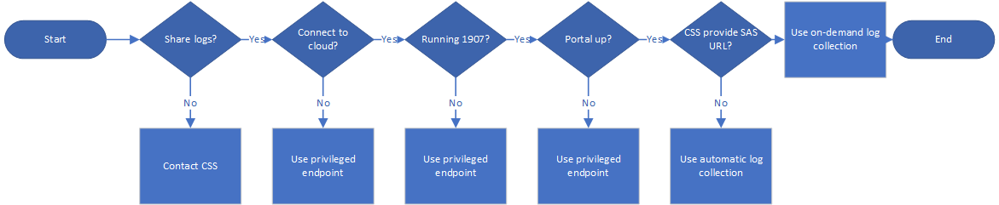

# Overview of Azure Stack diagnostic log collection 

*Applies to: Azure Stack integrated systems*

Azure Stack is a large collection of components working together and interacting with each other. All these components generate their own unique logs. This can make diagnosing issues a challenging task, especially for errors coming from multiple, interacting Azure Stack components.

Our diagnostics tools help make the log collection mechanism easy and efficient. For example, [the Log collection tool (Get-AzureStackLog)](azure-stack-diagnostics.md) lets use the privileged endpoint to collect logs from all the components in an Azure Stack environment, and [the Azure Stack validation tool (Test-AzureStack)](azure-stack-diagnostics-test.md) can run a series of tests on your system to identify failures. 

Beginning with the 1907 release, Azure Stack has a new way to collect logs by using the **Diagnostic log collection** in Help and Support. 
**Diagnostic log collection** is part of an ongoing investment to make it easier for Azure Stack operators to troubleshoot problems. 
It provides an easy way to share diagnostic logs with Microsoft Customer Support Services (CSS). 
The logs can be stored in a blob container in Azure and access can be restricted to only CSS.   
   
**Diagnostic log collection** can collect diagnostic logs in two different ways:

- **Collect logs now**: You choose a 1-4 hour time period from the last week
- **Automatic collection**: If enabled, log collection is triggered by specific health alerts 

If your policy allows sharing diagnostic logs with CSS, **Diagnostic log collection** is the easiest collection method beginning with the 1907 release. 
You should only need to [use PEP](azure-stack-diagnostics.md) if **Diagnostic log collection** in Help and Support is unavailable.

## On-demand diagnostic log collection

To do: describe scenarios from spec from Theebs

For more information about collecting logs on demand, see [Collect Azure Stack logs now](azure-stack-configure-on-demand-log-collection.md).

## Automatic diagnostic log collection 

To do: describe scenarios from spec from Theebs

For more information about automatic log collection, see [Configure automatic Azure Stack log collection](azure-stack-configure-automatic-log-collection.md).

## Decision tree

Filippo mentioned can you share logs? Can you connect to a cloud? Are you on 1907? Is portal available? If policy does not allow sending logs, CSS can work with you directly. Can we show a simpler tree? I'll make it vertical. 

## Bandwidth considerations

## See also

[Azure logging and auditing](https://docs.microsoft.com/en-us/azure/security/azure-log-audit)

[Azure Stack log and customer data handling](https://docs.microsoft.com/azure-stack/operator/azure-stack-data-collection)

[Using shared access signatures (SAS)](https://docs.microsoft.com/azure/storage/common/storage-dotnet-shared-access-signature-part-1)

