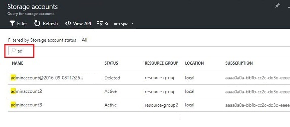
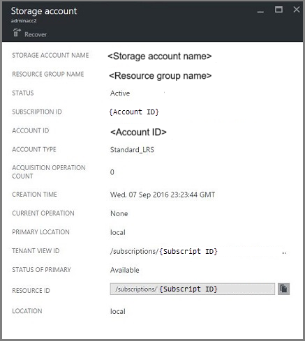
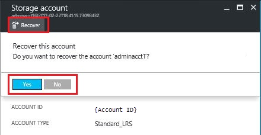
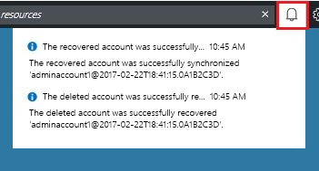

# Manage Azure Stack storage accounts

Learn how to manage Azure Stack storage accounts. Find, recover, and reclaim storage capacity based on business needs.

## Find a storage account

The list of storage accounts in the region can be viewed in Azure Stack by following these steps:

1. Sign in to the [administrator portal](https://adminportal.local.azurestack.external).

2. Select **All services** > **Storage** > **Storage accounts**.

   

By default, the first 10 accounts are displayed. You can choose to fetch
more by clicking the  **Load more** link at the bottom of the list.

OR

If you're interested in a particular storage account - you can **filter
and fetch the relevant accounts** only.

**To filter for accounts:**

1. Select **Filter** at the top of the pane.
2. On the Filter pane, it allows you to specify **account name**,
    **subscription ID**, or **status** to fine-tune the list of storage
    accounts to be displayed. Use them as appropriate.
3. As you type, the list will automatically apply the filter.

    

4. To reset the filter: select **Filter**, clear out the
    selections and update.

The search text box (on the top of the storage accounts list pane) lets
you highlight the selected text in the list of accounts. You can use this
when the full name or ID isn't easily available.

You can use free text here to help find the account you're interested
in.



## Look at account details
Once you have located the accounts you're interested in viewing, you
can select the particular account to view certain details. A new pane
opens with the account details. These details include the kind of account,
creation time, location, and so on.



## Recover a deleted account
You may be in a situation where you need to recover a deleted
account.

In Azure Stack, there's a simple way to do that:

1. Browse to the storage accounts list. For more information, see [Find a storage account](azure-stack-manage-storage-accounts.md) at the top of this article.
2. Locate that particular account in the list. You may need to filter.
3. Check the *state* of the account. It should say **Deleted**.
4. Select the account, which opens the account details pane.
5. On top of this pane, locate the **Recover** button and select it.
6. Select **Yes** to confirm.

   

7. The recovery is now in process. Wait for an indication that it was
   successful. You can also select the "bell" icon at the top of the portal to
   view progress indications.

   

   Once the recovered account is successfully synchronized, it can be used again.

### Some Gotchas
* Your deleted account shows state as **out of retention**.
  
  Out of retention means that the deleted account has exceeded the retention period
  and may not be recoverable.

* Your deleted account doesn't show in the accounts list.
  
  You account may not show in the account list when the deleted account has already been garbage collected. In this case, it can't be recovered. For more information, see [Reclaim capacity](#reclaim) in this article.

## Set the retention period
The retention period setting allows a cloud operator to specify a time period in
days (between 0 and 9999 days) during which any deleted account can
potentially be recovered. The default retention period is set to 0
days. Setting the value to "0" means that any deleted account is
immediately out of retention and marked for periodic garbage
collection.

**To change the retention period:**

1. Sign in to the [administrator portal](https://adminportal.local.azurestack.external).
2. Select **All services** > **Region management** under **Administration**.
3. Select **Resources providers** > **Storage** > **Settings**. Your path is Home > *region* - Resource providers > Storage.
4. Select **Configuration** then edit the retention period value.

   Set the number of days and then save it.

   This value is immediately effective and is set for your
   entire region.

   

## <a name="reclaim"></a>Reclaim capacity
One of the side effects of having a retention period is that a deleted account continues to consume capacity until it comes out of the retention period. As a cloud operator, you may need a way to reclaim the deleted account space even though the retention period hasn't yet expired.

You can reclaim capacity using either the portal or PowerShell.

**To reclaim capacity using the portal:**
1. Navigate to the storage accounts pane. See Find a storage account.
2. Select **Reclaim space** at the top of the pane.
3. Read the message and then select **OK**.

    

4. Wait for success notification. See the bell icon on the portal.

    

5. Refresh the Storage accounts page. The deleted accounts are no longer shown in the list because they have been purged.

You can also use PowerShell to explicitly override the retention period and immediately reclaim capacity.

**To reclaim capacity using PowerShell:**

1. Confirm that you have Azure PowerShell installed and configured. If not,
   use the following instructions: 
   * To install the latest Azure PowerShell version and associate it with your Azure subscription, see [How to install and configure Azure
   PowerShell](https://azure.microsoft.com/documentation/articles/powershell-install-configure/).
   For more information about Azure Resource Manager cmdlets, see
   [Using Azure PowerShell with Azure Resource
   Manager](https://go.microsoft.com/fwlink/?LinkId=394767).
2. Run the following cmdlets:

> [!NOTE]  
> If you run these cmdlets, you permanently delete the account and its contents. It's not recoverable. Use this with care.

```powershell  
    $farm_name = (Get-AzsStorageFarm)[0].name
    Start-AzsReclaimStorageCapacity -FarmName $farm_name
```

For more information, see [Azure Stack PowerShell documentation](https://docs.microsoft.com/powershell/azure/azure-stack/overview).
 

## Next steps

 - For information on managing permissions, see [Set access permissions using role-based access control](azure-stack-manage-permissions.md).
 - For information on managing storage capacity for Azure Stack, see [Manage storage capacity for Azure Stack](azure-stack-manage-storage-shares.md).
