# Manage storage capacity for Azure Stack Hub

You can use this article as an Azure Stack Hub cloud operator to learn how to monitor and manage the storage capacity of your Azure Stack Hub deployment. You can use the guidance to understand the memory available for your user's VMs. The Azure Stack Hub storage infrastructure allocates a subset of the total storage capacity of the Azure Stack Hub deployment as storage services. Storage services store a tenant's data in shares on volumes that correspond to the nodes of the deployment.

As a cloud operator, you have a limited amount of storage to work with. The amount of storage is defined by the solution you implement. The solution is provided by your OEM vendor when you use a multinode solution, or it's provided by the hardware on which you install the Azure Stack Development Kit (ASDK).

Azure Stack Hub only supports the expansion of storage capacity by adding extra scale unit nodes. For more information, see [add scale unit nodes in Azure Stack Hub](azure-stack-add-scale-node.md). Adding physical disks to the nodes won't expand the storage capacity.

It's important to [monitor](#monitor-storage) the available storage to ensure that efficient operations are maintained. When the remaining free capacity of a volume becomes limited, plan to [manage the available space](#manage-available-space) to prevent the shares from running out of capacity.

Your options for managing capacity include:

- Reclaiming capacity.
- Migrating storage objects.

When an object store volume is 100% utilized, the storage service no longer functions for that volume. To get assistance in restoring operations for the volume, contact Microsoft support.

## Understand disks, containers, and volumes

Tenant user creates disks, blobs, tables, and queues in Azure Stack Hub storage services. These tenant data are put on volumes on top of the available storage.

### Disks

VM store and manipulate data on virtual disks. Each VM starts with an OS disk, created from a marketplace image or private image. The VM can attach zero or more data disks. There are two types of disks offered in Azure Stack:

**Managed disks** simplify disk management for Azure IaaS VMs by managing the storage accounts associated with the VM disks. You only have to specify the size of disk you need, and Azure Stack Hub creates and manages the disk for you. For more information, see [Managed Disks Overview](/azure/virtual-machines/windows/managed-disks-overview).

**Unmanaged disks** are VHD files that are stored as page blobs in storage containers in Azure Stack storage accounts. The page blobs created by tenants are referred to as VM disks and are stored in containers in the storage accounts. We recommend you use unmanaged disks only for VMs that need to be compatible with third-party tools, which only support Azure unmanaged disks.

The guidance to tenants is to place each disk into a separate container to improve performance of the VM.

- Each container that holds a disk, or page blob, from a VM is considered an attached container to the VM that owns the disk.
- A container that doesn't hold any disks from a VM is considered a free container.

The options to free up space on an attached container are limited. To learn more, see [Distribute unmanaged disks](#distribute-unmanaged-disks).

>[!IMPORTANT]
> We recommended that you use only Managed disks in VMs for easier management. You don't have to prepare storage accounts and containers before using Managed disks. Managed disks provide equivalent or better functionality and performance compared to unmanaged disks. There are no advantages to use unmanaged disks and they are only provided for backward compatibility.
> 
> Managed disks are optimized for better placement in the storage infrastructure and have significantly reduced management overhead. But due to Managed disks are thin provisioned and the final utilization is unpredictable in creation, there are opportunities of volume being over-utilized caused by unbalanced disk placement. Operators are responsible for monitoring the storage capacity usage and avoid such issue.
> 
> For users that use ARM templates to provision new virtual machines, use the following document to understand how to modify your templates to use managed disks: [Use VM managed disks templates](../user/virtual-machines-use-managed-disks-template.md).

VM disks are stored as sparse files on storage infrastructure. Disks have provisioned size that the user requests at the time the disk is created. However only the non-zero pages written to the disk occupy space on the underlying storage infrastructure.

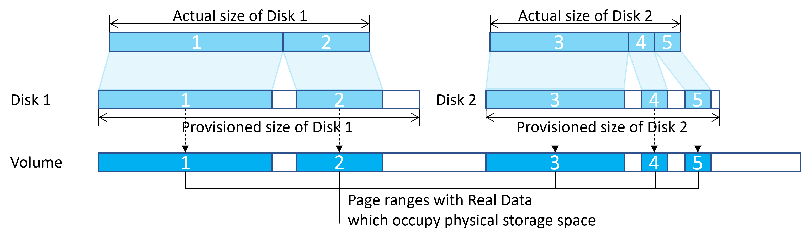

Disks are often created by copying from platform images, managed images, snapshots, or other disks. And snapshots are taken from disks. To increase utilization of storage capacity and reduce copy operation time the system uses block cloning in ReFS. Blob cloning is a low-cost metadata operation rather than a full byte-by-byte copy between files. The source file and target file can share the same extents, identical data isn't physically stored multiple times, improving storage capacity. 


The capacity usage grows only when the disks are written, and identical data reduces. 
When an image or a disk is deleted, the space may not be freed immediately because there could be disks or snapshots created from it still keep the identical data and occupy space. Only if all the related entities are removed, the space becomes available.

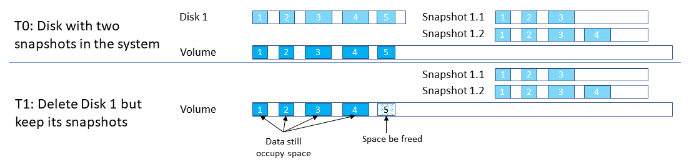

### Blobs and containers

Tenant users store massive amounts of unstructured data with Azure Blob. Azure Stack Hub supports three types of Blobs: Block Blobs, Append Blobs and Page Blobs. For more information about the different types of blobs, see [Understanding Block Blobs, Append Blobs, and Page Blobs](/rest/api/storageservices/understanding-block-blobs--append-blobs--and-page-blobs).

Tenant users create containers that are then used to store blob data. Although users decide in which container to place blobs, the storage service uses an algorithm to determine on which volume to put the container. The algorithm typically chooses the volume with the most available space.

After a blob is placed in a container, the blob can grow to use more space. As you add new blobs and existing blobs grow, the available space in the volume that holds the container shrinks.

Containers aren't limited to a single volume. When the combined blob data in a container grows to use 80% or more of the available space, the container enters *overflow* mode. When in overflow mode, any new blobs that are created in that container are allocated to a different volume that has sufficient space. Over time, a container in overflow mode can have blobs that are distributed across multiple volumes.

When 90% (and then 95%) of the available space in a volume is used, the system raises [alerts](#storage-space-alerts) in the Azure Stack Hub administrator portal. Cloud operators should review available storage capacity and plan to rebalance the content. The storage service stops working when a disk is 100% used and no additional alerts are raised.

### Volumes

The *storage service* partitions the available storage into separate volumes that are allocated to hold system and tenant data. Volumes combine the drives in the storage pool to introduce the fault tolerance, scalability, and performance benefits of Storage Spaces Direct. For more information about volumes in Azure Stack Hub, see [Manage storage infrastructure for Azure Stack Hub](azure-stack-manage-storage-infrastructure.md).

Object store volumes hold tenant data. Tenant data includes page blobs, block blobs, append blobs, tables, queues, databases, and related metadata stores. The number of object store volumes is equal to the number of nodes in the Azure Stack Hub deployment:

- On a four-node deployment, there are four object store volumes. On a multinode deployment, the number of volumes isn't reduced if a node is removed or malfunctioning.
- If you use the ASDK, there's a single volume with a single share.

The object store volumes are for the exclusive use of storage services. You must not directly modify, add, or remove any files on the volumes. Only storage services should work on the files stored in these volumes.

Because the storage objects (blobs, and so on) are individually contained within a single volume, the maximum size of each object can't exceed the size of a volume. The maximum size of new objects depends on the capacity that remains in a volume as unused space when that new object is created.

When an object store volume is low on free space and actions to [reclaim](#reclaim-capacity) space aren't successful or available, Azure Stack Hub cloud operators can migrate storage objects from one volume to another.

For information about how tenant users work with blob storage in Azure Stack Hub, see [Azure Stack Hub Storage services](../user/azure-stack-storage-overview.md).

## Monitor storage

::: moniker range="<azs-2002"

Use Azure PowerShell or the administrator portal to monitor shares so that you can understand when free space is limited. When you use the portal, you receive alerts about shares that are low on space.

### Use PowerShell

As a cloud operator, you can monitor the storage capacity of a share by using the PowerShell `Get-AzsStorageShare` cmdlet. The cmdlet returns the total, allocated, and free space, in bytes, on each of the shares.


- **Total capacity**: The total space, in bytes, that's available on the share. This space is used for data and metadata that's maintained by the storage services.
- **Used capacity**: The amount of data, in bytes, that's used by all the extents from the files that store the tenant data and associated metadata.

### Use the administrator portal

As a cloud operator, you can use the administrator portal to view the storage capacity of all shares.

1. Sign in to the administrator portal `https://adminportal.local.azurestack.external`.
2. Select **All services** > **Storage** > **File shares** to open the file share list, where you can view the usage information.

    

   - **Total**: The total space, in bytes, that's available on the share. This space is used for data and metadata that's maintained by the storage services.
   - **Used**: The amount of data, in bytes, that's used by all the extents from the files that store the tenant data and associated metadata.

::: moniker-end
::: moniker range=">=azs-2002"

Use Azure PowerShell or the administrator portal to monitor provisioned and used capacity and plan for migration to ensure continuous normal operation of the system. 

There are three tools for monitoring volume capacity:

- Portal and PowerShell of for current volume capacity.
- Storage space alerts.
- Volume capacity metrics.

In this section, we will introduce how to use these tools to monitor the capacity of the system.

### Use PowerShell

As a cloud operator, you can monitor the storage capacity of a volume using the PowerShell `Get-AzsVolume` cmdlet. The cmdlet returns the total and free space in gigabyte (GB) on each of the volumes.


- **Total capacity:** The total space in GB that's available on the share. This space is used for data and metadata that's maintained by the storage services.
- **Remaining capacity:** The amount of space in GB that's free to store the tenant data and associated metadata.

### Use the administrator portal

As a cloud operator, you can use the administrator portal to view the storage capacity of all volumes.

1. Sign in to the Azure Stack Hub administrator portal (`https://adminportal.local.azurestack.external`).
2. Select **All services** > **Storage** > **Volumes** to open the volume list where you can view the usage information.

    

   - **Total**: The total space available on the volume. This space is used for data and metadata that's maintained by the storage services.
   - **Used**: The amount of data that's used by the all the extents from the files that store the tenant data and associated metadata.

::: moniker-end

### Storage space alerts

When you use the administrator portal, you receive alerts about volumes that are low on space.

> [!IMPORTANT]
> As a cloud operator, you should prevent shares from reaching full usage. When a share is 100% utilized, the storage service no longer functions for that share. To recover free space and restore operations on a share that's 100% utilized, you must contact Microsoft support.

* **Warning**: When a file share is over 90% utilized, you receive a *Warning* alert in the administrator portal:

  [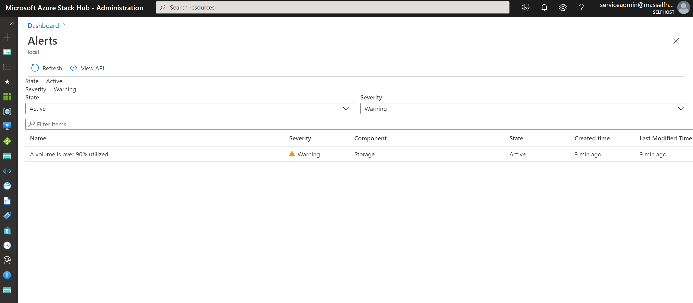](media/azure-stack-manage-storage-shares/alert-warning-new.png#lightbox)

* **Critical**: When a file share is over 95% utilized, you receive a *Critical* alert in the administrator portal:

  [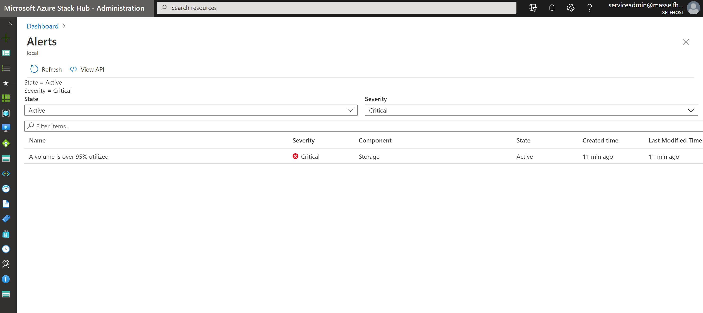](media/azure-stack-manage-storage-shares/alert-critical-new.png#lightbox)

* **View details**: In the administrator portal, you can open an alert's details to view your mitigation options:

  [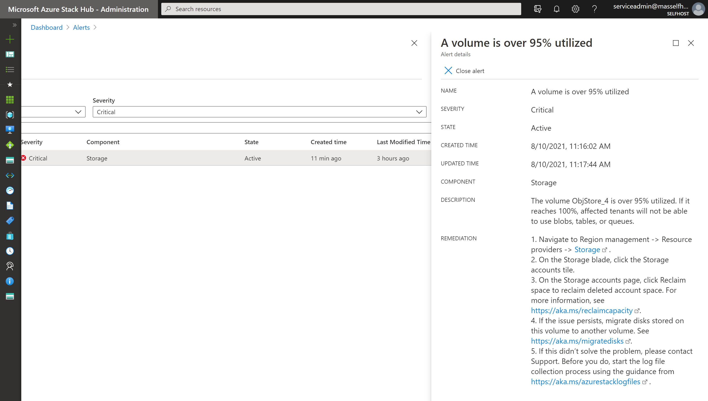](media/azure-stack-manage-storage-shares/alert-details-new.png#lightbox)

::: moniker range=">=azs-2005"

### Volume capacity metrics
Volume capacity metrics give you more detailed information about provisioned capacity and used capacity for different types of objects. The metrics data are preserved for 30 days. Background monitoring service refreshes the volume capacity metrics data hourly.

It is necessary to understand the resource usage of a volume by proactively checking the capacity metric report. The cloud operator can analyze the resource type distribution when a volume is approaching full to decide the corresponding action to free space. The operator can also prevent the volume being overused when the disk provisioned size indicates the volume has been over-provisioned too much.

Azure Monitor provides following metrics to show volume capacity utilization:

- **Volume Total Capacity** shows the total storage capacity of the volume.
- **Volume Remaining Capacity** shows the remaining storage capacity of the volume. 
- **Volume VM Disk Used Capacity** shows the total spaces occupied by VM disk related objects (including page blobs, managed disks/snapshot, managed images, and platform images). The underlying VHD file of VM disks can share the same extent (refer to [Disks](#disks)) with images, snapshots or other disks. This number could be smaller than sum of the used capacity of all individual VM disk related object.
- **Volume Other Used Capacity** is the total used size of objects other than disks – including block blobs, append blobs, tables, queues, and blob metadata. 
- **Volume VM Disk Provisioned Capacity** is total provisioned size of page blobs and managed disks/snapshots. This size is the maximum value of total disk capacity of all managed disks and page blobs on the specific volume can grow to.


To view volume capacity metrics in Azure Monitor:

1. Confirm that you have Azure PowerShell installed and configured. For instructions on configuring the PowerShell environment, see [Install PowerShell for Azure Stack Hub](azure-stack-powershell-install.md). To sign in to Azure Stack Hub, see [Configure the operator environment and sign in to Azure Stack Hub](azure-stack-powershell-configure-admin.md).
2. Download Azure Stack Hub tools from [GitHub repository](https://github.com/Azure/AzureStack-Tools). For detailed steps, see [Download Azure Stack Hub tools from GitHub](azure-stack-powershell-download.md).
3. Generate the Capacity Dashboard json by running the DashboardGenerator under CapacityManagement.
   ```powershell
   .\CapacityManagement\DashboardGenerator\Create-AzSStorageDashboard.ps1 -capacityOnly $true -volumeType object
   ```
   There would be a json file named starts with **DashboardVolumeObjStore** under the folder of DashboardGenerator.
4. Sign in to the Azure Stack Hub administrator portal (`https://adminportal.local.azurestack.external`).
5. In Dashboard page, click **Upload**, and select the json file generated in Step 3.
   
   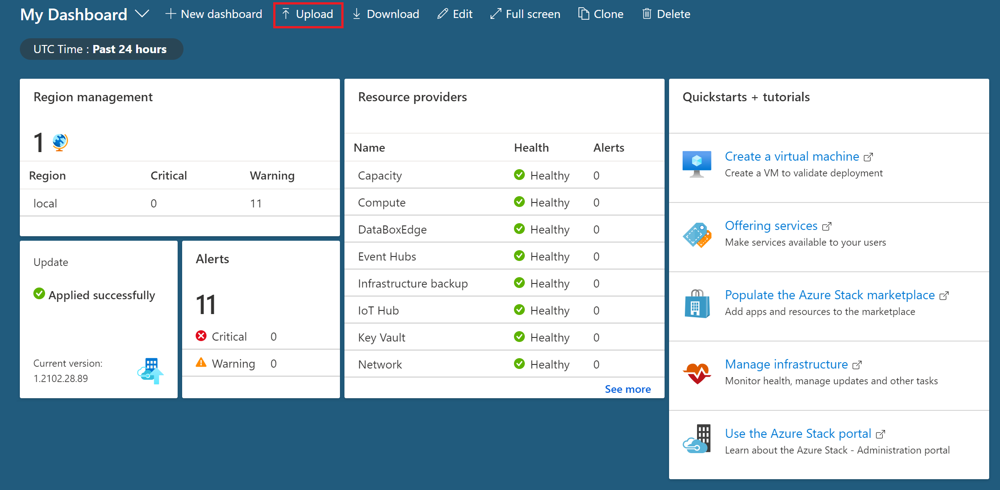

6. Once the json is uploaded, you would be directed to the new capacity dashboard. Each volume has a corresponding chart in the dashboard. The number of charts equals to the count of volumes:

   

7. By clicking one of the volumes, you can check five capacity metrics of the specific volume in the detailed chart:

   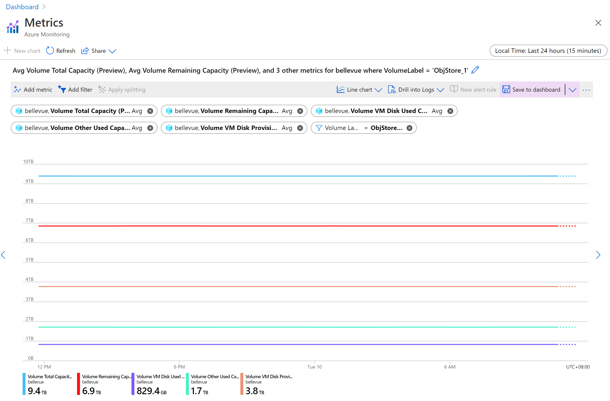

### Volume usage patterns

By checking the volume capacity metrics, the cloud operator understands how much a volume’s capacity is utilized, and which resource type is taking most of the space usage. The space usage pattern could be grouped to following types, which operator should take different action for each of the types:

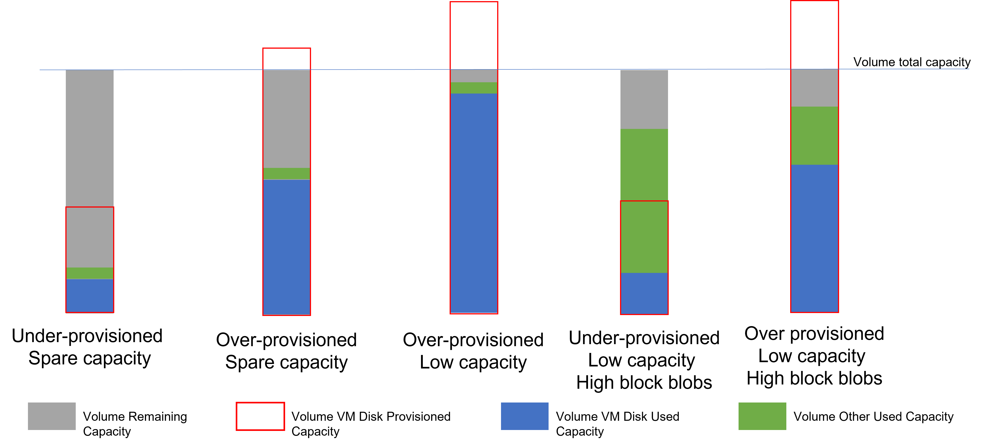

**Under-provisioned, spare capacity:** there’s enough available capacity on the volume, and the total provisioned capacity of all disks located on this volume is smaller than the total available capacity. The volume is available for more storage objects, including both disks and other objects (block/append blobs, tables and queues). You don’t need to take any action to operate the volume.

**Over-provisioned, spare capacity:** the remaining capacity of the volume is high, but the VM disk provisioned capacity is already above volume total capacity. This volume still has room for more storage objects now. However it has potential to be filled with the data in the VM disks located on this volume. You should closely monitor the usage trend of this volume. If it changes to **over-provisioned, low capacity pattern**, you may need to take action to free the space.

**Over-provisioned, low capacity:** the remaining capacity of the volume is low, and both of the VM disk provisioned capacity and VM disk used capacity is high.

The low remaining capacity indicates the volume is reaching full usage. Operators need to take immediate action to free space to prevent the volume being 100% utilized which would block the storage service. The high VM disk used capacity shows the majority of the volume usage is VM disks. You should refer instruction of [Migrate disk](#migrate-a-managed-disk-between-volumes) to move disks from the full volume to other available volumes to free space.

**Under-provisioned, low capacity, high block blobs:** the remaining capacity of the volume is low, and both of the VM disk provisioned capacity and VM disk used capacity is low, but the other used capacity is high.

The volume has the risk of being fully utilized that operator should take immediate action to free space. The high other used capacity indicates most of the volume capacity is taken by block/append blobs or table/queue. When the volume’s available capacity is less than 20%, container overflow would be enabled, and new blob object won’t be placed on this almost full volume. But the existing blobs may still grow. To prevent the continuous growing blobs overuse the capacity, you can contact Microsoft Support to query the containers occupying space on the specific volume, and decide whether cleanup of those containers needs to be done by tenants to free up some space.

**Over-provisioned, low capacity, high block blobs:** the remaining capacity of the volume is low, and both the disk used/provisioned capacity and other used capacity is high. This volume has high space utilization by both disks and other storage objects. You should free space of it to avoid volume being totally full. It is recommended to firstly following instruction of [Migrate disk](#migrate-a-managed-disk-between-volumes) to move disks from the full volume to other available volumes. In other case, you can contact Microsoft Support to query the containers occupying space on the specific volume, and decide whether cleanup of those containers needs to be done by tenants to free up some space.

::: moniker-end

## Manage available space

When it's necessary to free space on a volume, use the least invasive methods first. For example, try to reclaim space before you choose to migrate a managed disk.

### Reclaim capacity

You can reclaim the capacity that's used by tenant accounts that have been deleted. This capacity is automatically reclaimed when the data [retention period](azure-stack-manage-storage-accounts.md#set-the-retention-period) is reached, or you can act to reclaim it immediately.

For more information, see the "Reclaim capacity" section of [Manage Azure Stack Hub storage accounts](azure-stack-manage-storage-accounts.md#reclaim).

::: moniker range="<azs-1910"

### Migrate a container between volumes

*This option applies only to Azure Stack Hub integrated systems.*

Because of tenant usage patterns, some tenant shares use more space than others. This can result in some shares running low on space before other shares that are relatively unused.

You can free up space on an overused share by manually migrating some blob containers to a different share. You can migrate several smaller containers to a single share that has capacity to hold them all. Use migration to move *free* containers. Free containers are containers that don't contain a disk for a VM.

Migration consolidates all of a container's blobs on the new share.

- If a container has entered overflow mode and has placed blobs on other volumes, the new share must have sufficient capacity to hold all of the blobs belong to the container you migrate, including the blobs that are overflowed.

- The PowerShell cmdlet `Get-AzsStorageContainer` identifies only the space in use on the initial volume for a container. The cmdlet doesn't identify space that's used by blobs that are overflowed to additional volumes. Therefore, the full size of a container might not be evident. It's possible that consolidation of a container on a new share can send that new share into an overflow condition, where it places data onto additional shares. As a result, you might need to rebalance the shares.

- If you lack permissions to certain resource groups and can't use PowerShell to query the additional volumes for overflow data, work with the owner of those resource groups and containers to understand the total amount of data to migrate before you migrate it.

> [!IMPORTANT]
> The migration of blobs for a container is an offline operation that requires the use of PowerShell. Until the migration is complete, all blobs for the container that you're migrating remain offline and can't be used. You should also avoid upgrading Azure Stack Hub until all ongoing migration is complete.

#### Migrate containers by using PowerShell

1. Confirm that you have [Azure PowerShell installed and configured](/powershell/azure/). For more information, see [Manage Azure resources by using Azure PowerShell](/azure/azure-resource-manager/management/manage-resources-powershell).
2. Examine the container to understand what data is on the share that you plan to migrate. To identify the best candidate containers for migration in a volume, use the `Get-AzsStorageContainer` cmdlet:

   ```powershell
   $farm_name = (Get-AzsStorageFarm)[0].name
   $shares = Get-AzsStorageShare -FarmName $farm_name
   $containers = Get-AzsStorageContainer -ShareName $shares[0].ShareName -FarmName $farm_name
   ```
   Then examine $containers:

   ```powershell
   $containers
   ```

   

3. Identify the best destination shares to hold the container you're migrating:

   ```powershell
   $destinationshare = ($shares | Sort-Object FreeCapacity -Descending)[0]
   ```

   Then examine $destinationshares:

   ```powershell
   $destinationshares
   ```

   

4. Start the migration for a container. Migration is asynchronous. If you start the migration of another container before the first migration is complete, use the job ID to track the status of each.

   ```powershell
   $job_id = Start-AzsStorageContainerMigration -StorageAccountName $containers[0].Accountname -ContainerName $containers[0].Containername -ShareName $containers[0].Sharename -DestinationShareUncPath $destinationshares[0].UncPath -FarmName $farm_name
   ```

   Then examine $jobId. In the following example, replace *d62f8f7a-8b46-4f59-a8aa-5db96db4ebb0* with the job ID you want to examine:

   ```powershell
   $jobId
   d62f8f7a-8b46-4f59-a8aa-5db96db4ebb0
   ```

5. Use the job ID to check on the status of the migration job. When the container migration is complete, **MigrationStatus** is set to *Complete*.

   ```powershell
   Get-AzsStorageContainerMigrationStatus -JobId $job_id -FarmName $farm_name
   ```

   

6. You can cancel an in-progress migration job. Canceled migration jobs are processed asynchronously. You can track cancellations by using $jobid:

   ```powershell
   Stop-AzsStorageContainerMigration -JobId $job_id -FarmName $farm_name
   ```

   

7. You can run the command from step 6 again, until the migration status is *Canceled*:

    

### Move VM disks

*This option applies only to Azure Stack Hub integrated systems.*

The most extreme method for managing space involves moving VM disks. Because moving an attached container (one that contains a VM disk) is complex, contact Microsoft support to accomplish this action.

::: moniker-end
::: moniker range=">=azs-1910"

### Migrate a managed disk between volumes

*This option applies only to Azure Stack Hub integrated systems.*

Because of tenant usage patterns, some tenant volumes use more space than others. The result can be a volume that runs low on space before other volumes that are relatively unused.

You can free up space on an overused volume by manually migrating some managed disks to a different volume. You can migrate several managed disks to a single volume that has capacity to hold them all. Use migration to move *offline* managed disks. Offline managed disks are disks that aren't attached to a VM.

> [!IMPORTANT]
> Migration of managed disks is an offline operation that requires the use of PowerShell. You must detach the candidate disks for migration from their owner VM before starting migration job (once the migration job is done, you can reattach them). Until migration completes, all managed disks you are migrating must remain offline and can't be used, otherwise the migration job would abort and all unmigrated disks are still on their original volumes. You should also avoid upgrading Azure Stack Hub until all ongoing migration completes.

#### To migrate managed disks using PowerShell

1. Confirm that you have Azure PowerShell installed and configured. For instructions on configuring the PowerShell environment, see [Install PowerShell for Azure Stack Hub](azure-stack-powershell-install.md). To sign in to Azure Stack Hub, see [Configure the operator environment and sign in to Azure Stack Hub](azure-stack-powershell-configure-admin.md).
2. Examine the managed disks to understand what disks are on the volume that you plan to migrate. To identify the best candidate disks for migration in a volume, use the `Get-AzsDisk` cmdlet:

   ```powershell
   $ScaleUnit = (Get-AzsScaleUnit)[0]
   $StorageSubSystem = (Get-AzsStorageSubSystem -ScaleUnit $ScaleUnit.Name)[0]
   $Volumes = (Get-AzsVolume -ScaleUnit $ScaleUnit.Name -StorageSubSystem $StorageSubSystem.Name | Where-Object {$_.VolumeLabel -Like "ObjStore_*"})
   $SourceVolume  = ($Volumes | Sort-Object RemainingCapacityGB)[0]
   $VolumeName = $SourceVolume.Name.Split("/")[2]
   $VolumeName = $VolumeName.Substring($VolumeName.IndexOf(".")+1)
   $MigrationSource = "\\SU1FileServer."+$VolumeName+"\SU1_"+$SourceVolume.VolumeLabel
   $Disks = Get-AzsDisk -Status All -SharePath $MigrationSource | Select-Object -First 10
   ```
   Then examine $disks:

   ```powershell
   $Disks
   ```

   

3. Identify the best destination volume to hold the disks you migrate:

   ```powershell
   $DestinationVolume  = ($Volumes | Sort-Object RemainingCapacityGB -Descending)[0]
   $VolumeName = $DestinationVolume.Name.Split("/")[2]
   $VolumeName = $VolumeName.Substring($VolumeName.IndexOf(".")+1)
   $MigrationTarget = "\\SU1FileServer."+$VolumeName+"\SU1_"+$DestinationVolume.VolumeLabel
   ```

4. Start migration for managed disks. Migration is asynchronous. If you start migration of other disks before the first migration completes, use the job name to track the status of each.

   ```powershell
   $jobName = "MigratingDisk"
   Start-AzsDiskMigrationJob -Disks $Disks -TargetShare $MigrationTarget -Name $jobName
   ```

5. Use the job name to check on the status of the migration job. When the disk migration is complete, **MigrationStatus** is set to **Complete**.

   ```powershell
   $job = Get-AzsDiskMigrationJob -Name $jobName
   ```

   

   If you are migrating multiple managed disks in one migration job, you can also check the sub tasks of the job.

   ```powershell
   $job.Subtasks
   ```

   

6. You can cancel an in-progress migration job. Canceled migration jobs are processed asynchronously. You can track cancellation by using job name until the status confirms the migration job is **Canceled**:

   ```powershell
   Stop-AzsDiskMigrationJob -Name $jobName
   ```

   

### Distribute unmanaged disks

*This option applies only to Azure Stack Hub integrated systems.*

The most extreme method for managing space involves moving unmanaged disks. If the tenant adds numbers of unmanaged disks to one container, the total used capacity of the container could grow beyond the available capacity of the volume that holds it before the container entering *overflow* mode. To avoid single container exhaust the space of a volume, the tenant could distribute the existing unmanaged disks of one container to different containers. Because distributing an attached container (one that contains a VM disk) is complex, contact Microsoft Support to accomplish this action.

::: moniker-end

## Memory available for VMs

Azure Stack Hub is built as a hyper-converged cluster of compute and storage. The convergence allows for the sharing of the hardware, referred to as a scale unit. In Azure Stack Hub, a scale unit provides the availability and scalability of resources. A scale unit consists of a set of Azure Stack Hub servers, referred to as hosts or nodes. The infrastructure software is hosted within a set of VMs and shares the same physical servers as the tenant VMs. All Azure Stack Hub VMs are then managed by the scale unit's Windows Server clustering technologies and individual Hyper-V instances. The scale unit simplifies the acquisition and management Azure Stack Hub. The scale unit also allows for the movement and scalability of all services across Azure Stack Hub, tenant and infrastructure.

You can review a pie chart in the administration portal that shows the free and used memory in Azure Stack Hub like below:

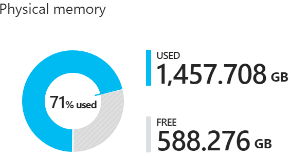

The following components consume the memory in the used section of the pie chart:

- **Host OS usage or reserve**
    This is the memory used by the operating system (OS) on the host, virtual memory page tables, processes that are running on the host OS, and the spaces direct memory cache. Since this value is dependent on the memory used by the different Hyper-V processes running on the host, it can fluctuate.
- **Infrastructure services**
    These are the infrastructure VMs that make up Azure Stack Hub. This entails approximately 31 VMs that take up 242 GB + (4 GB x number of nodes) of memory. The memory utilization of the infrastructure services component may change as we work on making our infrastructure services more scalable and resilient.
- **Resiliency reserve**
    Azure Stack Hub reserves a portion of the memory to allow for tenant availability during a single host failure and during patch and update to allow for successful live migration of VMs.
- **Tenant VMs**
    These are the VMs created by Azure Stack Hub users. In addition to running VMs, memory is consumed by any VMs that have landed on the fabric. This means that VMs in **Creating** or **Failed** state, or VMs shut down from within the guest, will consume memory. However, VMs that have been deallocated using the stop deallocated option from Azure Stack Hub user portal, PowerShell, and Azure CLI will not consume memory from Azure Stack Hub.
- **Add-on Resource Providers**
    VMs deployed for the add-on resource providers such as SQL, MySQL, and App Service.

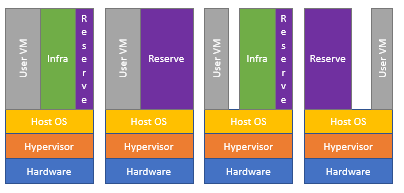


### Available Memory for VM placement

As a cloud operator for Azure Stack Hub, there isn't an  automated way to check the allocated memory for each VM. You can have access to your user VMs, and calculate the allocated memory manually. However, the allocated memory will not reflect the real use. This value can be lower than the allocated value.

To workout available memory for VMs the following formula is used:

**Available Memory for VM placement** = `Total Host Memory--Resiliency Reserve--Memory used by running tenant VMs - Azure Stack Hub Infrastructure Overhead`

**Resiliency reserve** =` H + R * ((N-1) * H) + V * (N-2)`

Where:

**H** = Size of single host memory

**N** = Size of scale unit (number of hosts)

**R** = Operating system reserve/memory used by the Host OS, which is .15 in this formula

**V** = Largest VM (memory wise) in the scale unit

**Azure Stack Hub Infrastructure Overhead** = 242 GB + (4 GB x # of nodes). This accounts for the approximately 31 VMs are used to host Azure Stack Hub's infrastructure.

**Memory used by the Host OS** = 15 percent (0.15) of host memory. The operating system reserve value is an estimate and will vary based on the physical memory capacity of the host and general operating system overhead.

The value **V**, largest VM in the scale unit, is dynamically based on the largest tenant VM deployed. For example, the largest VM value could be 7 GB or 112 GB or any other supported VM memory size in the Azure Stack Hub solution. We pick the size of the largest VM here to have enough memory reserved so a live migration of this large VM would not fail. Changing the largest VM on the Azure Stack Hub fabric will result in an increase in the resiliency reserve in addition to the increase in the memory of the VM itself.

For example, with a 12 node scale unit:

| Stamp details              | Values                          |
|----------------------------|---------------------------------|
| sts (N)                    | 12                              |
| Memory per Host (H)        | 384                             |
| Total Memory of Scale Unit | 4608                            |
| OS reserve (R)             | 15%                             |
| Largest VM (V)             | 112                             |
| Resiliency Reserve =       | H + R * ((N-1) * H) + V * (N-2) |
| Resiliency Reserve =       | 2137.6                          |

So with the above information, you can calculate that an Azure Stack with 12 nodes of 384 GB per host (Total 4,608 GB) has 2,137 GB reserved for resiliency if the largest VM has 112-GB memory.

When you consult the **Capacity** blade for the Physical memory as per below, the **Used** value includes the Resiliency Reserve. The graph is from a four node Azure Stack Hub instance.

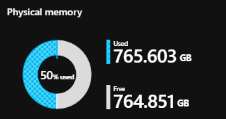

Keep these considerations in mind while planning the capacity for Azure Stack Hub. In addition, you can use the [Azure Stack Hub Capacity Planner](azure-stack-capacity-planning-overview.md).

## Next steps

To learn more about offering VMs to users, see [Manage storage capacity for Azure Stack Hub](./tutorial-offer-services.md).
