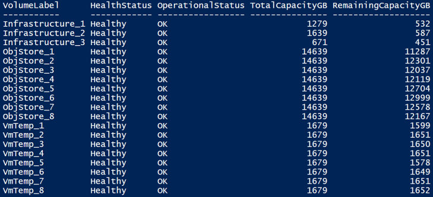
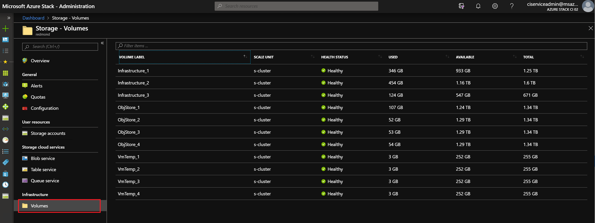
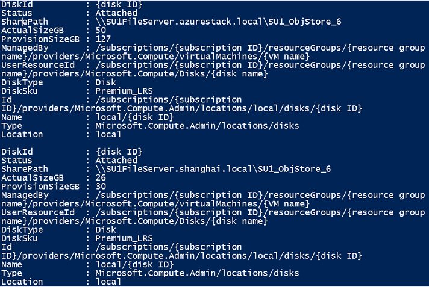
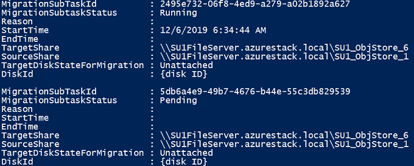
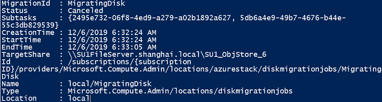

# Manage storage capacity for Azure Stack Hub

This article helps Azure Stack Hub cloud operators monitor and manage the storage capacity of their Azure Stack Hub deployment. The Azure Stack Hub storage infrastructure allocates a subset of the total storage capacity of the Azure Stack Hub deployment as storage services. Storage services store a tenant's data in shares on volumes that correspond to the nodes of the deployment.

As a cloud operator, you have a limited amount of storage to work with. The amount of storage is defined by the solution you implement. The solution is provided by your OEM vendor when you use a multinode solution, or it's provided by the hardware on which you install the Azure Stack Development Kit (ASDK).

Azure Stack Hub only supports the expansion of storage capacity by adding additional scale unit nodes. For more information, see [add additional scale unit nodes in Azure Stack Hub](azure-stack-add-scale-node.md). Adding physical disks to the nodes won't expand the storage capacity.

It's important to [monitor](#monitor-shares) the available storage to ensure that efficient operations are maintained. When the remaining free capacity of a volume becomes limited, plan to [manage the available space](#manage-available-space) to prevent the shares from running out of capacity.

Your options for managing capacity include:


- Reclaiming capacity.
- Migrating storage objects.

When an object store volume is 100% utilized, the storage service no longer functions for that volume. To get assistance in restoring operations for the volume, contact Microsoft support.

## Understand volumes and shares, containers, and disks

### Volumes and shares

The *storage service* partitions the available storage into separate, equal volumes that are allocated to hold tenant data. For more information about volumes in Azure Stack Hub, see [Manage storage infrastructure for Azure Stack Hub](azure-stack-manage-storage-infrastructure.md).

Object store volumes hold tenant data. Tenant data includes page blobs, block blobs, append blobs, tables, queues, databases, and related metadata stores. The number of object store volumes is equal to the number of nodes in the Azure Stack Hub deployment:

- On a four-node deployment, there are four object store volumes. On a multinode deployment, the number of volumes isn't reduced if a node is removed or malfunctioning.
- If you use the ASDK, there's a single volume with a single share.

The object store volumes are for the exclusive use of storage services. You must not directly modify, add, or remove any files on the volumes. Only storage services should work on the files stored in these volumes.

Because the storage objects (blobs, and so on) are individually contained within a single volume, the maximum size of each object can't exceed the size of a volume. The maximum size of new objects depends on the capacity that remains in a volume as unused space when that new object is created.

When an object store volume is low on free space and actions to [reclaim](#reclaim-capacity) space aren't successful or available, Azure Stack Hub cloud operators can migrate storage objects from one volume to another.

For information about how tenant users work with blob storage in Azure Stack Hub, see [Azure Stack Hub Storage services](../user/azure-stack-storage-overview.md).

### Containers

Tenant users create containers that are then used to store blob data. Although users decide in which container to place blobs, the storage service uses an algorithm to determine on which volume to put the container. The algorithm typically chooses the volume with the most available space.  

After a blob is placed in a container, the blob can grow to use more space. As you add new blobs and existing blobs grow, the available space in the volume that holds the container shrinks. 

Containers aren't limited to a single volume. When the combined blob data in a container grows to use 80% or more of the available space, the container enters *overflow* mode. When in overflow mode, any new blobs that are created in that container are allocated to a different volume that has sufficient space. Over time, a container in overflow mode can have blobs that are distributed across multiple volumes.

When 80% (and then 90%) of the available space in a volume is used, the system raises [alerts](#storage-space-alerts) in the Azure Stack Hub administrator portal. Cloud operators should review available storage capacity and plan to rebalance the content. The storage service stops working when a disk is 100% used and no additional alerts are raised.

### Disks

Azure Stack Hub supports the use of managed disks and unmanaged disks in VMs, as both an operating system (OS) and a data disk.

**Managed disks** simplify disk management for Azure IaaS VMs by managing the storage accounts associated with the VM disks. You only have to specify the size of disk you need, and Azure Stack Hub creates and manages the disk for you. For more information, see [Managed Disks Overview](/azure/virtual-machines/windows/managed-disks-overview).

It is recommended that you use Managed Disks for VM for easier management and capacity balance. You don't have to prepare a storage account and containers before using Managed Disks. When creating multiple managed disks, the disks are distributed into multiple volumes, which helps to balance the capacity of volumes.  

**Unmanaged disks** are VHD files that are stored as page blobs in Azure storage accounts. The page blobs created by tenants are referred to as VM disks and are stored in containers in the storage accounts. We recommend you use Unmanaged Disks only for VMs that need to compatible with third party tools only support Azure-Unmanaged Disks.

The guidance to tenants is to place each disk into a separate container to improve performance of the VM.

- Each container that holds a disk, or page blob, from a VM is considered an attached container to the VM that owns the disk.
- A container that doesn't hold any disks from a VM is considered a free container.

The options to free up space on an attached container are limited. To learn more, see [Distribute unmanaged disks](#distribute-unmanaged-disks).

>[!TIP]  
> Cloud operators don't directly operate unmanaged disks, which are attached to VMs that tenants might add to a container. However, when you plan to manage space on storage shares, it can be useful to understand how unmanaged disks relate to containers and shares.

::: moniker range="<azs-2002"
## Monitor shares

Use Azure PowerShell or the administrator portal to monitor shares so that you can understand when free space is limited. When you use the portal, you receive alerts about shares that are low on space.

### Use PowerShell

As a cloud operator, you can monitor the storage capacity of a share by using the PowerShell `Get-AzsStorageShare` cmdlet. The cmdlet returns the total, allocated, and free space, in bytes, on each of the shares.


- **Total capacity**: The total space, in bytes, that's available on the share. This space is used for data and metadata that's maintained by the storage services.
- **Used capacity**: The amount of data, in bytes, that's used by all the extents from the files that store the tenant data and associated metadata.

### Use the administrator portal

As a cloud operator, you can use the administrator portal to view the storage capacity of all shares.

1. Sign in to the administrator portal `https://adminportal.local.azurestack.external`.
2. Select **All services** > **Storage** > **File shares** to open the file share list, where you can view the usage information.

    

   - **Total**: The total space, in bytes, that's available on the share. This space is used for data and metadata that's maintained by the storage services.
   - **Used**: The amount of data, in bytes, that's used by all the extents from the files that store the tenant data and associated metadata.

::: moniker-end
::: moniker range=">=azs-2002"

## Monitor volumes

Use PowerShell or the administrator portal to monitor volumes so you can understand when free space is limited. When you use the portal, you receive alerts about volumes that are low on space.

### Use PowerShell

As a cloud operator, you can monitor the storage capacity of a volume using the PowerShell `Get-AzsVolume` cmdlet. The cmdlet returns the total and free space in gigabyte (GB) on each of the volumes.



- **Total capacity**: The total space in GB that's available on the share. This space is used for data and metadata that's maintained by the storage services.
- **Remaining capacity**: The amount of space in GB that's free to store the tenant data and associated metadata.

### Use the administrator portal

As a cloud operator, you can use the administrator portal to view the storage capacity of all volumes.

1. Sign in to the Azure Stack Hub administrator portal (`https://adminportal.local.azurestack.external`).
2. Select **All services** > **Storage** > **Volumes** to open the volume list where you can view the usage information.

    

   - **Total**: The total space available on the volume. This space is used for data and metadata that's maintained by the storage services.
   - **Used**: The amount of data that's used by the all the extents from the files that store the tenant data and associated metadata.

::: moniker-end

### Storage space alerts

When you use the administrator portal, you receive alerts about volumes that are low on space.

> [!IMPORTANT]
> As a cloud operator, you should prevent shares from reaching full usage. When a share is 100% utilized, the storage service no longer functions for that share. To recover free space and restore operations on a share that's 100% utilized, you must contact Microsoft support.

* **Warning**: When a file share is over 80% utilized, you receive a *Warning* alert in the administrator portal:

  

* **Critical**: When a file share is over 90% utilized, you receive a *Critical* alert in the administrator portal:

  

* **View details**: In the administrator portal, you can open an alert's details to view your mitigation options:

  

## Manage available space

When it's necessary to free space on a volume, use the least invasive methods first. For example, try to reclaim space before you choose to migrate a managed disk.  

### Reclaim capacity

You can reclaim the capacity that's used by tenant accounts that have been deleted. This capacity is automatically reclaimed when the data [retention period](azure-stack-manage-storage-accounts.md#set-the-retention-period) is reached, or you can act to reclaim it immediately.

For more information, see the "Reclaim capacity" section of [Manage Azure Stack Hub storage accounts](azure-stack-manage-storage-accounts.md#reclaim).

::: moniker range="<azs-1910"

### Migrate a container between volumes

*This option applies only to Azure Stack Hub integrated systems.*

Because of tenant usage patterns, some tenant shares use more space than others. This can result in some shares running low on space before other shares that are relatively unused.

You can free up space on an overused share by manually migrating some blob containers to a different share. You can migrate several smaller containers to a single share that has capacity to hold them all. Use migration to move *free* containers. Free containers are containers that don't contain a disk for a VM.

Migration consolidates all of a container's blobs on the new share.

- If a container has entered overflow mode and has placed blobs on additional volumes, the new share must have sufficient capacity to hold all of the blobs for the container you migrate. This includes the blobs that are located on additional shares.

- The PowerShell cmdlet `Get-AzsStorageContainer` identifies only the space in use on the initial volume for a container. The cmdlet doesn't identify space that's used by blobs that are put on additional volumes. Therefore, the full size of a container might not be evident. It's possible that consolidation of a container on a new share can send that new share into an overflow condition, where it places data onto additional shares. As a result, you might need to rebalance the shares.

- If you lack permissions to certain resource groups and can't use PowerShell to query the additional volumes for overflow data, work with the owner of those resource groups and containers to understand the total amount of data to migrate before you migrate it.  

> [!IMPORTANT]
> The migration of blobs for a container is an offline operation that requires the use of PowerShell. Until the migration is complete, all blobs for the container that you're migrating remain offline and can't be used. You should also avoid upgrading Azure Stack Hub until all ongoing migration is complete.

#### Migrate containers by using PowerShell

1. Confirm that you have [Azure PowerShell installed and configured](/powershell/azure/). For more information, see [Manage Azure resources by using Azure PowerShell](/azure/azure-resource-manager/management/manage-resources-powershell).
2. Examine the container to understand what data is on the share that you plan to migrate. To identify the best candidate containers for migration in a volume, use the `Get-AzsStorageContainer` cmdlet:

   ```powershell  
   $farm_name = (Get-AzsStorageFarm)[0].name
   $shares = Get-AzsStorageShare -FarmName $farm_name
   $containers = Get-AzsStorageContainer -ShareName $shares[0].ShareName -FarmName $farm_name
   ```
   Then examine $containers:

   ```powershell
   $containers
   ```

   

3. Identify the best destination shares to hold the container you're migrating:

   ```powershell
   $destinationshare = ($shares | Sort-Object FreeCapacity -Descending)[0]
   ```

   Then examine $destinationshares:

   ```powershell 
   $destinationshares
   ```

   

4. Start the migration for a container. Migration is asynchronous. If you start the migration of additional containers before the first migration is complete, use the job ID to track the status of each.

   ```powershell
   $job_id = Start-AzsStorageContainerMigration -StorageAccountName $containers[0].Accountname -ContainerName $containers[0].Containername -ShareName $containers[0].Sharename -DestinationShareUncPath $destinationshares[0].UncPath -FarmName $farm_name
   ```

   Then examine $jobId. In the following example, replace *d62f8f7a-8b46-4f59-a8aa-5db96db4ebb0* with the job ID you want to examine:

   ```powershell
   $jobId
   d62f8f7a-8b46-4f59-a8aa-5db96db4ebb0
   ```

5. Use the job ID to check on the status of the migration job. When the container migration is complete, **MigrationStatus** is set to *Complete*.

   ```powershell 
   Get-AzsStorageContainerMigrationStatus -JobId $job_id -FarmName $farm_name
   ```

   

6. You can cancel an in-progress migration job. Canceled migration jobs are processed asynchronously. You can track cancellations by using $jobid:

   ```powershell
   Stop-AzsStorageContainerMigration -JobId $job_id -FarmName $farm_name
   ```

   

7. You can run the command from step 6 again, until the migration status is *Canceled*:  

    

### Move VM disks

*This option applies only to Azure Stack Hub integrated systems.*

The most extreme method for managing space involves moving VM disks. Because moving an attached container (one that contains a VM disk) is complex, contact Microsoft support to accomplish this action.

::: moniker-end
::: moniker range=">=azs-1910"

### Migrate a managed disk between volumes

*This option applies only to Azure Stack Hub integrated systems.*

Because of tenant usage patterns, some tenant volumes use more space than others. The result can be a volume that runs low on space before other volume that are relatively unused.

You can free up space on an overused volume by manually migrating some managed disks to a different volume. You can migrate several managed disks to a single volume that has capacity to hold them all. Use migration to move *offline* managed disks. Offline managed disks are disks that aren't attached to a VM.

> [!IMPORTANT]
> Migration of managed disks is an offline operation that requires the use of PowerShell. You must detach the candidate disks for migration from their owner VM before starting migration job (once the migration job is done, you can reattach them). Until migration completes, all managed disks you are migrating must remain offline and can't be used, otherwise the migration job would abort and all unmigrated disks are still on their original volumes. You should also avoid upgrading Azure Stack Hub until all ongoing migration completes.

#### To migrate managed disks using PowerShell

1. Confirm that you have Azure PowerShell installed and configured. For instructions on configuring the PowerShell environment, see [Install PowerShell for Azure Stack Hub](azure-stack-powershell-install.md). To sign in to Azure Stack Hub, see [Configure the operator environment and sign in to Azure Stack Hub](azure-stack-powershell-configure-admin.md).
2. Examine the managed disks to understand what disks are on the volume that you plan to migrate. To identify the best candidate disks for migration in a volume, use the `Get-AzsDisk` cmdlet:

   ```powershell  
   $ScaleUnit = (Get-AzsScaleUnit)[0]
   $StorageSubSystem = (Get-AzsStorageSubSystem -ScaleUnit $ScaleUnit.Name)[0]
   $Volumes = (Get-AzsVolume -ScaleUnit $ScaleUnit.Name -StorageSubSystem $StorageSubSystem.Name | Where-Object {$_.VolumeLabel -Like "ObjStore_*"})
   $SourceVolume  = ($Volumes | Sort-Object RemainingCapacityGB)[0]
   $VolumeName = $SourceVolume.Name.Split("/")[2]
   $VolumeName = $VolumeName.Substring($VolumeName.IndexOf(".")+1)
   $MigrationSource = "\\SU1FileServer."+$VolumeName+"\SU1_"+$SourceVolume.VolumeLabel
   $Disks = Get-AzsDisk -Status All -SharePath $MigrationSource | Select-Object -First 10
   ```
   Then examine $disks:

   ```powershell
   $Disks
   ```

   

3. Identify the best destination volume to hold the disks you migrate:

   ```powershell
   $DestinationVolume  = ($Volumes | Sort-Object RemainingCapacityGB -Descending)[0]
   $VolumeName = $DestinationVolume.Name.Split("/")[2]
   $VolumeName = $VolumeName.Substring($VolumeName.IndexOf(".")+1)
   $MigrationTarget = "\\SU1FileServer."+$VolumeName+"\SU1_"+$DestinationVolume.VolumeLabel
   ```

4. Start migration for managed disks. Migration is asynchronous. If you start migration of additional disks before the first migration completes, use the job name to track the status of each.

   ```powershell
   $jobName = "MigratingDisk"
   Start-AzsDiskMigrationJob -Disks $Disks -TargetShare $MigrationTarget -Name $jobName
   ```

5. Use the job name to check on the status of the migration job. When the disk migration is complete, **MigrationStatus** is set to **Complete**.

   ```powershell 
   $job = Get-AzsDiskMigrationJob -Name $jobName
   ```

   
   
   If you are migrating multiple managed disks in one migration job, you can also check the sub tasks of the job.

   ```powershell 
   $job.Subtasks
   ```

   

6. You can cancel an in-progress migration job. Canceled migration jobs are processed asynchronously. You can track cancellation by using job name until the status confirms the migration job is **Canceled**:

   ```powershell
   Stop-AzsDiskMigrationJob -Name $jobName
   ```

   

### Distribute unmanaged disks

*This option applies only to Azure Stack Hub integrated systems.*

The most extreme method for managing space involves moving unmanaged disks. If the tenant adds numbers of unmanaged disks to one container, the total used capacity of the container could grow beyond the available capacity of the volume that holds it before the container entering *overflow* mode. To avoid single container exhaust the space of a volume, the tenant could distribute the existing unmanaged disks of one container to different containers. Because distributing an attached container (one that contains a VM disk) is complex, contact Microsoft Support to accomplish this action.

::: moniker-end

## Next steps

To learn more about offering VMs to users, see [Manage storage capacity for Azure Stack Hub](./tutorial-offer-services.md).