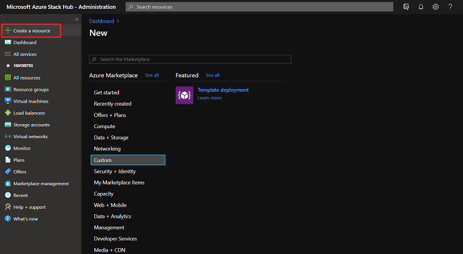

# Azure Stack Marketplace overview

*Applies to: Azure Stack integrated systems and Azure Stack Development Kit*

Azure Stack Marketplace is a collection of services, apps, and resources customized for Azure Stack. Resources include networks, virtual machines (VMs), storage, and more. Use Azure Stack Marketplace to create new resources and deploy new apps or browse and choose the items you want to use. To use a marketplace item, users must subscribe to an offer that grants them access to the item.

As an Azure Stack operator, you decide which items to add (publish) to Azure Stack Marketplace. You can publish items such as databases, app services, and more. Publishing makes items visible to all your users. You can publish custom items that you create, or you can publish items from a growing [list of Azure Marketplace items](azure-stack-marketplace-azure-items.md). When you publish an item to Azure Stack Marketplace, users can see it within five minutes.

> [!CAUTION]  
> All gallery item artifacts, including images and JSON files, are accessible without authentication after making them available in Azure Stack Marketplace. For more considerations when publishing custom marketplace items, see [Create and publish a Marketplace item](azure-stack-create-and-publish-marketplace-item.md).

To open the Marketplace, in the administrator portal select **+ Create a resource**.

## Marketplace items

An Azure Stack Marketplace item is a service, app, or resource that your users can download and use. All Azure Stack Marketplace items are visible to all your users, including administrative items such as plans and offers. These administrative items don't require a subscription to view, but are non-functional to users.

Every marketplace item has:

* An Azure Resource Manager template for resource provisioning.
* Metadata, such as strings, icons, and other marketing collateral.
* Formatting information to display the item in the portal.

Every item published to Azure Stack Marketplace uses the Azure Gallery Package (.azpkg) format. Add deployment or runtime resources (code, .zip files with software, or VM images) to Azure Stack separately, not as part of the marketplace item.

With version 1803 and later, Azure Stack converts images to sparse files when they download from Azure or when you upload custom images. This process adds time when adding an image, but saves space and speeds up the deployment of those images. Conversion only applies to new images. Existing images aren't changed.

## Next steps

* [Download existing marketplace items from Azure and publish to Azure Stack](azure-stack-download-azure-marketplace-item.md)  
* [Create and publish a custom Azure Stack Marketplace item](azure-stack-create-and-publish-marketplace-item.md)
