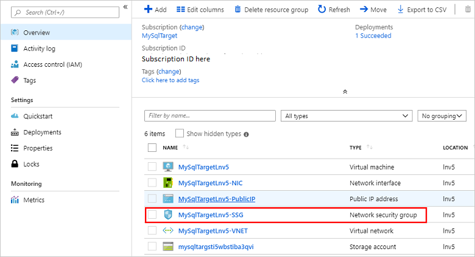
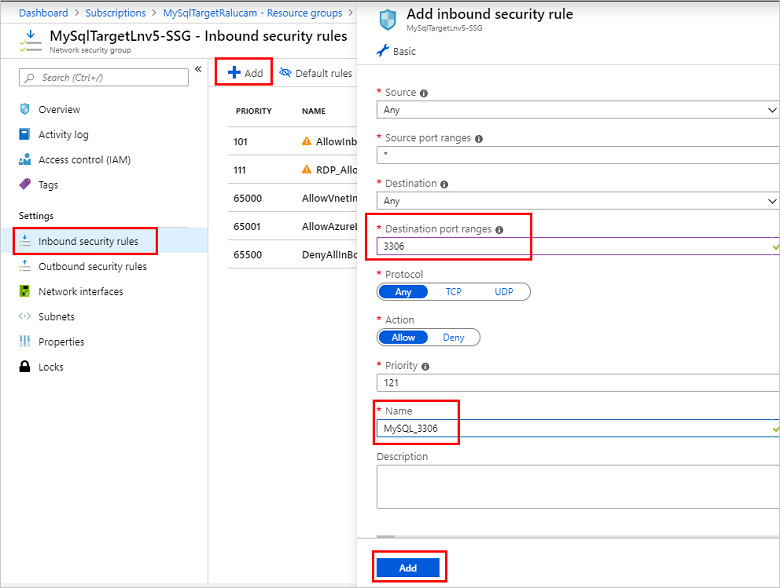

# Add MySQL hosting servers in Azure Stack Hub

You can host a MySQL hosting server instance on a virtual machine (VM) in [Azure Stack Hub](azure-stack-overview.md), or on a VM outside your Azure Stack Hub environment, as long as the MySQL resource provider can connect to the instance.

> [!NOTE]
> The MySQL resource provider should be created in the default provider subscription while MySQL hosting servers should be created in billable, user subscriptions. The resource provider server shouldn't be used to host user databases.

MySQL versions 5.6, 5.7 and 8.0 may be used for your hosting servers. The MySQL RP doesn't support caching_sha2_password authentication. MySQL 8.0 servers must be configured to use mysql_native_password.

## Prepare a MySQL hosting server

### Create a network security group rule

By default, no public access is configured for MySQL into the host VM. For the Azure Stack Hub MySQL resource provider to connect and manage the MySQL server, an inbound network security group (NSG) rule needs to be created.

1. In the administrator portal, go to the resource group created when deploying the MySQL server and select the network security group (**default-subnet-sg**):

   

2. Select **Inbound security rules** and then select **Add**.

    Enter **3306** in the **Destination port range** and optionally provide a description in the **Name** and **Description** fields.

   

3. Select **Add** to close the inbound security rule dialog.

### Configure external access to the MySQL hosting server

Before the MySQL server can be added as an Azure Stack Hub MySQL Server host, external access must be enabled. Take Bitnami MySQL, which is available in Azure Stack Hub marketplace as an example, you can take the following steps to configure the external access.

1. Using an SSH client (this example uses [PuTTY](https://www.chiark.greenend.org.uk/~sgtatham/putty/latest.html)) log in to the MySQL server from a computer that can access the public IP.

    Use the public IP and log in to the VM with the username and the application password you created earlier without special characters.

   

2. In the SSH client window, use the following command to ensure the bitnami service is active and running. Provide the bitnami password again when prompted:

   `sudo service bitnami status`

   

3. If the MySQL hosting server is version 8.0 or above, you need to change the authentication method to **mysql_native_password**. If the MySQL version is below 8.0, this step can be skipped.

   Take Bitnami MySQL as example, the configuration file is under **/opt/bitnami/mysql/conf/my.cnf**. Set the property **default_authentication_plugin** with value **mysql_native_password**.
   ```
   [mysqld]
   default_authentication_plugin=mysql_native_password
   ```
   Restart the bitnami service and make sure the bitnami service is running properly.
   ```console
   sudo service bitnami restart
   sudo service bitnami status
   ```

4. Create a remote access user account to be used by the Azure Stack Hub MySQL Hosting Server to connect to MySQL.

    Run the following commands to log in to MySQL as root, using the root password which is recorded in *~/bitnami_credentials*. Create a new admin user and replace *\<username\>* and *\<password\>* as required for your environment. In this example, the created user is named **sqlsa** and a strong password is used:

   ```sql
   mysql -u root -p
   create user <username>@'%' identified by '<password>';
   grant all privileges on *.* to <username>@'%' with grant option;
   flush privileges;
   ```

   

5. Make sure the plugin of the created sql user **sqlsa** is **mysql_native_password** and then exit the SSH client.
   
   ```sql
   SELECT user,host,plugin from mysql.user;
   ```
6. Record the new MySQL user information.

   This username and password will be used while Azure Stack Hub operator creates a MySQL hosting server using this MySQL server.


## Connect to a MySQL hosting server

Make sure you have the credentials for an account with system admin privileges.

> [!NOTE]
> For MySQL 8.0 and above versions, the remote access isn't enabled by default. You need to create a new user account and grant the privilege of remote access to this user account before adding it as a hosting server.

To add a hosting server, follow these steps:

1. Sign in to the Azure Stack Hub administrator portal as a service admin.
2. Select **All services**.
3. Under the  **ADMINISTRATIVE RESOURCES** category, select **MySQL Hosting Servers** > **+Add**. The **Add a MySQL Hosting Server** dialog will open, shown in the following screen capture.

   

4. Provide the connection details of your MySQL Server instance.

   * For **MySQL Hosting Server Name**, provide the fully qualified domain name (FQDN) or a valid IPv4 address. Don't use the short VM name.
   * The default admin **Username** for the Bitnami MySQL images available in Azure Stack Hub Marketplace is *root*.
   * If you don't know the root **Password**, see the [Bitnami documentation](https://docs.bitnami.com/azure/faq/#how-to-find-application-credentials) to learn how to get it.
   * A default MySQL instance isn't provided, so you have to specify the **Size of Hosting Server in GB**. Enter a size that's close to the capacity of the database server.
   * Keep the default setting for **Subscription**.
   * For **Resource group**, create a new one, or use an existing group.

   > [!IMPORTANT]
   > Do not choose **Resource group** `system.<region>.sqladapter`, which was created by the MySQL resource provider installer during deployment. You must provide a different resource group for the hosting server.    

   > [!NOTE]
   > If the MySQL instance can be accessed by the tenant and the admin Azure Resource Manager, you can put it under the control of the resource provider. But, the MySQL instance **must** be allocated exclusively to the resource provider.

5. Select **SKUs** to open the **Create SKU** dialog.

   

   The SKU **Name** should reflect the properties of the SKU so users can deploy their databases to the appropriate SKU.

6. Select **OK** to create the SKU.
   > [!NOTE]
   > SKUs can take up to an hour to be visible in the portal. You can't create a database until the SKU is deployed and running.

7. Under **Add a MySQL Hosting Server**, select **Create**.

As you add servers, assign them to a new or existing SKU to differentiate service offerings. For example, you can have a MySQL enterprise instance that provides increased database and automatic backups. You can reserve this high-performance server for different departments in your organization.

## Security considerations for MySQL

The following information applies to the RP and MySQL hosting servers:

* Ensure that all hosting servers are configured for communication using TLS 1.1. See [Configuring MySQL to Use Encrypted Connections](https://dev.mysql.com/doc/refman/5.7/en/using-encrypted-connections.html).
* Employ [Transparent Data Encryption](https://dev.mysql.com/doc/mysql-secure-deployment-guide/5.7/en/secure-deployment-data-encryption.html).
* The MySQL RP doesn't support caching_sha2_password authentication.

## Increase backend database capacity

You can increase backend database capacity by deploying more MySQL servers in the Azure Stack Hub portal. Add these servers to a new or existing SKU. If you add a server to an existing SKU, make sure the server characteristics are the same as the other servers in the SKU.

## SKU notes
Use a SKU name that describes the capabilities of the servers in the SKU, such as capacity and performance. The name serves as an aid to help users deploy their databases to the appropriate SKU. For example, you can use SKU names to differentiate service offerings by the following characteristics:
  
* high capacity
* high performance
* high availability

As a best practice, all the hosting servers in a SKU should have the same resource and performance characteristics.

SKUs cannot be hidden from certain tenants, nor can it be dedicated to certain tenants.

To edit a SKU, go to **All services** > **MySQL Adapter** > **SKUs**. Select the SKU to modify, make any necessary changes, and click **Save** to save changes. 

To delete a SKU that's no longer needed, go to **All services** > **MySQL Adapter** > **SKUs**. Right-click the SKU name and select **Delete** to delete it.

> [!IMPORTANT]
> It can take up to an hour for new SKUs to be available in the user portal.

## Make MySQL database servers available to your users

Create plans and offers to make MySQL database servers available to users. Add the Microsoft.MySqlAdapter service to the plan and create a new quota. MySQL doesn't allow limiting the size of databases.

> [!IMPORTANT]
> It can take up to two hours for new quotas to be available in the user portal or before a changed quota is enforced.

## Next steps

[Create a MySQL database](azure-stack-mysql-resource-provider-databases.md)
