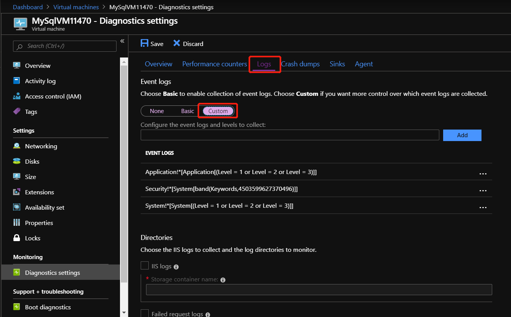
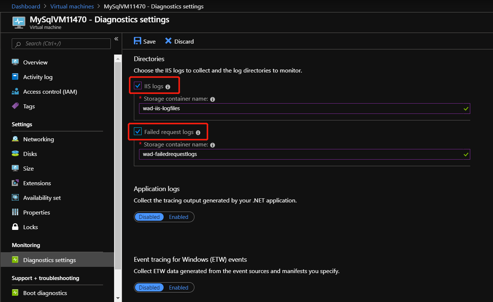

# MySQL resource provider maintenance operations in Azure Stack Hub

The MySQL resource provider runs on a locked down virtual machine (VM). To enable maintenance operations, you need to update the VM's security. To do this using the principle of least privilege (POLP), you can use PowerShell Just Enough Administration (JEA) endpoint DBAdapterMaintenance. The resource provider installation package includes a script for this operation.

## Update the VM operating system

Because the resource provider runs on a *user* VM, you need to apply the required patches and updates when they're released. You can use the Windows update packages that are provided as part of the patch-and-update cycle to apply updates to the VM.

Update the provider VM using one of the following methods:

- Install the latest resource provider package using a currently patched Windows Server 2016 Core image.
- Install a Windows Update package during the installation or update of the resource provider.

## Update the VM Windows Defender definitions

To update the Defender definitions, follow these steps:

1. Download the Windows Defender definitions update from [Windows Defender Definition](https://www.microsoft.com/en-us/wdsi/definitions).

    On the definitions page, scroll down to "Manually download and install the definitions". Download the "Windows Defender Antivirus for Windows 10 and Windows 8.1" 64-bit file.

    Alternatively, use [this direct link](https://go.microsoft.com/fwlink/?LinkID=121721&arch=x64) to download/run the fpam-fe.exe file.

2. Open a PowerShell session to the MySQL resource provider adapter VM's maintenance endpoint.

3. Copy the definitions update file to the resource provider adapter VM using the maintenance endpoint session.

4. On the maintenance PowerShell session, run the _Update-DBAdapterWindowsDefenderDefinitions_ command.

5. After you install the definitions, we recommend that you delete the definitions update file by using the _Remove-ItemOnUserDrive)_ command.

**PowerShell script example for updating definitions.**

You can edit and run the following script to update the Defender definitions. Replace values in the script with values from your environment.

```powershell
# Set credentials for the local admin on the resource provider VM.
$vmLocalAdminPass = ConvertTo-SecureString "<local admin user password>" -AsPlainText -Force
$vmLocalAdminUser = "<local admin user name>"
$vmLocalAdminCreds = New-Object System.Management.Automation.PSCredential `
    ($vmLocalAdminUser, $vmLocalAdminPass)

# Provide the public IP address for the adapter VM.
$databaseRPMachine  = "<RP VM IP address>"
$localPathToDefenderUpdate = "C:\DefenderUpdates\mpam-fe.exe"

# Download Windows Defender update definitions file from https://www.microsoft.com/en-us/wdsi/definitions.  
Invoke-WebRequest -Uri 'https://go.microsoft.com/fwlink/?LinkID=121721&arch=x64' `
    -Outfile $localPathToDefenderUpdate  

# Create a session to the maintenance endpoint.
$session = New-PSSession -ComputerName $databaseRPMachine `
    -Credential $vmLocalAdminCreds -ConfigurationName DBAdapterMaintenance

# Copy the defender update file to the adapter VM.
Copy-Item -ToSession $session -Path $localPathToDefenderUpdate `
     -Destination "User:\"

# Install the update definitions.
Invoke-Command -Session $session -ScriptBlock `
    {Update-AzSDBAdapterWindowsDefenderDefinition -DefinitionsUpdatePackageFile "User:\mpam-fe.exe"}

# Cleanup the definitions package file and session.
Invoke-Command -Session $session -ScriptBlock `
    {Remove-AzSItemOnUserDrive -ItemPath "User:\mpam-fe.exe"}
$session | Remove-PSSession

```

## Secrets rotation

*These instructions only apply to Azure Stack Hub Integrated Systems.*

When using the SQL and MySQL resource providers with Azure Stack Hub integrated systems, the Azure Stack Hub operator is responsible for rotating the following resource provider infrastructure secrets to ensure that they don't expire:

- External SSL Certificate [provided during deployment](azure-stack-pki-certs.md).
- The resource provider VM local administrator account password provided during deployment.
- Resource provider diagnostic user (dbadapterdiag) password.

### PowerShell examples for rotating secrets

**Change all the secrets at the same time:**

```powershell
.\SecretRotationMySQLProvider.ps1 `
    -Privilegedendpoint $Privilegedendpoint `
    -CloudAdminCredential $cloudCreds `
    -AzCredential $adminCreds `
    -DiagnosticsUserPassword $passwd `
    -DependencyFilesLocalPath $certPath `
    -DefaultSSLCertificatePassword $certPasswd `  
    -VMLocalCredential $localCreds

```

**Change the diagnostic user password:**

```powershell
.\SecretRotationMySQLProvider.ps1 `
    -Privilegedendpoint $Privilegedendpoint `
    -CloudAdminCredential $cloudCreds `
    -AzCredential $adminCreds `
    -DiagnosticsUserPassword  $passwd

```

**Change the VM local admin account password:**

```powershell
.\SecretRotationMySQLProvider.ps1 `
    -Privilegedendpoint $Privilegedendpoint `
    -CloudAdminCredential $cloudCreds `
    -AzCredential $adminCreds `
    -VMLocalCredential $localCreds

```

**Change the SSL certificate password:**

```powershell
.\SecretRotationMySQLProvider.ps1 `
    -Privilegedendpoint $Privilegedendpoint `
    -CloudAdminCredential $cloudCreds `
    -AzCredential $adminCreds `
    -DependencyFilesLocalPath $certPath `
    -DefaultSSLCertificatePassword $certPasswd

```

### SecretRotationMySQLProvider.ps1 parameters

|Parameter|Description|
|-----|-----|
|AzCredential|Azure Stack Hub service admin account credential.|
|CloudAdminCredential|Azure Stack Hub cloud admin domain account credential.|
|PrivilegedEndpoint|Privileged Endpoint to access Get-AzureStackStampInformation.|
|DiagnosticsUserPassword|Diagnostics user account password.|
|VMLocalCredential|The local admin account on the MySQLAdapter VM.|
|DefaultSSLCertificatePassword|Default SSL Certificate (*pfx) password.|
|DependencyFilesLocalPath|Dependency files local path.|
|     |     |

### Known issues

**Issue:**<br>
The logs for secrets rotation aren't automatically collected if the secret rotation script fails when it's run.

**Workaround:**<br>
Use the Get-AzsDBAdapterLogs cmdlet to collect all the resource provider logs, including AzureStack.DatabaseAdapter.SecretRotation.ps1_*.log, saved in C:\Logs.

## Collect diagnostic logs

To collect logs from the locked down VM, use the PowerShell Just Enough Administration (JEA) endpoint DBAdapterDiagnostics. This endpoint provides the following commands:

- **Get-AzsDBAdapterLog**. This command creates a zip package of the resource provider diagnostics logs and saves the file on the session's user drive. You can run this command without any parameters and the last four hours of logs are collected.

- **Remove-AzsDBAdapterLog**. This command removes existing log packages on the resource provider VM.

### Endpoint requirements and process

When a resource provider is installed or updated, the dbadapterdiag user account is created. You'll use this account to collect diagnostic logs.

>[!NOTE]
>The dbadapterdiag account password is the same as the password used for the local admin on the VM that's created during a provider deployment or update.

To use the _DBAdapterDiagnostics_ commands, create a remote PowerShell session to the resource provider VM and run the **Get-AzsDBAdapterLog** command.

You set the time span for log collection by using the **FromDate** and **ToDate** parameters. If you don't specify one or both of these parameters, the following defaults are used:

* FromDate is four hours before the current time.
* ToDate is the current time.

**PowerShell script example for collecting logs:**

The following script shows how to collect diagnostic logs from the resource provider VM.

```powershell
# Create a new diagnostics endpoint session.
$databaseRPMachineIP = '<RP VM IP address>'
$diagnosticsUserName = 'dbadapterdiag'
$diagnosticsUserPassword = '<Enter Diagnostic password>'
$diagCreds = New-Object System.Management.Automation.PSCredential `
        ($diagnosticsUserName, (ConvertTo-SecureString -String $diagnosticsUserPassword -AsPlainText -Force))
$session = New-PSSession -ComputerName $databaseRPMachineIP -Credential $diagCreds
        -ConfigurationName DBAdapterDiagnostics

# Sample that captures logs from the previous hour.
$fromDate = (Get-Date).AddHours(-1)
$dateNow = Get-Date
$sb = {param($d1,$d2) Get-AzSDBAdapterLog -FromDate $d1 -ToDate $d2}
$logs = Invoke-Command -Session $session -ScriptBlock $sb -ArgumentList $fromDate,$dateNow

# Copy the logs to the user drive.
$sourcePath = "User:\{0}" -f $logs
$destinationPackage = Join-Path -Path (Convert-Path '.') -ChildPath $logs
Copy-Item -FromSession $session -Path $sourcePath -Destination $destinationPackage

# Cleanup the logs.
$cleanup = Invoke-Command -Session $session -ScriptBlock {Remove-AzsDBAdapterLog}
# Close the session.
$session | Remove-PSSession

```

## Configure Azure Diagnostics extension for MySQL resource provider

The Azure Diagnostics extension is installed on the MySQL resource provider adapter VM by default. The following steps show how to customize the extension for gathering the MySQL resource provider operational event logs and IIS logs for troubleshooting and auditing purposes.

1. Sign in to the Azure Stack Hub administrator portal.

2. Select **Virtual machines** from the pane on the left, search for the MySQL resource provider adapter VM and select the VM.

3. In the **Diagnostics settings** of the VM, go to the **Logs** tab and choose **Custom** to customize event logs being collected.
   
   

4. Add **Microsoft-AzureStack-DatabaseAdapter/Operational!\*** to collect MySQL resource provider operational event logs.

   

5. To enable the collection of IIS logs, check **IIS logs** and **Failed request logs**.

   

6. Finally, select **Save** to save all the diagnostics settings.

Once the event logs and IIS logs collection are configured for MySQL resource provider, the logs can be found in a system storage account named **mysqladapterdiagaccount**.

To learn more about the Azure Diagnostics extension, see [What is Azure Diagnostics extension](/azure-monitor/platform/diagnostics-extension-overview).

## Next steps

[Remove the MySQL resource provider](azure-stack-mysql-resource-provider-remove.md)
