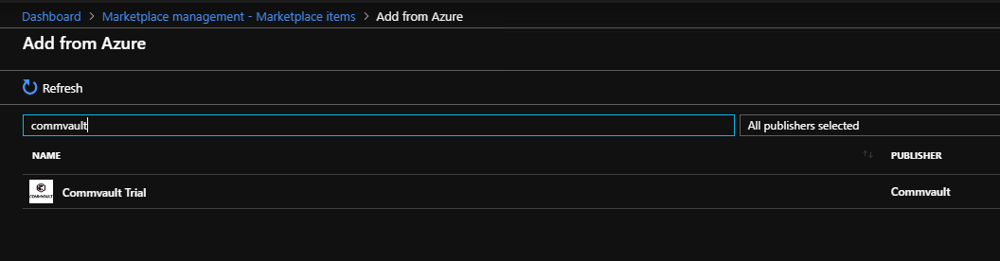

# Add Commvault to Azure Stack Hub Marketplace

This article walks through offering Commvault Live Sync to update a recovery virtual machine (VM) located on a separate Azure Stack Hub scale unit. You can download and offer Commvault as a backup and replication solution for your users.

## Notes for Commvault

- Your user needs to install the backup and replication software on a VM in their source Azure Stack Hub subscription. Azure Site Recovery and Azure Backup can offer an off-Stack location to store your backups and recovery images. They both require the creation of a Recovery Services Vault in Azure before downloading the software images to be installed on your Azure Stack Hub from the following locations: [Azure Backup Server](https://go.microsoft.com/fwLink/?LinkId=626082&clcid=0x0409) and [Azure Site Recovery](https://aka.ms/unifiedinstaller_eus).  
    
- You may need licenses for third party software (if chosen).
- Your users may need assistance in connecting their source and target through a VPN gateway or public IP on the backup and replication host.
- Target Azure Cloud subscription or a subscription on a recovery target Azure Stack Hub.
- Target resource group and blob storage account on a recovery target Azure Stack Hub.
- Some solutions require that you create VMs in the target subscription that need to run 24x7x365 in order to receive changes from the source server. In the [Back up your VM on Azure Stack Hub with Commvault](../user/azure-stack-network-howto-backup-commvault.md), Commvault Live Sync creates the target recovery VMs during initial configuration and keeps them idle (not running, not billable) until changes need to be applied during a replication cycle.

## Get Commvault for your marketplace

1. Open the Azure Stack Hub administrator portal.
2. Select **Marketplace management** > **Add from Azure**.

    

3. Enter `commvault`.
4. Select **Commvault Trial**. And then select **Download**.

## Next steps

- [Back up your VM on Azure Stack Hub with Commvault](../user/azure-stack-network-howto-backup-commvault.md)
- [Overview of offering services in Azure Stack Hub](service-plan-offer-subscription-overview.md)
