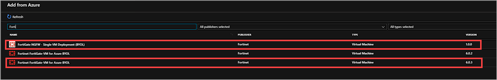

# Offer a network solution in Azure Stack with Fortinet Fortigate

You can add FortiGate Next-Generation Firewall to your Azure Stack Marketplace. FortiGate enables your users to create network solutions such as virtual private network (VPN) to Azure Stack and VNET peering. A network virtual appliance (NVA) controls the flow of network traffic from a perimeter network to other networks or subnets. 

For more information about Fortigate in the Azure Marketplace, see [Fortinet Fortigate Next-Generation Firewall Single VM Solution](https://azuremarketplace.microsoft.com/en-us/marketplace/apps/fortinet.fortinet-fortigate-singlevm).

## Download the Required Azure Stack Marketplace items

1.  Open the Azure Stack administrator portal.

2.  Select **Marketplace management** and select **Add from Azure**.

3. Type `Forti` in the search box, and double-click > select **Download** to get the latest available versions of the following items: 
    - Fortinet Fortigate-VM For Azure BYOL
    - FortiGate NGFW - Single VM Deployment (BYOL)

    

2.  Wait until your Marketplace items have a status of **Downloaded**. The items may take several minutes to download.

    

## Next steps

[Setup VPN for Azure Stack using Fortigate NVA](../user/azure-stack-network-howto-vnet-to-onprem.md)  
[How to connect two VNETs through peering](../user/azure-stack-network-howto-vnet-to-vnet.md)  
[How to establish a VNET to VNET connection with Fortinet Fortigate NVA](../user/azure-stack-network-howto-vnet-to-vnet-stacks.md)  
