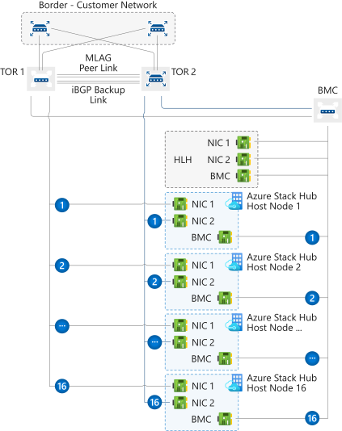
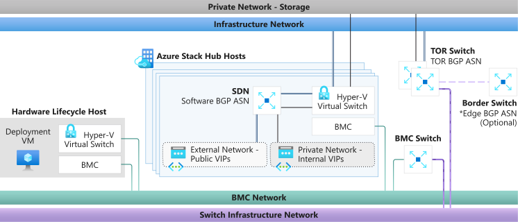

# Network integration planning for Azure Stack

This article provides Azure Stack network infrastructure information to help you decide how to best integrate Azure Stack into your existing networking environment. 

> [!NOTE]
> To resolve external DNS names from Azure Stack (for example, www\.bing.com), you need to provide DNS servers to forward DNS requests. For more information about Azure Stack DNS requirements, see [Azure Stack datacenter integration - DNS](azure-stack-integrate-dns.md).

## Physical network design

The Azure Stack solution requires a resilient and highly available physical infrastructure to support its operation and services. To integrate Azure Stack to the network it requires uplinks from the Top-of-Rack switches (ToR) to the nearest switch or router, which on this documentation is referred as Border. The ToRs can be uplinked to a single or a pair of Borders. The ToR is pre-configured by our automation tool, it expects a minimum of one connection between ToR and Border when using BGP Routing and a minimum of two connections (one per ToR) between ToR and Border when using Static Routing, with a maximum of four connections on either routing options. These connections are limited to SFP+ or SFP28 media and a minimum of one GB speed. Please check with your original equipment manufacturer (OEM) hardware vendor for availability. The following diagram presents the recommended design:

### Bandwidth Allocation

Azure Stack Hub is built using Windows Server 2019 Failover Cluster and Spaces Direct technologies. A portion of the Azure Stack Hub physical network configuration is done to utilize traffic separation and bandwidth guarantees to ensure that the Spaces Direct storage communications can meet the performance and scale required of the solution. The network configuration uses traffic classes to separate the Spaces Direct, RDMA-based communications from that of the network utilization by the Azure Stack Hub infrastructure and/or tenant. To align to the current best practices defined for Windows Server 2019, Azure Stack Hub is changing to use an additional traffic class or priority to further separate server to server communication in support of the Failover Clustering control communication. This new traffic class definition will be configured to reserve 2% of the available, physical bandwidth. This traffic class and bandwidth reservation configuration is accomplished by a change on the top-of-rack (ToR) switches of the Azure Stack Hub solution and on the host or servers of Azure Stack Hub. Note that changes are not required on the customer border network devices. These changes provide better resiliency for Failover Cluster communication and are meant to avoid situations where network bandwidth is fully consumed and as a result Failover Cluster control messages are disrupted. Note that the Failover Cluster communication is a critical component of the Azure Stack Hub infrastructure and if disrupted for long periods, can lead to instability in the Spaces Direct storage services or other services that will eventually impact tenant or end-user workload stability.

> [!NOTE]
> The described changes are added at the host level of an Azure Stack Hub system in the 2008 release. Please contact your OEM to arrange making the required changes at the ToR network switches. This ToR change can be performed either prior to updating to the 2008 release or after updating to 2008. The configuration change to the ToR switches is required to improve the Failover Cluster communications.

## Logical Networks

Logical networks represent an abstraction of the underlying physical network infrastructure. They're used to organize and simplify network assignments for hosts, virtual machines (VMs), and services. As part of logical network creation, network sites are created to define the virtual local area networks (VLANs), IP subnets, and IP subnet/VLAN pairs that are associated with the logical network in each physical location.

The following table shows the logical networks and associated IPv4 subnet ranges that you must plan for:

| Logical Network | Description | Size | 
| -------- | ------------- | ------------ | 
| Public VIP | Azure Stack uses a total of 31 addresses from this network. Eight public IP addresses are used for a small set of Azure Stack services and the rest are used by tenant VMs. If you plan to use App Service and the SQL resource providers, 7 more addresses are used. The remaining 15 IPs are reserved for future Azure services. | /26 (62 hosts) - /22 (1022 hosts)  Recommended = /24 (254 hosts) | 
| Switch infrastructure | Point-to-point IP addresses for routing purposes, dedicated switch management interfaces, and loopback addresses assigned to the switch. | /26 | 
| Infrastructure | Used for Azure Stack internal components to communicate. | /24 |
| Private | Used for the storage network, private VIPs, Infrastructure containers and other internal functions. Starting in 1910, the size for this subnet is changing to /20, for more details reference the [Private network](#private-network) section in this article. | /20 | 
| BMC | Used to communicate with the BMCs on the physical hosts. | /26 | 
| | | |

> [!NOTE]
> When the system is updated to 1910 version, an alert on the portal will remind the operator to run the new PEP cmdlet **Set-AzsPrivateNetwork** to add a new /20 Private IP space. Please see the [1910 release notes](release-notes.md) for instructions on running the cmdlet. For more information and guidance on selecting the /20 private IP space, please see the [Private network](#private-network) section in this article.

## Network infrastructure

The network infrastructure for Azure Stack consists of several logical networks that are configured on the switches. The following diagram shows these logical networks and how they integrate with the top-of-rack (TOR), baseboard management controller (BMC), and border (customer network) switches.

### BMC network

This network is dedicated to connecting all the baseboard management controllers (also known as BMC or service processors) to the management network. Examples include: iDRAC, iLO, iBMC, and so on. Only one BMC account is used to communicate with any BMC node. If present, the Hardware Lifecycle Host (HLH) is located on this network and may provide OEM-specific software for hardware maintenance or monitoring.

The HLH also hosts the Deployment VM (DVM). The DVM is used during Azure Stack deployment and is removed when deployment completes. The DVM requires internet access in connected deployment scenarios to test, validate, and access multiple components. These components can be inside and outside of your corporate network (for example: NTP, DNS, and Azure). For more information about connectivity requirements, see the [NAT section in Azure Stack firewall integration](azure-stack-firewall.md#network-address-translation).

### Private network

This /20 (4096 IPs) network is private to the Azure Stack region (doesn't route beyond the border switch devices of the Azure Stack system) and is divided into multiple subnets, here are some examples:

- **Storage network**: A /25 (128 IPs) network used to support the use of Spaces Direct and Server Message Block (SMB) storage traffic and VM live migration.
- **Internal virtual IP network**: A /25 network dedicated to internal-only VIPs for the software load balancer.
- **Container network**: A /23 (512 IPs) network dedicated to internal-only traffic between containers running infrastructure services.

Starting with the 1910 release, the Azure Stack Hub system **requires** an additional /20 private internal IP space. This network will be private to the Azure Stack system (doesn't route beyond the border switch devices of the Azure Stack system) and can be reused on multiple Azure Stack systems within your datacenter. While the network is private to Azure Stack, it must not overlap with other networks in the datacenter. The /20 private IP space is divided into multiple networks that enable running the Azure Stack Hub infrastructure on containers (as previously mentioned in the [1905 release notes](release-notes.md?view=azs-1905)). In addition, this new Private IP space enables ongoing efforts to reduce the required routable IP space prior to deployment. The goal of running the Azure Stack Hub infrastructure in containers is to optimize utilization and enhance performance. In addition, the /20 private IP space is also used to enable ongoing efforts that will reduce required routable IP space before deployment. For guidance on Private IP space, we recommend following  [RFC 1918](https://tools.ietf.org/html/rfc1918).

For systems deployed before 1910, this /20 subnet will be an additional network to be entered into systems after updating to 1910. The additional network will need to be provided to the system through the **Set-AzsPrivateNetwork** PEP cmdlet.

> [!NOTE]
> The /20 input serves as a prerequisite to the next Azure Stack Hub update after 1910. When the next Azure Stack Hub update after 1910 releases and you attempt to install it, the update will fail if you haven't completed the /20 input as described in the remediation steps as follows. An alert will be present in the administrator portal until the above remediation steps have been completed. See the [Datacenter network integration](azure-stack-network.md#private-network) article to understand how this new private space will be consumed.

**Remediation steps**: To remediate, follow the instructions to [open a PEP Session](azure-stack-privileged-endpoint.md#access-the-privileged-endpoint). Prepare a [private internal IP range](azure-stack-network.md#logical-networks) of size /20, and run the following cmdlet (only available starting with 1910) in the PEP session using the following example: `Set-AzsPrivateNetwork -UserSubnet 10.87.0.0/20`. If the operation is performed successfully, you'll receive the message **Azs Internal Network range added to the config**. If successfully completed, the alert will close in the administrator portal. The Azure Stack Hub system can now update to the next version.

### Azure Stack infrastructure network

This /24 network is dedicated to internal Azure Stack components so that they can communicate and exchange data among themselves. This subnet can be routable externally of the Azure Stack solution to your datacenter, we do not recommend using Public or Internet routable IP addresses on this subnet. This network is advertised to the Border but most of its IPs are protected by Access Control Lists (ACLs). The IPs allowed for access are within a small range equivalent in size to a /27 network and host services like the [privileged end point (PEP)](azure-stack-privileged-endpoint.md) and [Azure Stack Backup](azure-stack-backup-reference.md).

### Public VIP network

The Public VIP Network is assigned to the network controller in Azure Stack. It's not a logical network on the switch. The SLB uses the pool of addresses and assigns /32 networks for tenant workloads. On the switch routing table, these /32 IPs are advertised as an available route via BGP. This network contains the external-accessible or public IP addresses. The Azure Stack infrastructure reserves the first 31 addresses from this Public VIP Network while the remainder is used by tenant VMs. The network size on this subnet can range from a minimum of /26 (64 hosts) to a maximum of /22 (1022 hosts). We recommend that you plan for a /24 network.

### Switch infrastructure network

This /26 network is the subnet that contains the routable point-to-point IP /30 (two host IPs) subnets and the loopbacks, which are dedicated /32 subnets for in-band switch management and BGP router ID. This range of IP addresses must be routable outside the Azure Stack solution to your datacenter. They may be private or public IPs.

### Switch management network

This /29 (six host IPs) network is dedicated to connecting the management ports of the switches. It allows out-of-band access for deployment, management, and troubleshooting. It's calculated from the switch infrastructure network mentioned above.

## Permitted networks

Starting on 1910, the Deployment Worksheet will have this new field allowing the operator to change some access control list (ACL)s to allow access to network device management interfaces and the hardware lifecycle host (HLH) from a trusted datacenter network range. With the access control list change, the operator can allow their management jumpbox VMs within a specific network range to access the switch management interface, the HLH OS and the HLH BMC. The operator can provide one or multiple subnets to this list, if left blank it will default to deny access. This new functionality replaces the need for post-deployment manual intervention as it used to be described on the [Modify specific settings on your Azure Stack switch configuration](./azure-stack-customer-defined.md#access-control-list-updates).

## Next steps

Learn about network planning: [Border connectivity](azure-stack-border-connectivity.md).
