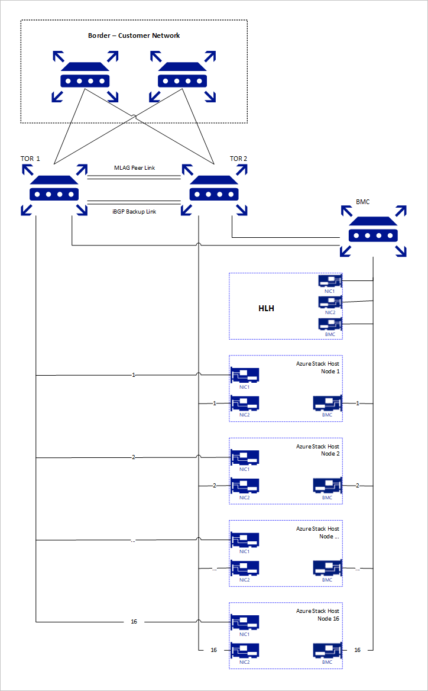
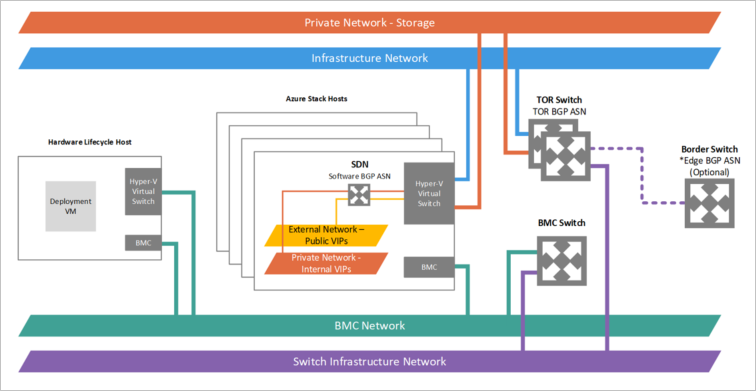

# Network integration planning for Azure Stack Hub

This article provides Azure Stack Hub network infrastructure information to help you decide how to best integrate Azure Stack Hub into your existing networking environment. 

> [!NOTE]
> To resolve external DNS names from Azure Stack Hub (for example, www\.bing.com), you need to provide DNS servers to forward DNS requests. For more information about Azure Stack Hub DNS requirements, see [Azure Stack Hub datacenter integration - DNS](azure-stack-integrate-dns.md).

## Physical network design

The Azure Stack Hub solution requires a resilient and highly available physical infrastructure to support its operation and services. Uplinks from ToR to Border switches are limited to SFP+ or SFP28 media and 1 GB, 10 GB, or 25-GB speeds. Check with your original equipment manufacturer (OEM) hardware vendor for availability. The following diagram presents our recommended design:

## Logical Networks

Logical networks represent an abstraction of the underlying physical network infrastructure. They're used to organize and simplify network assignments for hosts, virtual machines (VMs), and services. As part of logical network creation, network sites are created to define the virtual local area networks (VLANs), IP subnets, and IP subnet/VLAN pairs that are associated with the logical network in each physical location.

The following table shows the logical networks and associated IPv4 subnet ranges that you must plan for:

| Logical Network | Description | Size | 
| -------- | ------------- | ------------ | 
| Public VIP | Azure Stack Hub uses a total of 31 addresses from this network. Eight public IP addresses are used for a small set of Azure Stack Hub services and the rest are used by tenant VMs. If you plan to use App Service and the SQL resource providers, 7 more addresses are used. The remaining 15 IPs are reserved for future Azure services. | /26 (62 hosts) - /22 (1022 hosts)  Recommended = /24 (254 hosts) | 
| Switch infrastructure | Point-to-point IP addresses for routing purposes, dedicated switch management interfaces, and loopback addresses assigned to the switch. | /26 | 
| Infrastructure | Used for Azure Stack Hub internal components to communicate. | /24 |
| Private | Used for the storage network, private VIPs, infrastructure containers, and other internal functions. Starting in 1910, the size for this subnet is changing to /20. For more information, see the [Private network](#private-network) section in this article. | /20 | 
| BMC | Used to communicate with the BMCs on the physical hosts. | /26 | 
| | | |

> [!NOTE]
> When the system is updated to version 1910, an alert on the portal will remind the operator to run the new PEP cmdlet **Set-AzsPrivateNetwork** to add a new /20 private IP space. See the [1910 release notes](release-notes.md) for instructions on running the cmdlet. For more information and guidance on selecting the /20 private IP space, see the [Private network](#private-network) section in this article.

## Network infrastructure

The network infrastructure for Azure Stack Hub consists of several logical networks that are configured on the switches. The following diagram shows these logical networks and how they integrate with the top-of-rack (TOR), baseboard management controller (BMC), and border (customer network) switches.

### BMC network

This network is dedicated to connecting all the baseboard management controllers (also known as BMC or service processors) to the management network. Examples include: iDRAC, iLO, iBMC, and so on. Only one BMC account is used to communicate with any BMC node. If present, the Hardware Lifecycle Host (HLH) is located on this network and may provide OEM-specific software for hardware maintenance or monitoring.

The HLH also hosts the Deployment VM (DVM). The DVM is used during Azure Stack Hub deployment and is removed when deployment completes. The DVM requires internet access in connected deployment scenarios to test, validate, and access multiple components. These components can be inside and outside of your corporate network (for example: NTP, DNS, and Azure). For more information about connectivity requirements, see the [NAT section in Azure Stack Hub firewall integration](azure-stack-firewall.md#network-address-translation).

### Private network

This /20 (4096 IPs) network is private to the Azure Stack Hub region (doesn't route beyond the border switch devices of the Azure Stack Hub system) and is divided into multiple subnets, here are some examples:

- **Storage network**: A /25 (128 IPs) network used to support the use of Spaces Direct and Server Message Block (SMB) storage traffic and VM live migration.
- **Internal virtual IP network**: A /25 network dedicated to internal-only VIPs for the software load balancer.
- **Container network**: A /23 (512 IPs) network dedicated to internal-only traffic between containers running infrastructure services.

Starting in 1910, the size for the Private Network will change to a /20 (4096 IPs) of private IP space. This network will be private to the Azure Stack Hub system (doesn't route beyond the border switch devices of the Azure Stack Hub system) and can be reused on multiple Azure Stack Hub systems within your datacenter. While the network is private to Azure Stack Hub, it must not overlap with other networks in the datacenter. If overlap occurs, it is possible that Azure Stack Hub may not route corporate network traffic externally. For guidance on the private IP space, we recommend following the [RFC 1918](https://tools.ietf.org/html/rfc1918).

This /20 private IP space will be divided into multiple networks that will enable running the Azure Stack Hub system internal infrastructure on containers in future releases. For more information, see the [1910 release notes](release-notes.md). In addition, this new private IP space enables ongoing efforts to reduce the required routable IP space prior to deployment.

For systems deployed before 1910, this /20 subnet will be an additional network to be entered into systems after updating to 1910. The additional network will need to be provided to the system through the **Set-AzsPrivateNetwork** PEP cmdlet. For guidance on this cmdlet, see the [1910 release notes](release-notes.md).

### Azure Stack Hub infrastructure network

This /24 network is dedicated to internal Azure Stack Hub components so that they can communicate and exchange data among themselves. This subnet can be routable externally for the Azure Stack Hub solution to your datacenter. We do not recommend using public or internet routable IP addresses on this subnet. This network is advertised to the border, but most of its IPs are protected by Access Control Lists (ACLs). The IPs allowed for access are within a small range equivalent in size to a /27 network and host services such as the [privileged end point (PEP)](azure-stack-privileged-endpoint.md) and [Azure Stack Hub Backup](azure-stack-backup-reference.md).

### Public VIP network

The Public VIP Network is assigned to the network controller in Azure Stack Hub. It's not a logical network on the switch. The SLB uses the pool of addresses and assigns /32 networks for tenant workloads. On the switch routing table, these /32 IPs are advertised as an available route via BGP. This network contains the external-accessible or public IP addresses. The Azure Stack Hub infrastructure reserves the first 31 addresses from this Public VIP Network while the remainder is used by tenant VMs. The network size on this subnet can range from a minimum of /26 (64 hosts) to a maximum of /22 (1022 hosts). We recommend that you plan for a /24 network.

### Switch infrastructure network

This /26 network is the subnet that contains the routable point-to-point IP /30 (two host IPs) subnets and the loopbacks, which are dedicated /32 subnets for in-band switch management and BGP router ID. This range of IP addresses must be routable outside the Azure Stack Hub solution to your datacenter. They may be private or public IPs.

### Switch management network

This /29 (six host IPs) network is dedicated to connecting the management ports of the switches. It allows out-of-band access for deployment, management, and troubleshooting. It's calculated from the switch infrastructure network mentioned above.

## Permitted networks

Starting in 1910, the deployment worksheet will have a new field allowing the operator to change some access control lists (ACLs) to allow access to network device management interfaces and the hardware lifecycle host (HLH) from a trusted datacenter network range. With the access control list change, the operator can allow their management jumpbox VMs within a specific network range to access the switch management interface, the HLH OS and the HLH BMC. The operator can provide one or multiple subnets to this list, if left blank it will default to deny access. This new functionality replaces the need for post-deployment manual intervention as it used to be described on the [Modify specific settings on your Azure Stack Hub switch configuration](azure-stack-customer-defined.md#access-control-list-updates).

## Next steps

Learn about network planning: [Border connectivity](azure-stack-border-connectivity.md).
