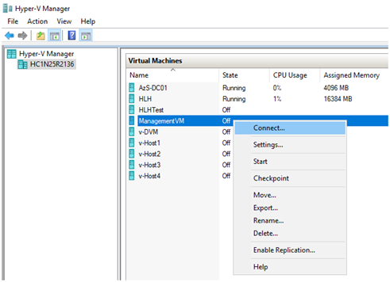
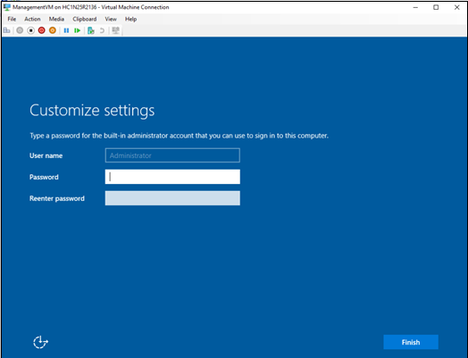

# Azure Stack Hub Operator Access Workstation (Preview Only)

The Operator Access Workstation (OAW.vhdx) is used to deploy a jump box virtual machine (VM) on the Hardware Lifecycle Host (HLH) so an Azure Stack Hub operator can access the privileged endpoint (PEP) and the Administrator portal for support scenarios. The HLH version must be 2005 or later. Beginning with the 2005, the image file is in public preview only and is not supported in production environments.  

The OAW VM should be created when an operator creates a new support task. After a required support task inside the VM is completed, the VM should be shut down and removed as support tasks do not require this VM to always run.  

Due to the stateless nature of the solution, there are no updates for the OAW VM. For each milestone, a new version of the VM image file will be released. Use the latest version to create a new OAW VM. The image file is based on the latest Windows Server 2019 version. After installation, you can apply updates, including any critical updates, using Windows Update. 

You can download the OAW VM for the preview here.

The following security enhancement configuration for the HLH is also applied to the OAW VM: 

1. MaximumPasswordAge = 42 days
2. Built-in Guest username: GUser (disabled by default) 
3. Built-in Administrator username: AdminUser

The following table lists the pre-installed software on the OAW VM.

| Software Name	           | Location                                                                                       |
|--------------------------|------------------------------------------------------------------------------------------------|
| [Microsoft Edge for Business](https://www.microsoft.com/edge/business/)                                            | Desktop                                                                                        |
| [Az Modules](https://docs.microsoft.com/azure-stack/operator/powershell-install-az-module)                         | \[SystemDrive\]\ProgramFiles\WindowsPowerShell\Modules                                         |  
| [Powershell 7](https://docs.microsoft.com/powershell/scripting/whats-new/what-s-new-in-powershell-70?view=powershell-7)| Launched from Start menu                                                                       |
| [Azure Command-Line Interface (CLI)](https://docs.microsoft.com/cli/azure/?view=azure-cli-latest) | Recommend using Microsoft Edge for Business as the default web browser to work with Azure CLI. |
| [Microsoft Azure Storage Explorer](https://azure.microsoft.com/features/storage-explorer/)   | Launched from Start menu                                                                       |
| [AzCopy](https://docs.microsoft.com/azure/storage/common/storage-use-azcopy-v10)                             | \[SystemDrive\]\VMSoftware\azcopy_windows_amd64_10.3.4                                         |
| [AzureStack-Tools](https://github.com/Azure/AzureStack-Tools/tree/az)                  | \[SystemDrive\]\VMSoftware\AzureStack-Tools                                                    |

## Check HLH version

1. Log onto the HLH with your credentials.
1. Open PowerShell ISE and run the following script:

   ```powershell
   'C:\Version\Get-Version.ps1'
   ```

   

## Create the OAW VM using a script   

1. On a machine with internet connectivity, download the OAW VM zip from here: TBD
1. Log onto the HLH with your credentials.
1. Open an elevated Powershell session.
1. Extract the zip file from Step 1 and open the New-VM.ps1 file inside the elevated Powershell session.
1. Modify the parameters following the guidance in the script.
1. Run the script.

    This script is part of Microsoft Azure Stack Hub and prepares the virtual machine as the Operator Access
    Workstation (OAW), which is uesd to access Microsoft Azure Stack Hub for administrative or diagostic activities.

 .Parameter LocalAdministratorPassword
    Password for the virtual machine's local administrator account AdminUser.
 .Parameter AzureStackCertificatePath
    Optional parameter; path of certificates to be imported to the virtual machine trusted root for Azure Stack Hub access.
    Won't take effect if -SkipNetworkConfiguration is set.
.Parameter ERCSVMIP
    Optional parameter; IP of Azure Stack Hub ERCS VM(s) to be added to trusted host list of the virtual machine.
    Won't take effect if -SkipNetworkConfiguration is set.
 .Parameter SkipNetworkConfiguration
    Optional parameter; use this flag to skip network configuration for the virtual machine, user can configure later.
 .Parameter UseDVMConfiguration
    Optional parameter; use this flag to apply Azure Stack Hub deployment virtual machine (dvm) network configuration.
 .Parameter DeploymentDataFilePath
    Optional parameter; path of DeploymentData.json.
    Won't take effect if -SkipNetworkConfiguration is set.
 .Parameter IPAddress
    The static IPv4 address to configure TCP/IP on the virtual machine.
 .Parameter SubnetMask
    The IPv4 subnet mask to configure TCP/IP on the virtual machine.
 .Parameter DefaultGateway
    IPv4 address of the default gateway to configure TCP/IP on the virtual machine.
 .Parameter DNS
    DNS server(s) to configure TCP/IP on the virtual machine.
 .Parameter VlanId
    Optional parameter; the VLAN ID that needs to be configured in HyperV for the virtual machine.
 .Parameter ImageFilePath
    Path of OAW.vhdx provided by Microsoft.
    Optional parameter; default value is OAW.vhdx under the same parent folder of this script.
 .Parameter VirtualMachineName
    The name to be assigned to the virtual machine.
    Optional parameter; default value is AzSOAW.
 .Parameter VirtualMachineMemory
    Memory to be assigned to the virtual machine.
    Optional parameter; default value is 4GB.
 .Parameter VirtualProcessorCount
    Number of virtual processors to be assigned to the virtual machine.
    Optional parameter; default value is 8.
 .Parameter VirtualMachineDiffDiskPath
    Path to store temporary diff disk files while the manageemnt VM was active.
    Optional parameter; default value is DiffDisks sub directory under the same parent folder of this script.
 .Parameter PhysicalAdapterMACAddress
    Optional parameter; the MAC address of the host's network adapter that will be used to connect the virtual machine to.
    If there is only one physical network adapter, this parameter is not needed and the only network adapter will be used.
    If there are more than one physical network adapters, this parameter is required to specify which one to use.
 .Parameter VirtualSwitchName
    Optional parameter; the name of virtual switch that needs to be configured in HyperV for the virtual machine.
    If there is VMSwitch with the provided name, such VMSwitch will be selected.
    If there is only one VMSwitch with switch type External, value 'DVMVirtualSwitch' can be used to select this VMSwitch without providing its name.
    If there is no VMSwitch with the provided name, a VMSwitch will be created with the provided name.
 .Parameter ReCreate
    Optional parameter; use this flag to remove and re-create the virtual machine if there is already an exsited virtual machine with the same name.

 .EXAMPLE

  Running at HLH without customization in version 2005 or later.
    $securePassword = Read-Host -Prompt "Enter password for Azure Stack OAW's local administrator" -AsSecureString
    New-OAW.ps1 -LocalAdministratorPassword $securePassword

  Running at HLH with DeploymentData.json.
    $securePassword = Read-Host -Prompt "Enter password for Azure Stack OAW's local administrator" -AsSecureString
    New-OAW.ps1 -LocalAdministratorPassword $securePassword `
        -DeploymentDataFilePath 'D:\AzureStack\DeploymentData.json'

  Running at a host with network connection to Azure Stack Hub.
    $securePassword = Read-Host -Prompt "Enter password for Azure Stack OAW's local administrator" -AsSecureString
    New-OAW.ps1 -LocalAdministratorPassword $securePassword `
        -IPAddress '192.168.0.20' `
        -SubnetMask '255.255.255.0' `
        -DefaultGateway '192.168.0.1' `
        -DNS '192.168.0.10' `


## Create the OAW VM manually

Please note that once the VM is created manually, the image file will be modified. Please re-download the VM image file when creating new instances of the VM. 

1. On a machine with internet connectivity, download the OAW VM zip from here: TBD
1. Copy the new .vhdx image over to the HLH host in a well-known location.
1. Log onto the HLH with your credentials.
1. On the HLH host, launch the Hyper-V Manager.
1. Ensure no VM is selected. In the Hyper-V Manager, click Action->New->Virtual Machine.
1. Complete the New Virtual Machine Wizard pages using the following table. 

   | Wizard page               | Values                                                     |
   |---------------------------|------------------------------------------------------------|
   | Specify Name and Location | Provide a name for the VM and location to store it         |
   | Specify Generation        | Choose **Generation 2** to support Secure Boot             |
   | Assign Memory             | Specify **4096** MB or greater                             |
   | Configure Networking      | Select a switch with access to the BMC management network  |
   | Connect Virtual Hard Disk | - Click **Use an existing virtual hard disk**<br>- Browse to where you saved ManagementVM.vhdx in step 2<br>- Click **Finish**<br> |

   

1. Right-click the new VM in Hyper-V Manager and click **Settings**.

   

1. If you have chosen a Generation 2 VM, click **Security** and then click **Enable Trusted Platform Module**.

   

1. Click **Processor** and assign 8 or more virtual processors, and then click **Apply** and **OK** to exit the settings.

   

1. Right-click the created VM in the Hyper-V Manager and click **Connect...**.    

   

1. Click **Start**.
1. Wait for the VM to start and provide a password with a minimum length of 14 characters for the built-in Administrator account (which will be renamed to AdminUser later). 

   

1. When the logon screen appears, sign in using use the password you provided previously for the built-in AdminUser. 
1. The VM is now ready to use.

   >[!TIP]
   >If you want to configure networking to be able to access BMC management network:
   >- In Hyper-V Manager, right-click the HLH VM and click **Settings**, click **Network Adapter** and change the configuration to the appropriate virtual switch.
   >- Navigate back to OAW VM.
   >- Click **Network & Internet Settings** and change the adapter.


## Remove the OAW VM

The following script removes the OAW VM, which is used to access Azure Stack Hub for administration and diagnostics. This script also removes the disk files and the guardian associated with the VM.

1. Log onto the HLH with your credentials.
1. Open an elevated PowerShell session. 
1. Navigate to the extracted contents of the installed OAW.zip file.
1. Remove the VM by running the Remove-OAW.ps1 script: 

   ```powershell
   Remove-OAW.ps1 -VirtualMachineName <name>
   ```

   Where \<name\> is the name of the virtual machine to be removed. By default, the name is **AzSOAW**.

   For example:

   ```powershell
   Remove-OAW.ps1 -VirtualMachineName <name>
   ```

