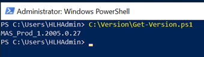
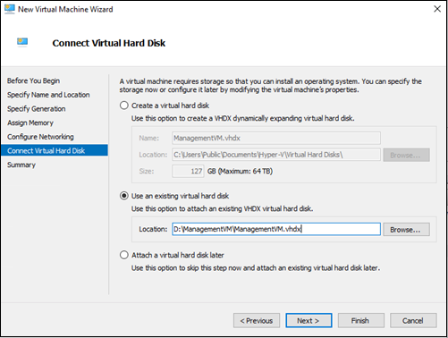
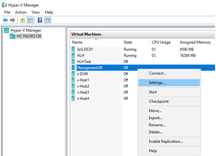
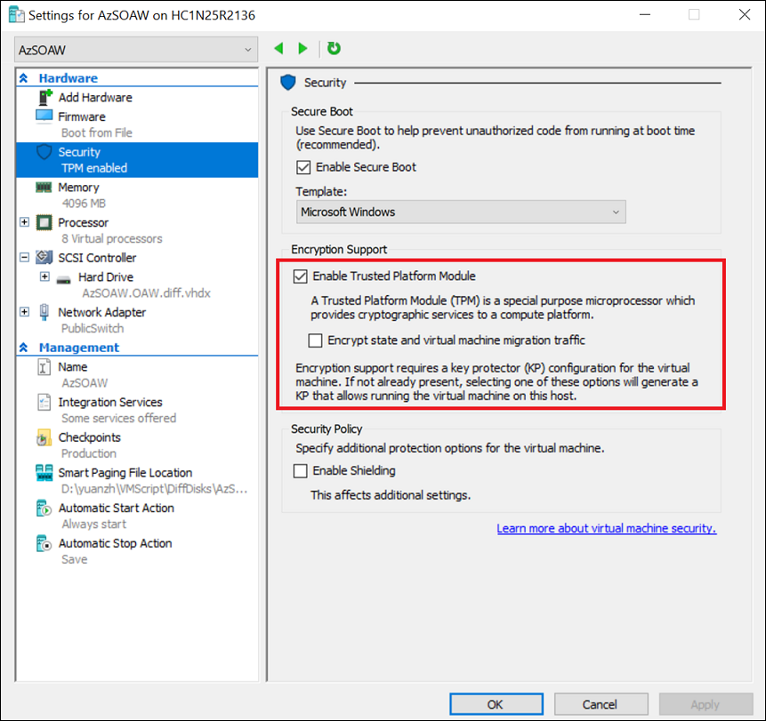
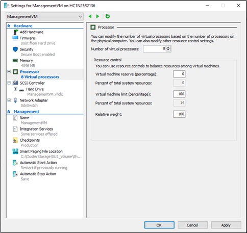

# Azure Stack Hub Operator Access Workstation (Preview Only)

The Operator Access Workstation (OAW.vhdx) is used to deploy a jump box virtual machine (VM) on the Hardware Lifecycle Host (HLH) so an Azure Stack Hub operator can access the privileged endpoint (PEP) and the Administrator portal for support scenarios. The HLH version must be 2005 or later. Beginning with the 2005, the image file is in public preview only and is not supported in production environments.  

The OAW VM should be created when an operator creates a new support task. After a required support task inside the VM is completed, the VM should be shut down and removed as support tasks do not require this VM to always run.  

Due to the stateless nature of the solution, there are no updates for the OAW VM. For each milestone, a new version of the VM image file will be released. Use the latest version to create a new OAW VM. The image file is based on the latest Windows Server 2019 version. After installation, you can apply updates, including any critical updates, using Windows Update. 

You can download the OAW VM for the preview here.

The following security enhancement configuration for the HLH is also applied to the OAW VM: 

1. MaximumPasswordAge = 42 days
2. Built-in Guest username: GUser (disabled by default) 
3. Built-in Administrator username: AdminUser

The following table lists the pre-installed software on the OAW VM.

| Software Name	           | Location                                                                                       |
|--------------------------|------------------------------------------------------------------------------------------------|
| [Microsoft Edge for Business](https://www.microsoft.com/edge/business/)                                            | Desktop                                                                                        |
| [Az Modules](https://docs.microsoft.com/azure-stack/operator/powershell-install-az-module)                         | \[SystemDrive\]\ProgramFiles\WindowsPowerShell\Modules                                         |  
| [Powershell 7](https://docs.microsoft.com/powershell/scripting/whats-new/what-s-new-in-powershell-70?view=powershell-7)| Launched from Start menu                                                                       |
| [Azure Command-Line Interface (CLI)](https://docs.microsoft.com/cli/azure/?view=azure-cli-latest) | Recommend using Microsoft Edge for Business as the default web browser to work with Azure CLI. |
| [Microsoft Azure Storage Explorer](https://azure.microsoft.com/features/storage-explorer/)   | Launched from Start menu                                                                       |
| [AzCopy](https://docs.microsoft.com/azure/storage/common/storage-use-azcopy-v10)                             | \[SystemDrive\]\VMSoftware\azcopy_windows_amd64_10.3.4                                         |
| [AzureStack-Tools](https://github.com/Azure/AzureStack-Tools/tree/az)                  | \[SystemDrive\]\VMSoftware\AzureStack-Tools                                                    |

## Check HLH version

1. Log onto the HLH with your credentials.
1. Open PowerShell ISE and run the following script:

   ```powershell
   'C:\Version\Get-Version.ps1'
   ```

   

## Create the OAW VM using a script   

1. On a machine with internet connectivity, download the OAW VM zip from here: TBD
1. Log onto the HLH with your credentials.
1. Open an elevated Powershell session.
1. Extract the zip file from Step 1 and open the New-VM.ps1 file inside the elevated Powershell session.
1. Modify the parameters following the guidance in the script.
1. Run the script.

## Create the OAW VM manually

Please note that once the VM is created manually, the image file will be modified. Please re-download the VM image file when creating new instances of the VM. 

1. On a machine with internet connectivity, download the OAW VM zip from here: TBD
1. Copy the new .vhdx image over to the HLH host in a well-known location.
1. Log onto the HLH with your credentials.
1. On the HLH host, launch the Hyper-V Manager.
1. Ensure no VM is selected. In the Hyper-V Manager, click Action->New->Virtual Machine.
1. Complete the New Virtual Machine Wizard pages using the following table. 

   | Wizard page               | Values                                                     |
   |---------------------------|------------------------------------------------------------|
   | Specify Name and Location | Provide a name for the VM and location to store it         |
   | Specify Generation        | Choose **Generation 2** to support Secure Boot             |
   | Assign Memory             | Specify **4096** MB or greater                             |
   | Configure Networking      | Select a switch with access to the BMC management network  |
   | Connect Virtual Hard Disk | - Click **Use an existing virtual hard disk**<br>- Browse to where you saved ManagementVM.vhdx in step 2<br>- Click **Finish**<br> |

   

1. Right-click the new VM in Hyper-V Manager and click **Settings**.

   

1. If you have chosen a Generation 2 VM, click **Security** and then click **Enable Trusted Platform Module**.

   

1. Click **Processor** and assign 8 or more virtual processors, and then click **Apply** and **OK** to exit the settings.

   

1.    