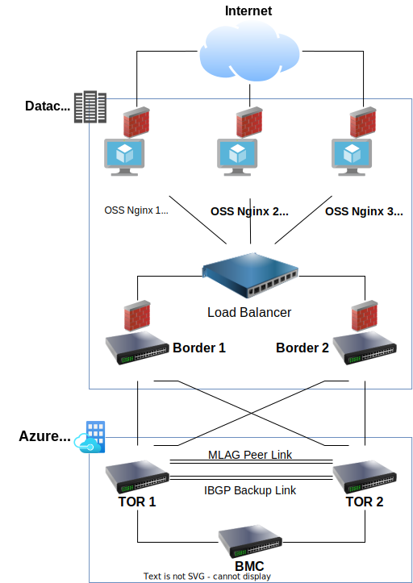
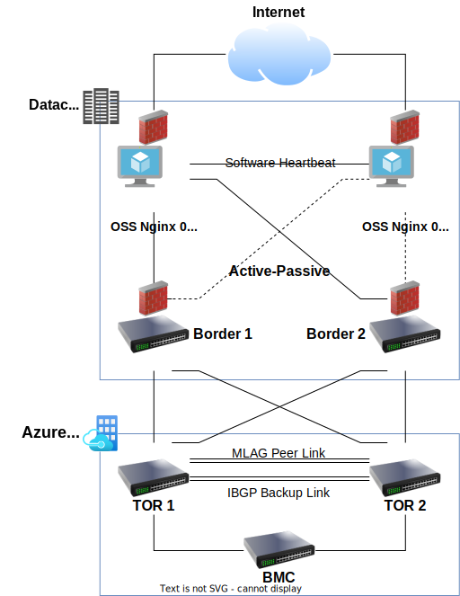

# OSS Nginx with Streams SSL Module

In this article you learn how to compile, configure, and setup high availability Transparent "Forward" Proxy for Azure Stack Hub deployment using OSS Nginx.

The completed setup will route HTTPS and HTTP traffic using Nginx Streams SSL module and HTTP module respectively. You may optionally filter egress HTTPS traffic using the TLS [Server Name Indication](https://en.wikipedia.org/wiki/Server_Name_Indication) extension.

Streams SSL module is not compiled in OSS Nginx by default. The steps below document how we will we doing a fresh compilation of OSS Nginx with Streams SSL module explicitly enabled.

> [!NOTE]
> Filter by Server Name Indication is based on Nginx Streams SSL PreRead module and only works with TLS 1.2. The filtering does not with TLS 1.3's Encrypted Server Name Indication.

> [!IMPORTANT]
> You will need to include the additional effort to upgrade this setup in the future. This setup and installation is not using the OSS Nginx from your Linux distribution's default package manager. Future upgrade of this OSS Nginx installation will require you to repeat the following steps on the latest version of OSS Nginx source code.

## Prerequisite
This setup and configuration guide has been verified with Ubuntu 20.04 LTS edition, but you should be able to complete the setup on most common commercial Linux distributions.
- Network CIDR range sufficient for N number of Nginx nodes. CIDR range sufficient for N+1 if using software load balancing.
- Latest source code for OSS Nginx from the [official release site](http://nginx.org/en/download.html).
- Patched and updated Linux operating system.
- Some experience in compiling Linux packages from source code is beneficial but not mandatory.

## Compile OSS Nginx
Refer to the Nginx documentation to [Compile and Install from Source](https://docs.nginx.com/nginx/admin-guide/installing-nginx/installing-nginx-open-source/#compiling-and-installing-from-source) for OSS Nginx.

The compile and installation steps in the official reference are divided into several sections. We will indicate below the sections where we will be applying our overriding options.

### Installing Nginx Dependencies 
- To reduce your maintainability overhead, you may want to consider using your Linux distribution's default Package Manager to install each required package if they satisfy the package version requirement. The Configure command in the next step will tell you if all package version requirements are satisfied.

### Downloading the Sources
- Download the latest version of OSS Nginx from the [official release site](http://nginx.org/en/download.html).

### Configuring the Build Options
We will use our own OSS Nginx configure options. In here we explicitly enabled the required Nginx Streams modules and explicitly disabled the unnecessary default modules using the `--without` syntax for basic software hardening.

A couple of key points to take note:
- OSS Nginx will create a Linux user `www` belonging to Linux group `www` during the installation step. You need to change this to match your organization's security requirements.
- OSS Nginx will install all executable binaries and write Nginx logs into the directory indicated by `--prefix`. You need to change it to match your organization's environment architecture.
- You may wish to consider modifying the list of modules disabled by the following to comply with your organization's security requirements.
- The Configure command will inform you if there is a package dependency mismatch. The error will state the missing package name that you should install. Check your Linux distribution's package manager for the required missing package. Or search [pkgs.org](https://pkgs.org/) for the compatible package.

```
./configure --user=www --group=www --prefix=/usr/local/nginx --with-http_ssl_module --with-http_stub_status_module --with-http_realip_module --with-threads --with-stream --with-stream_ssl_preread_module --with-stream_ssl_module --without-select_module --without-poll_module --without-http_autoindex_module --without-mail_pop3_module --without-mail_imap_module --without-mail_smtp_module
``` 
### Completing the Installation from Source
You will run make and make-install to compile and deploy the new OSS Nginx package into the directory configured in the `--prefix` attribute supplied earlier.

```
make
sudo make install
```

### Setup Nginx as a Service

We will need to setup OSS Nginx to start, stop, and restart as a Service. The following setup is for **Ubuntu 20.04 LTS** version. You will need to follow the documentation of your Linux distribution if it is different.

Create soft link for the new OSS Nginx executable.
```
sudo ln -s /usr/local/nginx/sbin/nginx /usr/local/sbin/nginx
```

Create a `/lib/systemd/system/nginx.service` file.
```
sudo nano /lib/systemd/system/nginx.service
```

Edit the contents of the `nginx.service` file with the following.

```
[Unit]
Description=A high performance web server and a reverse proxy server
Documentation=man:nginx(8)
After=network.target

[Service]
Type=forking
PIDFile=/usr/local/nginx/logs/nginx.pid
ExecStartPre=/usr/local/sbin/nginx -t -q -g 'daemon on; master_process on;'
ExecStart=/usr/local/sbin/nginx -g 'daemon on; master_process on;'
ExecReload=/usr/local/sbin/nginx -g 'daemon on; master_process on;' -s reload
ExecStop=-/sbin/start-stop-daemon --quiet --stop --retry QUIT/5 --pidfile /usr/local/nginx/logs/nginx.pid
TimeoutStopSec=5
KillMode=mixed

[Install]
WantedBy=multi-user.target
```

Enable and restart OSS Nginx service

```
sudo systemctl enable nginx.service
sudo systemctl restart nginx.service
```

Check OSS Nginx service is running. The following is a sample of successfully running instance of vanilla OSS Nginx. We will need to look for the `active (running)` status in the output.

```
nginx.service - A high performance web server and a reverse proxy server
     Loaded: loaded (/lib/systemd/system/nginx.service; enabled; vendor preset: enabled)
     Active: active (running) since Thu 2022-09-01 09:17:24 UTC; 33min ago
       Docs: man:nginx(8)
    Process: 20985 ExecStartPre=/usr/local/sbin/nginx -t -q -g daemon on; master_process on; (code=exited, status=0/SUCCESS)
    Process: 20986 ExecStart=/usr/local/sbin/nginx -g daemon on; master_process on; (code=exited, status=0/SUCCESS)
   Main PID: 20987 (nginx)
      Tasks: 3 (limit: 4637)
     Memory: 3.3M
     CGroup: /system.slice/nginx.service
             ├─20987 nginx: master process /usr/local/sbin/nginx -g daemon on; master_process on;
             ├─20988 nginx: worker process
             └─20989 nginx: worker process

Sep 01 09:17:24 30713621211c.mylabserver.com systemd[1]: Starting A high performance web server and a reverse proxy server...
Sep 01 09:17:24 30713621211c.mylabserver.com systemd[1]: Started A high performance web server and a reverse proxy server.
```

## Configure OSS Nginx
The OSS Nginx becomes a transparent forward proxy after the enablement of streams configuration and enablement of IPTables forwarding.

### Updating OSS Nginx Configuration File
Backup the existing OSS Nginx configuration file in `/usr/local/nginx/nginx.conf`, and create a new file of the same name.

> [!NOTE]
> Please note that you will need to adjust the OSS Nginx configuration according to the need of your deployment.

The first section of the configuration file will define the operating parameters of your OSS Nginx instance. In the following we define the following:
- Define the OSS Nginx to create new files (logs, errors) that belong to the user `www` and group `www`.
- Define `5` worker processes and each worker able to handle `4096` connections. Totalling a possible `20480` concurrent connections. Please ensure that you verify the configured Linux soft limits before specifying more connections than allowed File Descriptors per Linux User Session. Check by running using `ulimit -Sn`.
- Define the location of Error Log.
- Define the Process ID (PID). The Linux `systemd` process will use the PID stored in this file to terminate running instances of OSS Nginx.
- Define the maximum number of open files per worker process. Defined below as `8192`.

```
user www www;
worker_processes 5;
error_log /usr/local/nginx/logs/error.log;
pid /usr/local/nginx/logs/nginx.pid; 
worker_rlimit_nofile 8192;

events {
  worker_connections 4096;
}
```

The following sections are used for by the respective OSS Nginx modules.

- For the OSS Nginx Streams SSL module
  - The Streams SSL module will listen on `Port 443`.
  - Streams SSL PreRead is enabled to pre-populate the `ssl_preread_server_name` with the SNI value in the HTTP Request.
  - Access logs are defined in to the specified location.
  - We use "double mapping" to determine if the HTTPS Request is "whitelisted" to pass-through because other conditional expressions are not supported.
  - The first map compares the `ssl_preread_server_name` to a list of regular expressions of Microsoft Azure domain names and maps `allow_fqdn` to TRUE if there is a match. Otherwise to FALSE.
  - The second map compares the boolean value of `allow_fqdn` and writes the value of `ssl_preread_server_name` into the place holder `destination_ssl_server` if TRUE. Otherwise it writes a value of "`-`" to cause the request to fail.
  - The `proxy_pass` directive is used to forward the HTTPS Request to the next hop.
  - The `resolver` is used to define the DNS Server to resolve the FQDN leaving the OSS Nginx process towards the next hop (Internet). 
  
  ```
  stream {

    log_format proxy '$remote_addr [$time_local] $ssl_preread_server_name:$server_port '
                     '$protocol $status $bytes_sent $bytes_received '
                     '$session_time "$upstream_addr" '
                     '"$upstream_bytes_sent" "$upstream_bytes_received" "$upstream_connect_time"';

    resolver 8.8.8.8;

    # IF condition not supported by Nginx Streams. So we have to use double map.
    map $ssl_preread_server_name $allow_fqdn {
      ~*[a-z]*[\.]?azure.com                true;
      ~*[a-z]*[\.]?microsoft.com            true;
      ~*[a-z]*[\.]?microsoftonline.com      true;
      ~*[a-z]*[\.]?microsoftonline-p.com    true;
      ~*[a-z]*[\.]?msocdn.com               true;
      ~*[a-z]*[\.]?aka.ms                   true;
      ~*[a-z]*[\.]?azureedge.net            true;
      ~*[a-z]*[\.]?msauth.net               true;
      ~*[a-z]*[\.]?msftauth.net             true;
      ~*[a-z]*[\.]?trafficmanager.net       true;
      ~*[a-z]*[\.]?windows.net              true;
      ~*[a-z]*[\.]?azurecr.io               true;
      ~*[a-z]*[\.]?azure.net                true;
      ~*[a-z]*[\.]?visualstudio.com         true;
      ~*[a-z]*[\.]?vsassets.io              true;
      ~*[a-z]*[\.]?live.com                 true;
      ~*[a-z]*[\.]?sharepointonline.com     true;
      default                               false;
    }

    map $allow_fqdn $destination_ssl_server {
      ~*true    $ssl_preread_server_name;
      default   '-';
    }

    server {
      listen 443;
      ssl_preread on;
      proxy_connect_timeout 5s;
      access_log /usr/local/nginx/logs/access.log proxy;
      proxy_pass $destination_ssl_server:$server_port;
    }

  }
  ```

- For the OSS Nginx HTTP module
  - The HTTP module will listen on `Port 80`.
  - Access logs are defined in to the specified location.
  - Using `proxy_pass` and `proxy_set_header` to define the next hop.
  
  ```
  http {

    log_format http_log '$remote_addr [$time_local] $http_host:$server_port '
                     'TCP $status $bytes_sent "-" '
                     '"-" "$upstream_addr" '
                     '"$upstream_bytes_sent" "$upstream_bytes_received  "$upstream_connect_time"';

    resolver 8.8.8.8;

    server {
      listen 80;
      access_log /usr/local/nginx/logs/access.log http_log;
      location / {
        proxy_pass http://$http_host;
        proxy_set_header Host $host;
      }
    }
  }
  ```

### Setup IPTables Forwarding
Apart from the Border Switch routing Azure Stack Hub egress traffic towards the Forward Proxy virtual machine, we also need to forward the HTTP and HTTPS requests to be handled by our OSS Nginx process. Without this step then ingress request will be dropped by the virtual machine because it cannot accept TCP sockets destined for Microsoft servers. This will be done using Linux [IPTables](https://manpages.ubuntu.com/manpages/bionic/man8/iptables.8.html). The following commands are based on Ubuntu 20.04 LTS version, but equivalent packages are available in most commercial Linux distributions.

- Install the required Ubuntu using the APT package manager. This will install the IPTables package and the required additional packages to persist subsequent changes after virtual machine restarts.
  ```
  sudo apt install iptables iptables-persistent netfilter-persistent
  ```

- Enable the saving of IPTable changes to file.
  ```
  sudo netfilter-persistent start
  ```

- Add the following statements to the IPTables `PREROUTING` definition to forward all ingress `Port 80` and `Port 443` connections to the OSS Nginx process. Please note and change the place holder `HOST_IP` with the IP Address of your forward proxy before running these commands.
  ```
  sudo iptables -t nat -A PREROUTING -p tcp --dport 80 -m comment --comment "Transparent HTTP Proxy" -j DNAT --to-destination HOST_IP:80
  
  sudo iptables -t nat -A PREROUTING -p tcp --dport 443 -m comment --comment "Transparent HTTPS Proxy" -j DNAT --to-destination HOST_IP:443
  ```

- Verify that the IPTables PREROUTING rules are configured correctly.
  - Run the following command and check the expected output.
    ```
    sudo iptables -L -t nat
    ```
  - Sample of expected output. The sample value of `HOST_IP` is `10.192.0.3`.
    ```
    Chain PREROUTING (policy ACCEPT)
    target     prot opt source               destination
    DNAT       tcp  --  anywhere             anywhere             tcp dpt:http /* Transparent HTTP Proxy */ to:10.192.0.3:80
    DNAT       tcp  --  anywhere             anywhere             tcp dpt:https /* Transparent HTTPS Proxy */ to:10.192.0.3:443
    
    Chain INPUT (policy ACCEPT)
    target     prot opt source               destination
    
    Chain OUTPUT (policy ACCEPT)
    target     prot opt source               destination
    
    Chain POSTROUTING (policy ACCEPT)
    target     prot opt source               destination
    ```
- Save the IPTables changes if the output is correct.
  - Run this command to save the changes.
    ```
    sudo netfilter-persistent save
    ```
  - Verify that the IPTables changes are saved to file.
    ```
    cat /etc/iptables/rules.v4
    ```

## Testing the OSS Nginx Forward Proxy
After all required changes have been made;
- Datacenter firewall rules are updated to allow traffic from Azure Stack Hub towards Proxy Server.
- Layer 3 Border Switches updated to forward all Azure Stack Hub requests towards Proxy server.
- The above configurations and commands are executed successfully. 

### Azure Stack Hub Deployment In-Progress
If your Azure Stack Hub stamp deployment is in-progress or incomplete, you can verify the transparent forward proxy to be functional by working with your hardware OEM vendor to send CURL requests towards any [Azure endpoints](azure-stack-integrate-endpoints.md#ports-and-urls-outbound).

For example, the following command should return a JSON response from Azure mentioning missing api-version query parameter.
```
curl -vvv https://management.azure.com
```

Verify that the same request has passed through the OSS Nginx forward proxy by monitoring its `access.log`.
```
tail -f /usr/local/nginx/logs/access.log
```

### Azure Stack Hub Deployment Completed
If your Azure Stack Hub stamp deployment has completed, you can verify the transparent forward proxy to be functional by running the same CURL command as above using a Tenant VM, and verify the OSS Nginx `access.log` has recorded the same request.
```
curl -vvv https://management.azure.com
```
```
tail -f /usr/local/nginx/logs/access.log
```

## High Availability with Datacenter Load Balancer Capability (Optional)
For use cases when the datacenter has load balancer capability is able to support outbound HTTP requests from Apps zone to DMZ zone. Multiple instances of OSS Nginx can be deployed in an Active-Active configuration in the DMZ zone. The Border switches will need to route all egress traffic from Azure Stack Hub towards the Datacenter Load Balancer. No software clustering or session failover will be setup across OSS Nginx servers.

The Datacenter Load Balancer will need to:
- Create a new Backend Pool service and add IP addresses of all OSS Nginx instances.
- No session affinity is required as every egress request is stateless.
- Permit egress TCP/80 and egress TCP/443 traffic to the backend pool.



## High Availability with Software Clustering (Optional)
For use cases when the datacenter does not have load balancer capability to support outbound HTTP requests from Apps zone to DMZ zone. The OSS Nginx instances in DMZ zone can be software clustered to provide Active-Passive high availability for Azure Stack Hub egress requests. Session failover will not be setup across OSS Nginx servers. The Border switches will need to route all egress traffic from Azure Stack Hub towards the Virtual IP of the software cluster.

The software clustering will:
- Manage a floating Virtual IP that will be pegged to the Node with the Active running instance of OSS Nginx.
- Maintain a heartbeat between the Active and Passive Nodes in the cluster to discover if the Active Node is able to continue servicing Azure Stack Hub egress HTTP requests.
- Automatically start the OSS Nginx service in the Passive node and assign the floating Virtual IP when the Active Node has failed the heartbeat check.



### Update Hosts File in Cluster Nodes
Modify the `/etc/hosts` file in each OSS Nginx VM to statistically define the IP Address and Hostname to facilitate operations. In the following installation instructions we will assume that a CIDR of `10.1.0.0/29` is allocated by your datacenter network administrator to setup your software clustering of OSS Nginx servers. Expect to use a larger CIDR if your datacenter needs to run additional monitoring and security capabilities for every subnet allocated.

In the following example we will be assuming Active Node is `nginx01 10.1.0.4`, Passive Node is `nginx02 10.1.0.5`, and Virtual IP is `10.1.0.6`.


```
sudo vi /etc/hosts

# Add one line per OSS Nginx Cluster Node (Sample)
10.1.0.4  nginx01
10.1.0.5  nginx02
```
### Install the Packages and Dependencies
The following commands will install and enable the required packages and dependencies into the Ubuntu 20.04 LTS operating system. The equivalent packages are available in other Linux distributions.
- **corosync** - A common Linux software clustering engine that provides cluster membership and cluster messaging capabilities between participating nodes.
- **pacemaker** - A common Linux management utility to support Corosync in starting, stopping, and health check of OSS Nginx service.
- **pcs** - Installs `pcsd` system daemon to configure and integrate Corosync and Pacemaker packages.

```
sudo apt install corosync pacemaker pcs

sudo systemctl enable pcsd
sudo systemctl start pcsd
```

### Change Password of the Default Linux Account
A default `hacluster` Linux account is setup with installation of `corosync` package. We need to update the Password to the same value across all OSS Nginx servers in the software cluster.

```
sudo passwd hacluster
```

### Define the Software Cluster
The following commands will define the software cluster for OSS Nginx servers. If you have updated the `hacluster` Linux account to the same password across all OSS Nginx servers, you only need to run these commands on the Active node.

- Specify Corosync and configuration services to authenticate between nodes using `hacluster` Linux account.
  ```
  sudo pcs cluster auth -u hacluster
  sudo pcs host auth nginx01 nginx02 -u hacluster
  ```

- Define, enable and start teh OSS Nginx cluster.
  ```
  sudo pcs cluster setup nginxcluster nginx01 nginx02 --force
  sudo pcs cluster enable --all
  sudo pcs cluster start --all
  ```

- Defines Pacemaker behavior regarding what to do when the Active server becomes unresponsive. Since OSS Nginx is stateless, it is safe to disable the STONITH feature. The OSS Nginx cluster will not wait for the failed ***Active*** server's OSS Nginx to respond before electing a new ***Active*** node and redeploying Virtual IP and OSS Nginx service.
  ```
  sudo pcs property set stonith-enabled=false
  ```

- Defines Pacemaker behavior regarding what to do when OSS Nginx cluster does not have quorum. Set to `ignore` if you are setting up ***two*** OSS Nginx servers in cluster. Omit defining this property if you are setting up an odd numbered cluster (3 or 5 servers).
  ```
  sudo pcs property set no-quorum-policy=ignore
  ```

- Create Virtual IP resource to be used by OSS Nginx cluster. We define the name as `nginx_vip`, the network IP address, and refresh interval of 60 seconds.
  ```
  sudo pcs resource create nginx_vip ocf:heartbeat:IPaddr2 ip=10.1.0.6 cidr_netmask=29 op monitor interval=60s
  ```

- Define Service resource to be used by OSS Nginx cluster. We define the name as `nginx_svc`, the local OSS Nginx configuration, and refresh interval of 60 seconds.
  ```
  sudo pcs resource create nginx_svc ocf:heartbeat:nginx configfile="/usr/local/nginx/conf/nginx.conf" op monitor timeout="20s" interval="60s"
  ```

- Group the Virtual IP resource and Service resource to always be on the same active member of the cluster.
  ```
  sudo crm configure group nginxcluster nginx_vip nginx_svc
  ```

### Verify the Setup
We verify the setup has correctly deployed the Virtual IP resource and Service resource onto the Active node in the OSS Nginx cluster after a rolling restart of cluster.

- Run the following command in all nodes of the OSS Nginx cluster. No specific order is required.
  ```
  sudo crm cluster stop
  ```

- Starting from the OSS Nginx node we will like to make as ***Active***. Then move onto the other OSS Nginx nodes in cluster that we will like to make as ***Passive***.
  ```
  sudo crm cluster start
  ```

- Run the following in any of the nodes in OSS Nginx cluster to inspect each node's appreciation of where the the Virtual IP resource and Service resource are deployed. You should see the `nginx_vip` and `nginx_svc` associated to the hostname of ***Active*** node we defined in `/etc/hosts`.
  ```
  sudo crm cluster status
  ```

- Generate some egress traffic from Azure Stack Hub to verify the OSS Nginx cluster is able to handle load. Refer to section [Testing the OSS Nginx Forward Proxy](#testing-the-oss-nginx-forward-proxy) in this document.
  

### Verify the Resource Failover in OSS Nginx Cluster
We verify the ***Active*** node in OSS Nginx cluster is able to correctly failover after an abrupt loss of service. We can simulate this by manually stopping the OSS Nginx process gracefully or abruptly.

We start with gracefully failover the ***Active*** node in OSS Nginx cluster.

- Login to the ***Active*** node in OSS Nginx cluster and execute the following command to gracefully undeploy the `nginx_vip` and `nginx_svc`.
  ```
  sudo crm cluster stop
  ```

- After the configured `interval` duration, check that the `nginx_vip` and `nginx_svc` has been redeployed to another node in OSS Nginx cluster. Execute the following command in any other "_surviving_" nodes of the cluster.
  ```
  sudo crm cluster status
  ```

- Generate some egress traffic from Azure Stack Hub to verify the OSS Nginx cluster is able to handle load. Refer to section [Testing the OSS Nginx Forward Proxy](#testing-the-oss-nginx-forward-proxy) in this document.

We restart the services in Active node of OSS Nginx cluster and then proceed to test abrupt disruption of ***Active** node.

- Work with your on-premises hosting provider to terminate the virtual machine instance of the ***Active*** node.

- After the configured `interval` duration, check that the `nginx_vip` and `nginx_svc` has been redeployed to another node in OSS Nginx cluster. Execute the following command in any other "_surviving_" nodes of the cluster.
  ```
  sudo crm cluster status
  ```

- Generate some egress traffic from Azure Stack Hub to verify the OSS Nginx cluster is able to handle load. Refer to section [Testing the OSS Nginx Forward Proxy](#testing-the-oss-nginx-forward-proxy) in this document.