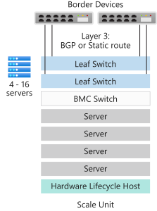
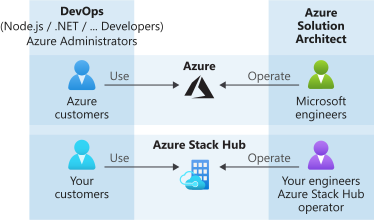

---

title: Azure Stack Hub Overview
description: Learn about Azure Stack Hub and how it lets you run Azure services in your datacenter.
author: sethmanheim
ms.topic: overview
ms.date: 05/08/2025
ms.author: sethm

# Intent: As an Azure Stack operator, I need an overview of what Azure Stack is so I can start using it.
# Keyword: use azure stack
---

# Azure Stack Hub overview

Azure Stack Hub is an extension of Azure that provides a way to run apps in an on-premises environment and deliver Azure services in your datacenter. With a consistent cloud platform, organizations can confidently make technology decisions based on business requirements, rather than business decisions based on technology limitations.

## Why use Azure Stack Hub?

Azure provides a rich platform for developers to build modern apps. However, some cloud-based apps face obstacles like latency, intermittent connectivity, and regulations. Azure and Azure Stack Hub unlock new hybrid cloud use cases for both customer-facing and internal line-of-business apps:

- **Edge and disconnected solutions**. Address latency and connectivity requirements by processing data locally in Azure Stack Hub and then aggregating it in Azure for further analytics, with common app logic across both. You can even deploy Azure Stack Hub disconnected from the internet without connectivity to Azure. Think of factory floors, cruise ships, and mine shafts as examples.
- **Cloud apps that meet varied regulations**. Develop and deploy apps in Azure with full flexibility to deploy on-premises with Azure Stack Hub to meet regulatory or policy requirements. No code changes are needed. App examples include global audit, financial reporting, foreign exchange trading, online gaming, and expense reporting.
- **Cloud app model on-premises**. Use Azure services, containers, serverless, and microservice architectures to update and extend existing apps or build new ones. Use consistent DevOps processes across Azure in the cloud and Azure Stack Hub on-premises to speed up app modernization for core mission-critical apps.

### Data residency

If the customer deploys Azure Stack Hub disconnected from global Azure and from the internet, no data that is stored on the appliance is sent to Microsoft. Azure Stack Hub is an on-premises appliance. Customers fully own and control the appliance, access to the appliance, and any data stored on the appliance. Disconnected deployment allows for complete control over data location by the customer. A customer can alternatively elect to connect an Azure Stack Hub appliance to global Azure or to the internet in a hybrid workload scenario (for example, a solution that uses resources deployed on Azure Stack Hub and global Azure with data transmitting between both) or with hybrid cloud management (for example, connecting a virtual machine deployed on Azure Stack Hub to Azure Monitor in global Azure for monitoring). In such scenarios, the customer is responsible for validating whether the Azure or other online services used with the appliance satisfy any data residency concerns. For more information about data residency, see [Data residency in Azure](https://azure.microsoft.com/global-infrastructure/data-residency/).

## Azure Stack Hub architecture

Azure Stack Hub integrated systems are comprised of racks of 4-16 servers built by trusted hardware partners and delivered straight to your datacenter. After delivery, a solution provider works with you to deploy the integrated system and ensure the Azure Stack Hub solution meets your business requirements. You can prepare your datacenter by ensuring all required power and cooling, border connectivity, and other required datacenter integration requirements are in place.

For more information about the Azure Stack Hub datacenter integration experience, see [Azure Stack Hub datacenter integration](azure-stack-customer-journey.md).

Azure Stack Hub is built on industry standard hardware and is managed using the same tools you already use for managing Azure subscriptions. As a result, you can apply consistent DevOps processes whether you're connected to Azure or not.

The Azure Stack Hub architecture lets you provide Azure services at the edge for remote locations or intermittent connectivity, disconnected from the internet. You can create hybrid solutions that process data locally in Azure Stack Hub and then aggregate it in Azure for additional processing and analytics. Finally, because Azure Stack Hub is installed on-premises, you can meet specific regulatory or policy requirements with the flexibility of deploying cloud apps on-premises without changing any code.

## Deployment options

Azure Stack Hub integrated systems are offered through a partnership of Microsoft and hardware partners, creating a solution that offers cloud-paced innovation and computing management simplicity. Because Azure Stack Hub is offered as an integrated hardware and software system, you have the flexibility and control you need, along with the ability to innovate from the cloud.

An Azure Stack Hub integrated system can range in size from 4-16 servers, called a *scale unit*. Integrated systems are supported by the hardware partner and Microsoft. The following diagram shows an example of a scale unit:

.

### Connection models

You can choose to deploy Azure Stack Hub either **connected** to the internet (and to Azure) or **disconnected** from it.

For more information, see the considerations for [connected](azure-stack-connected-deployment.md) and [disconnected](azure-stack-disconnected-deployment.md) deployment models.

### Identity provider

Azure Stack Hub uses either Microsoft Entra ID or Active Directory Federation Services (AD FS). Microsoft Entra ID is Microsoft's cloud-based, multitenant identity provider. Most hybrid scenarios with internet-connected deployments use Microsoft Entra ID as the identity store.

For disconnected deployments of Azure Stack Hub, you must use AD FS. Azure Stack Hub resource providers and other apps work similarly with AD FS or Microsoft Entra ID. Azure Stack Hub includes its own Active Directory instance and an Active Directory Graph API.

## How is Azure Stack Hub managed?

Azure Stack Hub uses the same operations model as Azure. An Azure Stack Hub operator can deliver a variety of services and apps to tenant users, similar to how Microsoft delivers Azure services to tenant users.

You can manage Azure Stack Hub with the administrator portal, user portal, or [PowerShell](/powershell/azurestackhub/overview). The Azure Stack Hub portals are each backed by separate instances of Azure Resource Manager. An Azure Stack Hub Operator uses the administrator portal to manage Azure Stack Hub, and to do things like create tenant offerings and maintain the health and monitor status of the integrated system. The user portal provides a self-service experience for consumption of cloud resources like virtual machines (VMs), storage accounts, and web apps.

For more information about managing Azure Stack Hub using the administrator portal, see the use the [Azure Stack Hub administration portal quickstart](azure-stack-manage-portals.md).

As an Azure Stack Hub operator, you can deliver [VMs](./tutorial-offer-services.md), [web apps](azure-stack-app-service-overview.md), highly available [SQL Server](azure-stack-tutorial-sql.md), and [MySQL Server](azure-stack-tutorial-mysql.md) databases.

An operator can manage Azure Stack Hub with the [administrator portal](azure-stack-manage-portals.md) or [PowerShell](/powershell/azurestackhub/overview). You can configure Azure Stack Hub to [deliver services](service-plan-offer-subscription-overview.md) to tenants using plans, quotas, offers, and subscriptions. Tenant users can subscribe to multiple offers. Offers can have one or more plans, and plans can have one or more services. Operators also manage capacity and respond to alerts.

Users consume services that the operator offers. Users can provision, monitor, and manage services that they're subscribed to, like web apps, storage, and VMs. Users can manage Azure Stack Hub with the user portal or PowerShell.

For more information about managing Azure Stack Hub, including what accounts to use where, typical operator responsibilities, what to tell your users, and how to get help, see [Azure Stack Hub administration basics](azure-stack-manage-basics.md).

## Resource providers

Resource providers are web services that form the foundation for all Azure Stack Hub IaaS and PaaS services. Azure Resource Manager relies on different resource providers to provide access to services. Each resource provider helps you configure and control its respective resources. Service admins can also add new custom resource providers.

### Foundational resource providers

There are three foundational IaaS resource providers:

- **Compute**: The Compute resource provider enables Azure Stack Hub tenants to create their own VMs. The Compute resource provider includes the ability to create VMs and VM extensions. The VM extension service helps provide IaaS capabilities for Windows and Linux VMs. As an example, you can use the Compute resource provider to provision a Linux VM and run Bash scripts during deployment to configure the VM.
- **Network Resource Provider**: The Network resource provider delivers a series of Software Defined Networking (SDN) and Network Function Virtualization (NFV) features for the private cloud. You can use the Network resource provider to create resources like software load balancers, public IPs, network security groups, and virtual networks.
- **Storage Resource Provider**: The Storage resource provider delivers four Azure-consistent storage services: [blob](/azure/storage/common/storage-introduction#blob-storage), [queue](/azure/storage/common/storage-introduction#queue-storage), [table](/azure/storage/common/storage-introduction#table-storage), and [Key Vault](/azure/key-vault/) account management providing management and auditing of secrets, such as passwords and certificates. The Storage resource provider also offers a storage cloud administration service to facilitate service provider administration of Azure-consistent storage services. Azure Storage provides the flexibility to store and retrieve large amounts of unstructured data, such as documents and media files with Azure Blobs, and structured NoSQL based data with Azure Tables.

### Optional resource providers

There are three optional PaaS resource providers that you can deploy and use with Azure Stack Hub:

- **App Service**: [Azure App Service on Azure Stack Hub](azure-stack-app-service-overview.md) is a PaaS offering of Microsoft Azure available to Azure Stack Hub. The service enables your internal or external customers to create web, API, and Azure Functions apps for any platform or device.
- **SQL Server**: Use the [SQL Server resource provider](azure-stack-sql-resource-provider.md) to offer SQL databases as a service of Azure Stack Hub. After you install the resource provider and connect it to one or more SQL Server instances, you and your users can create databases for cloud-native apps, websites that use SQL, and other workloads that use SQL.
- **MySQL Server**: Use the [MySQL Server resource provider](azure-stack-mysql-resource-provider-deploy.md) to expose MySQL databases as an Azure Stack Hub service. The MySQL resource provider runs as a service on a Windows Server 2019 Server Core VM.

## Next steps

- [Administration basics](azure-stack-manage-basics.md)
- [Quickstart: use the Azure Stack Hub administration portal](azure-stack-manage-portals.md)
- [Understand usage and billing](azure-stack-usage-reporting.md)
