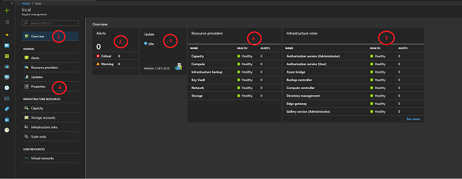

# Region management in Azure Stack Hub

Azure Stack Hub uses the concept of *regions*, which are logical entities comprised of the hardware resources that make up the Azure Stack Hub infrastructure. In region management, you can find all resources that are required to successfully operate the Azure Stack Hub infrastructure.

One integrated system deployment (referred to as an *Azure Stack Hub cloud*) makes up a single region. Each Azure Stack Development Kit (ASDK) has one region, named **local**. If you deploy a second Azure Stack Hub integrated system, or you set up another instance of the ASDK on separate hardware, this Azure Stack Hub cloud is a different region.

## Information available through the region management tile

Azure Stack Hub has a set of region management capabilities available in the **Region management** tile. This tile is available to an Azure Stack Hub operator on the default dashboard in the administrator portal. Through this tile, you can monitor and update your Azure Stack Hub region and its components, which are region-specific.

If you click a region in the **Region management** tile, you can access the following information:

1. **The resource menu**: Access different infrastructure management areas, and view and manage user resources such as storage accounts and virtual networks.

2. **Alerts**: List system-wide alerts and provide details on each of those alerts.

3. **Updates**: View the current version of your Azure Stack Hub infrastructure, available updates, and the update history. You can also update your integrated system.

4. **Resource providers**: Manage the user functionality offered by the components required to run Azure Stack Hub. Each resource provider comes with an administrative experience. This experience can include alerts for the specific provider, metrics, and other management capabilities specific to the resource provider.

5. **Infrastructure roles**: The components necessary to run Azure Stack Hub. Only the infrastructure roles that report alerts are listed. By selecting a role, you can view the alerts associated with the role and the role instances where this role is running.

6. **Properties**: The registration status and details of your environment in the region management blade. The status can be **Registered**, **Not registered**, or **Expired**. If registered, it also shows the Azure subscription ID that you used to register your Azure Stack Hub, along with the registration resource group and name.

## Next steps

- [Monitor health and alerts in Azure Stack Hub](azure-stack-monitor-health.md)
- [Manage updates in Azure Stack Hub](azure-stack-updates.md)
