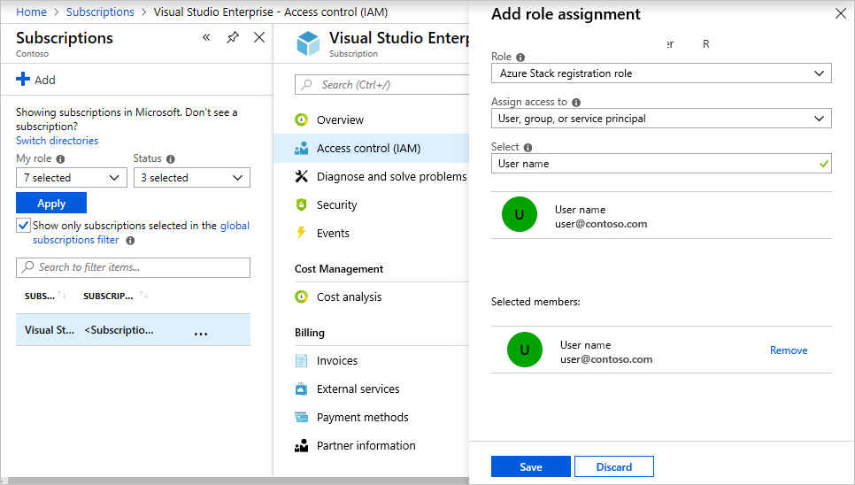

# Create a custom role for Azure Stack Hub registration

> [!WARNING]
> This isn't a security posture feature. Use it in scenarios where you want constraints to prevent accidental changes to the Azure Subscription. When a user is delegated rights to this custom role, the user has rights to edit permissions and elevate rights. Only assign users you trust to the custom role.

During Azure Stack Hub registration, you must sign in with an Azure Active Directory (Azure AD) account. The account requires the following Azure AD permissions and Azure Subscription permissions:

* **App registration permissions in your Azure AD tenant:** Admins have app registration permissions. The permission for users is a global setting for all users in the tenant. To view or change the setting, see [create an Azure AD app and service principal that can access resources](/azure/active-directory/develop/howto-create-service-principal-portal#required-permissions).

    The *user can register applications* setting must be set to **Yes** for you to enable a user account to register Azure Stack Hub. If the app registrations setting is set to **No**, you can't use a user account to register Azure Stack Hub—you have to use a global admin account.

* **A set of sufficient Azure Subscription permissions:** Users that belong to the Owner role have sufficient permissions. For other accounts, you can assign the permission set by assigning a custom role as outlined in the following sections.

Rather than using an account that has Owner permissions in the Azure subscription, you can create a custom role to assign permissions to a less-privileged user account. This account can then be used to register your Azure Stack Hub.

## Create a custom role using PowerShell

To create a custom role, you must have the `Microsoft.Authorization/roleDefinitions/write` permission on all `AssignableScopes`, such as [Owner](/azure/role-based-access-control/built-in-roles#owner) or [User Access Administrator](/azure/role-based-access-control/built-in-roles#user-access-administrator). Use the following JSON template to simplify creation of the custom role. The template creates a custom role that allows the required read and write access for Azure Stack Hub registration.

1. Create a JSON file. For example,  `C:\CustomRoles\registrationrole.json`.
2. Add the following JSON to the file. Replace `<SubscriptionID>` with your Azure subscription ID.

    ```json
    {
      "Name": "Azure Stack Hub registration role",
      "Id": null,
      "IsCustom": true,
      "Description": "Allows access to register Azure Stack Hub",
      "Actions": [
        "Microsoft.Resources/subscriptions/resourceGroups/write",
        "Microsoft.Resources/subscriptions/resourceGroups/read",
        "Microsoft.AzureStack/registrations/*",
        "Microsoft.AzureStack/register/action",
        "Microsoft.Authorization/roleAssignments/read",
        "Microsoft.Authorization/roleAssignments/write",
        "Microsoft.Authorization/roleAssignments/delete",
        "Microsoft.Authorization/permissions/read"
      ],
      "NotActions": [
      ],
      "AssignableScopes": [
        "/subscriptions/<SubscriptionID>"
      ]
    }
    ```

3. In PowerShell, connect to Azure to use Azure Resource Manager. When prompted, authenticate using an account with sufficient permissions such as [Owner](/azure/role-based-access-control/built-in-roles#owner) or [User Access Administrator](/azure/role-based-access-control/built-in-roles#user-access-administrator).

    ```azurepowershell
    Connect-AzureRmAccount
    ```

4. To create the custom role, use **New-AzureRmRoleDefinition** specifying the JSON template file.

    ``` azurepowershell
    New-AzureRmRoleDefinition -InputFile "C:\CustomRoles\registrationrole.json"
    ```

## Assign a user to registration role

After the registration custom role is created, assign the role to the user account that will be used for registering Azure Stack Hub.

1. Sign in with the account with sufficient permission on the Azure subscription to delegate rights—such as [Owner](/azure/role-based-access-control/built-in-roles#owner) or [User Access Administrator](/azure/role-based-access-control/built-in-roles#user-access-administrator).
2. In **Subscriptions**, select **Access control (IAM) > Add role assignment**.
3. In **Role**, choose the custom role you created: *Azure Stack Hub registration role*.
4. Select the users you want to assign to the role.
5. Select **Save** to assign the selected users to the role.

    

For more information on using custom roles, see [manage access using RBAC and the Azure portal](/azure/role-based-access-control/role-assignments-portal).

## Next steps

[Register Azure Stack Hub with Azure](azure-stack-registration.md)
