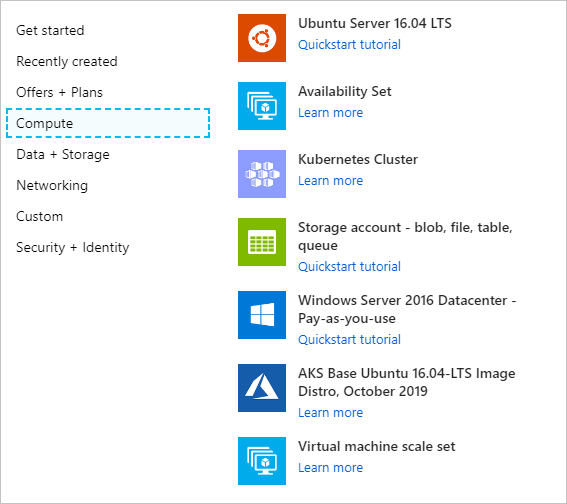

# Add Kubernetes to Azure Stack Hub Marketplace

> [!note]  
> Only use the Kubernetes Azure Stack Hub Marketplace item to deploy clusters as a proof-of-concept. For supported Kubernetes clusters on Azure Stack Hub, use [the AKS engine](azure-stack-aks-engine.md).

You can offer Kubernetes as a marketplace item to your users. Your users can then deploy Kubernetes in a single, coordinated operation.

This article looks at using an Azure Resource Manager template to deploy and provision the resources for a standalone Kubernetes cluster. Before you start, check your Azure Stack Hub and global Azure tenant settings. Collect the required information about your Azure Stack Hub. Add necessary resources to your tenant and to Azure Stack Hub Marketplace. The cluster depends on an Ubuntu server, custom script, and the Kubernetes Cluster marketplace item to be in Azure Stack Hub Marketplace.

## Create a plan, an offer, and a subscription

Create a plan, an offer, and a subscription for the Kubernetes marketplace item. You can also use an existing plan and offer.

1. Sign in to the [administrator portal.](https://adminportal.local.azurestack.external)

1. Create a plan as the base plan. For instructions, see [Create a plan in Azure Stack Hub](azure-stack-create-plan.md).

1. Create an offer. For instructions, see [Create an offer in Azure Stack Hub](azure-stack-create-offer.md).

1. Select **Offers**, and find the offer you created.

1. Select **Overview** in the Offer blade.

1. Select **Change state**. Select **Public**.

1. Select **+ Create a resource** > **Offers and Plans** > **Subscription** to create a subscription.

    a. Enter a **Display Name**.

    b. Enter a **User**. Use the Azure AD account associated with your tenant.

    c. **Provider Description**

    d. Set the **Directory tenant** to the Azure AD tenant for your Azure Stack Hub. 

    e. Select **Offer**. Select the name of the offer that you created. Make note of the Subscription ID.

## Create a service principal and credentials in AD FS

If you use Active Directory Federated Services (AD FS) for your identity management service, you need to create a service principal for users deploying a Kubernetes cluster. Create service principal using a client secret. For instructions, see [Create a service principal using a client secret](azure-stack-create-service-principals.md#create-a-service-principal-that-uses-client-secret-credentials).

## Add an Ubuntu server image

Add the following Ubuntu Server image to Azure Stack Hub Marketplace:

1. Sign in to the [administrator portal](https://adminportal.local.azurestack.external).

1. Select **All services**, and then under the **ADMINISTRATION** category, select **Marketplace management**.

1. Select **+ Add from Azure**.

1. Enter `Ubuntu Server`.

1. Select the newest version of the server. Check the full version and ensure that you have the newest version:
    - **Publisher**: Canonical
    - **Offer**: UbuntuServer
    - **Version**: 16.04.201806120 (or latest version)
    - **SKU**: 16.04-LTS

1. Select **Download.**

## Add a custom script for Linux

Add the Kubernetes from Azure Stack Hub Marketplace:

1. Open the [administrator portal](https://adminportal.local.azurestack.external).

1. Select **ALL services** and then under the **ADMINISTRATION** category, select **Marketplace Management**.

1. Select **+ Add from Azure**.

1. Enter `Custom Script for Linux`.

1. Select the script with the following profile:
   - **Offer**: Custom Script for Linux 2.0
   - **Version**: 2.0.6 (or latest version)
   - **Publisher**: Microsoft Corp

     > [!Note]  
     > More than one version of Custom Script for Linux may be listed. You need to add the last version of the item.

1. Select **Download.**

## Add Kubernetes to the marketplace

1. Open the [administrator portal](https://adminportal.local.azurestack.external).

1. Select **All services** and then under the **ADMINISTRATION** category, select **Marketplace Management**.

1. Select **+ Add from Azure**.

1. Enter `Kubernetes`.

1. Select `Kubernetes Cluster`.

1. Select **Download.**

    > [!note]  
    > It may take five minutes for the marketplace item to appear in Azure Stack Hub Marketplace.

    

## Update or remove the Kubernetes

When updating the Kubernetes item, you remove the previous item in Azure Stack Hub Marketplace. Follow the instruction below to add the Kubernetes update to Azure Stack Hub Marketplace.

To remove the Kubernetes item:

1. Connect to Azure Stack Hub with PowerShell as an operator. For instruction, see [Connect to Azure Stack Hub with PowerShell as an operator](azure-stack-powershell-configure-admin.md).

2. Find the current Kubernetes Cluster item in the gallery.

    ```powershell  
    Get-AzsGalleryItem | Select Name
    ```
    
3. Note name of the current item, such as `Microsoft.AzureStackKubernetesCluster.0.3.0`.

4. Use the following PowerShell cmdlet to remove the item:

    ```powershell  
    $Itemname="Microsoft.AzureStackKubernetesCluster.0.3.0"

    Remove-AzsGalleryItem -Name $Itemname
    ```

## Next steps

[Deploy a Kubernetes to Azure Stack Hub](../user/azure-stack-solution-template-kubernetes-deploy.md)

[Overview of offering services in Azure Stack Hub](service-plan-offer-subscription-overview.md)
