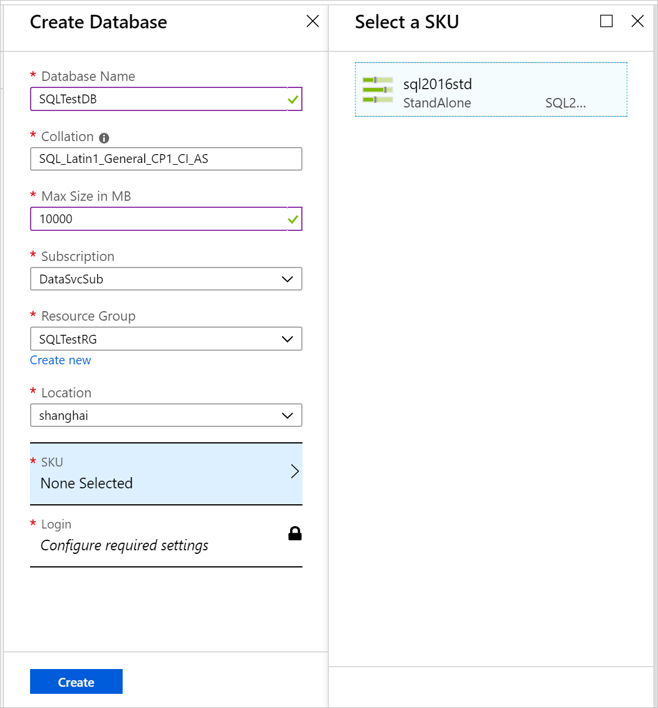
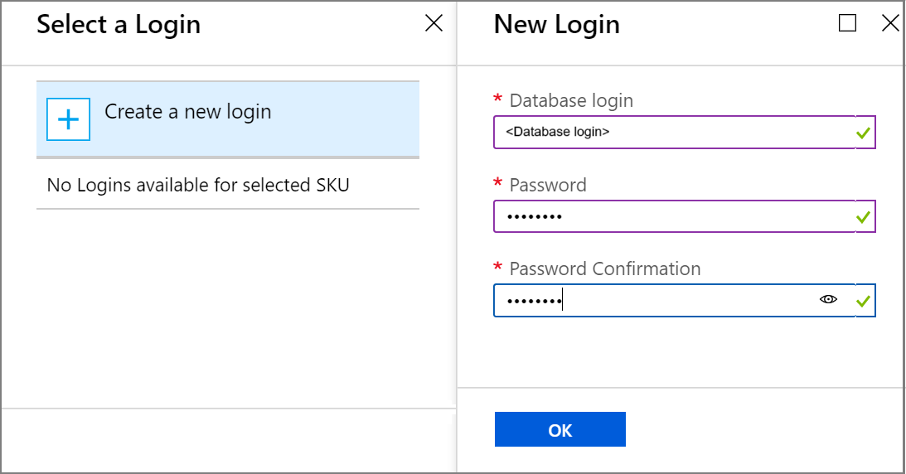
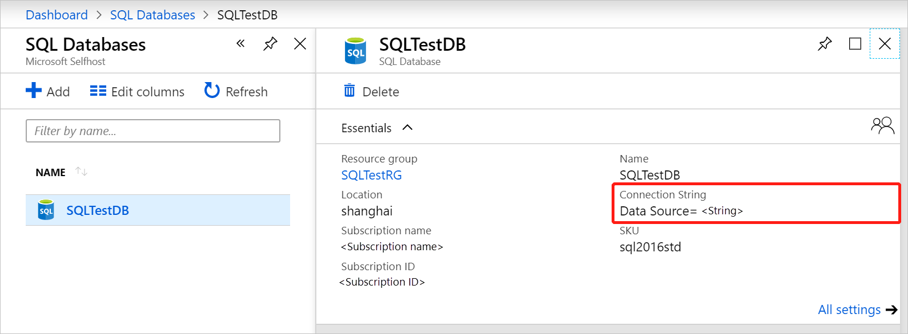
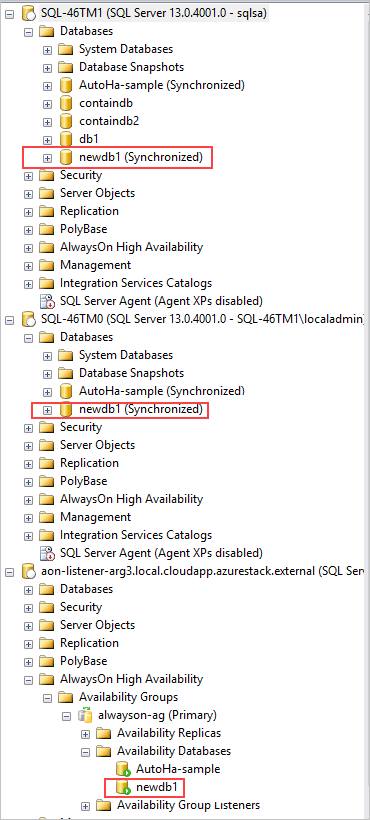

# Create SQL databases

You can create and manage self-service databases in the user portal. An Azure Stack Hub user needs a subscription with an offer that includes the SQL database service.

1. Sign in to the [Azure Stack Hub](azure-stack-overview.md) user portal.

2. Select **+ New** &gt;**Data + Storage** &gt; **SQL Server Database** &gt; **Add**.

3. Under **Create Database**, enter the required information, such as **Database Name** and **Max Size in MB**.

   >[!NOTE]
   >The database size must be at least 64 MB, which can be increased after you deploy the database.

   Configure the other settings as required for your environment.

4. Under **Create Database**, select **SKU**. Under **Select a SKU**, select the SKU for your database.

   

   >[!NOTE]
   >As hosting servers are added to Azure Stack Hub, they're assigned a SKU. Databases are created in the pool of hosting servers in a SKU.

5. Select **Login**.

6. Under **Select a Login**, choose an existing login, or select **+ Create a new login**.

7. Under **New Login**, enter a name for **Database login** and a **Password**.

   >[!NOTE]
   >These settings are the SQL authentication credential that's created for your access to this database only. The login user name must be globally unique. You can reuse login settings for other databases that use the same SKU.

   

8. Select **OK** to finish deploying the database.

Under **Essentials**, which is shown after the database is deployed, take note of the **Connection string**. You can use this string in any app that needs to access the SQL Server database.

## SQL Always On databases

By design, Always On databases are handled differently than in a standalone server environment. For more information, see [Introducing SQL Server Always On availability groups on Azure virtual machines](https://docs.microsoft.com/azure/virtual-machines/windows/sql/virtual-machines-windows-portal-sql-availability-group-overview).

### Verify SQL Always On databases

The following screen capture shows how you can use SQL Server Management Studio to look at database status in SQL Always On.

Always On databases should show as **Synchronized** and available on all the SQL instances and appear in **Availability Groups**. In the previous screenshot, the database example is newdb1 and its status is **newdb1 (Synchronized)**.

### Delete an Always On database

When you delete a SQL Always On database from the resource provider, SQL deletes the database from the **Primary** replica and from the availability group.

SQL then puts the database into the **Restoring** state on the other replicas and doesn't drop the database unless triggered. If the database isn't dropped, the secondary replicas go into a **Not Synchronizing** state.

## Next steps

Learn how to [offer highly available SQL databases](azure-stack-tutorial-sql.md)
