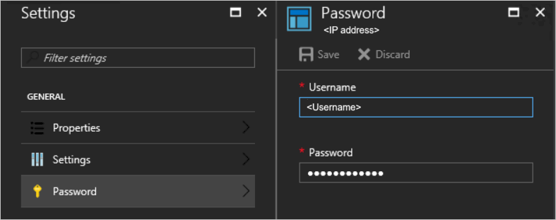
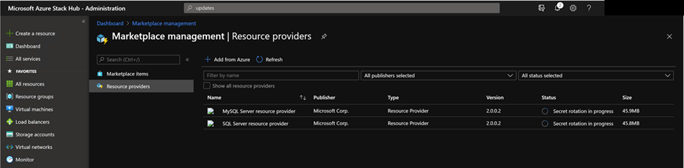

# SQL resource provider maintenance operations

[!INCLUDE [preview-banner](../includes/sql-mysql-rp-limit-access.md)]

::: moniker range="< azs-2108"
The SQL resource provider runs on a locked down virtual machine (VM). To enable maintenance operations, you need to  update the VM's security. To do this using the principle of Least Privilege, use [PowerShell Just Enough Administration (JEA)](/powershell/scripting/learn/remoting/jea/overview) endpoint *DBAdapterMaintenance*. The resource provider installation package includes a script for this action.
::: moniker-end

## Patching and updating

The SQL resource provider isn't serviced as part of Azure Stack Hub because it's an add-on component. Microsoft provides updates to the SQL resource provider as necessary. 

For SQL RP V1, When an updated SQL Server resource provider is released, a script is provided to apply the update. This script creates a new resource provider VM, migrating the state of the old provider VM to the new VM. 

For SQL RP V2, resource providers are updated using the same update feature that is used to apply Azure Stack Hub updates.

For more information, see [Update the SQL resource provider](azure-stack-sql-resource-provider-update.md).

### Update the provider VM

SQL RP V1 runs on a *user* VM, you need to apply the required patches and updates when they're released. You can install a Windows Update package during the installation of, or update to, the resource provider.

SQL RP V2 runs on a managed Windows Server that is hidden. You don't need to patch or update the resource provider VM. It will be updated automatically when you update the RP.

::: moniker range="< azs-2108"

### Update the VM Windows Defender definitions
*These instructions only apply to SQL RP V1 running on Azure Stack Hub Integrated Systems.*

To update the Windows Defender definitions:

1. Download the Windows Defender definitions update from [Security intelligence updates for Windows Defender](https://www.microsoft.com/wdsi/definitions).

   On the definitions update page, scroll down to "Manually download the update". Download the "Windows Defender Antivirus for Windows 10 and Windows 8.1" 64-bit file.

   You can also use [this direct link](https://go.microsoft.com/fwlink/?LinkID=121721&arch=x64) to download/run the fpam-fe.exe file.

2. Create a PowerShell session to the SQL resource provider adapter VM's maintenance endpoint.

3. Copy the definitions update file to the VM using the maintenance endpoint session.

4. On the maintenance PowerShell session, run the *Update-DBAdapterWindowsDefenderDefinitions* command.

5. After you install the definitions, we recommend you delete the definitions update file by using the *Remove-ItemOnUserDrive* command.

**PowerShell script example for updating definitions**

You can edit and run the following script to update the Defender definitions. Replace values in the script with values from your environment.

```powershell
# Set credentials for local admin on the resource provider VM.
$vmLocalAdminPass = ConvertTo-SecureString '<local admin user password>' -AsPlainText -Force
$vmLocalAdminUser = "<local admin user name>"
$vmLocalAdminCreds = New-Object System.Management.Automation.PSCredential `
    ($vmLocalAdminUser, $vmLocalAdminPass)

# Provide the public IP address for the adapter VM.
$databaseRPMachine  = "<RP VM IP address>"
$localPathToDefenderUpdate = "C:\DefenderUpdates\mpam-fe.exe"

# Download the Windows Defender update definitions file from https://www.microsoft.com/wdsi/definitions.
Invoke-WebRequest -Uri 'https://go.microsoft.com/fwlink/?LinkID=121721&arch=x64' `
    -Outfile $localPathToDefenderUpdate

# Create a session to the maintenance endpoint.
$session = New-PSSession -ComputerName $databaseRPMachine `
    -Credential $vmLocalAdminCreds -ConfigurationName DBAdapterMaintenance `
    -SessionOption (New-PSSessionOption -Culture en-US -UICulture en-US)
# Copy the defender update file to the adapter VM.
Copy-Item -ToSession $session -Path $localPathToDefenderUpdate `
     -Destination "User:\"
# Install the update definitions.
Invoke-Command -Session $session -ScriptBlock `
    {Update-AzSDBAdapterWindowsDefenderDefinition -DefinitionsUpdatePackageFile "User:\mpam-fe.exe"}
# Cleanup the definitions package file and session.
Invoke-Command -Session $session -ScriptBlock `
    {Remove-AzSItemOnUserDrive -ItemPath "User:\mpam-fe.exe"}
$session | Remove-PSSession
```

### Configure Azure Diagnostics extension for SQL resource provider

*These instructions only apply to SQL RP V1 running on Azure Stack Hub Integrated Systems.*

Azure Diagnostics extension is installed on the SQL resource provider adapter VM by default. The following steps show how to customize the extension for gathering the SQL resource provider operational event logs and IIS logs for troubleshooting and auditing purpose.

1. Sign in to the Azure Stack Hub administrator portal.

2. Select **Virtual machines** from the pane on the left, search for the SQL resource provider adapter VM and select the VM.

3. In **Diagnostics settings** of the VM, go to the **Logs** tab and choose **Custom** to customize event logs being collected.


4. Add **Microsoft-AzureStack-DatabaseAdapter/Operational!\*** to collect SQL resource provider operational event logs.


5. To enable the collection of IIS logs, check **IIS logs** and **Failed request logs**.


6. Finally select **Save** to save all the Diagnostics settings.

Once the event logs and IIS logs collection are configured for SQL resource provider, the logs can be found in a system storage account named **sqladapterdiagaccount**.

To learn more about Azure Diagnostics extension, please see [What is Azure Diagnostics extension](/azure/azure-monitor/platform/diagnostics-extension-overview).

::: moniker-end

## Updating SQL credentials

You're responsible for creating and maintaining sysadmin accounts on your SQL servers. The resource provider needs an account with these privileges to manage databases for users, but it doesn't need access to the users' data. If you need to update the sysadmin passwords on your SQL servers, you can use the resource provider's administrator interface to change a stored password. These passwords are stored in a Key Vault on your Azure Stack Hub instance.

To modify the settings, select **Browse** &gt; **ADMINISTRATIVE RESOURCES** &gt; **SQL Hosting Servers** &gt; **SQL Logins** and select a user name. The change must be made on the SQL instance first (and any replicas, if necessary.) Under **Settings**, select **Password**.



## Secrets rotation

::: moniker range="< azs-2108"

*These instructions only apply to SQL RP V1 running on Azure Stack Hub Integrated Systems.*

When using the SQL and MySQL resource providers with Azure Stack Hub integrated systems, the Azure Stack Hub operator is responsible for rotating the following resource provider infrastructure secrets to ensure that they don't expire:

- External SSL certificate [provided during deployment](azure-stack-pki-certs.md).
- The resource provider VM local admin account password provided during deployment.
- Resource provider diagnostic user (dbadapterdiag) password.
- (version >= 1.1.47.0) Key Vault certificate generated during deployment.

### PowerShell examples for rotating secrets

> [!IMPORTANT]
> Successful secret rotation requires the [removal of any existing versions of the Azure Stack Hub PowerShell modules](azure-stack-powershell-install.md#3-uninstall-existing-versions-of-the-azure-stack-hub-powershell-modules), prior to running the script below.

**Change all the secrets at the same time.**

```powershell
.\SecretRotationSQLProvider.ps1 `
    -Privilegedendpoint $Privilegedendpoint `
    -CloudAdminCredential $cloudCreds `
    -AzCredential $adminCreds `
    -DiagnosticsUserPassword $passwd `
    -DependencyFilesLocalPath $certPath `
    -DefaultSSLCertificatePassword $certPasswd  `
    -VMLocalCredential $localCreds `
    -KeyVaultPfxPassword $keyvaultCertPasswd
```

**Change the diagnostic user password.**

```powershell
.\SecretRotationSQLProvider.ps1 `
    -Privilegedendpoint $Privilegedendpoint `
    -CloudAdminCredential $cloudCreds `
    -AzCredential $adminCreds `
    -DiagnosticsUserPassword  $passwd
```

**Change the VM local admin account password.**

```powershell
.\SecretRotationSQLProvider.ps1 `
    -Privilegedendpoint $Privilegedendpoint `
    -CloudAdminCredential $cloudCreds `
    -AzCredential $adminCreds `
    -VMLocalCredential $localCreds
```

**Rotate the SSL certificate**

```powershell
.\SecretRotationSQLProvider.ps1 `
    -Privilegedendpoint $Privilegedendpoint `
    -CloudAdminCredential $cloudCreds `
    -AzCredential $adminCreds `
    -DependencyFilesLocalPath $certPath `
    -DefaultSSLCertificatePassword $certPasswd
```

**Rotate the Key Vault certificate**

```powershell
.\SecretRotationSQLProvider.ps1 `
    -Privilegedendpoint $Privilegedendpoint `
    -CloudAdminCredential $cloudCreds `
    -AzCredential $adminCreds `
    -KeyVaultPfxPassword $keyvaultCertPasswd
```

### SecretRotationSQLProvider.ps1 parameters

|Parameter|Description|Comment|
|-----|-----|-----|
|AzureEnvironment|The Azure environment of the service admin account used for deploying Azure Stack Hub. Required only for Microsoft Entra deployments. Supported environment names are **AzureCloud**, **AzureUSGovernment**, or if using a China Microsoft Entra ID, **AzureChinaCloud**.|Optional|
|AzCredential|Azure Stack Hub service admin account credential. The script will fail if the account you use with AzCredential requires multi-factor authentication (MFA).|Mandatory|
|CloudAdminCredential|Azure Stack Hub cloud admin domain account credential.|Mandatory|
|PrivilegedEndpoint|Privileged Endpoint to access Get-AzureStackStampInformation.|Mandatory|
|DiagnosticsUserPassword|Diagnostics user account password.|Optional|
|VMLocalCredential|Local admin account on the MySQLAdapter VM.|Optional|
|DefaultSSLCertificatePassword|Default SSL certificate (*.pfx) password.|Optional|
|DependencyFilesLocalPath|Dependency files local path.|Optional|
|KeyVaultPfxPassword|The password used for generating the Key Vault certificate for database adapter.|Optional|
|     |     |     |

::: moniker-end

::: moniker range=">= azs-2108"

*These instructions only apply to SQL RP V2 running on Azure Stack Hub Integrated Systems.*

> [!NOTE]
> Secret rotation for value-add resource providers (RPs) is currently only supported via PowerShell. 

Like the Azure Stack Hub infrastructure, value-add resource providers use both internal and external secrets. As an operator, you're responsible for:

- Providing updated external secrets, such as a new TLS certificate used to secure resource provider endpoints.
- Managing resource provider secret rotation on a regular basis.

When secrets are nearing expiration, the following alerts are generated in the administrator portal. Completing secret rotation will resolve these alerts:
- Pending internal certificate expiration
- Pending external certificate expiration

### Prerequisites

In preparation for the rotation process:

1. If you haven't already, [Install PowerShell Az module for Azure Stack Hub](../operator/powershell-install-az-module.md) before continuing. Version 2.0.2-preview or later is required for Azure Stack Hub secret rotation. For more information, see [Migrate from AzureRM to Azure PowerShell Az in Azure Stack Hub](../operator/migrate-azurerm-az.md).

2. Install Azs.Deployment.Admin 1.0.0 modules: [PowerShell Gallery | Azs.Deployment.Admin 1.0.0](https://www.powershellgallery.com/packages/Azs.Deployment.Admin/1.0.0)
```powershell
Install-Module -Name Azs.Deployment.Admin
```

3. If external certificate is nearing expiration, review [Azure Stack Hub public key infrastructure (PKI) certificate requirements](../operator/azure-stack-pki-certs.md#certificate-requirements) for important prerequisite information before acquiring/renewing your X509 certificate, including details on the required PFX format. Also review the requirements specified in the [Optional PaaS certificates section](../operator/azure-stack-pki-certs.md#optional-paas-certificates), for your specific value-add resource provider.

### Prepare a new TLS certificate for external certificate rotation

> [!NOTE]
> If only internal certificate is nearing expiration, you can skip this section.

Next, create or renew your TLS certificate for securing the value-add resource provider endpoints:

1. Complete the steps in [Generate certificate signing requests (CSRs) for certificate renewal](/azure-stack/operator/azure-stack-get-pki-certs?pivots=csr-type-renewal#generate-csrs-for-renewal-certificates) for your resource provider. Here you use the Azure Stack Hub Readiness Checker tool to create the CSR. Be sure to run the correct cmdlet for your resource provider, in the step "Generate certificate requests for other Azure Stack Hub services". For example `New-AzsDbAdapterCertificateSigningRequest` is used for SQL and MySQL RPs. When finished, you submit the generated .REQ file to your Certificate Authority (CA) for the new certificate.

2. Once you've received your certificate file from the CA, complete the steps in [Prepare certificates for deployment or rotation](../operator/azure-stack-prepare-pki-certs.md). You use the Readiness Checker tool again, to process the file returned from the CA.

3. Finally, complete the steps in [Validate Azure Stack Hub PKI certificates](../operator/azure-stack-validate-pki-certs.md). You use the Readiness Checker tool once more, to perform validation tests on your new certificate.

### Rotate the internal certificate

Open an elevated PowerShell console and complete the following steps to rotate the resource provider's external secrets:

1. Sign in to your Azure Stack Hub environment using your operator credentials. See [Connect to Azure Stack Hub with PowerShell](../operator/azure-stack-powershell-configure-admin.md) for PowerShell sign-in script. Be sure to use the PowerShell Az cmdlets (instead of AzureRM), and replace all placeholder values, such as endpoint URLs and directory tenant name.

2. Determine the product-id of the resource provider. Run the `Get-AzsProductDeployment` cmdlet to retrieve a list of the latest resource provider deployments. The returned `"value"` collection contains an element for each deployed resource provider. Find the resource provider of interest and make note of the values for these properties:
   - `"name"` - contains the resource provider product ID in the second segment of the value.
   
   For example, the SQL RP deployment may have a product ID of `"microsoft.sqlrp"`.

3. Run the `Invoke-AzsProductRotateSecretsAction` cmdlet to rotate the internal certificate:

   ```powershell
   Invoke-AzsProductRotateSecretsAction -ProductId $productId
   ```

### Rotate the external certificate

You need to first make note of the values for the following parameters.

   | Placeholder | Description | Example value |
   | ----------- | ----------- | --------------|
   | `<product-id>` | The product ID of the latest resource provider deployment. | `microsoft.sqlrp` |
   | `<installed-version>` | The version of the latest resource provider deployment. | `2.0.0.2` |
   | `<package-id>` | The package ID is built by concatenating the product-id and installed-version. | `microsoft.sqlrp.2.0.0.2` |
   | `<cert-secret-name>` | The name under which the certificate secret is stored. | `SSLCert` |
   | `<cert-pfx-file-path>` | The path to your certificate PFX file. | `C:\dir\dbadapter-cert-file.pfx` |
   | `<pfx-password>` | The password assigned to your certificate .PFX file. | `strong@CertSecret6` |

Open an elevated PowerShell console and complete the following steps:

1. Sign in to your Azure Stack Hub environment using your operator credentials. See [Connect to Azure Stack Hub with PowerShell](../operator/azure-stack-powershell-configure-admin.md) for PowerShell sign-in script. Be sure to use the PowerShell Az cmdlets (instead of AzureRM), and replace all placeholder values, such as endpoint URLs and directory tenant name.

2. Get the product-id parameter value. Run the `Get-AzsProductDeployment` cmdlet to retrieve a list of the latest resource provider deployments. The returned `"value"` collection contains an element for each deployed resource provider. Find the resource provider of interest and make note of the values for these properties:
   - `"name"` - contains the resource provider product ID in the second segment of the value. 
   - `"properties"."deployment"."version"` - contains the currently deployed version number. 

For example, the SQL RP deployment may have a product ID of `"microsoft.sqlrp"`, and version `"2.0.0.2"`.

3. Build the resource provider's package ID, by concatenating the resource provider product ID and version. For example, using the values derived in the previous step, the SQL RP package ID is `microsoft.sqlrp.2.0.0.2`. 

4. Using the package ID derived in the previous step, run `Get-AzsProductSecret -PackageId` to retrieve the list of secret types being used by the resource provider. In the returned `value` collection, find the element containing a value of `"Certificate"` for the `"properties"."secretKind"` property. This element contains properties for the RP's certificate secret. Make note of the name assigned to this certificate secret, which is identified by the last segment of the `"name"` property, just above `"properties"`. 

For example, the secrets collection returned for the SQL RP contains a `"Certificate"` secret named `SSLCert`. 

5. Use the `Set-AzsProductSecret` cmdlet to import your new certificate to Key Vault, which will be used by the rotation process. Replace the variable placeholder values accordingly before running the script. 

   ```powershell
   $productId = '<product-id>'
   $packageId = $productId + '.' + '<installed-version>'
   $certSecretName = '<cert-secret-name>' 
   $pfxFilePath = '<cert-pfx-file-path>'
   $pfxPassword = ConvertTo-SecureString '<pfx-password>' -AsPlainText -Force   
   Set-AzsProductSecret -PackageId $packageId -SecretName $certSecretName -PfxFileName $pfxFilePath -PfxPassword $pfxPassword -Force
   ```

6. Finally, use the `Invoke-AzsProductRotateSecretsAction` cmdlet to rotate the secrets:

   ```powershell
   Invoke-AzsProductRotateSecretsAction -ProductId $productId
   ```

### Monitor the secret rotation progress

You can monitor secret rotation progress in either the PowerShell console, or in the administrator portal by selecting the resource provider in the Marketplace service:



> [!NOTE]
> The secret rotation time might cost more than 10 minutes. After it is done, Status of the resource provider will change to “Installed”.

::: moniker-end

## Collect diagnostic logs

::: moniker range=">= azs-2008"

Azure Stack Hub has multiple ways to collect, save, and send diagnostic logs to Microsoft Support. Starting from version 1.1.93, SQL Resource Provider supports the standard way of collecting logs from your Azure Stack Hub environment. For more information, see [Diagnostic log collection](diagnostic-log-collection.md).

::: moniker-end

::: moniker range="< azs-2008"

Starting from version 1.1.93, SQL Resource Provider supports the standard way of collecting logs from your Azure Stack Hub environment. If you are using an older version, it is recommended to update your SQL Resource Provider to the latest version.

To collect logs from the locked down VM, use the PowerShell Just Enough Administration (JEA) endpoint *DBAdapterDiagnostics*. This endpoint provides the following commands:

- **Get-AzsDBAdapterLog**. This command creates a zip package of the resource provider diagnostics logs and saves the file on the session's user drive. You can run this command without any parameters and the last four hours of logs are collected.
- **Remove-AzsDBAdapterLog**. This command removes existing log packages on the resource provider VM.

### Endpoint requirements and process

When a resource provider is installed or updated, the **dbadapterdiag** user account is created. You'll use this account to collect diagnostic logs.

>[!NOTE]
>The dbadapterdiag account password is the same as the password used for the local admin on the VM that's created during a provider deployment or update.

To use the *DBAdapterDiagnostics* commands, create a remote PowerShell session to the resource provider VM and run the **Get-AzsDBAdapterLog** command.

You set the time span for log collection by using the **FromDate** and **ToDate** parameters. If you don't specify one or both of these parameters, the following defaults are used:

- FromDate is four hours before the current time.
- ToDate is the current time.

**PowerShell script example for collecting logs**

The following script shows how to collect diagnostic logs from the resource provider VM.

```powershell
# Create a new diagnostics endpoint session.
$databaseRPMachineIP = '<RP VM IP address>'
$diagnosticsUserName = 'dbadapterdiag'
$diagnosticsUserPassword = '<Enter Diagnostic password>'

$diagCreds = New-Object System.Management.Automation.PSCredential `
        ($diagnosticsUserName, (ConvertTo-SecureString -String $diagnosticsUserPassword -AsPlainText -Force))
$session = New-PSSession -ComputerName $databaseRPMachineIP -Credential $diagCreds `
        -ConfigurationName DBAdapterDiagnostics `
        -SessionOption (New-PSSessionOption -Culture en-US -UICulture en-US)

# Sample that captures logs from the previous hour.
$fromDate = (Get-Date).AddHours(-1)
$dateNow = Get-Date
$sb = {param($d1,$d2) Get-AzSDBAdapterLog -FromDate $d1 -ToDate $d2}
$logs = Invoke-Command -Session $session -ScriptBlock $sb -ArgumentList $fromDate,$dateNow

# Copy the logs to the user drive.
$sourcePath = "User:\{0}" -f $logs
$destinationPackage = Join-Path -Path (Convert-Path '.') -ChildPath $logs
Copy-Item -FromSession $session -Path $sourcePath -Destination $destinationPackage

# Clean up the logs.
$cleanup = Invoke-Command -Session $session -ScriptBlock {Remove-AzsDBAdapterLog}
# Close the session.
$session | Remove-PSSession
```
::: moniker-end

### Known limitations of SQL Server resource provider Version 1

**Limitation**:<br>
When the deployment, upgrade, or secret rotation script failed, some logs cannot be collected by the standard log collection mechanism.

**Workaround**:<br>
Besides using the standard log collection mechanism, go to the Logs folder in the extracted folder where the script locates, to find more logs.

## Next steps

[Add SQL Server hosting servers](azure-stack-sql-resource-provider-hosting-servers.md)
