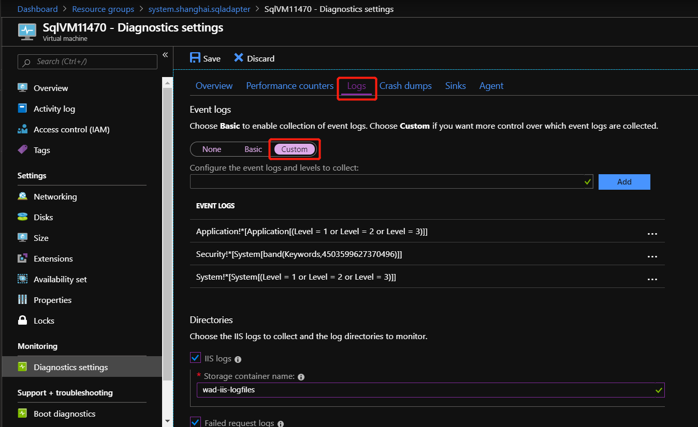
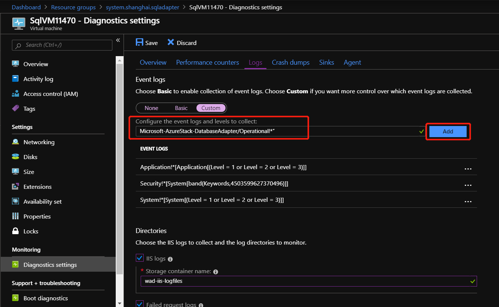

# SQL resource provider maintenance operations

The SQL resource provider runs on a locked down virtual machine (VM). To enable maintenance operations, you need to update the VM's security. To do this using the principal of Least Privilege, use [PowerShell Just Enough Administration (JEA)](https://docs.microsoft.com/powershell/scripting/learn/remoting/jea/overview) endpoint *DBAdapterMaintenance*. The resource provider installation package includes a script for this action.

## Patching and updating

The SQL resource provider isn't serviced as part of Azure Stack because it's an add-on component. Microsoft provides updates to the SQL resource provider as necessary. When an updated SQL adapter is released, a script is provided to apply the update. This script creates a new resource provider VM, migrating the state of the old provider VM to the new VM. For more information, see [Update the SQL resource provider](azure-stack-sql-resource-provider-update.md).

### Provider VM

Because the resource provider runs on a *user* VM, you need to apply the required patches and updates when they're released. Use the Windows update packages that are provided as part of the patch-and-update cycle to apply updates to the VM.

## Updating SQL credentials

You're responsible for creating and maintaining sysadmin accounts on your SQL servers. The resource provider needs an account with these privileges to manage databases for users, but it doesn't need access to the users' data. If you need to update the sysadmin passwords on your SQL servers, you can use the resource provider's administrator interface to change a stored password. These passwords are stored in a Key Vault on your Azure Stack instance.

To modify the settings, select **Browse** &gt; **ADMINISTRATIVE RESOURCES** &gt; **SQL Hosting Servers** &gt; **SQL Logins** and select a user name. The change must be made on the SQL instance first (and any replicas, if necessary.) Under **Settings**, select **Password**.


## Secrets rotation

*These instructions only apply to Azure Stack Integrated Systems.*

When using the SQL and MySQL resource providers with Azure Stack integrated systems, the Azure Stack operator is responsible for rotating the following resource provider infrastructure secrets to ensure that they don't expire:

- External SSL certificate [provided during deployment](azure-stack-pki-certs.md).
- The resource provider VM local admin account password provided during deployment.
- Resource provider diagnostic user (dbadapterdiag) password.

### PowerShell examples for rotating secrets

**Change all the secrets at the same time.**

```powershell
.\SecretRotationSQLProvider.ps1 `
    -Privilegedendpoint $Privilegedendpoint `
    -CloudAdminCredential $cloudCreds `
    -AzCredential $adminCreds `
    -DiagnosticsUserPassword $passwd `
    -DependencyFilesLocalPath $certPath `
    -DefaultSSLCertificatePassword $certPasswd  `
    -VMLocalCredential $localCreds
```

**Change the diagnostic user password.**

```powershell
.\SecretRotationSQLProvider.ps1 `
    -Privilegedendpoint $Privilegedendpoint `
    -CloudAdminCredential $cloudCreds `
    -AzCredential $adminCreds `
    -DiagnosticsUserPassword  $passwd
```

**Change the VM local admin account password.**

```powershell
.\SecretRotationSQLProvider.ps1 `
    -Privilegedendpoint $Privilegedendpoint `
    -CloudAdminCredential $cloudCreds `
    -AzCredential $adminCreds `
    -VMLocalCredential $localCreds
```

**Change the SSL certificate password.**

```powershell
.\SecretRotationSQLProvider.ps1 `
    -Privilegedendpoint $Privilegedendpoint `
    -CloudAdminCredential $cloudCreds `
    -AzCredential $adminCreds `
    -DependencyFilesLocalPath $certPath `
    -DefaultSSLCertificatePassword $certPasswd
```

### SecretRotationSQLProvider.ps1 parameters

|Parameter|Description|
|-----|-----|
|AzCredential|Azure Stack service admin account credential.|
|CloudAdminCredential|Azure Stack cloud admin domain account credential.|
|PrivilegedEndpoint|Privileged Endpoint to access Get-AzureStackStampInformation.|
|DiagnosticsUserPassword|Diagnostics user account password.|
|VMLocalCredential|Local admin account on the MySQLAdapter VM.|
|DefaultSSLCertificatePassword|Default SSL certificate (*pfx) password.|
|DependencyFilesLocalPath|Dependency files local path.|
|     |     |

### Known issues

**Issue**:<br>
Secrets rotation logs. The logs for secrets rotation aren't automatically collected if the secret rotation custom script fails when it's run.

**Workaround**:<br>
Use the Get-AzsDBAdapterLogs cmdlet to collect all resource provider logs, including AzureStack.DatabaseAdapter.SecretRotation.ps1_*.log, saved in C:\Logs.

## Update the VM operating system

Use one of the following methods to update the VM operating system.

- Install the latest resource provider package using a currently patched Windows Server 2016 Core image.
- Install a Windows Update package during the installation of, or update to, the resource provider.

## Update the VM Windows Defender definitions

To update the Windows Defender definitions:

1. Download the Windows Defender definitions update from [Security intelligence updates for Windows Defender](https://www.microsoft.com/wdsi/definitions).

   On the definitions update page, scroll down to "Manually download the update". Download the "Windows Defender Antivirus for Windows 10 and Windows 8.1" 64-bit file.

   You can also use [this direct link](https://go.microsoft.com/fwlink/?LinkID=121721&arch=x64) to download/run the fpam-fe.exe file.

2. Create a PowerShell session to the SQL resource provider adapter VM's maintenance endpoint.

3. Copy the definitions update file to the VM using the maintenance endpoint session.

4. On the maintenance PowerShell session, run the *Update-DBAdapterWindowsDefenderDefinitions* command.

5. After you install the definitions, we recommend you delete the definitions update file by using the *Remove-ItemOnUserDrive* command.

**PowerShell script example for updating definitions**

You can edit and run the following script to update the Defender definitions. Replace values in the script with values from your environment.

```powershell
# Set credentials for local admin on the resource provider VM.
$vmLocalAdminPass = ConvertTo-SecureString "<local admin user password>" -AsPlainText -Force
$vmLocalAdminUser = "<local admin user name>"
$vmLocalAdminCreds = New-Object System.Management.Automation.PSCredential `
    ($vmLocalAdminUser, $vmLocalAdminPass)

# Provide the public IP address for the adapter VM.
$databaseRPMachine  = "<RP VM IP address>"
$localPathToDefenderUpdate = "C:\DefenderUpdates\mpam-fe.exe"

# Download the Windows Defender update definitions file from https://www.microsoft.com/wdsi/definitions.
Invoke-WebRequest -Uri 'https://go.microsoft.com/fwlink/?LinkID=121721&arch=x64' `
    -Outfile $localPathToDefenderUpdate

# Create a session to the maintenance endpoint.
$session = New-PSSession -ComputerName $databaseRPMachine `
    -Credential $vmLocalAdminCreds -ConfigurationName DBAdapterMaintenance
# Copy the defender update file to the adapter VM.
Copy-Item -ToSession $session -Path $localPathToDefenderUpdate `
     -Destination "User:\"
# Install the update definitions.
Invoke-Command -Session $session -ScriptBlock `
    {Update-AzSDBAdapterWindowsDefenderDefinition -DefinitionsUpdatePackageFile "User:\mpam-fe.exe"}
# Cleanup the definitions package file and session.
Invoke-Command -Session $session -ScriptBlock `
    {Remove-AzSItemOnUserDrive -ItemPath "User:\mpam-fe.exe"}
$session | Remove-PSSession
```

## Collect diagnostic logs

To collect logs from the locked down VM, use the PowerShell Just Enough Administration (JEA) endpoint *DBAdapterDiagnostics*. This endpoint provides the following commands:

- **Get-AzsDBAdapterLog**. This command creates a zip package of the resource provider diagnostics logs and saves the file on the session's user drive. You can run this command without any parameters and the last four hours of logs are collected.
- **Remove-AzsDBAdapterLog**. This command removes existing log packages on the resource provider VM.

### Endpoint requirements and process

When a resource provider is installed or updated, the **dbadapterdiag** user account is created. You'll use this account to collect diagnostic logs.

>[!NOTE]
>The dbadapterdiag account password is the same as the password used for the local admin on the VM that's created during a provider deployment or update.

To use the *DBAdapterDiagnostics* commands, create a remote PowerShell session to the resource provider VM and run the **Get-AzsDBAdapterLog** command.

You set the time span for log collection by using the **FromDate** and **ToDate** parameters. If you don't specify one or both of these parameters, the following defaults are used:

- FromDate is four hours before the current time.
- ToDate is the current time.

**PowerShell script example for collecting logs**

The following script shows how to collect diagnostic logs from the resource provider VM.

```powershell
# Create a new diagnostics endpoint session.
$databaseRPMachineIP = '<RP VM IP address>'
$diagnosticsUserName = 'dbadapterdiag'
$diagnosticsUserPassword = '<Enter Diagnostic password>'

$diagCreds = New-Object System.Management.Automation.PSCredential `
        ($diagnosticsUserName, (ConvertTo-SecureString -String $diagnosticsUserPassword -AsPlainText -Force))
$session = New-PSSession -ComputerName $databaseRPMachineIP -Credential $diagCreds `
        -ConfigurationName DBAdapterDiagnostics

# Sample that captures logs from the previous hour.
$fromDate = (Get-Date).AddHours(-1)
$dateNow = Get-Date
$sb = {param($d1,$d2) Get-AzSDBAdapterLog -FromDate $d1 -ToDate $d2}
$logs = Invoke-Command -Session $session -ScriptBlock $sb -ArgumentList $fromDate,$dateNow

# Copy the logs to the user drive.
$sourcePath = "User:\{0}" -f $logs
$destinationPackage = Join-Path -Path (Convert-Path '.') -ChildPath $logs
Copy-Item -FromSession $session -Path $sourcePath -Destination $destinationPackage

# Clean up the logs.
$cleanup = Invoke-Command -Session $session -ScriptBlock {Remove-AzsDBAdapterLog}
# Close the session.
$session | Remove-PSSession
```
## Configure Azure Diagnostics extension for SQL resource provider
Azure Diagnostics extension is installed on the SQL resource provider adapter VM by default. The following steps show how to customize the extension for gathering the SQL resource provider operational event logs and IIS logs for troubleshooting and auditing purpose.

1. In Admin portal, go to the SQL resource provider adapter VM.

2. In **Diagnostics settings** of the VM, go to the **Logs** tab and choose **Custom** to customize event logs being collected.


3. Add **“Microsoft-AzureStack-DatabaseAdapter/Operational!\*”** to collect SQL resource provider operational event logs.


4. To enable the collection of IIS logs, check **“IIS logs”** and **“Failed request logs”**.


5. Finally click **“Save”** button to save all the Diagnostics settings.

Once the event logs and IIS logs collection are configured for SQL resource provider, the logs can be found in a system storage account named **sqladapterdiagaccount**.

To learn more about Azure Diagnostics extension, please see [What is Azure Diagnostics extension](/azure-monitor/platform/diagnostics-extension-overview).

## Next steps

[Add SQL Server hosting servers](azure-stack-sql-resource-provider-hosting-servers.md)
